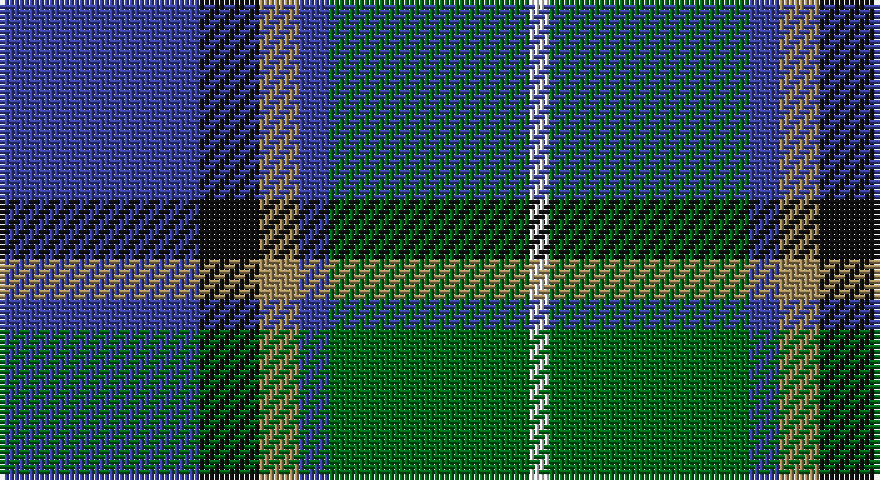

This page is one **sett** — a single exact thread-count. It belongs to the [tartan](/setts/db20k6lo4db3g20w2/)
(the same proportion at any scale), whose colour order is pattern [BKYBGW](/stripes/bkybgw/).

Sourced from tartans-authority.  It is a [6 stripe tartan](/stripes/stripes6/).

Original link http://www.tartansauthority.com/tartan-ferret/display/10658/

## Register references

External register numbers recorded for this tartan.

- Scottish Register of Tartans: [10658](https://www.tartanregister.gov.uk/tartanDetails?ref=10658)
- Scottish Tartans Authority (ITI): 10658

## Thread count
B/40 K12 LT8 B6 G40 W/4

One full sett is **176 threads**.

## Palette

Palette: <strong>Tartan Register</strong> <small style="color:#888">(4 of 5 colours)</small>
<table><thead><tr><th>Colour</th><th>Threads</th><th>Shade</th><th>Base</th><th>OKLCh</th></tr></thead><tbody><tr><td>B/</td><td style="text-align:right;font-variant-numeric:tabular-nums">40</td><td><code style="background-color:#38409C;">#38409C</code> <small style="color:#888">#38409C</small></td><td>B <code style="background-color:#2A418A;">#2A418A</code></td><td><small style="color:#888">oklch(42.1% 0.148 274.4)</small></td></tr><tr><td>K</td><td style="text-align:right;font-variant-numeric:tabular-nums">12</td><td><code style="background-color:#101010;">#101010</code> <small style="color:#888">#101010</small></td><td>K <code style="background-color:#000000;">#000000</code></td><td><small style="color:#888">oklch(17.3% 0.000 89.9)</small></td></tr><tr><td>LT</td><td style="text-align:right;font-variant-numeric:tabular-nums">8</td><td><code style="background-color:#A08858;">#A08858</code> <small style="color:#888">#A08858</small></td><td>Y <code style="background-color:#F2BF00;">#F2BF00</code></td><td><small style="color:#888">oklch(63.7% 0.071 84.0)</small></td></tr><tr><td>B</td><td style="text-align:right;font-variant-numeric:tabular-nums">6</td><td><code style="background-color:#38409C;">#38409C</code> <small style="color:#888">#38409C</small></td><td>B <code style="background-color:#2A418A;">#2A418A</code></td><td><small style="color:#888">oklch(42.1% 0.148 274.4)</small></td></tr><tr><td>G</td><td style="text-align:right;font-variant-numeric:tabular-nums">40</td><td><code style="background-color:#006818;">#006818</code> <small style="color:#888">#006818</small></td><td>G <code style="background-color:#006100;">#006100</code></td><td><small style="color:#888">oklch(45.0% 0.142 145.0)</small></td></tr><tr><td>W/</td><td style="text-align:right;font-variant-numeric:tabular-nums">4</td><td><code style="background-color:#FCFCFC;">#FCFCFC</code> <small style="color:#888">#FCFCFC</small></td><td>W <code style="background-color:#F7F7F7;">#F7F7F7</code></td><td><small style="color:#888">oklch(99.1% 0.000 89.9)</small></td></tr></tbody></table>

# Sample pattern

## Nearest tartans

The nearest existing variants by ΔTartan distance, with this tartan at the top so the swatches line up against it.

ΔTartan

Tartan

Sett

—

<a href="/ttd/edit/#slug=db20k6lo4db3g20w2~x2">DeLoughery (Personal)</a> <a class="nn-out" href="/variants/s6/db20k6lo4db3g20w2~x2/" title="open its dictionary page">↗</a>

0.52

<a href="/ttd/edit/#slug=b11k4g4m1g4k1r1~x4&amp;base=db20k6lo4db3g20w2~x2">Ednie (Personal)</a> <a class="nn-out" href="/variants/s7/b11k4g4m1g4k1r1~x4/" title="open its dictionary page">↗</a>

0.66

<a href="/ttd/edit/#slug=k6g15w2db22r2k4~x2&amp;base=db20k6lo4db3g20w2~x2">Leslie, Hebridean</a> <a class="nn-out" href="/variants/s6/k6g15w2db22r2k4~x2/" title="open its dictionary page">↗</a>

0.68

<a href="/ttd/edit/#slug=k2ly1g10db10w1~x6&amp;base=db20k6lo4db3g20w2~x2">Turnbull Hunting (1983) #2</a> <a class="nn-out" href="/variants/s5/k2ly1g10db10w1~x6/" title="open its dictionary page">↗</a>

0.73

<a href="/ttd/edit/#slug=r2ly1g10db10w1~x6&amp;base=db20k6lo4db3g20w2~x2">Turnbull Hunting (Name)</a> <a class="nn-out" href="/variants/s5/r2ly1g10db10w1~x6/" title="open its dictionary page">↗</a>

0.76

<a href="/ttd/edit/#slug=r7ly3dg28db28w3~x2&amp;base=db20k6lo4db3g20w2~x2">Turnbull Hunting</a> <a class="nn-out" href="/variants/s5/r7ly3dg28db28w3~x2/" title="open its dictionary page">↗</a>

0.78

<a href="/ttd/edit/#slug=b5dy28lb5k20lo5b47lo4~x2&amp;base=db20k6lo4db3g20w2~x2">State Seal of Washington (Fashion)</a> <a class="nn-out" href="/variants/s7/b5dy28lb5k20lo5b47lo4~x2/" title="open its dictionary page">↗</a>

0.78

<a href="/ttd/edit/#slug=db22w2k10g11r3g4~x2&amp;base=db20k6lo4db3g20w2~x2">Paterson Blue (Personal)</a> <a class="nn-out" href="/variants/s6/db22w2k10g11r3g4~x2/" title="open its dictionary page">↗</a>

0.78

<a href="/ttd/edit/#slug=dg5lp3dg32k16b32m3b5~x2&amp;base=db20k6lo4db3g20w2~x2">MacThomas (Clan)</a> <a class="nn-out" href="/variants/s7/dg5lp3dg32k16b32m3b5~x2/" title="open its dictionary page">↗</a>

0.79

<a href="/ttd/edit/#slug=k7lb3g18db18w2~x2&amp;base=db20k6lo4db3g20w2~x2">Bhatti (Name)</a> <a class="nn-out" href="/variants/s5/k7lb3g18db18w2~x2/" title="open its dictionary page">↗</a>

0.80

<a href="/ttd/edit/#slug=g3db12w1k12g13r2g2~x4&amp;base=db20k6lo4db3g20w2~x2">MacFadzean/MacPhedran</a> <a class="nn-out" href="/variants/s7/g3db12w1k12g13r2g2~x4/" title="open its dictionary page">↗</a>

## Neighbour map

Every grey dot is one of 14360 variants placed by the first two principal components of the ΔTartan feature space (44% of its variance). Red is this tartan; blue dots are its nearest — click one to open its page.

<svg viewBox="0 0 640 380" role="img" style="max-width:100%;height:auto;border:1px solid #e0e0e0;border-radius:4px;display:block" xmlns="http://www.w3.org/2000/svg"><image href="/nn/cloud.v1.png" width="640" height="380"/><a href="/variants/s7/b11k4g4m1g4k1r1~x4/"><circle cx="212.9" cy="195.3" r="4" fill="#3465a4"><title>Ednie (Personal)</title></circle></a><a href="/variants/s6/k6g15w2db22r2k4~x2/"><circle cx="214.4" cy="198.6" r="4" fill="#3465a4"><title>Leslie, Hebridean</title></circle></a><a href="/variants/s5/k2ly1g10db10w1~x6/"><circle cx="215.3" cy="205.5" r="4" fill="#3465a4"><title>Turnbull Hunting (1983) #2</title></circle></a><a href="/variants/s5/r2ly1g10db10w1~x6/"><circle cx="220.5" cy="203.4" r="4" fill="#3465a4"><title>Turnbull Hunting (Name)</title></circle></a><a href="/variants/s5/r7ly3dg28db28w3~x2/"><circle cx="224.5" cy="219.3" r="4" fill="#3465a4"><title>Turnbull Hunting</title></circle></a><a href="/variants/s7/b5dy28lb5k20lo5b47lo4~x2/"><circle cx="218.6" cy="177.7" r="4" fill="#3465a4"><title>State Seal of Washington (Fashion)</title></circle></a><a href="/variants/s6/db22w2k10g11r3g4~x2/"><circle cx="203.8" cy="205.8" r="4" fill="#3465a4"><title>Paterson Blue (Personal)</title></circle></a><a href="/variants/s7/dg5lp3dg32k16b32m3b5~x2/"><circle cx="213.8" cy="201.7" r="4" fill="#3465a4"><title>MacThomas (Clan)</title></circle></a><a href="/variants/s5/k7lb3g18db18w2~x2/"><circle cx="167.8" cy="221.7" r="4" fill="#3465a4"><title>Bhatti (Name)</title></circle></a><a href="/variants/s7/g3db12w1k12g13r2g2~x4/"><circle cx="193.7" cy="188.3" r="4" fill="#3465a4"><title>MacFadzean/MacPhedran</title></circle></a><circle cx="206.5" cy="204.1" r="5" fill="#c00000"/></svg>

ID: /variants/s6/db20k6lo4db3g20w2~x2/
