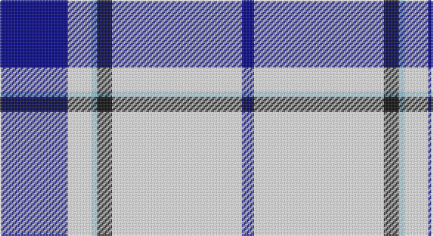

This page is one **sett** — a single exact thread-count. It belongs to the [tartan](/setts/db23w8lb2k5w44db4/)
(the same proportion at any scale), whose colour order is pattern [BWKWWB](/stripes/bwkwwb/).

Sourced from register-of-tartans.  It is a [6 stripe tartan](/stripes/stripes6/).

Original link https://www.tartanregister.gov.uk/tartanDetails.aspx?ref=11562

## Register references

External register numbers recorded for this tartan.

- Scottish Register of Tartans: [11562](https://www.tartanregister.gov.uk/tartanDetails.aspx?ref=11562)

## Thread count
DB/46 W16 LB4 K10 W88 DB/8

One full sett is **290 threads**.

## Palette

Palette: <strong>Tartan Register</strong>
<table><thead><tr><th>Colour</th><th>Threads</th><th>Shade</th><th>Base</th><th>OKLCh</th></tr></thead><tbody><tr><td>DB/</td><td style="text-align:right;font-variant-numeric:tabular-nums">46</td><td><code style="background-color:#00008C;">#00008C</code> <small style="color:#888">#00008C</small></td><td>B <code style="background-color:#2A418A;">#2A418A</code></td><td><small style="color:#888">oklch(28.9% 0.200 264.1)</small></td></tr><tr><td>W</td><td style="text-align:right;font-variant-numeric:tabular-nums">16</td><td><code style="background-color:#FFFFFF;">#FFFFFF</code> <small style="color:#888">#FFFFFF</small></td><td>W <code style="background-color:#F7F7F7;">#F7F7F7</code></td><td><small style="color:#888">oklch(100.0% 0.000 89.9)</small></td></tr><tr><td>LB</td><td style="text-align:right;font-variant-numeric:tabular-nums">4</td><td><code style="background-color:#98C8E8;">#98C8E8</code> <small style="color:#888">#98C8E8</small></td><td>W <code style="background-color:#F7F7F7;">#F7F7F7</code></td><td><small style="color:#888">oklch(81.0% 0.068 237.9)</small></td></tr><tr><td>K</td><td style="text-align:right;font-variant-numeric:tabular-nums">10</td><td><code style="background-color:#101010;">#101010</code> <small style="color:#888">#101010</small></td><td>K <code style="background-color:#000000;">#000000</code></td><td><small style="color:#888">oklch(17.3% 0.000 89.9)</small></td></tr><tr><td>W</td><td style="text-align:right;font-variant-numeric:tabular-nums">88</td><td><code style="background-color:#FFFFFF;">#FFFFFF</code> <small style="color:#888">#FFFFFF</small></td><td>W <code style="background-color:#F7F7F7;">#F7F7F7</code></td><td><small style="color:#888">oklch(100.0% 0.000 89.9)</small></td></tr><tr><td>DB/</td><td style="text-align:right;font-variant-numeric:tabular-nums">8</td><td><code style="background-color:#00008C;">#00008C</code> <small style="color:#888">#00008C</small></td><td>B <code style="background-color:#2A418A;">#2A418A</code></td><td><small style="color:#888">oklch(28.9% 0.200 264.1)</small></td></tr></tbody></table>

# Sample pattern

## Nearest tartans

The nearest existing variants by ΔTartan distance, with this tartan at the top so the swatches line up against it.

ΔTartan

Tartan

Sett

—

<a href="/ttd/edit/#slug=db23w8lb2k5w44db4~x2">WaterAid</a> <a class="nn-out" href="/variants/s6/db23w8lb2k5w44db4~x2/" title="open its dictionary page">↗</a>

1.29

<a href="/ttd/edit/#slug=db9lb27db2k4db2lb10db2w3~x2&amp;base=db23w8lb2k5w44db4~x2">Alaska Highlanders Pipes &amp; Drums Corporate Tartan</a> <a class="nn-out" href="/variants/s8/db9lb27db2k4db2lb10db2w3~x2/" title="open its dictionary page">↗</a>

1.35

<a href="/ttd/edit/#slug=lt25db11r5w1k1~x4&amp;base=db23w8lb2k5w44db4~x2">Mount Vernon Primary School</a> <a class="nn-out" href="/variants/s5/lt25db11r5w1k1~x4/" title="open its dictionary page">↗</a>

1.37

<a href="/ttd/edit/#slug=b26w28b14ly3k1ly2k1~x2&amp;base=db23w8lb2k5w44db4~x2">Gothenburg</a> <a class="nn-out" href="/variants/s7/b26w28b14ly3k1ly2k1~x2/" title="open its dictionary page">↗</a>

1.41

<a href="/ttd/edit/#slug=ly5db15lb5db5lb40ly3~x2&amp;base=db23w8lb2k5w44db4~x2">Legary</a> <a class="nn-out" href="/variants/s6/ly5db15lb5db5lb40ly3~x2/" title="open its dictionary page">↗</a>

1.41

<a href="/ttd/edit/#slug=db26w28db14ly3k1ly2k1~x2&amp;base=db23w8lb2k5w44db4~x2">Gothenburg/Goteborg</a> <a class="nn-out" href="/variants/s7/db26w28db14ly3k1ly2k1~x2/" title="open its dictionary page">↗</a>

1.44

<a href="/ttd/edit/#slug=db9lb27db2ly4db2lb10db2w3~x2&amp;base=db23w8lb2k5w44db4~x2">Alaska Highlanders P &amp; D (Corporate)</a> <a class="nn-out" href="/variants/s8/db9lb27db2ly4db2lb10db2w3~x2/" title="open its dictionary page">↗</a>

1.52

<a href="/ttd/edit/#slug=b4r2b40k11g2w16r2~x2&amp;base=db23w8lb2k5w44db4~x2">Jack Sinclair (Personal)</a> <a class="nn-out" href="/variants/s7/b4r2b40k11g2w16r2~x2/" title="open its dictionary page">↗</a>

1.55

<a href="/ttd/edit/#slug=lb25db11r5w1k1~x4&amp;base=db23w8lb2k5w44db4~x2">Mount Vernon Primary School (Corp)</a> <a class="nn-out" href="/variants/s5/lb25db11r5w1k1~x4/" title="open its dictionary page">↗</a>

1.57

<a href="/ttd/edit/#slug=w80db30lo5ly4~x2&amp;base=db23w8lb2k5w44db4~x2">Tarbh Deargh (Red Bull)</a> <a class="nn-out" href="/variants/s4/w80db30lo5ly4~x2/" title="open its dictionary page">↗</a>

1.59

<a href="/ttd/edit/#slug=r3b2w35b35r2g3~x2&amp;base=db23w8lb2k5w44db4~x2">Galloway (Dance)</a> <a class="nn-out" href="/variants/s6/r3b2w35b35r2g3~x2/" title="open its dictionary page">↗</a>

## Neighbour map

Every grey dot is one of 14360 variants placed by the first two principal components of the ΔTartan feature space (44% of its variance). Red is this tartan; blue dots are its nearest — click one to open its page.

<svg viewBox="0 0 640 380" role="img" style="max-width:100%;height:auto;border:1px solid #e0e0e0;border-radius:4px;display:block" xmlns="http://www.w3.org/2000/svg"><image href="/nn/cloud.v1.png" width="640" height="380"/><a href="/variants/s8/db9lb27db2k4db2lb10db2w3~x2/"><circle cx="319.0" cy="150.7" r="4" fill="#3465a4"><title>Alaska Highlanders Pipes &amp; Drums Corporate Tartan</title></circle></a><a href="/variants/s5/lt25db11r5w1k1~x4/"><circle cx="299.8" cy="133.4" r="4" fill="#3465a4"><title>Mount Vernon Primary School</title></circle></a><a href="/variants/s7/b26w28b14ly3k1ly2k1~x2/"><circle cx="312.4" cy="134.6" r="4" fill="#3465a4"><title>Gothenburg</title></circle></a><a href="/variants/s6/ly5db15lb5db5lb40ly3~x2/"><circle cx="332.9" cy="176.2" r="4" fill="#3465a4"><title>Legary</title></circle></a><a href="/variants/s7/db26w28db14ly3k1ly2k1~x2/"><circle cx="308.0" cy="132.9" r="4" fill="#3465a4"><title>Gothenburg/Goteborg</title></circle></a><a href="/variants/s8/db9lb27db2ly4db2lb10db2w3~x2/"><circle cx="332.5" cy="153.9" r="4" fill="#3465a4"><title>Alaska Highlanders P &amp; D (Corporate)</title></circle></a><a href="/variants/s7/b4r2b40k11g2w16r2~x2/"><circle cx="286.2" cy="119.9" r="4" fill="#3465a4"><title>Jack Sinclair (Personal)</title></circle></a><a href="/variants/s5/lb25db11r5w1k1~x4/"><circle cx="314.1" cy="136.4" r="4" fill="#3465a4"><title>Mount Vernon Primary School (Corp)</title></circle></a><a href="/variants/s4/w80db30lo5ly4~x2/"><circle cx="379.0" cy="159.6" r="4" fill="#3465a4"><title>Tarbh Deargh (Red Bull)</title></circle></a><a href="/variants/s6/r3b2w35b35r2g3~x2/"><circle cx="270.5" cy="144.6" r="4" fill="#3465a4"><title>Galloway (Dance)</title></circle></a><circle cx="318.6" cy="135.4" r="5" fill="#c00000"/></svg>

ID: /variants/s6/db23w8lb2k5w44db4~x2/
