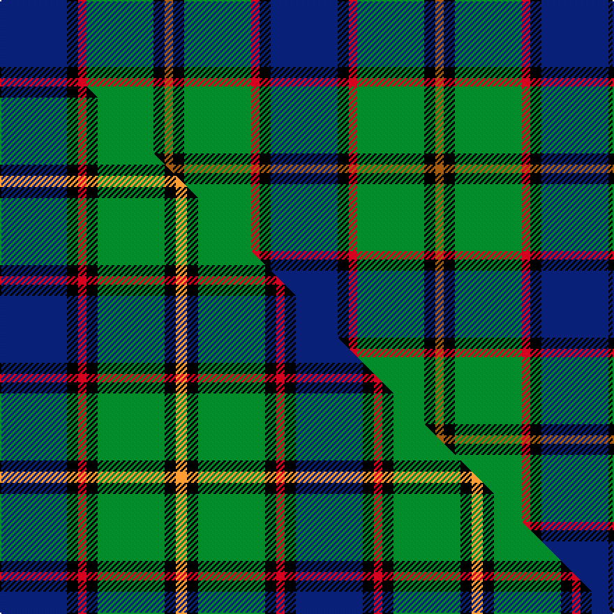

This is one **variant** — a specific cloth: this exact thread count and colourway, with its own
provenance below. It is one weaving of the [sett](/setts/db24k4r3g24k4o3/) (the scale-free proportion — the
same cloth at any scale or shade), whose colour order is pattern [BKRGKR](/stripes/bkrgkr/).

Part of the [Skene](/tartans/skene-2/) tartan — the named design grouping this sett with its other cloths.

Sourced from weddslist.  It is a [6 stripe tartan](/stripes/stripes6/).

Original link [http://www.weddslist.com/cgi-bin/tartans/pg.pl?source=misc](http://www.weddslist.com/cgi-bin/tartans/pg.pl?source=misc)

Dataset <small>— provenance for this record, inherited from the source manifest</small>

<dl class="dataset-prov">
<dt>source</dt><dd><a href="/sources/weddslist/">Weddslist</a></dd>
<dt>data captured from</dt><dd><a href="https://github.com/thetartan/tartan-database/blob/master/data/weddslist/data.csv">https://github.com/thetartan/tartan-database/blob/master/data/weddslist/data.csv</a></dd>
<dt>data date</dt><dd>2016-11-17 <small>(dataset default)</small></dd>
<dt>licence</dt><dd><a href="https://creativecommons.org/licenses/by-nc-nd/4.0/">CC BY-NC-ND 4.0</a></dd>
</dl>

Capture chain <small>— the hands this data passed through, oldest first; each capture carries its own licence</small>

<ol class="capture-chain">
<li><a href="https://www.weddslist.com/tartans/">Weddslist</a> <small>the living privately compiled reference</small></li>
<li><a href="https://github.com/thetartan/tartan-database">thetartan/tartan-database</a> <small>2016-2017</small> · <a href="https://creativecommons.org/licenses/by-nc-nd/4.0/">CC BY-NC-ND 4.0</a> <small>Levko Kravets's frozen compilation — the capture we vendored, and where its CC licence text came from</small></li>
<li>this dictionary <small>captured 2026-06-10 · commit 5bf86c7566</small> <small>each re-capture is a git commit to data/sources</small></li>
</ol>

## Thread count
DB/48 K8 R6 G48 K8 O/6

One full sett is **194 threads**.

## Palette
<table><thead><tr><th>Colour</th><th>Shade</th><th>OKLCh</th></tr></thead><tbody><tr><td>DB</td><td><code style="background-color:#082077;">#082077</code> <small style="color:#888">#082077</small></td><td><small style="color:#888">oklch(30.0% 0.149 265.1)</small></td></tr><tr><td>G</td><td><code style="background-color:#008B2A;">#008B2A</code> <small style="color:#888">#008B2A</small></td><td><small style="color:#888">oklch(55.4% 0.170 145.9)</small></td></tr><tr><td>K</td><td><code style="background-color:#000000;">#000000</code> <small style="color:#888">#000000</small></td><td><small style="color:#888">oklch(0.0% 0.000 0.0)</small></td></tr><tr><td>O</td><td><code style="background-color:#A65C11;">#A65C11</code> <small style="color:#888">#A65C11</small></td><td><small style="color:#888">oklch(55.0% 0.125 58.3)</small></td></tr><tr><td>R</td><td><code style="background-color:#D60020;">#D60020</code> <small style="color:#888">#D60020</small></td><td><small style="color:#888">oklch(55.2% 0.224 25.5)</small></td></tr></tbody></table>

# Sample pattern

## Compared to the master

This cloth is one sett of its design; the master sett (the exemplar the design is anchored on) is below for comparison.

Its **ΔTartan distance** from the master is **1.02** — the same measure the nearest-tartans table ranks by (0 is identical; a re-scale of the same cloth is near 0, a recolour or a different proportion further).

<figure class="master-compare" style="margin:0">

this sett
master sett ★

<figcaption style="color:#888;font-size:smaller">One weave of this sett against the <a href="/setts/db24k4r3k4g24k4lo4/">master sett ★</a>, split on the diagonal: a shared proportion runs seamlessly across it with only the shades shifting; a different proportion breaks on it.</figcaption>
</figure>

## Nearest tartan variants

The nearest existing variants by ΔTartan distance, with this cloth at the top so the swatches line up against it.

ΔTartan

Threads

Variant

Sett

—

194

<a href="/variants/s6/db24k4r3g24k4o3~x2/">(1) Skene</a>

<a href="/ttd/edit/#slug=db24k4r3k4g24k4lo4~x2&amp;base=db24k4r3g24k4o3~x2" title="compare in the TTD">1.02</a>

212

<a href="/variants/s7/db24k4r3k4g24k4lo4~x2/">Skene</a>

<a href="/ttd/edit/#slug=k1g8w1k8db8r1~x4&amp;base=db24k4r3g24k4o3~x2" title="compare in the TTD">1.12</a>

208

<a href="/variants/s6/k1g8w1k8db8r1~x4/">Leslie Hunting</a>

<a href="/ttd/edit/#slug=k1g8w1k8db8r1~x4~db1004274&amp;base=db24k4r3g24k4o3~x2" title="compare in the TTD">1.13</a>

208

<a href="/variants/s6/k1g8w1k8db8r1~x4~db1004274/">Syme</a>

<a href="/ttd/edit/#slug=k7dr3g29db29w3~x2&amp;base=db24k4r3g24k4o3~x2" title="compare in the TTD">1.15</a>

264

<a href="/variants/s5/k7dr3g29db29w3~x2/">Highlander, Highland Laddie Kilts</a>

<a href="/ttd/edit/#slug=k6r3g30ly10db30w3~x2&amp;base=db24k4r3g24k4o3~x2" title="compare in the TTD">1.16</a>

310

<a href="/variants/s6/k6r3g30ly10db30w3~x2/">Turnbull of Thornton (Personal)</a>

<a href="/ttd/edit/#slug=k7dr3g30db28lb3~x2&amp;base=db24k4r3g24k4o3~x2" title="compare in the TTD">1.18</a>

264

<a href="/variants/s5/k7dr3g30db28lb3~x2/">Highlander Highland Laddie</a>

<a href="/ttd/edit/#slug=k1db1g8dt8w1~x4~db1406275-dt1204274&amp;base=db24k4r3g24k4o3~x2" title="compare in the TTD">1.23</a>

144

<a href="/variants/s5/k1dbi1g8db8w1~x4~dbi1406275-db1204274/">Douglas, Green (Wilsons)</a>

<a href="/ttd/edit/#slug=k1lb1g8db8w1~x4&amp;base=db24k4r3g24k4o3~x2" title="compare in the TTD">1.23</a>

144

<a href="/variants/s5/k1lb1g8db8w1~x4/">Douglas</a>

<a href="/ttd/edit/#slug=r3k2g20k10t20y2~x2&amp;base=db24k4r3g24k4o3~x2" title="compare in the TTD">1.26</a>

218

<a href="/variants/s6/r3k2g20k10t20y2~x2/">MacLeod of Assynt</a>

<a href="/ttd/edit/#slug=w2db20r3k10g20lo2~x2&amp;base=db24k4r3g24k4o3~x2" title="compare in the TTD">1.26</a>

220

<a href="/variants/s6/w2db20r3k10g20lo2~x2/">Morris of Eddergoll (Personal)</a>

## Neighbour map

Every grey dot is one of 13621 variants placed by the first two principal components of the ΔTartan feature space (42% of its variance). Red is this tartan; blue dots are its nearest — click one to open its page.

<svg viewBox="0 0 640 380" role="img" style="max-width:100%;height:auto;border:1px solid #e0e0e0;border-radius:4px;display:block" xmlns="http://www.w3.org/2000/svg"><image href="/nn/cloud.v1.png" width="640" height="380"/><a href="/variants/s7/db24k4r3k4g24k4lo4~x2/"><circle cx="132.3" cy="175.2" r="4" fill="#3465a4"><title>Skene</title></circle></a><a href="/variants/s6/k1g8w1k8db8r1~x4/"><circle cx="109.4" cy="194.1" r="4" fill="#3465a4"><title>Leslie Hunting</title></circle></a><a href="/variants/s6/k1g8w1k8db8r1~x4~db1004274/"><circle cx="111.9" cy="193.9" r="4" fill="#3465a4"><title>Syme</title></circle></a><a href="/variants/s5/k7dr3g29db29w3~x2/"><circle cx="186.5" cy="197.4" r="4" fill="#3465a4"><title>Highlander, Highland Laddie Kilts</title></circle></a><a href="/variants/s6/k6r3g30ly10db30w3~x2/"><circle cx="120.2" cy="168.7" r="4" fill="#3465a4"><title>Turnbull of Thornton (Personal)</title></circle></a><a href="/variants/s5/k7dr3g30db28lb3~x2/"><circle cx="198.8" cy="198.1" r="4" fill="#3465a4"><title>Highlander Highland Laddie</title></circle></a><a href="/variants/s5/k1dbi1g8db8w1~x4~dbi1406275-db1204274/"><circle cx="199.4" cy="202.1" r="4" fill="#3465a4"><title>Douglas, Green (Wilsons)</title></circle></a><a href="/variants/s5/k1lb1g8db8w1~x4/"><circle cx="197.5" cy="205.3" r="4" fill="#3465a4"><title>Douglas</title></circle></a><a href="/variants/s6/r3k2g20k10t20y2~x2/"><circle cx="139.2" cy="189.7" r="4" fill="#3465a4"><title>MacLeod of Assynt</title></circle></a><a href="/variants/s6/w2db20r3k10g20lo2~x2/"><circle cx="109.8" cy="169.5" r="4" fill="#3465a4"><title>Morris of Eddergoll (Personal)</title></circle></a><circle cx="165.4" cy="187.0" r="5" fill="#c00000"/><text x="320" y="376" text-anchor="middle" font-size="11" fill="#999">ground</text><text x="11" y="190" text-anchor="middle" font-size="11" fill="#999" transform="rotate(-90 11 190)">complexity</text></svg>

ID: /variants/s6/db24k4r3g24k4o3~x2/
