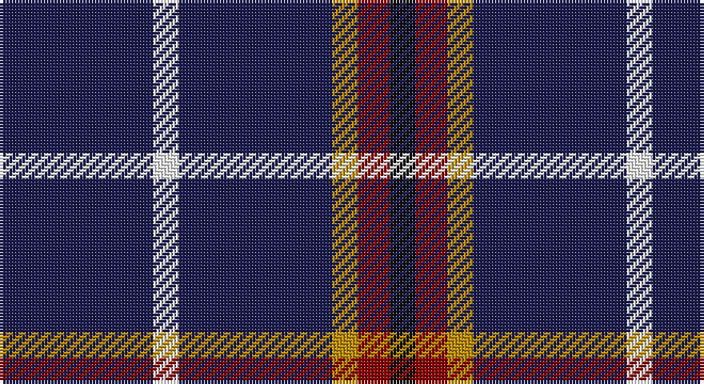

This page is one **sett** — a single exact thread-count. It belongs to the [tartan](/setts/db24w4db24lo4r5k4/)
(the same proportion at any scale), whose colour order is pattern [BWBYRK](/stripes/bwbyrk/).

Sourced from tartans-authority.  It is a [6 stripe tartan](/stripes/stripes6/).

Original link http://www.tartansauthority.com/tartan-ferret/display/10045/

## Also known as

This cloth is also recorded under:

- De Grussa

## Register references

External register numbers recorded for this tartan.

- Scottish Register of Tartans: [10045](https://www.tartanregister.gov.uk/tartanDetails?ref=10045)
- Scottish Tartans Authority (ITI): 10045

## Thread count
DB/48 W8 DB48 DY8 DR10 K/8

One full sett is **204 threads**.

## Palette

Palette: <strong>Tartan Register</strong>
<table><thead><tr><th>Colour</th><th>Threads</th><th>Shade</th><th>Base</th><th>OKLCh</th></tr></thead><tbody><tr><td>DB/</td><td style="text-align:right;font-variant-numeric:tabular-nums">48</td><td><code style="background-color:#1C1C50;">#1C1C50</code> <small style="color:#888">#1C1C50</small></td><td>B <code style="background-color:#2A418A;">#2A418A</code></td><td><small style="color:#888">oklch(26.2% 0.093 277.9)</small></td></tr><tr><td>W</td><td style="text-align:right;font-variant-numeric:tabular-nums">8</td><td><code style="background-color:#F8F8F8;">#F8F8F8</code> <small style="color:#888">#F8F8F8</small></td><td>W <code style="background-color:#F7F7F7;">#F7F7F7</code></td><td><small style="color:#888">oklch(97.9% 0.000 89.9)</small></td></tr><tr><td>DB</td><td style="text-align:right;font-variant-numeric:tabular-nums">48</td><td><code style="background-color:#1C1C50;">#1C1C50</code> <small style="color:#888">#1C1C50</small></td><td>B <code style="background-color:#2A418A;">#2A418A</code></td><td><small style="color:#888">oklch(26.2% 0.093 277.9)</small></td></tr><tr><td>DY</td><td style="text-align:right;font-variant-numeric:tabular-nums">8</td><td><code style="background-color:#BC8C00;">#BC8C00</code> <small style="color:#888">#BC8C00</small></td><td>Y <code style="background-color:#F2BF00;">#F2BF00</code></td><td><small style="color:#888">oklch(66.8% 0.137 84.1)</small></td></tr><tr><td>DR</td><td style="text-align:right;font-variant-numeric:tabular-nums">10</td><td><code style="background-color:#880000;">#880000</code> <small style="color:#888">#880000</small></td><td>R <code style="background-color:#CC0000;">#CC0000</code></td><td><small style="color:#888">oklch(39.4% 0.162 29.2)</small></td></tr><tr><td>K/</td><td style="text-align:right;font-variant-numeric:tabular-nums">8</td><td><code style="background-color:#101010;">#101010</code> <small style="color:#888">#101010</small></td><td>K <code style="background-color:#000000;">#000000</code></td><td><small style="color:#888">oklch(17.3% 0.000 89.9)</small></td></tr></tbody></table>

# Sample pattern

## Nearest tartans

The nearest existing variants by ΔTartan distance, with this tartan at the top so the swatches line up against it.

ΔTartan

Tartan

Sett

—

<a href="/ttd/edit/#slug=db24w4db24lo4r5k4~x2">de Grussa (Personal)</a> <a class="nn-out" href="/variants/s6/db24w4db24lo4r5k4~x2/" title="open its dictionary page">↗</a>

0.92

<a href="/ttd/edit/#slug=db24w4db24ly4r5k4~x2&amp;base=db24w4db24lo4r5k4~x2">De Grussa</a> <a class="nn-out" href="/variants/s6/db24w4db24ly4r5k4~x2/" title="open its dictionary page">↗</a>

1.32

<a href="/ttd/edit/#slug=db65k9db21ly8db21w8db35r35&amp;base=db24w4db24lo4r5k4~x2">Maud, Mary</a> <a class="nn-out" href="/variants/s8/db65k9db21ly8db21w8db35r35/" title="open its dictionary page">↗</a>

1.36

<a href="/ttd/edit/#slug=r5db15g3db15ly3db3~x2&amp;base=db24w4db24lo4r5k4~x2">Abertay University (Estimated threadcount)</a> <a class="nn-out" href="/variants/s6/r5db15g3db15ly3db3~x2/" title="open its dictionary page">↗</a>

1.52

<a href="/variants/s6/r3lo2k10w1~x6/">St. Eloi</a>

1.60

<a href="/ttd/edit/#slug=dt30t5dt5lp5dt10w4r4dt10g5dt10~x2&amp;base=db24w4db24lo4r5k4~x2">Bukowski-Jackson (Personal)</a> <a class="nn-out" href="/variants/s10/dt30t5dt5lp5dt10w4r4dt10g5dt10~x2/" title="open its dictionary page">↗</a>

1.63

<a href="/ttd/edit/#slug=k8t3k32b14w3k25t3~x2&amp;base=db24w4db24lo4r5k4~x2">Cowe (Personal)</a> <a class="nn-out" href="/variants/s7/k8t3k32b14w3k25t3~x2/" title="open its dictionary page">↗</a>

1.75

<a href="/ttd/edit/#slug=k16b2k8r3lr3r3k8~x2&amp;base=db24w4db24lo4r5k4~x2">Benson (New England)</a> <a class="nn-out" href="/variants/s7/k16b2k8r3lr3r3k8~x2/" title="open its dictionary page">↗</a>

1.76

<a href="/ttd/edit/#slug=r1db12k5o3db5w1~x4&amp;base=db24w4db24lo4r5k4~x2">Massachusetts</a> <a class="nn-out" href="/variants/s6/r1db12k5o3db5w1~x4/" title="open its dictionary page">↗</a>

1.78

<a href="/ttd/edit/#slug=db40w7db60k10r25ly4&amp;base=db24w4db24lo4r5k4~x2">Stradling (Name)</a> <a class="nn-out" href="/variants/s6/db40w7db60k10r25ly4/" title="open its dictionary page">↗</a>

1.79

<a href="/ttd/edit/#slug=w1db8r3db2r1db2r3db8lo1~x4&amp;base=db24w4db24lo4r5k4~x2">Louisville Fire &amp; Rescue P&amp;D</a> <a class="nn-out" href="/variants/s9/w1db8r3db2r1db2r3db8lo1~x4/" title="open its dictionary page">↗</a>

## Neighbour map

Every grey dot is one of 14360 variants placed by the first two principal components of the ΔTartan feature space (44% of its variance). Red is this tartan; blue dots are its nearest — click one to open its page.

<svg viewBox="0 0 640 380" role="img" style="max-width:100%;height:auto;border:1px solid #e0e0e0;border-radius:4px;display:block" xmlns="http://www.w3.org/2000/svg"><image href="/nn/cloud.v1.png" width="640" height="380"/><a href="/variants/s6/db24w4db24ly4r5k4~x2/"><circle cx="359.3" cy="214.5" r="4" fill="#3465a4"><title>De Grussa</title></circle></a><a href="/variants/s8/db65k9db21ly8db21w8db35r35/"><circle cx="349.3" cy="204.7" r="4" fill="#3465a4"><title>Maud, Mary</title></circle></a><a href="/variants/s6/r5db15g3db15ly3db3~x2/"><circle cx="400.8" cy="256.2" r="4" fill="#3465a4"><title>Abertay University (Estimated threadcount)</title></circle></a><a href="/variants/s6/r3lo2k10w1~x6/"><circle cx="376.0" cy="216.7" r="4" fill="#3465a4"><title>St. Eloi</title></circle></a><a href="/variants/s10/dt30t5dt5lp5dt10w4r4dt10g5dt10~x2/"><circle cx="350.8" cy="177.8" r="4" fill="#3465a4"><title>Bukowski-Jackson (Personal)</title></circle></a><a href="/variants/s7/k8t3k32b14w3k25t3~x2/"><circle cx="411.9" cy="213.6" r="4" fill="#3465a4"><title>Cowe (Personal)</title></circle></a><a href="/variants/s7/k16b2k8r3lr3r3k8~x2/"><circle cx="402.8" cy="229.1" r="4" fill="#3465a4"><title>Benson (New England)</title></circle></a><a href="/variants/s6/r1db12k5o3db5w1~x4/"><circle cx="316.5" cy="194.5" r="4" fill="#3465a4"><title>Massachusetts</title></circle></a><a href="/variants/s6/db40w7db60k10r25ly4/"><circle cx="385.1" cy="194.4" r="4" fill="#3465a4"><title>Stradling (Name)</title></circle></a><a href="/variants/s9/w1db8r3db2r1db2r3db8lo1~x4/"><circle cx="381.4" cy="208.2" r="4" fill="#3465a4"><title>Louisville Fire &amp; Rescue P&amp;D</title></circle></a><circle cx="376.5" cy="221.6" r="5" fill="#c00000"/></svg>

ID: /variants/s6/db24w4db24lo4r5k4~x2/
