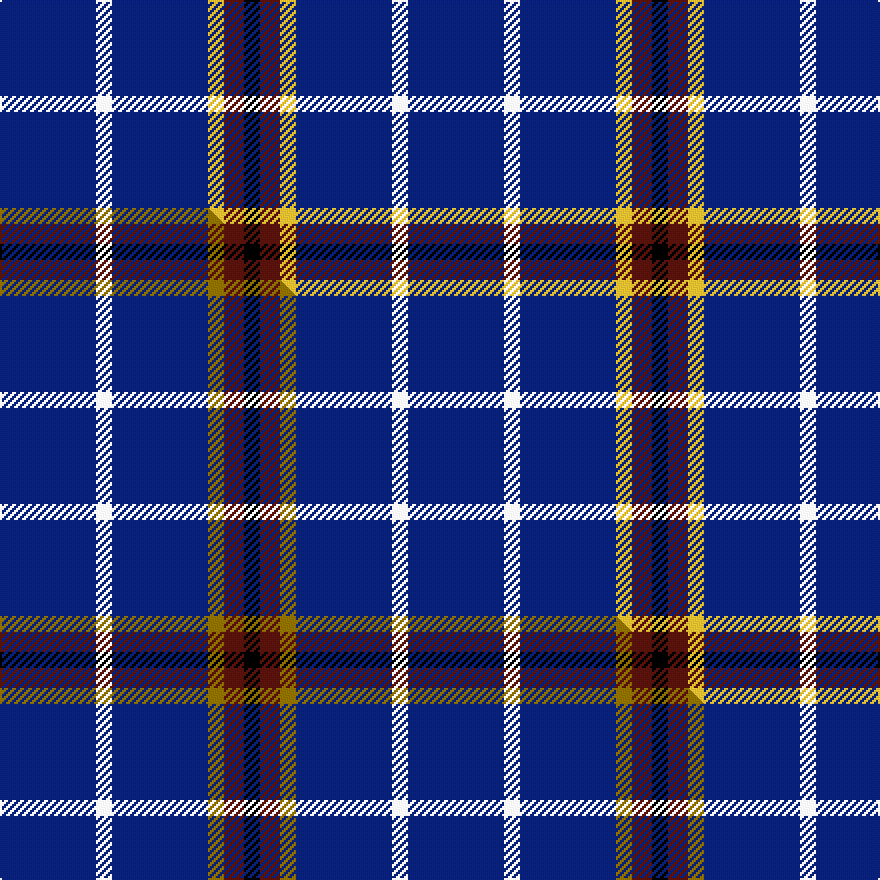

This is one **variant** — a specific cloth: this exact thread count and colourway, with its own
provenance below. It is one weaving of the [sett](/tartans/d/de/de-grussa/) (the scale-free proportion — the
same cloth at any scale or shade), whose colour order is pattern [BWBYBK](/stripes/bwbybk/).

Part of the [De Grussa](/tartans/d/de/de-grussa/) tartan — the named design grouping this sett with its other cloths.

Sourced from tartans-authority.  It is a [6 stripe tartan](/stripes/stripes6/).

Original link <code>http://www.tartansauthority.com/tartan-ferret/display/10045/</code> — retired · [Internet Archive copy](https://web.archive.org/web/*/http://www.tartansauthority.com/tartan-ferret/display/10045/*)

Dataset <small>— provenance for this record, inherited from the source manifest</small>

<dl class="dataset-prov">
<dt>source</dt><dd><a href="/sources/tartans-authority/">Scottish Tartans Authority</a></dd>
<dt>data captured from</dt><dd><a href="https://github.com/thetartan/tartan-database/blob/master/data/tartans-authority/data.csv">https://github.com/thetartan/tartan-database/blob/master/data/tartans-authority/data.csv</a></dd>
<dt>data date</dt><dd>15th July 2009 <small>(this record)</small></dd>
<dt>licence</dt><dd><a href="https://creativecommons.org/licenses/by-nc-nd/4.0/">CC BY-NC-ND 4.0</a></dd>
</dl>

Capture chain <small>— the hands this data passed through, oldest first; each capture carries its own licence</small>

<ol class="capture-chain">
<li><a href="https://www.tartansauthority.com/">Scottish Tartans Authority</a> <small>the heritage body’s archive — its tartan-ferret record browser is retired; dead record links are shown unlinked, with an Internet Archive copy (ITI numbers are not SRT references)</small></li>
<li><a href="https://github.com/thetartan/tartan-database">thetartan/tartan-database</a> <small>2016-2017</small> · <a href="https://creativecommons.org/licenses/by-nc-nd/4.0/">CC BY-NC-ND 4.0</a> <small>Levko Kravets's frozen compilation — the capture we vendored, and where its CC licence text came from</small></li>
<li>this dictionary <small>captured 2026-06-10 · commit 5bf86c7566</small> <small>each re-capture is a git commit to data/sources</small></li>
</ol>

## Register references

External register numbers recorded for this tartan.

- Scottish Register of Tartans: [10045](https://www.tartanregister.gov.uk/tartanDetails?ref=10045)
- Scottish Tartans Authority (ITI): 10045

## Thread count
DB/48 W8 DB48 LY8 DR10 K/8

One full sett is **204 threads**.

## Palette
<table><thead><tr><th>Colour</th><th>Shade</th><th>OKLCh</th></tr></thead><tbody><tr><td>DB</td><td><code style="background-color:#082077;">#082077</code> <small style="color:#888">#082077</small></td><td><small style="color:#888">oklch(30.0% 0.149 265.1)</small></td></tr><tr><td>DR</td><td><code style="background-color:#55120C;">#55120C</code> <small style="color:#888">#55120C</small></td><td><small style="color:#888">oklch(30.0% 0.099 29.3)</small></td></tr><tr><td>LY</td><td><code style="background-color:#DCBC32;">#DCBC32</code> <small style="color:#888">#DCBC32</small></td><td><small style="color:#888">oklch(80.0% 0.150 95.2)</small></td></tr><tr><td>K</td><td><code style="background-color:#000000;">#000000</code> <small style="color:#888">#000000</small></td><td><small style="color:#888">oklch(0.0% 0.000 0.0)</small></td></tr><tr><td>W</td><td><code style="background-color:#F7F7F7;">#F7F7F7</code> <small style="color:#888">#F7F7F7</small></td><td><small style="color:#888">oklch(97.6% 0.000 89.9)</small></td></tr></tbody></table>

# Sample pattern

## Compared to the master

This cloth is one sett of its design; the master sett (the exemplar the design is anchored on) is below for comparison.

Its **ΔTartan distance** from the master is **0.04** — the same measure the nearest-tartans table ranks by (0 is identical; a re-scale of the same cloth is near 0, a recolour or a different proportion further).

<figure class="master-compare" style="margin:0">

this sett
master sett ★

<figcaption style="color:#888;font-size:smaller">One weave of this sett against the <a href="/setts/db24w4db24y4dr5k4/">master sett ★</a>, split on the diagonal: a shared proportion runs seamlessly across it with only the shades shifting; a different proportion breaks on it.</figcaption>
</figure>

## Nearest tartan variants

The nearest existing variants by ΔTartan distance, with this cloth at the top so the swatches line up against it.

ΔTartan

Threads

Variant

Sett

—

204

<a href="/variants/s6/db24w4db24ly4dr5k4~x2/">de Grussa (Personal)</a>

<a href="/ttd/edit/#slug=db24w4db24y4dr5k4~x2&amp;base=db24w4db24ly4dr5k4~x2" title="compare in the TTD">0.04</a>

204

<a href="/variants/s6/db24w4db24y4dr5k4~x2/">De Grussa</a>

<a href="/ttd/edit/#slug=db40w7db60k10dr25y4&amp;base=db24w4db24ly4dr5k4~x2" title="compare in the TTD">0.73</a>

248

<a href="/variants/s6/db40w7db60k10dr25y4/">Stradling (Name)</a>

<a href="/ttd/edit/#slug=db50k12db21w5~x2&amp;base=db24w4db24ly4dr5k4~x2" title="compare in the TTD">1.01</a>

242

<a href="/variants/s4/db50k12db21w5~x2/">Coinean Dubh</a>

<a href="/ttd/edit/#slug=y1db6k1dy5db6w1~x4&amp;base=db24w4db24ly4dr5k4~x2" title="compare in the TTD">1.08</a>

152

<a href="/variants/s6/y1db6k1dy5db6w1~x4/">Atlantic, Ancient (Fashion)</a>

<a href="/ttd/edit/#slug=db68lb7db16k16ly4~x2&amp;base=db24w4db24ly4dr5k4~x2" title="compare in the TTD">1.12</a>

300

<a href="/variants/s5/db68lb7db16k16ly4~x2/">Burnetts &amp; Struth</a>

<a href="/ttd/edit/#slug=lo1db6k5db6lb1~x6~db3514276-lb82&amp;base=db24w4db24ly4dr5k4~x2" title="compare in the TTD">1.38</a>

216

<a href="/variants/s5/lo1db6k5db6lb1~x6~db3514276-lb82/">Bank of Scotland (1995)</a>

<a href="/ttd/edit/#slug=r6db35k36db36w6&amp;base=db24w4db24ly4dr5k4~x2" title="compare in the TTD">1.42</a>

226

<a href="/variants/s5/r6db35k36db36w6/">Davidson of Tulloch Clan Tartan</a>

<a href="/ttd/edit/#slug=db12lb1k2db1r1~x8&amp;base=db24w4db24ly4dr5k4~x2" title="compare in the TTD">1.44</a>

168

<a href="/variants/s5/db12lb1k2db1r1~x8/">Lochcarron (1985)</a>

<a href="/ttd/edit/#slug=y4db24k23db30w4~x2&amp;base=db24w4db24ly4dr5k4~x2" title="compare in the TTD">1.46</a>

324

<a href="/variants/s5/y4db24k23db30w4~x2/">Bank of Scotland Corporate Tartan</a>

<a href="/ttd/edit/#slug=r1db12k5o3db5w1~x4&amp;base=db24w4db24ly4dr5k4~x2" title="compare in the TTD">1.57</a>

208

<a href="/variants/s6/r1db12k5o3db5w1~x4/">Massachusetts</a>

## Neighbour map

Every grey dot is one of 13662 variants placed by the first two principal components of the ΔTartan feature space (42% of its variance). Red is this tartan; blue dots are its nearest — click one to open its page. The map is a flat projection of a many-dimensional space — [how to read it](/posts/neighbourhood-maps/).

<svg viewBox="0 0 640 380" role="img" style="max-width:100%;height:auto;border:1px solid #e0e0e0;border-radius:4px;display:block" xmlns="http://www.w3.org/2000/svg"><image href="/nn/cloud.v1.png" width="640" height="380"/><a href="/variants/s6/db24w4db24y4dr5k4~x2/"><circle cx="362.8" cy="199.2" r="4" fill="#3465a4"><title>De Grussa</title></circle></a><a href="/variants/s6/db40w7db60k10dr25y4/"><circle cx="367.8" cy="173.6" r="4" fill="#3465a4"><title>Stradling (Name)</title></circle></a><a href="/variants/s4/db50k12db21w5~x2/"><circle cx="474.9" cy="229.6" r="4" fill="#3465a4"><title>Coinean Dubh</title></circle></a><a href="/variants/s6/y1db6k1dy5db6w1~x4/"><circle cx="279.1" cy="221.5" r="4" fill="#3465a4"><title>Atlantic, Ancient (Fashion)</title></circle></a><a href="/variants/s5/db68lb7db16k16ly4~x2/"><circle cx="445.2" cy="167.3" r="4" fill="#3465a4"><title>Burnetts &amp; Struth</title></circle></a><a href="/variants/s5/lo1db6k5db6lb1~x6~db3514276-lb82/"><circle cx="286.9" cy="239.5" r="4" fill="#3465a4"><title>Bank of Scotland (1995)</title></circle></a><a href="/variants/s5/r6db35k36db36w6/"><circle cx="266.9" cy="239.9" r="4" fill="#3465a4"><title>Davidson of Tulloch Clan Tartan</title></circle></a><a href="/variants/s5/db12lb1k2db1r1~x8/"><circle cx="459.5" cy="167.2" r="4" fill="#3465a4"><title>Lochcarron (1985)</title></circle></a><a href="/variants/s5/y4db24k23db30w4~x2/"><circle cx="303.1" cy="230.9" r="4" fill="#3465a4"><title>Bank of Scotland Corporate Tartan</title></circle></a><a href="/variants/s6/r1db12k5o3db5w1~x4/"><circle cx="292.2" cy="170.0" r="4" fill="#3465a4"><title>Massachusetts</title></circle></a><circle cx="349.3" cy="195.5" r="5" fill="#c00000"/><text x="320" y="376" text-anchor="middle" font-size="11" fill="#999">ground</text><text x="11" y="190" text-anchor="middle" font-size="11" fill="#999" transform="rotate(-90 11 190)">complexity</text></svg>

ID: /variants/s6/db24w4db24ly4dr5k4~x2/
