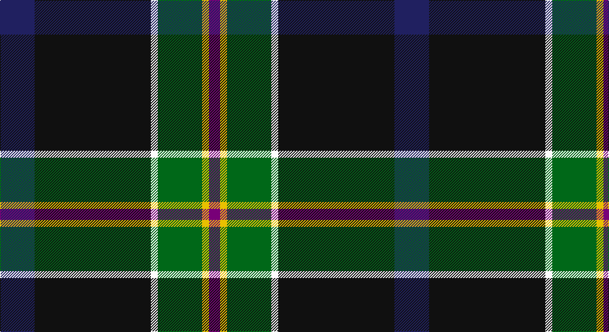

This page is one **sett** — a single exact thread-count. It belongs to the [tartan](/setts/db25k84w5g32ly5dp8/)
(the same proportion at any scale), whose colour order is pattern [BKWGYB](/stripes/bkwgyb/).

Part of the [Woodward, R Glenn](/tartans/woodward-r-glenn/) tartan — the named design grouping this sett with its other cloths.

Sourced from tartans-authority.  It is a [6 stripe tartan](/stripes/stripes6/).

Original link http://www.tartansauthority.com/tartan-ferret/display/10877/

## Register references

External register numbers recorded for this tartan.

- Scottish Register of Tartans: [10877](https://www.tartanregister.gov.uk/tartanDetails?ref=10877)
- Scottish Tartans Authority (ITI): 10877

## Thread count
DB/50 K168 W10 G64 Y10 P/16

One full sett is **570 threads**.

## Palette

Palette: <strong>Tartan Register</strong>
<table><thead><tr><th>Colour</th><th>Threads</th><th>Shade</th><th>Base</th><th>OKLCh</th></tr></thead><tbody><tr><td>DB/</td><td style="text-align:right;font-variant-numeric:tabular-nums">50</td><td><code style="background-color:#202060;">#202060</code> <small style="color:#888">#202060</small></td><td>B <code style="background-color:#2A418A;">#2A418A</code></td><td><small style="color:#888">oklch(28.9% 0.111 276.9)</small></td></tr><tr><td>K</td><td style="text-align:right;font-variant-numeric:tabular-nums">168</td><td><code style="background-color:#101010;">#101010</code> <small style="color:#888">#101010</small></td><td>K <code style="background-color:#000000;">#000000</code></td><td><small style="color:#888">oklch(17.3% 0.000 89.9)</small></td></tr><tr><td>W</td><td style="text-align:right;font-variant-numeric:tabular-nums">10</td><td><code style="background-color:#FCFCFC;">#FCFCFC</code> <small style="color:#888">#FCFCFC</small></td><td>W <code style="background-color:#F7F7F7;">#F7F7F7</code></td><td><small style="color:#888">oklch(99.1% 0.000 89.9)</small></td></tr><tr><td>G</td><td style="text-align:right;font-variant-numeric:tabular-nums">64</td><td><code style="background-color:#006818;">#006818</code> <small style="color:#888">#006818</small></td><td>G <code style="background-color:#006100;">#006100</code></td><td><small style="color:#888">oklch(45.0% 0.142 145.0)</small></td></tr><tr><td>Y</td><td style="text-align:right;font-variant-numeric:tabular-nums">10</td><td><code style="background-color:#E8C000;">#E8C000</code> <small style="color:#888">#E8C000</small></td><td>Y <code style="background-color:#F2BF00;">#F2BF00</code></td><td><small style="color:#888">oklch(81.9% 0.168 93.7)</small></td></tr><tr><td>P/</td><td style="text-align:right;font-variant-numeric:tabular-nums">16</td><td><code style="background-color:#780078;">#780078</code> <small style="color:#888">#780078</small></td><td>B <code style="background-color:#2A418A;">#2A418A</code></td><td><small style="color:#888">oklch(40.2% 0.185 328.4)</small></td></tr></tbody></table>

# Sample pattern

## Compared to the master

This cloth is one sett of its design; the master sett (the exemplar the design is anchored on) is below for comparison.

<figure style="margin:0"><figcaption style="color:#888;font-size:smaller">this sett</figcaption></figure>
<figure style="margin:0"><figcaption style="color:#888;font-size:smaller"><a href="/setts/dt25k84w5dg23lo5dp8/">master sett →</a></figcaption></figure>

## Nearest tartans

The nearest existing variants by ΔTartan distance, with this tartan at the top so the swatches line up against it.

ΔTartan

Tartan

Sett

—

<a href="/ttd/edit/#slug=db25k84w5g32ly5dp8~x2">Woodward, R Glenn</a> <a class="nn-out" href="/variants/s6/db25k84w5g32ly5dp8~x2/" title="open its dictionary page">↗</a>

0.89

<a href="/ttd/edit/#slug=dt25k84w5dg23lo5dp8~x2&amp;base=db25k84w5g32ly5dp8~x2">Woodward, R Glenn (Personal)</a> <a class="nn-out" href="/variants/s6/dt25k84w5dg23lo5dp8~x2/" title="open its dictionary page">↗</a>

1.13

<a href="/ttd/edit/#slug=dg10w2dt10lo5db35r6~x2&amp;base=db25k84w5g32ly5dp8~x2">Hatfield &amp; Mize (Personal)</a> <a class="nn-out" href="/variants/s6/dg10w2dt10lo5db35r6~x2/" title="open its dictionary page">↗</a>

1.18

<a href="/ttd/edit/#slug=w5k26ly2dg24dt7k3r3~x2&amp;base=db25k84w5g32ly5dp8~x2">Cornish Hunting District Tartan</a> <a class="nn-out" href="/variants/s7/w5k26ly2dg24dt7k3r3~x2/" title="open its dictionary page">↗</a>

1.18

<a href="/ttd/edit/#slug=r5t2k30n26ly2n2db4~x2&amp;base=db25k84w5g32ly5dp8~x2">Milne-Murtaugh (Personal)</a> <a class="nn-out" href="/variants/s7/r5t2k30n26ly2n2db4~x2/" title="open its dictionary page">↗</a>

1.19

<a href="/ttd/edit/#slug=r3y13db13ly2dg34w3~x2&amp;base=db25k84w5g32ly5dp8~x2">Glencross, Tynron (Name)</a> <a class="nn-out" href="/variants/s6/r3y13db13ly2dg34w3~x2/" title="open its dictionary page">↗</a>

1.23

<a href="/ttd/edit/#slug=o11k66y32dg11y10db6y10r4&amp;base=db25k84w5g32ly5dp8~x2">Turnbull, Dress Bruce (Personal)</a> <a class="nn-out" href="/variants/s8/o11k66y32dg11y10db6y10r4/" title="open its dictionary page">↗</a>

1.24

<a href="/ttd/edit/#slug=r3w2dy10dg37k12db21w2~x2&amp;base=db25k84w5g32ly5dp8~x2">Jones, The</a> <a class="nn-out" href="/variants/s7/r3w2dy10dg37k12db21w2~x2/" title="open its dictionary page">↗</a>

1.25

<a href="/ttd/edit/#slug=r3w2g5k35db40ly3~x2&amp;base=db25k84w5g32ly5dp8~x2">Italian National</a> <a class="nn-out" href="/variants/s6/r3w2g5k35db40ly3~x2/" title="open its dictionary page">↗</a>

1.27

<a href="/variants/s7/m5yii2k30yi26y2yi2ki4~x2/">Milne-Murtagh (2009)</a>

1.27

<a href="/ttd/edit/#slug=lo2dg20db8dp3db2dp2db16w1lg2~x2&amp;base=db25k84w5g32ly5dp8~x2">Scotland’s Golf Coast</a> <a class="nn-out" href="/variants/s9/lo2dg20db8dp3db2dp2db16w1lg2~x2/" title="open its dictionary page">↗</a>

## Neighbour map

Every grey dot is one of 14360 variants placed by the first two principal components of the ΔTartan feature space (44% of its variance). Red is this tartan; blue dots are its nearest — click one to open its page.

<svg viewBox="0 0 640 380" role="img" style="max-width:100%;height:auto;border:1px solid #e0e0e0;border-radius:4px;display:block" xmlns="http://www.w3.org/2000/svg"><image href="/nn/cloud.v1.png" width="640" height="380"/><a href="/variants/s6/dt25k84w5dg23lo5dp8~x2/"><circle cx="309.2" cy="166.3" r="4" fill="#3465a4"><title>Woodward, R Glenn (Personal)</title></circle></a><a href="/variants/s6/dg10w2dt10lo5db35r6~x2/"><circle cx="254.0" cy="157.2" r="4" fill="#3465a4"><title>Hatfield &amp; Mize (Personal)</title></circle></a><a href="/variants/s7/w5k26ly2dg24dt7k3r3~x2/"><circle cx="196.0" cy="164.1" r="4" fill="#3465a4"><title>Cornish Hunting District Tartan</title></circle></a><a href="/variants/s7/r5t2k30n26ly2n2db4~x2/"><circle cx="235.0" cy="144.9" r="4" fill="#3465a4"><title>Milne-Murtaugh (Personal)</title></circle></a><a href="/variants/s6/r3y13db13ly2dg34w3~x2/"><circle cx="259.2" cy="165.3" r="4" fill="#3465a4"><title>Glencross, Tynron (Name)</title></circle></a><a href="/variants/s8/o11k66y32dg11y10db6y10r4/"><circle cx="218.5" cy="134.3" r="4" fill="#3465a4"><title>Turnbull, Dress Bruce (Personal)</title></circle></a><a href="/variants/s7/r3w2dy10dg37k12db21w2~x2/"><circle cx="199.2" cy="154.6" r="4" fill="#3465a4"><title>Jones, The</title></circle></a><a href="/variants/s6/r3w2g5k35db40ly3~x2/"><circle cx="260.3" cy="144.0" r="4" fill="#3465a4"><title>Italian National</title></circle></a><a href="/variants/s7/m5yii2k30yi26y2yi2ki4~x2/"><circle cx="243.1" cy="148.9" r="4" fill="#3465a4"><title>Milne-Murtagh (2009)</title></circle></a><a href="/variants/s9/lo2dg20db8dp3db2dp2db16w1lg2~x2/"><circle cx="258.4" cy="136.2" r="4" fill="#3465a4"><title>Scotland’s Golf Coast</title></circle></a><circle cx="265.3" cy="155.9" r="5" fill="#c00000"/></svg>

ID: /variants/s6/db25k84w5g32ly5dp8~x2/
