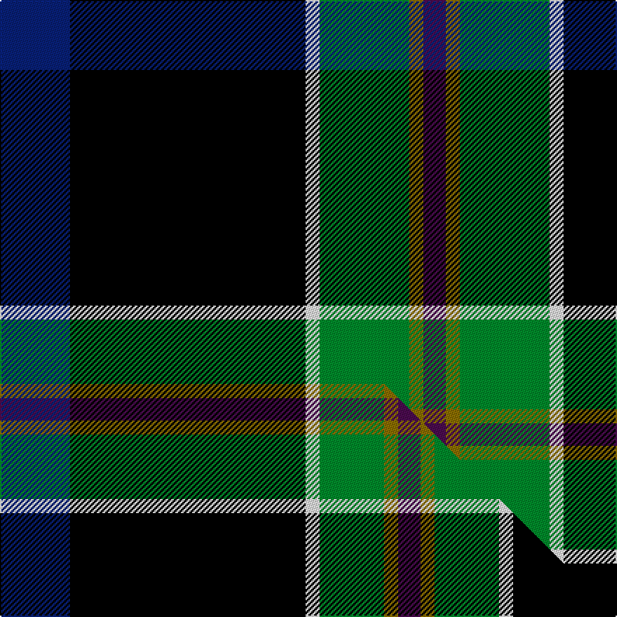

This is one **variant** — a specific cloth: this exact thread count and colourway, with its own
provenance below. It is one weaving of the [sett](/tartans/w/wo/woodward-r-glenn/) (the scale-free proportion — the
same cloth at any scale or shade), whose colour order is pattern [BGGWKB](/stripes/bggwkb/).

Part of the [Woodward, R Glenn](/tartans/w/wo/woodward-r-glenn/) tartan — the named design grouping this sett with its other cloths.

Sourced from tartans-authority.  It is a [6 stripe tartan](/stripes/stripes6/).

Original link <code>http://www.tartansauthority.com/tartan-ferret/display/10877/</code> — retired · [Internet Archive copy](https://web.archive.org/web/*/http://www.tartansauthority.com/tartan-ferret/display/10877/*)

Dataset <small>— provenance for this record, inherited from the source manifest</small>

<dl class="dataset-prov">
<dt>source</dt><dd><a href="/sources/tartans-authority/">Scottish Tartans Authority</a></dd>
<dt>data captured from</dt><dd><a href="https://github.com/thetartan/tartan-database/blob/master/data/tartans-authority/data.csv">https://github.com/thetartan/tartan-database/blob/master/data/tartans-authority/data.csv</a></dd>
<dt>data date</dt><dd>2013 <small>(this record)</small></dd>
<dt>licence</dt><dd><a href="https://creativecommons.org/licenses/by-nc-nd/4.0/">CC BY-NC-ND 4.0</a></dd>
</dl>

Capture chain <small>— the hands this data passed through, oldest first; each capture carries its own licence</small>

<ol class="capture-chain">
<li><a href="https://www.tartansauthority.com/">Scottish Tartans Authority</a> <small>the heritage body’s archive — its tartan-ferret record browser is retired; dead record links are shown unlinked, with an Internet Archive copy (ITI numbers are not SRT references)</small></li>
<li><a href="https://github.com/thetartan/tartan-database">thetartan/tartan-database</a> <small>2016-2017</small> · <a href="https://creativecommons.org/licenses/by-nc-nd/4.0/">CC BY-NC-ND 4.0</a> <small>Levko Kravets's frozen compilation — the capture we vendored, and where its CC licence text came from</small></li>
<li>this dictionary <small>captured 2026-06-10 · commit 5bf86c7566</small> <small>each re-capture is a git commit to data/sources</small></li>
</ol>

## Register references

External register numbers recorded for this tartan.

- Scottish Register of Tartans: [10877](https://www.tartanregister.gov.uk/tartanDetails?ref=10877)
- Scottish Tartans Authority (ITI): 10877

## Thread count
DB/50 K168 W10 G64 Y10 DP/16

One full sett is **570 threads**.

## Palette
<table><thead><tr><th>Colour</th><th>Shade</th><th>OKLCh</th></tr></thead><tbody><tr><td>DB</td><td><code style="background-color:#082077;">#082077</code> <small style="color:#888">#082077</small></td><td><small style="color:#888">oklch(30.0% 0.149 265.1)</small></td></tr><tr><td>G</td><td><code style="background-color:#008B2A;">#008B2A</code> <small style="color:#888">#008B2A</small></td><td><small style="color:#888">oklch(55.4% 0.170 145.9)</small></td></tr><tr><td>K</td><td><code style="background-color:#000000;">#000000</code> <small style="color:#888">#000000</small></td><td><small style="color:#888">oklch(0.0% 0.000 0.0)</small></td></tr><tr><td>DP</td><td><code style="background-color:#4B0B4F;">#4B0B4F</code> <small style="color:#888">#4B0B4F</small></td><td><small style="color:#888">oklch(30.1% 0.125 325.4)</small></td></tr><tr><td>W</td><td><code style="background-color:#F7F7F7;">#F7F7F7</code> <small style="color:#888">#F7F7F7</small></td><td><small style="color:#888">oklch(97.6% 0.000 89.9)</small></td></tr><tr><td>Y</td><td><code style="background-color:#8B6E00;">#8B6E00</code> <small style="color:#888">#8B6E00</small></td><td><small style="color:#888">oklch(55.1% 0.113 90.4)</small></td></tr></tbody></table>

# Sample pattern

## Compared to the master

This cloth is one sett of its design; the master sett (the exemplar the design is anchored on) is below for comparison.

Its **ΔTartan distance** from the master is **0.16** — the same measure the nearest-tartans table ranks by (0 is identical; a re-scale of the same cloth is near 0, a recolour or a different proportion further).

<figure class="master-compare" style="margin:0">

this sett
master sett ★

<figcaption style="color:#888;font-size:smaller">One weave of this sett against the <a href="/setts/db25k84w5g23y5dp8/">master sett ★</a>, split on the diagonal: a shared proportion runs seamlessly across it with only the shades shifting; a different proportion breaks on it.</figcaption>
</figure>

## Nearest tartan variants

The nearest existing variants by ΔTartan distance, with this cloth at the top so the swatches line up against it.

ΔTartan

Threads

Variant

Sett

—

570

<a href="/variants/s6/db25k84w5g32y5dp8~x2/">Woodward, R Glenn</a>

<a href="/ttd/edit/#slug=db25k84w5g23y5dp8~x2&amp;base=db25k84w5g32y5dp8~x2" title="compare in the TTD">0.16</a>

534

<a href="/variants/s6/db25k84w5g23y5dp8~x2/">Woodward, R Glenn (Personal)</a>

<a href="/ttd/edit/#slug=k54n11g13ly1t13w1~x2&amp;base=db25k84w5g32y5dp8~x2" title="compare in the TTD">1.28</a>

262

<a href="/variants/s6/k54n11g13ly1t13w1~x2/">Kilmaine Saints (Corporate)</a>

<a href="/ttd/edit/#slug=k54n11g13y1db13w1~x2&amp;base=db25k84w5g32y5dp8~x2" title="compare in the TTD">1.28</a>

262

<a href="/variants/s6/k54n11g13y1db13w1~x2/">Kilmaine Saints</a>

<a href="/ttd/edit/#slug=dg10w2k10y5db35r6~x2&amp;base=db25k84w5g32y5dp8~x2" title="compare in the TTD">1.65</a>

240

<a href="/variants/s6/dg10w2k10y5db35r6~x2/">Hatfield &amp; Mize (Personal)</a>

<a href="/ttd/edit/#slug=dt30lb2k6db3r3~x4~db1406275&amp;base=db25k84w5g32y5dp8~x2" title="compare in the TTD">1.67</a>

220

<a href="/variants/s5/dt30lb2k6db3r3~x4~db1406275/">Edinburgh Crystal Corporate Tartan</a>

<a href="/ttd/edit/#slug=y4g22r3k17r3db37w3~x2&amp;base=db25k84w5g32y5dp8~x2" title="compare in the TTD">1.80</a>

342

<a href="/variants/s7/y4g22r3k17r3db37w3~x2/">Souza Nery</a>

<a href="/ttd/edit/#slug=ly4g22r3k17r3db37w3~x2&amp;base=db25k84w5g32y5dp8~x2" title="compare in the TTD">1.80</a>

342

<a href="/variants/s7/ly4g22r3k17r3db37w3~x2/">Souza Nery (Personal)</a>

<a href="/ttd/edit/#slug=db12k17o4dg51ly3g4~x2~o2203076-ly3307090&amp;base=db25k84w5g32y5dp8~x2" title="compare in the TTD">1.84</a>

332

<a href="/variants/s6/db12k17y4dg51ly3g4~x2~y2203076-ly3307090/">US Army Regimental Tartan</a>

<a href="/ttd/edit/#slug=lb2g13r2k6db23w1~x4&amp;base=db25k84w5g32y5dp8~x2" title="compare in the TTD">1.86</a>

364

<a href="/variants/s6/lb2g13r2k6db23w1~x4/">Gamblin Thompson (Personal)</a>

<a href="/ttd/edit/#slug=k45ly10g7r3w4db13w9r6~x2&amp;base=db25k84w5g32y5dp8~x2" title="compare in the TTD">1.99</a>

286

<a href="/variants/s8/k45ly10g7r3w4db13w9r6~x2/">Legion of Frontiersmen (Corporate)</a>

## Neighbour map

Every grey dot is one of 13656 variants placed by the first two principal components of the ΔTartan feature space (42% of its variance). Red is this tartan; blue dots are its nearest — click one to open its page. The map is a flat projection of a many-dimensional space — [how to read it](/posts/neighbourhood-maps/).

<svg viewBox="0 0 640 380" role="img" style="max-width:100%;height:auto;border:1px solid #e0e0e0;border-radius:4px;display:block" xmlns="http://www.w3.org/2000/svg"><image href="/nn/cloud.v1.png" width="640" height="380"/><a href="/variants/s6/db25k84w5g23y5dp8~x2/"><circle cx="242.4" cy="124.6" r="4" fill="#3465a4"><title>Woodward, R Glenn (Personal)</title></circle></a><a href="/variants/s6/k54n11g13ly1t13w1~x2/"><circle cx="285.4" cy="80.4" r="4" fill="#3465a4"><title>Kilmaine Saints (Corporate)</title></circle></a><a href="/variants/s6/k54n11g13y1db13w1~x2/"><circle cx="296.8" cy="82.5" r="4" fill="#3465a4"><title>Kilmaine Saints</title></circle></a><a href="/variants/s6/dg10w2k10y5db35r6~x2/"><circle cx="229.6" cy="140.0" r="4" fill="#3465a4"><title>Hatfield &amp; Mize (Personal)</title></circle></a><a href="/variants/s5/dt30lb2k6db3r3~x4~db1406275/"><circle cx="281.6" cy="130.5" r="4" fill="#3465a4"><title>Edinburgh Crystal Corporate Tartan</title></circle></a><a href="/variants/s7/y4g22r3k17r3db37w3~x2/"><circle cx="143.2" cy="142.4" r="4" fill="#3465a4"><title>Souza Nery</title></circle></a><a href="/variants/s7/ly4g22r3k17r3db37w3~x2/"><circle cx="138.2" cy="141.0" r="4" fill="#3465a4"><title>Souza Nery (Personal)</title></circle></a><a href="/variants/s6/db12k17y4dg51ly3g4~x2~y2203076-ly3307090/"><circle cx="285.5" cy="141.0" r="4" fill="#3465a4"><title>US Army Regimental Tartan</title></circle></a><a href="/variants/s6/lb2g13r2k6db23w1~x4/"><circle cx="214.5" cy="123.5" r="4" fill="#3465a4"><title>Gamblin Thompson (Personal)</title></circle></a><a href="/variants/s8/k45ly10g7r3w4db13w9r6~x2/"><circle cx="143.2" cy="111.7" r="4" fill="#3465a4"><title>Legion of Frontiersmen (Corporate)</title></circle></a><circle cx="219.8" cy="129.5" r="5" fill="#c00000"/><text x="320" y="376" text-anchor="middle" font-size="11" fill="#999">ground</text><text x="11" y="190" text-anchor="middle" font-size="11" fill="#999" transform="rotate(-90 11 190)">complexity</text></svg>

ID: /variants/s6/db25k84w5g32y5dp8~x2/
