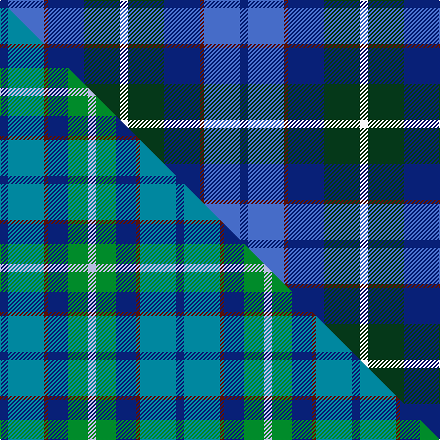

This is one **variant** — a specific cloth: this exact thread count and colourway, with its own
provenance below. It is one weaving of the [sett](/setts/db2b9dr1db9dg9w2/) (the scale-free proportion — the
same cloth at any scale or shade), whose colour order is pattern [BBBBGW](/stripes/bbbbgw/).

Part of the [American Express](/tartans/a/am/american-express-2/) tartan — the named design grouping this sett with its other cloths.

Sourced from weddslist.  It is a [6 stripe tartan](/stripes/stripes6/).

Original link [http://www.weddslist.com/cgi-bin/tartans/pg.pl?source=sts](http://www.weddslist.com/cgi-bin/tartans/pg.pl?source=sts)

Dataset <small>— provenance for this record, inherited from the source manifest</small>

<dl class="dataset-prov">
<dt>source</dt><dd><a href="/sources/weddslist/">Weddslist</a></dd>
<dt>data captured from</dt><dd><a href="https://github.com/thetartan/tartan-database/blob/master/data/weddslist/data.csv">https://github.com/thetartan/tartan-database/blob/master/data/weddslist/data.csv</a></dd>
<dt>data date</dt><dd>2016-11-17 <small>(dataset default)</small></dd>
<dt>licence</dt><dd><a href="https://creativecommons.org/licenses/by-nc-nd/4.0/">CC BY-NC-ND 4.0</a></dd>
</dl>

Capture chain <small>— the hands this data passed through, oldest first; each capture carries its own licence</small>

<ol class="capture-chain">
<li><a href="https://www.weddslist.com/tartans/">Weddslist</a> <small>the living privately compiled reference</small></li>
<li><a href="https://github.com/thetartan/tartan-database">thetartan/tartan-database</a> <small>2016-2017</small> · <a href="https://creativecommons.org/licenses/by-nc-nd/4.0/">CC BY-NC-ND 4.0</a> <small>Levko Kravets's frozen compilation — the capture we vendored, and where its CC licence text came from</small></li>
<li>this dictionary <small>captured 2026-06-10 · commit 5bf86c7566</small> <small>each re-capture is a git commit to data/sources</small></li>
</ol>

## Thread count
DB/8 B36 DR4 DB36 DG36 W/8

One full sett is **240 threads**.

## Palette
<table><thead><tr><th>Colour</th><th>Shade</th><th>OKLCh</th></tr></thead><tbody><tr><td>B</td><td><code style="background-color:#466CC8;">#466CC8</code> <small style="color:#888">#466CC8</small></td><td><small style="color:#888">oklch(55.1% 0.149 265.0)</small></td></tr><tr><td>DB</td><td><code style="background-color:#082077;">#082077</code> <small style="color:#888">#082077</small></td><td><small style="color:#888">oklch(30.0% 0.149 265.1)</small></td></tr><tr><td>DG</td><td><code style="background-color:#053819;">#053819</code> <small style="color:#888">#053819</small></td><td><small style="color:#888">oklch(30.0% 0.075 151.3)</small></td></tr><tr><td>DR</td><td><code style="background-color:#55120C;">#55120C</code> <small style="color:#888">#55120C</small></td><td><small style="color:#888">oklch(30.0% 0.099 29.3)</small></td></tr><tr><td>W</td><td><code style="background-color:#F7F7F7;">#F7F7F7</code> <small style="color:#888">#F7F7F7</small></td><td><small style="color:#888">oklch(97.6% 0.000 89.9)</small></td></tr></tbody></table>

# Sample pattern

## Compared to the master

This cloth is one sett of its design; the master sett (the exemplar the design is anchored on) is below for comparison.

Its **ΔTartan distance** from the master is **0.87** — the same measure the nearest-tartans table ranks by (0 is identical; a re-scale of the same cloth is near 0, a recolour or a different proportion further).

<figure class="master-compare" style="margin:0">

this sett
master sett ★

<figcaption style="color:#888;font-size:smaller">One weave of this sett against the <a href="/setts/db2t9dr1db5g5lb2/">master sett ★</a>, split on the diagonal: a shared proportion runs seamlessly across it with only the shades shifting; a different proportion breaks on it.</figcaption>
</figure>

## Nearest tartan variants

The nearest existing variants by ΔTartan distance, with this cloth at the top so the swatches line up against it.

ΔTartan

Threads

Variant

Sett

—

240

<a href="/variants/s6/db2b9dr1db9dg9w2~x4/">American Express</a>

<a href="/ttd/edit/#slug=db2t9dr1db5g5lb2~x4&amp;base=db2b9dr1db9dg9w2~x4" title="compare in the TTD">0.87</a>

176

<a href="/variants/s6/db2t9dr1db5g5lb2~x4/">American Express</a>

<a href="/ttd/edit/#slug=w15dg98db72dr25db8ly15&amp;base=db2b9dr1db9dg9w2~x4" title="compare in the TTD">1.89</a>

436

<a href="/variants/s6/w15dg98db72dr25db8ly15/">Afternoon Tea / Darjeeling</a>

<a href="/ttd/edit/#slug=y15db8r25db72dg98w15&amp;base=db2b9dr1db9dg9w2~x4" title="compare in the TTD">1.89</a>

436

<a href="/variants/s6/y15db8r25db72dg98w15/">Afternoon Tea / Darjeeling</a>

<a href="/ttd/edit/#slug=g11dy4w1db10dr1db2~x4&amp;base=db2b9dr1db9dg9w2~x4" title="compare in the TTD">2.07</a>

180

<a href="/variants/s6/g11dy4w1db10dr1db2~x4/">Ayrshire</a>

<a href="/ttd/edit/#slug=db3g11lb2db11b6g3~x2&amp;base=db2b9dr1db9dg9w2~x4" title="compare in the TTD">2.07</a>

132

<a href="/variants/s6/db3g11lb2db11b6g3~x2/">Unnamed, No 29</a>

<a href="/ttd/edit/#slug=lb2db20n2dt15dr9lb2~x2&amp;base=db2b9dr1db9dg9w2~x4" title="compare in the TTD">2.10</a>

192

<a href="/variants/s6/lb2db20n2dt15dr9lb2~x2/">Open Championship (1998)</a>

<a href="/ttd/edit/#slug=y4dt4lb5db24y2dt24w4~x2~dt1204274-db1406275&amp;base=db2b9dr1db9dg9w2~x4" title="compare in the TTD">2.19</a>

252

<a href="/variants/s7/y4db4lb5dbi24y2db24w4~x2~db1204274-dbi1406275/">Mina Perhonen Japanese Corporate Tartan</a>

<a href="/ttd/edit/#slug=db4bi2dp3db24b24w3~x2~db1004274-bi2308302-dp1105325-b2105244&amp;base=db2b9dr1db9dg9w2~x4" title="compare in the TTD">2.23</a>

226

<a href="/variants/s6/db4b2dp3db24t24w3~x2~db1004274-b2308302-dp1105325-t2105244/">Aberdeen Academy of Performing Arts</a>

<a href="/ttd/edit/#slug=lb8n4db30dt30r3dt4~x2&amp;base=db2b9dr1db9dg9w2~x4" title="compare in the TTD">2.29</a>

292

<a href="/variants/s6/lb8n4db30dt30r3dt4~x2/">Hutchesons' Grammar (Corporate)</a>

<a href="/ttd/edit/#slug=db2b22dg11y2dg11db2~x2&amp;base=db2b9dr1db9dg9w2~x4" title="compare in the TTD">2.37</a>

192

<a href="/variants/s6/db2b22dg11y2dg11db2~x2/">Cetoloni</a>

## Neighbour map

Every grey dot is one of 13656 variants placed by the first two principal components of the ΔTartan feature space (42% of its variance). Red is this tartan; blue dots are its nearest — click one to open its page. The map is a flat projection of a many-dimensional space — [how to read it](/posts/neighbourhood-maps/).

<svg viewBox="0 0 640 380" role="img" style="max-width:100%;height:auto;border:1px solid #e0e0e0;border-radius:4px;display:block" xmlns="http://www.w3.org/2000/svg"><image href="/nn/cloud.v1.png" width="640" height="380"/><a href="/variants/s6/db2t9dr1db5g5lb2~x4/"><circle cx="220.8" cy="255.1" r="4" fill="#3465a4"><title>American Express</title></circle></a><a href="/variants/s6/w15dg98db72dr25db8ly15/"><circle cx="245.6" cy="210.5" r="4" fill="#3465a4"><title>Afternoon Tea / Darjeeling</title></circle></a><a href="/variants/s6/y15db8r25db72dg98w15/"><circle cx="227.3" cy="195.7" r="4" fill="#3465a4"><title>Afternoon Tea / Darjeeling</title></circle></a><a href="/variants/s6/g11dy4w1db10dr1db2~x4/"><circle cx="246.7" cy="218.3" r="4" fill="#3465a4"><title>Ayrshire</title></circle></a><a href="/variants/s6/db3g11lb2db11b6g3~x2/"><circle cx="225.9" cy="285.9" r="4" fill="#3465a4"><title>Unnamed, No 29</title></circle></a><a href="/variants/s6/lb2db20n2dt15dr9lb2~x2/"><circle cx="307.9" cy="254.2" r="4" fill="#3465a4"><title>Open Championship (1998)</title></circle></a><a href="/variants/s7/y4db4lb5dbi24y2db24w4~x2~db1204274-dbi1406275/"><circle cx="269.0" cy="203.6" r="4" fill="#3465a4"><title>Mina Perhonen Japanese Corporate Tartan</title></circle></a><a href="/variants/s6/db4b2dp3db24t24w3~x2~db1004274-b2308302-dp1105325-t2105244/"><circle cx="336.0" cy="221.5" r="4" fill="#3465a4"><title>Aberdeen Academy of Performing Arts</title></circle></a><a href="/variants/s6/lb8n4db30dt30r3dt4~x2/"><circle cx="275.9" cy="214.9" r="4" fill="#3465a4"><title>Hutchesons' Grammar (Corporate)</title></circle></a><a href="/variants/s6/db2b22dg11y2dg11db2~x2/"><circle cx="337.6" cy="242.1" r="4" fill="#3465a4"><title>Cetoloni</title></circle></a><circle cx="203.3" cy="246.1" r="5" fill="#c00000"/><text x="320" y="376" text-anchor="middle" font-size="11" fill="#999">ground</text><text x="11" y="190" text-anchor="middle" font-size="11" fill="#999" transform="rotate(-90 11 190)">complexity</text></svg>

ID: /variants/s6/db2b9dr1db9dg9w2~x4/
