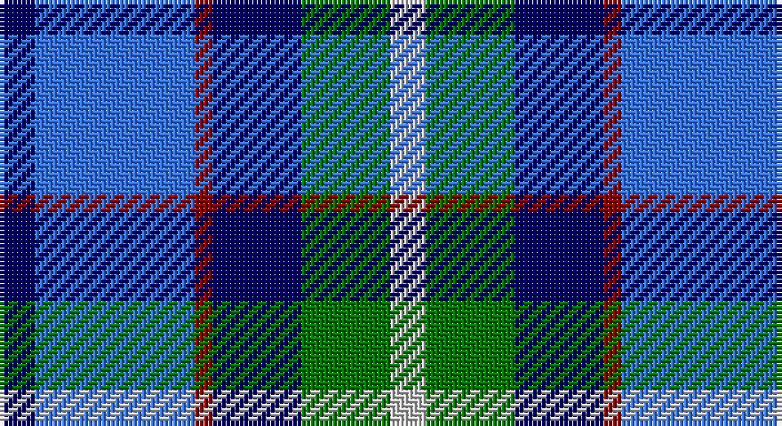

This page is one **sett** — a single exact thread-count. It belongs to the [tartan](/setts/db2b9r1db5g5lb2/)
(the same proportion at any scale), whose colour order is pattern [BBRBGW](/stripes/bbrbgw/).

Part of the [American Express](/tartans/american-express/) tartan — the named design grouping this sett with its other cloths.

Sourced from register-of-tartans.  It is a [6 stripe tartan](/stripes/stripes6/).

Original link https://www.tartanregister.gov.uk/tartanDetails.aspx?ref=68

2 attestations — the source records this cloth was collapsed from (oldest owns this page)

<ul>
<li>01/04/1997 — American Express (register-of-tartans, <a href="https://www.tartanregister.gov.uk/tartanDetails.aspx?ref=68">record</a>)</li>
<li>April 1997 — American Express (Corporate) (tartans-authority, <a href="http://www.tartansauthority.com/tartan-ferret/display/2354/">record</a>)</li>
</ul>

## Register references

External register numbers recorded for this tartan.

- Scottish Register of Tartans: [68](https://www.tartanregister.gov.uk/tartanDetails.aspx?ref=68)
- Scottish Tartans Authority (ITI): 2354
- Scottish Tartans World Register: 2354

## Thread count
DB/8 B36 DR4 DB20 G20 N/8

One full sett is **176 threads**.

## Palette

Palette: <strong>Tartan Register</strong> <small style="color:#888">(3 of 5 colours)</small>
<table><thead><tr><th>Colour</th><th>Threads</th><th>Shade</th><th>Base</th><th>OKLCh</th></tr></thead><tbody><tr><td>DB/</td><td style="text-align:right;font-variant-numeric:tabular-nums">8</td><td><code style="background-color:#000064;">#000064</code> <small style="color:#888">#000064</small></td><td>B <code style="background-color:#2A418A;">#2A418A</code></td><td><small style="color:#888">oklch(22.7% 0.158 264.1)</small></td></tr><tr><td>B</td><td style="text-align:right;font-variant-numeric:tabular-nums">36</td><td><code style="background-color:#3474FC;">#3474FC</code> <small style="color:#888">#3474FC</small></td><td>B <code style="background-color:#2A418A;">#2A418A</code></td><td><small style="color:#888">oklch(59.7% 0.214 262.7)</small></td></tr><tr><td>DR</td><td style="text-align:right;font-variant-numeric:tabular-nums">4</td><td><code style="background-color:#8C0000;">#8C0000</code> <small style="color:#888">#8C0000</small></td><td>R <code style="background-color:#CC0000;">#CC0000</code></td><td><small style="color:#888">oklch(40.2% 0.165 29.2)</small></td></tr><tr><td>DB</td><td style="text-align:right;font-variant-numeric:tabular-nums">20</td><td><code style="background-color:#000064;">#000064</code> <small style="color:#888">#000064</small></td><td>B <code style="background-color:#2A418A;">#2A418A</code></td><td><small style="color:#888">oklch(22.7% 0.158 264.1)</small></td></tr><tr><td>G</td><td style="text-align:right;font-variant-numeric:tabular-nums">20</td><td><code style="background-color:#007800;">#007800</code> <small style="color:#888">#007800</small></td><td>G <code style="background-color:#006100;">#006100</code></td><td><small style="color:#888">oklch(49.6% 0.169 142.5)</small></td></tr><tr><td>N/</td><td style="text-align:right;font-variant-numeric:tabular-nums">8</td><td><code style="background-color:#C8C8C8;">#C8C8C8</code> <small style="color:#888">#C8C8C8</small></td><td>W <code style="background-color:#F7F7F7;">#F7F7F7</code></td><td><small style="color:#888">oklch(83.3% 0.000 89.9)</small></td></tr></tbody></table>

# Sample pattern

## Nearest tartans

The nearest existing variants by ΔTartan distance, with this tartan at the top so the swatches line up against it.

ΔTartan

Tartan

Sett

—

<a href="/ttd/edit/#slug=db2b9r1db5g5lb2~x4">American Express</a> <a class="nn-out" href="/variants/s6/db2b9r1db5g5lb2~x4/" title="open its dictionary page">↗</a>

1.05

<a href="/ttd/edit/#slug=r2db12k5t16w2~x4&amp;base=db2b9r1db5g5lb2~x4">RSCDS Australia? (Corporate)</a> <a class="nn-out" href="/variants/s5/r2db12k5t16w2~x4/" title="open its dictionary page">↗</a>

1.11

<a href="/ttd/edit/#slug=b9r1db5g5lb2g5db5r1b9db2~x4&amp;base=db2b9r1db5g5lb2~x4">American Express Corporate Tartan</a> <a class="nn-out" href="/variants/s10/b9r1db5g5lb2g5db5r1b9db2~x4/" title="open its dictionary page">↗</a>

1.22

<a href="/ttd/edit/#slug=db2b9m1db9dg9w2~x4&amp;base=db2b9r1db5g5lb2~x4">American Express</a> <a class="nn-out" href="/variants/s6/db2b9m1db9dg9w2~x4/" title="open its dictionary page">↗</a>

1.27

<a href="/ttd/edit/#slug=k4db2k15w10b15db2b4~x2&amp;base=db2b9r1db5g5lb2~x4">Strathclyde</a> <a class="nn-out" href="/variants/s7/k4db2k15w10b15db2b4~x2/" title="open its dictionary page">↗</a>

1.29

<a href="/ttd/edit/#slug=lr2r1t7db7lb1~x8&amp;base=db2b9r1db5g5lb2~x4">Bryson (1988) (Name)</a> <a class="nn-out" href="/variants/s5/lr2r1t7db7lb1~x8/" title="open its dictionary page">↗</a>

1.30

<a href="/ttd/edit/#slug=db11dg10y6db7lt2db3dp10lt2~x2&amp;base=db2b9r1db5g5lb2~x4">Hummelt, Katherine (Personal)</a> <a class="nn-out" href="/variants/s8/db11dg10y6db7lt2db3dp10lt2~x2/" title="open its dictionary page">↗</a>

1.34

<a href="/ttd/edit/#slug=dg12b8db4ly2r1ly1db6~x4&amp;base=db2b9r1db5g5lb2~x4">F.I.A.T.A. Congress of 1990</a> <a class="nn-out" href="/variants/s7/dg12b8db4ly2r1ly1db6~x4/" title="open its dictionary page">↗</a>

1.38

<a href="/ttd/edit/#slug=db3t24k11db20w2db5lo3~x2&amp;base=db2b9r1db5g5lb2~x4">Icelandair</a> <a class="nn-out" href="/variants/s7/db3t24k11db20w2db5lo3~x2/" title="open its dictionary page">↗</a>

1.40

<a href="/ttd/edit/#slug=b24k4r3g24k4ly3~x2&amp;base=db2b9r1db5g5lb2~x4">(1) Skene</a> <a class="nn-out" href="/variants/s6/b24k4r3g24k4ly3~x2/" title="open its dictionary page">↗</a>

1.40

<a href="/ttd/edit/#slug=y16r8b57db56lb8&amp;base=db2b9r1db5g5lb2~x4">Bryson (1988)</a> <a class="nn-out" href="/variants/s5/y16r8b57db56lb8/" title="open its dictionary page">↗</a>

## Neighbour map

Every grey dot is one of 14360 variants placed by the first two principal components of the ΔTartan feature space (44% of its variance). Red is this tartan; blue dots are its nearest — click one to open its page.

<svg viewBox="0 0 640 380" role="img" style="max-width:100%;height:auto;border:1px solid #e0e0e0;border-radius:4px;display:block" xmlns="http://www.w3.org/2000/svg"><image href="/nn/cloud.v1.png" width="640" height="380"/><a href="/variants/s5/r2db12k5t16w2~x4/"><circle cx="182.0" cy="215.7" r="4" fill="#3465a4"><title>RSCDS Australia? (Corporate)</title></circle></a><a href="/variants/s10/b9r1db5g5lb2g5db5r1b9db2~x4/"><circle cx="136.5" cy="195.7" r="4" fill="#3465a4"><title>American Express Corporate Tartan</title></circle></a><a href="/variants/s6/db2b9m1db9dg9w2~x4/"><circle cx="126.7" cy="208.9" r="4" fill="#3465a4"><title>American Express</title></circle></a><a href="/variants/s7/k4db2k15w10b15db2b4~x2/"><circle cx="129.3" cy="208.9" r="4" fill="#3465a4"><title>Strathclyde</title></circle></a><a href="/variants/s5/lr2r1t7db7lb1~x8/"><circle cx="160.8" cy="213.0" r="4" fill="#3465a4"><title>Bryson (1988) (Name)</title></circle></a><a href="/variants/s8/db11dg10y6db7lt2db3dp10lt2~x2/"><circle cx="108.5" cy="232.0" r="4" fill="#3465a4"><title>Hummelt, Katherine (Personal)</title></circle></a><a href="/variants/s7/dg12b8db4ly2r1ly1db6~x4/"><circle cx="148.7" cy="190.0" r="4" fill="#3465a4"><title>F.I.A.T.A. Congress of 1990</title></circle></a><a href="/variants/s7/db3t24k11db20w2db5lo3~x2/"><circle cx="206.7" cy="188.5" r="4" fill="#3465a4"><title>Icelandair</title></circle></a><a href="/variants/s6/b24k4r3g24k4ly3~x2/"><circle cx="152.3" cy="189.7" r="4" fill="#3465a4"><title>(1) Skene</title></circle></a><a href="/variants/s5/y16r8b57db56lb8/"><circle cx="177.0" cy="221.4" r="4" fill="#3465a4"><title>Bryson (1988)</title></circle></a><circle cx="129.1" cy="209.7" r="5" fill="#c00000"/></svg>

ID: /variants/s6/db2b9r1db5g5lb2~x4/
