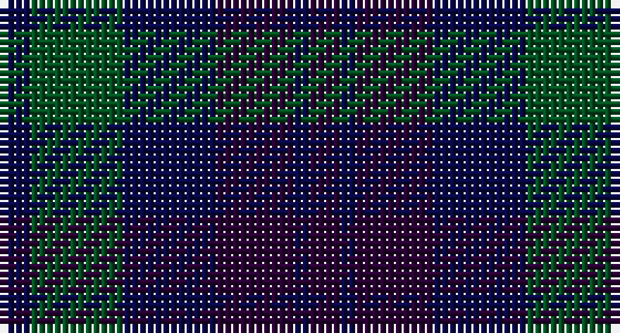

This page is one **sett** — a single exact thread-count. It belongs to the [tartan](/setts/db2dg6db6dp5db1dp2/)
(the same proportion at any scale), whose colour order is pattern [BBBBGB](/stripes/bbbbgb/).

Sourced from register-of-tartans.  It is a [6 stripe tartan](/stripes/stripes6/).

Original link https://www.tartanregister.gov.uk/tartanDetails.aspx?ref=4334

## Also known as

This cloth is also recorded under:

- Unnamed, No 54

## Register references

External register numbers recorded for this tartan.

- Scottish Register of Tartans: [4334](https://www.tartanregister.gov.uk/tartanDetails.aspx?ref=4334)
- Scottish Tartans World Register: 32

## Thread count
DB/4 G12 DB12 DP10 DB2 DP/4

One full sett is **80 threads**.

## Palette

Palette: <strong>Tartan Register</strong> <small style="color:#888">(1 of 3 colours)</small>
<table><thead><tr><th>Colour</th><th>Threads</th><th>Shade</th><th>Base</th><th>OKLCh</th></tr></thead><tbody><tr><td>DB/</td><td style="text-align:right;font-variant-numeric:tabular-nums">4</td><td><code style="background-color:#080848;">#080848</code> <small style="color:#888">#080848</small></td><td>B <code style="background-color:#2A418A;">#2A418A</code></td><td><small style="color:#888">oklch(20.2% 0.112 270.4)</small></td></tr><tr><td>G</td><td style="text-align:right;font-variant-numeric:tabular-nums">12</td><td><code style="background-color:#005020;">#005020</code> <small style="color:#888">#005020</small></td><td>G <code style="background-color:#006100;">#006100</code></td><td><small style="color:#888">oklch(37.7% 0.105 149.6)</small></td></tr><tr><td>DB</td><td style="text-align:right;font-variant-numeric:tabular-nums">12</td><td><code style="background-color:#080848;">#080848</code> <small style="color:#888">#080848</small></td><td>B <code style="background-color:#2A418A;">#2A418A</code></td><td><small style="color:#888">oklch(20.2% 0.112 270.4)</small></td></tr><tr><td>DP</td><td style="text-align:right;font-variant-numeric:tabular-nums">10</td><td><code style="background-color:#280032;">#280032</code> <small style="color:#888">#280032</small></td><td>B <code style="background-color:#2A418A;">#2A418A</code></td><td><small style="color:#888">oklch(20.3% 0.098 318.7)</small></td></tr><tr><td>DB</td><td style="text-align:right;font-variant-numeric:tabular-nums">2</td><td><code style="background-color:#080848;">#080848</code> <small style="color:#888">#080848</small></td><td>B <code style="background-color:#2A418A;">#2A418A</code></td><td><small style="color:#888">oklch(20.2% 0.112 270.4)</small></td></tr><tr><td>DP/</td><td style="text-align:right;font-variant-numeric:tabular-nums">4</td><td><code style="background-color:#280032;">#280032</code> <small style="color:#888">#280032</small></td><td>B <code style="background-color:#2A418A;">#2A418A</code></td><td><small style="color:#888">oklch(20.3% 0.098 318.7)</small></td></tr></tbody></table>

# Sample pattern

## Nearest tartans

The nearest existing variants by ΔTartan distance, with this tartan at the top so the swatches line up against it.

ΔTartan

Tartan

Sett

—

<a href="/ttd/edit/#slug=db2dg6db6dp5db1dp2~x2">Unidentified no. 54</a> <a class="nn-out" href="/variants/s6/db2dg6db6dp5db1dp2~x2/" title="open its dictionary page">↗</a>

1.34

<a href="/ttd/edit/#slug=k4dg16k13db16t3db3~x2&amp;base=db2dg6db6dp5db1dp2~x2">I Y</a> <a class="nn-out" href="/variants/s6/k4dg16k13db16t3db3~x2/" title="open its dictionary page">↗</a>

1.44

<a href="/ttd/edit/#slug=k5dg14k16db12dg4~x2&amp;base=db2dg6db6dp5db1dp2~x2">Unidentified #29</a> <a class="nn-out" href="/variants/s5/k5dg14k16db12dg4~x2/" title="open its dictionary page">↗</a>

1.56

<a href="/ttd/edit/#slug=db7k2db2k2db2k7dp7k2~x4&amp;base=db2dg6db6dp5db1dp2~x2">Glasgow Academy</a> <a class="nn-out" href="/variants/s8/db7k2db2k2db2k7dp7k2~x4/" title="open its dictionary page">↗</a>

1.74

<a href="/ttd/edit/#slug=k1dg3k3db3k1db1~x4&amp;base=db2dg6db6dp5db1dp2~x2">Sutherland 42nd</a> <a class="nn-out" href="/variants/s6/k1dg3k3db3k1db1~x4/" title="open its dictionary page">↗</a>

1.76

<a href="/ttd/edit/#slug=dy3dbi6db2lo2db11dbi2db2dy3~x2&amp;base=db2dg6db6dp5db1dp2~x2">Daks (Blue)</a> <a class="nn-out" href="/variants/s8/dy3dbi6db2lo2db11dbi2db2dy3~x2/" title="open its dictionary page">↗</a>

1.80

<a href="/ttd/edit/#slug=b5k22db4k4db26k4~x2&amp;base=db2dg6db6dp5db1dp2~x2">Slanj, The</a> <a class="nn-out" href="/variants/s6/b5k22db4k4db26k4~x2/" title="open its dictionary page">↗</a>

1.83

<a href="/ttd/edit/#slug=k3db15k9dy3k2dy14k2dy3k9db13k2db3~x2&amp;base=db2dg6db6dp5db1dp2~x2">McWilliams (2014)</a> <a class="nn-out" href="/variants/s12/k3db15k9dy3k2dy14k2dy3k9db13k2db3~x2/" title="open its dictionary page">↗</a>

1.89

<a href="/ttd/edit/#slug=db21k10dt8r3~x2&amp;base=db2dg6db6dp5db1dp2~x2">Rangers 1989 (Sports)</a> <a class="nn-out" href="/variants/s4/db21k10dt8r3~x2/" title="open its dictionary page">↗</a>

1.90

<a href="/ttd/edit/#slug=m4k29dr30dt29m4~x2&amp;base=db2dg6db6dp5db1dp2~x2">Glen Shee #3 (Fashion)</a> <a class="nn-out" href="/variants/s5/m4k29dr30dt29m4~x2/" title="open its dictionary page">↗</a>

1.91

<a href="/ttd/edit/#slug=k3dg4k1dg4k3db4k1~x2&amp;base=db2dg6db6dp5db1dp2~x2">Unidentified No 63</a> <a class="nn-out" href="/variants/s7/k3dg4k1dg4k3db4k1~x2/" title="open its dictionary page">↗</a>

## Neighbour map

Every grey dot is one of 14360 variants placed by the first two principal components of the ΔTartan feature space (44% of its variance). Red is this tartan; blue dots are its nearest — click one to open its page.

<svg viewBox="0 0 640 380" role="img" style="max-width:100%;height:auto;border:1px solid #e0e0e0;border-radius:4px;display:block" xmlns="http://www.w3.org/2000/svg"><image href="/nn/cloud.v1.png" width="640" height="380"/><a href="/variants/s6/k4dg16k13db16t3db3~x2/"><circle cx="239.2" cy="311.5" r="4" fill="#3465a4"><title>I Y</title></circle></a><a href="/variants/s5/k5dg14k16db12dg4~x2/"><circle cx="265.0" cy="365.6" r="4" fill="#3465a4"><title>Unidentified #29</title></circle></a><a href="/variants/s8/db7k2db2k2db2k7dp7k2~x4/"><circle cx="276.9" cy="325.2" r="4" fill="#3465a4"><title>Glasgow Academy</title></circle></a><a href="/variants/s6/k1dg3k3db3k1db1~x4/"><circle cx="234.1" cy="350.3" r="4" fill="#3465a4"><title>Sutherland 42nd</title></circle></a><a href="/variants/s8/dy3dbi6db2lo2db11dbi2db2dy3~x2/"><circle cx="305.5" cy="281.4" r="4" fill="#3465a4"><title>Daks (Blue)</title></circle></a><a href="/variants/s6/b5k22db4k4db26k4~x2/"><circle cx="347.6" cy="294.5" r="4" fill="#3465a4"><title>Slanj, The</title></circle></a><a href="/variants/s12/k3db15k9dy3k2dy14k2dy3k9db13k2db3~x2/"><circle cx="302.6" cy="271.6" r="4" fill="#3465a4"><title>McWilliams (2014)</title></circle></a><a href="/variants/s4/db21k10dt8r3~x2/"><circle cx="301.7" cy="304.5" r="4" fill="#3465a4"><title>Rangers 1989 (Sports)</title></circle></a><a href="/variants/s5/m4k29dr30dt29m4~x2/"><circle cx="222.8" cy="288.1" r="4" fill="#3465a4"><title>Glen Shee #3 (Fashion)</title></circle></a><a href="/variants/s7/k3dg4k1dg4k3db4k1~x2/"><circle cx="235.9" cy="345.5" r="4" fill="#3465a4"><title>Unidentified No 63</title></circle></a><circle cx="290.3" cy="334.0" r="5" fill="#c00000"/></svg>

ID: /variants/s6/db2dg6db6dp5db1dp2~x2/
