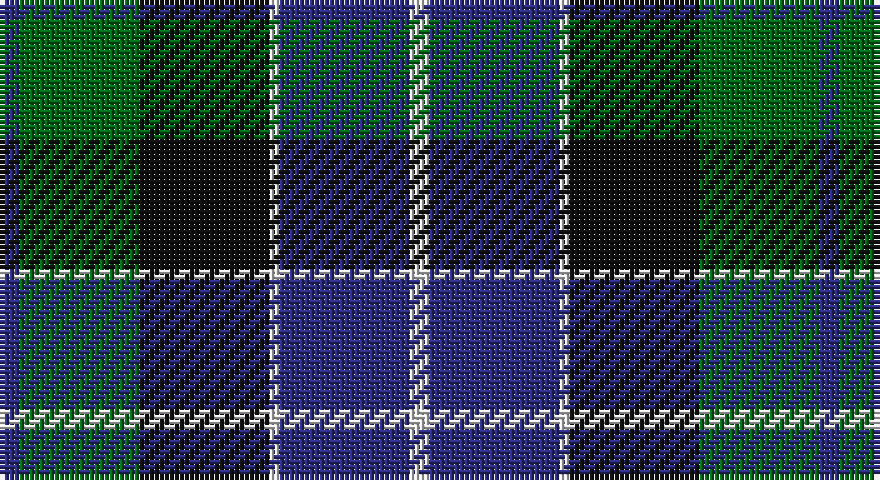

This page is one **sett** — a single exact thread-count. It belongs to the [tartan](/setts/db2g12k13w1db13w2/)
(the same proportion at any scale), whose colour order is pattern [BGKWBW](/stripes/bgkwbw/).

Part of the [Herd](/tartans/herd/) tartan — the named design grouping this sett with its other cloths.

Sourced from house-of-tartan.  It is a [6 stripe tartan](/stripes/stripes6/).

Original link http://www.house-of-tartan.scotland.net/house/TartanViewjs.asp?colr=Def&tnam=170

## Provenance

Earliest known date: 1978 Woven for the wedding of William Hurd to Heather Petit. From JCT: STS monitoring committee recorded 1978. In march 2005. STS Record has the application being made by Councillor R J Herd, C.Eng, M.I.C.E., A.M.B.I.M. who had been granted arms by Lord Lyon.

## Thread count
DB/4 G24 K26 LN2 DB26 LN/4

One full sett is **164 threads**.

## Palette

Palette: <strong>Tartan Register</strong>
<table><thead><tr><th>Colour</th><th>Threads</th><th>Shade</th><th>Base</th><th>OKLCh</th></tr></thead><tbody><tr><td>DB/</td><td style="text-align:right;font-variant-numeric:tabular-nums">4</td><td><code style="background-color:#2C2C80;">#2C2C80</code> <small style="color:#888">#2C2C80</small></td><td>B <code style="background-color:#2A418A;">#2A418A</code></td><td><small style="color:#888">oklch(35.0% 0.138 276.6)</small></td></tr><tr><td>G</td><td style="text-align:right;font-variant-numeric:tabular-nums">24</td><td><code style="background-color:#006818;">#006818</code> <small style="color:#888">#006818</small></td><td>G <code style="background-color:#006100;">#006100</code></td><td><small style="color:#888">oklch(45.0% 0.142 145.0)</small></td></tr><tr><td>K</td><td style="text-align:right;font-variant-numeric:tabular-nums">26</td><td><code style="background-color:#101010;">#101010</code> <small style="color:#888">#101010</small></td><td>K <code style="background-color:#000000;">#000000</code></td><td><small style="color:#888">oklch(17.3% 0.000 89.9)</small></td></tr><tr><td>LN</td><td style="text-align:right;font-variant-numeric:tabular-nums">2</td><td><code style="background-color:#E0E0E0;">#E0E0E0</code> <small style="color:#888">#E0E0E0</small></td><td>W <code style="background-color:#F7F7F7;">#F7F7F7</code></td><td><small style="color:#888">oklch(90.7% 0.000 89.9)</small></td></tr><tr><td>DB</td><td style="text-align:right;font-variant-numeric:tabular-nums">26</td><td><code style="background-color:#2C2C80;">#2C2C80</code> <small style="color:#888">#2C2C80</small></td><td>B <code style="background-color:#2A418A;">#2A418A</code></td><td><small style="color:#888">oklch(35.0% 0.138 276.6)</small></td></tr><tr><td>LN/</td><td style="text-align:right;font-variant-numeric:tabular-nums">4</td><td><code style="background-color:#E0E0E0;">#E0E0E0</code> <small style="color:#888">#E0E0E0</small></td><td>W <code style="background-color:#F7F7F7;">#F7F7F7</code></td><td><small style="color:#888">oklch(90.7% 0.000 89.9)</small></td></tr></tbody></table>

# Sample pattern

## Nearest tartans

The nearest existing variants by ΔTartan distance, with this tartan at the top so the swatches line up against it.

ΔTartan

Tartan

Sett

—

<a href="/ttd/edit/#slug=db2g12k13w1db13w2~x2">Herd Family Tartan</a> <a class="nn-out" href="/variants/s6/db2g12k13w1db13w2~x2/" title="open its dictionary page">↗</a>

0.72

<a href="/ttd/edit/#slug=ly8k4o39k37dt36k6dt7&amp;base=db2g12k13w1db13w2~x2">Oceanic (Corporate?)</a> <a class="nn-out" href="/variants/s7/ly8k4o39k37dt36k6dt7/" title="open its dictionary page">↗</a>

0.85

<a href="/ttd/edit/#slug=db4k3db18k18g18db1g2w4~x2&amp;base=db2g12k13w1db13w2~x2">Dress Watch</a> <a class="nn-out" href="/variants/s8/db4k3db18k18g18db1g2w4~x2/" title="open its dictionary page">↗</a>

0.86

<a href="/ttd/edit/#slug=db2k2db12k11g16w2~x2&amp;base=db2g12k13w1db13w2~x2">Campbell of Argyll (Smiths)</a> <a class="nn-out" href="/variants/s6/db2k2db12k11g16w2~x2/" title="open its dictionary page">↗</a>

0.90

<a href="/ttd/edit/#slug=k2g12k11b12w1~x2&amp;base=db2g12k13w1db13w2~x2">MacKirdy</a> <a class="nn-out" href="/variants/s5/k2g12k11b12w1~x2/" title="open its dictionary page">↗</a>

0.91

<a href="/ttd/edit/#slug=r2g12k12g1db12g2~x2&amp;base=db2g12k13w1db13w2~x2">Gunn</a> <a class="nn-out" href="/variants/s6/r2g12k12g1db12g2~x2/" title="open its dictionary page">↗</a>

0.93

<a href="/ttd/edit/#slug=r2g23dbi11db22r2~x2&amp;base=db2g12k13w1db13w2~x2">Skibo</a> <a class="nn-out" href="/variants/s5/r2g23dbi11db22r2~x2/" title="open its dictionary page">↗</a>

0.94

<a href="/ttd/edit/#slug=w4db4dg22k20db20w3&amp;base=db2g12k13w1db13w2~x2">Unidentified No 26</a> <a class="nn-out" href="/variants/s6/w4db4dg22k20db20w3/" title="open its dictionary page">↗</a>

0.96

<a href="/ttd/edit/#slug=db3r2db22k11g22r2g3~x2&amp;base=db2g12k13w1db13w2~x2">Gammell (1978) (Personal)</a> <a class="nn-out" href="/variants/s7/db3r2db22k11g22r2g3~x2/" title="open its dictionary page">↗</a>

1.00

<a href="/ttd/edit/#slug=k4w1g13k11db11lb3~x4&amp;base=db2g12k13w1db13w2~x2">New York Fire Department Pipe Band</a> <a class="nn-out" href="/variants/s6/k4w1g13k11db11lb3~x4/" title="open its dictionary page">↗</a>

1.03

<a href="/ttd/edit/#slug=db3r1db10k8g10r1g3~x4&amp;base=db2g12k13w1db13w2~x2">Blair</a> <a class="nn-out" href="/variants/s7/db3r1db10k8g10r1g3~x4/" title="open its dictionary page">↗</a>

## Neighbour map

Every grey dot is one of 14360 variants placed by the first two principal components of the ΔTartan feature space (44% of its variance). Red is this tartan; blue dots are its nearest — click one to open its page.

<svg viewBox="0 0 640 380" role="img" style="max-width:100%;height:auto;border:1px solid #e0e0e0;border-radius:4px;display:block" xmlns="http://www.w3.org/2000/svg"><image href="/nn/cloud.v1.png" width="640" height="380"/><a href="/variants/s7/ly8k4o39k37dt36k6dt7/"><circle cx="172.9" cy="210.3" r="4" fill="#3465a4"><title>Oceanic (Corporate?)</title></circle></a><a href="/variants/s8/db4k3db18k18g18db1g2w4~x2/"><circle cx="197.2" cy="181.0" r="4" fill="#3465a4"><title>Dress Watch</title></circle></a><a href="/variants/s6/db2k2db12k11g16w2~x2/"><circle cx="184.6" cy="238.2" r="4" fill="#3465a4"><title>Campbell of Argyll (Smiths)</title></circle></a><a href="/variants/s5/k2g12k11b12w1~x2/"><circle cx="179.1" cy="234.0" r="4" fill="#3465a4"><title>MacKirdy</title></circle></a><a href="/variants/s6/r2g12k12g1db12g2~x2/"><circle cx="216.6" cy="231.7" r="4" fill="#3465a4"><title>Gunn</title></circle></a><a href="/variants/s5/r2g23dbi11db22r2~x2/"><circle cx="216.3" cy="232.8" r="4" fill="#3465a4"><title>Skibo</title></circle></a><a href="/variants/s6/w4db4dg22k20db20w3/"><circle cx="150.1" cy="240.9" r="4" fill="#3465a4"><title>Unidentified No 26</title></circle></a><a href="/variants/s7/db3r2db22k11g22r2g3~x2/"><circle cx="231.6" cy="211.5" r="4" fill="#3465a4"><title>Gammell (1978) (Personal)</title></circle></a><a href="/variants/s6/k4w1g13k11db11lb3~x4/"><circle cx="153.6" cy="210.2" r="4" fill="#3465a4"><title>New York Fire Department Pipe Band</title></circle></a><a href="/variants/s7/db3r1db10k8g10r1g3~x4/"><circle cx="167.2" cy="214.6" r="4" fill="#3465a4"><title>Blair</title></circle></a><circle cx="187.8" cy="214.3" r="5" fill="#c00000"/></svg>

ID: /variants/s6/db2g12k13w1db13w2~x2/
