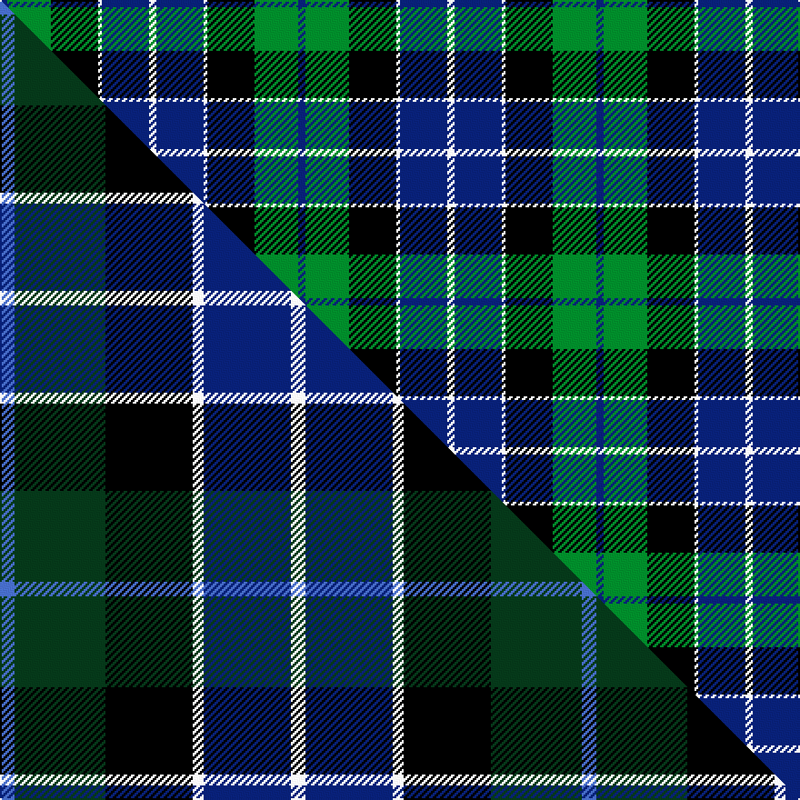

This page is one **sett** — a single exact thread-count. It belongs to the [tartan](/setts/db2g12k13w1db13w2/)
(the same proportion at any scale), whose colour order is pattern [BGKWBW](/stripes/bgkwbw/).

Part of the [Herd](/tartans/herd/) tartan — the named design grouping this sett with its other cloths.

Sourced from house-of-tartan.  It is a [6 stripe tartan](/stripes/stripes6/).

Original link http://www.house-of-tartan.scotland.net/house/TartanViewjs.asp?colr=Def&tnam=170

## Provenance

Earliest known date: 1978 Woven for the wedding of William Hurd to Heather Petit. From JCT: STS monitoring committee recorded 1978. In march 2005. STS Record has the application being made by Councillor R J Herd, C.Eng, M.I.C.E., A.M.B.I.M. who had been granted arms by Lord Lyon.

## Thread count
DB/4 G24 K26 W2 DB26 W/4

One full sett is **164 threads**.

## Palette
<table><thead><tr><th>Colour</th><th>Shade</th><th>OKLCh</th></tr></thead><tbody><tr><td>DB</td><td><code style="background-color:#082077;">#082077</code> <small style="color:#888">#082077</small></td><td><small style="color:#888">oklch(30.0% 0.149 265.1)</small></td></tr><tr><td>G</td><td><code style="background-color:#008B2A;">#008B2A</code> <small style="color:#888">#008B2A</small></td><td><small style="color:#888">oklch(55.4% 0.170 145.9)</small></td></tr><tr><td>K</td><td><code style="background-color:#000000;">#000000</code> <small style="color:#888">#000000</small></td><td><small style="color:#888">oklch(0.0% 0.000 0.0)</small></td></tr><tr><td>W</td><td><code style="background-color:#F7F7F7;">#F7F7F7</code> <small style="color:#888">#F7F7F7</small></td><td><small style="color:#888">oklch(97.6% 0.000 89.9)</small></td></tr></tbody></table>

# Sample pattern

## Compared to the master

This cloth is one sett of its design; the master sett (the exemplar the design is anchored on) is below for comparison.

Its **ΔTartan distance** from the master is **1.39** — the same measure the nearest-tartans table ranks by (0 is identical; a re-scale of the same cloth is near 0, a recolour or a different proportion further).

<figure class="master-compare" style="margin:0">

this sett
master sett ★

<figcaption style="color:#888;font-size:smaller">One weave of this sett against the <a href="/setts/b4dg25k24w3db24w4/">master sett ★</a>, split on the diagonal: a shared proportion runs seamlessly across it with only the shades shifting; a different proportion breaks on it.</figcaption>
</figure>

## Nearest tartan variants

The nearest existing variants by ΔTartan distance, with this cloth at the top so the swatches line up against it.

ΔTartan

Threads

Variant

Sett

—

164

<a href="/variants/s6/db2g12k13w1db13w2~x2/">Herd Family Tartan</a>

<a href="/ttd/edit/#slug=w4db4g22k20db20w3&amp;base=db2g12k13w1db13w2~x2" title="compare in the TTD">1.09</a>

139

<a href="/variants/s6/w4db4g22k20db20w3/">Unidentified No 26</a>

<a href="/ttd/edit/#slug=k2g12k12r1db12w2~x2&amp;base=db2g12k13w1db13w2~x2" title="compare in the TTD">1.52</a>

156

<a href="/variants/s6/k2g12k12r1db12w2~x2/">Russell or Mitchell or Hunter or Galbraith</a>

<a href="/ttd/edit/#slug=k2g12k12r1db12w2&amp;base=db2g12k13w1db13w2~x2" title="compare in the TTD">1.52</a>

78

<a href="/variants/s6/k2g12k12r1db12w2/">Mitchell</a>

<a href="/ttd/edit/#slug=k2g12k11db12w1~x2&amp;base=db2g12k13w1db13w2~x2" title="compare in the TTD">1.56</a>

146

<a href="/variants/s5/k2g12k11db12w1~x2/">MacKirdy</a>

<a href="/ttd/edit/#slug=k2g12k11t12w1~x2~g2203152&amp;base=db2g12k13w1db13w2~x2" title="compare in the TTD">1.56</a>

146

<a href="/variants/s5/k2g12k11t12w1~x2~g2203152/">MacKirdy</a>

<a href="/ttd/edit/#slug=r1g14k14r2db14lb1~x2&amp;base=db2g12k13w1db13w2~x2" title="compare in the TTD">1.80</a>

180

<a href="/variants/s6/r1g14k14r2db14lb1~x2/">Wilson's No.221</a>

<a href="/ttd/edit/#slug=y5g16k16db16k2db2~x2&amp;base=db2g12k13w1db13w2~x2" title="compare in the TTD">2.09</a>

214

<a href="/variants/s6/y5g16k16db16k2db2~x2/">Hudson Valley Reg. Police P &amp; D (Cor</a>

<a href="/ttd/edit/#slug=db2k2db12k11g16w2~x2&amp;base=db2g12k13w1db13w2~x2" title="compare in the TTD">2.13</a>

172

<a href="/variants/s6/db2k2db12k11g16w2~x2/">Campbell of Argyll (Smiths)</a>

<a href="/ttd/edit/#slug=k14w3g42k36db40lb10&amp;base=db2g12k13w1db13w2~x2" title="compare in the TTD">2.20</a>

266

<a href="/variants/s6/k14w3g42k36db40lb10/">New York, Firemen's Pipe Band</a>

<a href="/ttd/edit/#slug=r2db23k14g16k2w2~x2&amp;base=db2g12k13w1db13w2~x2" title="compare in the TTD">2.26</a>

228

<a href="/variants/s6/r2db23k14g16k2w2~x2/">MacPhail Hunting</a>

## Neighbour map

Every grey dot is one of 13620 variants placed by the first two principal components of the ΔTartan feature space (42% of its variance). Red is this tartan; blue dots are its nearest — click one to open its page.

<svg viewBox="0 0 640 380" role="img" style="max-width:100%;height:auto;border:1px solid #e0e0e0;border-radius:4px;display:block" xmlns="http://www.w3.org/2000/svg"><image href="/nn/cloud.v1.png" width="640" height="380"/><a href="/variants/s6/w4db4g22k20db20w3/"><circle cx="110.7" cy="219.7" r="4" fill="#3465a4"><title>Unidentified No 26</title></circle></a><a href="/variants/s6/k2g12k12r1db12w2~x2/"><circle cx="121.4" cy="180.4" r="4" fill="#3465a4"><title>Russell or Mitchell or Hunter or Galbraith</title></circle></a><a href="/variants/s6/k2g12k12r1db12w2/"><circle cx="121.4" cy="180.4" r="4" fill="#3465a4"><title>Mitchell</title></circle></a><a href="/variants/s5/k2g12k11db12w1~x2/"><circle cx="150.2" cy="214.2" r="4" fill="#3465a4"><title>MacKirdy</title></circle></a><a href="/variants/s5/k2g12k11t12w1~x2~g2203152/"><circle cx="148.4" cy="215.1" r="4" fill="#3465a4"><title>MacKirdy</title></circle></a><a href="/variants/s6/r1g14k14r2db14lb1~x2/"><circle cx="125.4" cy="171.2" r="4" fill="#3465a4"><title>Wilson's No.221</title></circle></a><a href="/variants/s6/y5g16k16db16k2db2~x2/"><circle cx="127.0" cy="222.0" r="4" fill="#3465a4"><title>Hudson Valley Reg. Police P &amp; D (Cor</title></circle></a><a href="/variants/s6/db2k2db12k11g16w2~x2/"><circle cx="141.5" cy="213.1" r="4" fill="#3465a4"><title>Campbell of Argyll (Smiths)</title></circle></a><a href="/variants/s6/k14w3g42k36db40lb10/"><circle cx="119.4" cy="188.9" r="4" fill="#3465a4"><title>New York, Firemen's Pipe Band</title></circle></a><a href="/variants/s6/r2db23k14g16k2w2~x2/"><circle cx="152.7" cy="176.0" r="4" fill="#3465a4"><title>MacPhail Hunting</title></circle></a><circle cx="147.5" cy="192.1" r="5" fill="#c00000"/><text x="320" y="376" text-anchor="middle" font-size="11" fill="#999">ground</text><text x="11" y="190" text-anchor="middle" font-size="11" fill="#999" transform="rotate(-90 11 190)">complexity</text></svg>

ID: /variants/s6/db2g12k13w1db13w2~x2/
