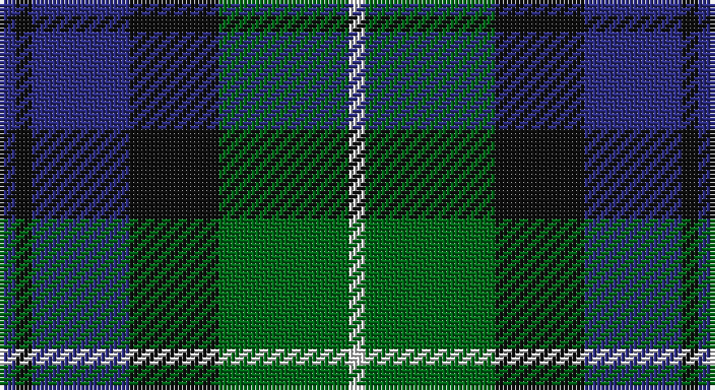

This page is one **sett** — a single exact thread-count. It belongs to the [tartan](/setts/db2k2db12k11g16w2/)
(the same proportion at any scale), whose colour order is pattern [BKBKGW](/stripes/bkbkgw/).

Part of the [Campbell of Argyll](/tartans/campbell-of-argyll/) tartan — the named design grouping this sett with its other cloths.

Sourced from register-of-tartans.  It is a [6 stripe tartan](/stripes/stripes6/).

Original link https://www.tartanregister.gov.uk/tartanDetails.aspx?ref=514

## Also known as

This cloth is also recorded under:

- Campbell of Argyll #2

## Register references

External register numbers recorded for this tartan.

- Scottish Register of Tartans: [514](https://www.tartanregister.gov.uk/tartanDetails.aspx?ref=514)
- Scottish Tartans Authority (ITI): 8
- Scottish Tartans World Register: 8

## Thread count
DB/4 K4 DB24 K22 G32 LN/4

One full sett is **172 threads**.

## Palette

Palette: <strong>Tartan Register</strong>
<table><thead><tr><th>Colour</th><th>Threads</th><th>Shade</th><th>Base</th><th>OKLCh</th></tr></thead><tbody><tr><td>DB/</td><td style="text-align:right;font-variant-numeric:tabular-nums">4</td><td><code style="background-color:#2C2C80;">#2C2C80</code> <small style="color:#888">#2C2C80</small></td><td>B <code style="background-color:#2A418A;">#2A418A</code></td><td><small style="color:#888">oklch(35.0% 0.138 276.6)</small></td></tr><tr><td>K</td><td style="text-align:right;font-variant-numeric:tabular-nums">4</td><td><code style="background-color:#101010;">#101010</code> <small style="color:#888">#101010</small></td><td>K <code style="background-color:#000000;">#000000</code></td><td><small style="color:#888">oklch(17.3% 0.000 89.9)</small></td></tr><tr><td>DB</td><td style="text-align:right;font-variant-numeric:tabular-nums">24</td><td><code style="background-color:#2C2C80;">#2C2C80</code> <small style="color:#888">#2C2C80</small></td><td>B <code style="background-color:#2A418A;">#2A418A</code></td><td><small style="color:#888">oklch(35.0% 0.138 276.6)</small></td></tr><tr><td>K</td><td style="text-align:right;font-variant-numeric:tabular-nums">22</td><td><code style="background-color:#101010;">#101010</code> <small style="color:#888">#101010</small></td><td>K <code style="background-color:#000000;">#000000</code></td><td><small style="color:#888">oklch(17.3% 0.000 89.9)</small></td></tr><tr><td>G</td><td style="text-align:right;font-variant-numeric:tabular-nums">32</td><td><code style="background-color:#006818;">#006818</code> <small style="color:#888">#006818</small></td><td>G <code style="background-color:#006100;">#006100</code></td><td><small style="color:#888">oklch(45.0% 0.142 145.0)</small></td></tr><tr><td>LN/</td><td style="text-align:right;font-variant-numeric:tabular-nums">4</td><td><code style="background-color:#E0E0E0;">#E0E0E0</code> <small style="color:#888">#E0E0E0</small></td><td>W <code style="background-color:#F7F7F7;">#F7F7F7</code></td><td><small style="color:#888">oklch(90.7% 0.000 89.9)</small></td></tr></tbody></table>

# Sample pattern

## Nearest tartans

The nearest existing variants by ΔTartan distance, with this tartan at the top so the swatches line up against it.

ΔTartan

Tartan

Sett

—

<a href="/ttd/edit/#slug=db2k2db12k11g16w2~x2">Campbell of Argyll (Smiths)</a> <a class="nn-out" href="/variants/s6/db2k2db12k11g16w2~x2/" title="open its dictionary page">↗</a>

0.55

<a href="/ttd/edit/#slug=k3g14k14g2b14r3~x2&amp;base=db2k2db12k11g16w2~x2">Morrison Society</a> <a class="nn-out" href="/variants/s6/k3g14k14g2b14r3~x2/" title="open its dictionary page">↗</a>

0.58

<a href="/ttd/edit/#slug=w4db4dg22k20db20w3&amp;base=db2k2db12k11g16w2~x2">Unidentified No 26</a> <a class="nn-out" href="/variants/s6/w4db4dg22k20db20w3/" title="open its dictionary page">↗</a>

0.66

<a href="/ttd/edit/#slug=ly5g16k16db16k2db2~x2&amp;base=db2k2db12k11g16w2~x2">Hudson Valley Reg. Police P &amp; D (Cor</a> <a class="nn-out" href="/variants/s6/ly5g16k16db16k2db2~x2/" title="open its dictionary page">↗</a>

0.67

<a href="/ttd/edit/#slug=g52lb7g9k35db35k7&amp;base=db2k2db12k11g16w2~x2">Redland</a> <a class="nn-out" href="/variants/s6/g52lb7g9k35db35k7/" title="open its dictionary page">↗</a>

0.74

<a href="/ttd/edit/#slug=g24b6lb3k6b12k15g4~x2&amp;base=db2k2db12k11g16w2~x2">Blaylock Annandale</a> <a class="nn-out" href="/variants/s7/g24b6lb3k6b12k15g4~x2/" title="open its dictionary page">↗</a>

0.75

<a href="/ttd/edit/#slug=k4g25k24r3db24g4~x2&amp;base=db2k2db12k11g16w2~x2">Ferguson of Balquhidder #2</a> <a class="nn-out" href="/variants/s6/k4g25k24r3db24g4~x2/" title="open its dictionary page">↗</a>

0.77

<a href="/ttd/edit/#slug=g8t1g1k6db6k1~x4&amp;base=db2k2db12k11g16w2~x2">Graham of Menteith (Clan)</a> <a class="nn-out" href="/variants/s6/g8t1g1k6db6k1~x4/" title="open its dictionary page">↗</a>

0.83

<a href="/ttd/edit/#slug=g1db6k6g6r1g1~x6&amp;base=db2k2db12k11g16w2~x2">Callum Beg (Fashion)</a> <a class="nn-out" href="/variants/s6/g1db6k6g6r1g1~x6/" title="open its dictionary page">↗</a>

0.84

<a href="/ttd/edit/#slug=db1k1db6k6dg6k1w1~x2&amp;base=db2k2db12k11g16w2~x2">Forbes #4</a> <a class="nn-out" href="/variants/s7/db1k1db6k6dg6k1w1~x2/" title="open its dictionary page">↗</a>

0.85

<a href="/ttd/edit/#slug=r2g12k12g1db12g2~x2&amp;base=db2k2db12k11g16w2~x2">Gunn</a> <a class="nn-out" href="/variants/s6/r2g12k12g1db12g2~x2/" title="open its dictionary page">↗</a>

## Neighbour map

Every grey dot is one of 14360 variants placed by the first two principal components of the ΔTartan feature space (44% of its variance). Red is this tartan; blue dots are its nearest — click one to open its page.

<svg viewBox="0 0 640 380" role="img" style="max-width:100%;height:auto;border:1px solid #e0e0e0;border-radius:4px;display:block" xmlns="http://www.w3.org/2000/svg"><image href="/nn/cloud.v1.png" width="640" height="380"/><a href="/variants/s6/k3g14k14g2b14r3~x2/"><circle cx="163.0" cy="248.5" r="4" fill="#3465a4"><title>Morrison Society</title></circle></a><a href="/variants/s6/w4db4dg22k20db20w3/"><circle cx="150.1" cy="240.9" r="4" fill="#3465a4"><title>Unidentified No 26</title></circle></a><a href="/variants/s6/ly5g16k16db16k2db2~x2/"><circle cx="151.4" cy="240.0" r="4" fill="#3465a4"><title>Hudson Valley Reg. Police P &amp; D (Cor</title></circle></a><a href="/variants/s6/g52lb7g9k35db35k7/"><circle cx="207.5" cy="247.7" r="4" fill="#3465a4"><title>Redland</title></circle></a><a href="/variants/s7/g24b6lb3k6b12k15g4~x2/"><circle cx="189.5" cy="236.9" r="4" fill="#3465a4"><title>Blaylock Annandale</title></circle></a><a href="/variants/s6/k4g25k24r3db24g4~x2/"><circle cx="204.5" cy="249.5" r="4" fill="#3465a4"><title>Ferguson of Balquhidder #2</title></circle></a><a href="/variants/s6/g8t1g1k6db6k1~x4/"><circle cx="218.0" cy="249.8" r="4" fill="#3465a4"><title>Graham of Menteith (Clan)</title></circle></a><a href="/variants/s6/g1db6k6g6r1g1~x6/"><circle cx="197.7" cy="261.3" r="4" fill="#3465a4"><title>Callum Beg (Fashion)</title></circle></a><a href="/variants/s7/db1k1db6k6dg6k1w1~x2/"><circle cx="192.0" cy="248.0" r="4" fill="#3465a4"><title>Forbes #4</title></circle></a><a href="/variants/s6/r2g12k12g1db12g2~x2/"><circle cx="216.6" cy="231.7" r="4" fill="#3465a4"><title>Gunn</title></circle></a><circle cx="184.6" cy="238.2" r="5" fill="#c00000"/></svg>

ID: /variants/s6/db2k2db12k11g16w2~x2/
