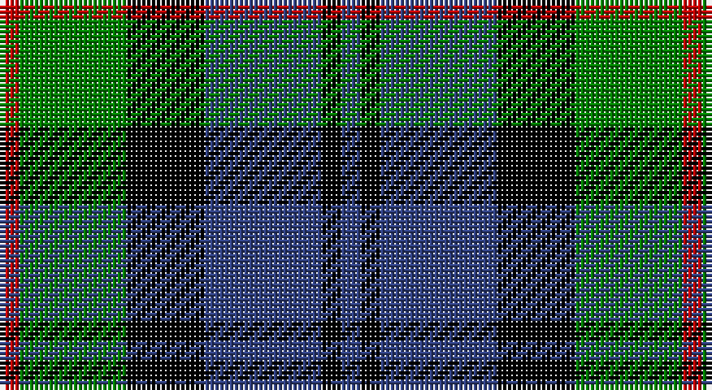

This page is one **sett** — a single exact thread-count. It belongs to the [tartan](/setts/db2k2db12k8g11r2/)
(the same proportion at any scale), whose colour order is pattern [BKBKGR](/stripes/bkbkgr/).

Part of the [Murray](/tartans/murray/) tartan — the named design grouping this sett with its other cloths.

Sourced from weddslist.  It is a [6 stripe tartan](/stripes/stripes6/).

Original link http://www.weddslist.com/cgi-bin/tartans/pg.pl?source=sts

## Provenance

Earliest known date: 1810-15 A simplified version of the Murray of Atholl. The Cockburn collection housed in the Mitchell Library in Glasgow, is one of the earliest references for clan tartans. James Logan, in his book, The Scottish Gael (1831), wrote concerning the Black Watch, that "...a red stripe is often introduced", and this by Lord Murray who commanded the regiment.

## Also known as

This cloth is also recorded under:

- Murray #2
- Murray #3
- NSW Scottish Rifles
- New South Wales Scottish Rifle Regimental
- New South Wales Scottish Rifles
- New South Wales, Scottish Rifles

2 attestations — the source records this cloth was collapsed from (oldest owns this page)

<ul>
<li>undated — Murray (weddslist, <a href="http://www.weddslist.com/cgi-bin/tartans/pg.pl?source=sts">record</a>)</li>
<li>undated — Murray (Variation) Clan Tartan (house-of-tartan, <a href="http://www.house-of-tartan.scotland.net/house/TartanViewjs.asp?colr=Def&tnam=271">record</a>)</li>
</ul>

## Thread count
R/4 G22 K16 B24 K4 B/4

One full sett is **140 threads**.

## Palette

Palette: <strong>Ingles Buchan</strong> <small style="color:#888">(1 of 4 colours)</small>
<table><thead><tr><th>Colour</th><th>Threads</th><th>Shade</th><th>Base</th><th>OKLCh</th></tr></thead><tbody><tr><td>R/</td><td style="text-align:right;font-variant-numeric:tabular-nums">4</td><td><code style="background-color:#C00000;">#C00000</code> <small style="color:#888">#C00000</small></td><td>R <code style="background-color:#CC0000;">#CC0000</code></td><td><small style="color:#888">oklch(50.7% 0.208 29.2)</small></td></tr><tr><td>G</td><td style="text-align:right;font-variant-numeric:tabular-nums">22</td><td><code style="background-color:#008000;">#008000</code> <small style="color:#888">#008000</small></td><td>G <code style="background-color:#006100;">#006100</code></td><td><small style="color:#888">oklch(52.0% 0.177 142.5)</small></td></tr><tr><td>K</td><td style="text-align:right;font-variant-numeric:tabular-nums">16</td><td><code style="background-color:#000000;">#000000</code> <small style="color:#888">#000000</small></td><td>K <code style="background-color:#000000;">#000000</code></td><td><small style="color:#888">oklch(0.0% 0.000 0.0)</small></td></tr><tr><td>B</td><td style="text-align:right;font-variant-numeric:tabular-nums">24</td><td><code style="background-color:#304080;">#304080</code> <small style="color:#888">#304080</small></td><td>B <code style="background-color:#2A418A;">#2A418A</code></td><td><small style="color:#888">oklch(39.4% 0.109 270.2)</small></td></tr><tr><td>K</td><td style="text-align:right;font-variant-numeric:tabular-nums">4</td><td><code style="background-color:#000000;">#000000</code> <small style="color:#888">#000000</small></td><td>K <code style="background-color:#000000;">#000000</code></td><td><small style="color:#888">oklch(0.0% 0.000 0.0)</small></td></tr><tr><td>B/</td><td style="text-align:right;font-variant-numeric:tabular-nums">4</td><td><code style="background-color:#304080;">#304080</code> <small style="color:#888">#304080</small></td><td>B <code style="background-color:#2A418A;">#2A418A</code></td><td><small style="color:#888">oklch(39.4% 0.109 270.2)</small></td></tr></tbody></table>

# Sample pattern

## Compared to the master

This cloth is one sett of its design; the master sett (the exemplar the design is anchored on) is below for comparison.

<figure style="margin:0"><figcaption style="color:#888;font-size:smaller">this sett</figcaption></figure>
<figure style="margin:0"><figcaption style="color:#888;font-size:smaller"><a href="/setts/db6k1db1k1db1k6g6r2g6k6db6k1db2/">master sett →</a></figcaption></figure>

## Nearest tartans

The nearest existing variants by ΔTartan distance, with this tartan at the top so the swatches line up against it.

ΔTartan

Tartan

Sett

—

<a href="/ttd/edit/#slug=db2k2db12k8g11r2~x2">Murray</a> <a class="nn-out" href="/variants/s6/db2k2db12k8g11r2~x2/" title="open its dictionary page">↗</a>

0.48

<a href="/ttd/edit/#slug=db2k2db12k11g12w2~x2&amp;base=db2k2db12k8g11r2~x2">Campbell, The White Stripe</a> <a class="nn-out" href="/variants/s6/db2k2db12k11g12w2~x2/" title="open its dictionary page">↗</a>

0.55

<a href="/ttd/edit/#slug=k3g14k14g2db14r3~x2&amp;base=db2k2db12k8g11r2~x2">Morrison</a> <a class="nn-out" href="/variants/s6/k3g14k14g2db14r3~x2/" title="open its dictionary page">↗</a>

0.63

<a href="/ttd/edit/#slug=db1k1db6k6g6k1w1~x2&amp;base=db2k2db12k8g11r2~x2">Forbes</a> <a class="nn-out" href="/variants/s7/db1k1db6k6g6k1w1~x2/" title="open its dictionary page">↗</a>

0.64

<a href="/ttd/edit/#slug=dt4g18dt3k17dt18dp4~x2&amp;base=db2k2db12k8g11r2~x2">Scottish Airports</a> <a class="nn-out" href="/variants/s6/dt4g18dt3k17dt18dp4~x2/" title="open its dictionary page">↗</a>

0.69

<a href="/ttd/edit/#slug=db6k1db6k8r1g8r2~x2&amp;base=db2k2db12k8g11r2~x2">Fletcher of Dunans</a> <a class="nn-out" href="/variants/s7/db6k1db6k8r1g8r2~x2/" title="open its dictionary page">↗</a>

0.71

<a href="/ttd/edit/#slug=db6k1db6k8r1g8k2~x2&amp;base=db2k2db12k8g11r2~x2">Fletcher</a> <a class="nn-out" href="/variants/s7/db6k1db6k8r1g8k2~x2/" title="open its dictionary page">↗</a>

0.72

<a href="/ttd/edit/#slug=k2g10t2k9p8g2~x2&amp;base=db2k2db12k8g11r2~x2">Lennie</a> <a class="nn-out" href="/variants/s6/k2g10t2k9p8g2~x2/" title="open its dictionary page">↗</a>

0.76

<a href="/ttd/edit/#slug=g14db2g2k8p9k2~x2&amp;base=db2k2db12k8g11r2~x2">MacArthur of Milton, hunting</a> <a class="nn-out" href="/variants/s6/g14db2g2k8p9k2~x2/" title="open its dictionary page">↗</a>

0.82

<a href="/ttd/edit/#slug=t3g12k14t11r3t3~x2&amp;base=db2k2db12k8g11r2~x2">Wellington, or Waterloo</a> <a class="nn-out" href="/variants/s6/t3g12k14t11r3t3~x2/" title="open its dictionary page">↗</a>

0.82

<a href="/ttd/edit/#slug=w4db4g22k20db20w3&amp;base=db2k2db12k8g11r2~x2">Unnamed, No 26</a> <a class="nn-out" href="/variants/s6/w4db4g22k20db20w3/" title="open its dictionary page">↗</a>

## Neighbour map

Every grey dot is one of 14360 variants placed by the first two principal components of the ΔTartan feature space (44% of its variance). Red is this tartan; blue dots are its nearest — click one to open its page.

<svg viewBox="0 0 640 380" role="img" style="max-width:100%;height:auto;border:1px solid #e0e0e0;border-radius:4px;display:block" xmlns="http://www.w3.org/2000/svg"><image href="/nn/cloud.v1.png" width="640" height="380"/><a href="/variants/s6/db2k2db12k11g12w2~x2/"><circle cx="129.6" cy="237.4" r="4" fill="#3465a4"><title>Campbell, The White Stripe</title></circle></a><a href="/variants/s6/k3g14k14g2db14r3~x2/"><circle cx="137.1" cy="236.8" r="4" fill="#3465a4"><title>Morrison</title></circle></a><a href="/variants/s7/db1k1db6k6g6k1w1~x2/"><circle cx="142.7" cy="224.4" r="4" fill="#3465a4"><title>Forbes</title></circle></a><a href="/variants/s6/dt4g18dt3k17dt18dp4~x2/"><circle cx="162.3" cy="254.1" r="4" fill="#3465a4"><title>Scottish Airports</title></circle></a><a href="/variants/s7/db6k1db6k8r1g8r2~x2/"><circle cx="147.1" cy="229.0" r="4" fill="#3465a4"><title>Fletcher of Dunans</title></circle></a><a href="/variants/s7/db6k1db6k8r1g8k2~x2/"><circle cx="158.2" cy="233.5" r="4" fill="#3465a4"><title>Fletcher</title></circle></a><a href="/variants/s6/k2g10t2k9p8g2~x2/"><circle cx="126.9" cy="245.7" r="4" fill="#3465a4"><title>Lennie</title></circle></a><a href="/variants/s6/g14db2g2k8p9k2~x2/"><circle cx="177.6" cy="225.8" r="4" fill="#3465a4"><title>MacArthur of Milton, hunting</title></circle></a><a href="/variants/s6/t3g12k14t11r3t3~x2/"><circle cx="115.5" cy="249.6" r="4" fill="#3465a4"><title>Wellington, or Waterloo</title></circle></a><a href="/variants/s6/w4db4g22k20db20w3/"><circle cx="118.1" cy="225.8" r="4" fill="#3465a4"><title>Unnamed, No 26</title></circle></a><circle cx="152.3" cy="241.4" r="5" fill="#c00000"/></svg>

ID: /variants/s6/db2k2db12k8g11r2~x2/
