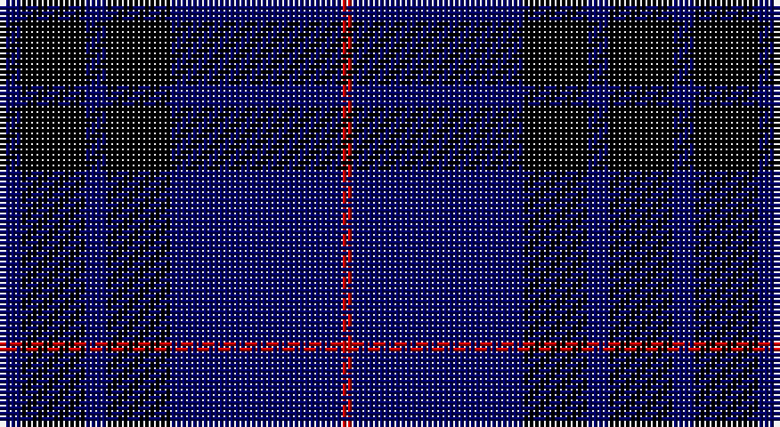

This page is one **sett** — a single exact thread-count. It belongs to the [tartan](/setts/db2k6db2k6db16r1/)
(the same proportion at any scale), whose colour order is pattern [BKBKBR](/stripes/bkbkbr/).

Part of the [MacKay](/tartans/mackay/) tartan — the named design grouping this sett with its other cloths.

Sourced from weddslist.  It is a [6 stripe tartan](/stripes/stripes6/).

Original link http://www.weddslist.com/cgi-bin/tartans/pg.pl?source=rb

## Also known as

This cloth is also recorded under:

- MacKay #2
- MacKay Plaid
- MacKay V
- MacKay VS
- MacKay, Blue
- MacKay, Plaid

4 attestations — the source records this cloth was collapsed from (oldest owns this page)

<ul>
<li>undated — MacKay V (weddslist, <a href="http://www.weddslist.com/cgi-bin/tartans/pg.pl?source=rb">record</a>)</li>
<li>undated — MacKay (weddslist, <a href="http://www.weddslist.com/cgi-bin/tartans/pg.pl?source=sts">record</a>)</li>
<li>undated — MacKay VS (weddslist, <a href="http://www.weddslist.com/cgi-bin/tartans/pg.pl?source=tinsel">record</a>)</li>
<li>undated — MacKay VS (weddslist, <a href="http://www.weddslist.com/cgi-bin/tartans/pg.pl?source=x">record</a>)</li>
</ul>

## Thread count
DB/4 K12 DB4 K12 DB32 R/2

One full sett is **126 threads**.

## Palette

Palette: <strong>Tartan Register</strong>
<table><thead><tr><th>Colour</th><th>Threads</th><th>Shade</th><th>Base</th><th>OKLCh</th></tr></thead><tbody><tr><td>DB/</td><td style="text-align:right;font-variant-numeric:tabular-nums">4</td><td><code style="background-color:#000064;">#000064</code> <small style="color:#888">#000064</small></td><td>B <code style="background-color:#2A418A;">#2A418A</code></td><td><small style="color:#888">oklch(22.7% 0.158 264.1)</small></td></tr><tr><td>K</td><td style="text-align:right;font-variant-numeric:tabular-nums">12</td><td><code style="background-color:#000000;">#000000</code> <small style="color:#888">#000000</small></td><td>K <code style="background-color:#000000;">#000000</code></td><td><small style="color:#888">oklch(0.0% 0.000 0.0)</small></td></tr><tr><td>DB</td><td style="text-align:right;font-variant-numeric:tabular-nums">4</td><td><code style="background-color:#000064;">#000064</code> <small style="color:#888">#000064</small></td><td>B <code style="background-color:#2A418A;">#2A418A</code></td><td><small style="color:#888">oklch(22.7% 0.158 264.1)</small></td></tr><tr><td>K</td><td style="text-align:right;font-variant-numeric:tabular-nums">12</td><td><code style="background-color:#000000;">#000000</code> <small style="color:#888">#000000</small></td><td>K <code style="background-color:#000000;">#000000</code></td><td><small style="color:#888">oklch(0.0% 0.000 0.0)</small></td></tr><tr><td>DB</td><td style="text-align:right;font-variant-numeric:tabular-nums">32</td><td><code style="background-color:#000064;">#000064</code> <small style="color:#888">#000064</small></td><td>B <code style="background-color:#2A418A;">#2A418A</code></td><td><small style="color:#888">oklch(22.7% 0.158 264.1)</small></td></tr><tr><td>R/</td><td style="text-align:right;font-variant-numeric:tabular-nums">2</td><td><code style="background-color:#C80000;">#C80000</code> <small style="color:#888">#C80000</small></td><td>R <code style="background-color:#CC0000;">#CC0000</code></td><td><small style="color:#888">oklch(52.3% 0.215 29.2)</small></td></tr></tbody></table>

# Sample pattern

## Compared to the master

This cloth is one sett of its design; the master sett (the exemplar the design is anchored on) is below for comparison.

<figure style="margin:0"><figcaption style="color:#888;font-size:smaller">this sett</figcaption></figure>
<figure style="margin:0"><figcaption style="color:#888;font-size:smaller"><a href="/setts/db8dg8db1dg8k8db8ly2/">master sett →</a></figcaption></figure>

## Nearest tartans

The nearest existing variants by ΔTartan distance, with this tartan at the top so the swatches line up against it.

ΔTartan

Tartan

Sett

—

<a href="/ttd/edit/#slug=db2k6db2k6db16r1~x2">MacKay V</a> <a class="nn-out" href="/variants/s6/db2k6db2k6db16r1~x2/" title="open its dictionary page">↗</a>

1.39

<a href="/ttd/edit/#slug=k14db14k14db40k3db2~x2&amp;base=db2k6db2k6db16r1~x2">Atlin (Fashion)</a> <a class="nn-out" href="/variants/s6/k14db14k14db40k3db2~x2/" title="open its dictionary page">↗</a>

1.43

<a href="/ttd/edit/#slug=k30db6k6db41lt2~x2&amp;base=db2k6db2k6db16r1~x2">Williams (New York) (Personal)</a> <a class="nn-out" href="/variants/s5/k30db6k6db41lt2~x2/" title="open its dictionary page">↗</a>

1.55

<a href="/ttd/edit/#slug=k20db2k6db2k4db27w2db8~x2&amp;base=db2k6db2k6db16r1~x2">Pride of Kinross</a> <a class="nn-out" href="/variants/s8/k20db2k6db2k4db27w2db8~x2/" title="open its dictionary page">↗</a>

1.61

<a href="/ttd/edit/#slug=db5w3db33k3db3k36db3~x2&amp;base=db2k6db2k6db16r1~x2">Argentina</a> <a class="nn-out" href="/variants/s7/db5w3db33k3db3k36db3~x2/" title="open its dictionary page">↗</a>

1.65

<a href="/ttd/edit/#slug=k1lo2k3db12k18w1~x2&amp;base=db2k6db2k6db16r1~x2">Jon's Theme (Fashion)</a> <a class="nn-out" href="/variants/s6/k1lo2k3db12k18w1~x2/" title="open its dictionary page">↗</a>

1.65

<a href="/ttd/edit/#slug=r4k21w2k20db21k2db2~x2&amp;base=db2k6db2k6db16r1~x2">St. Georges, Edgbaston</a> <a class="nn-out" href="/variants/s7/r4k21w2k20db21k2db2~x2/" title="open its dictionary page">↗</a>

1.77

<a href="/ttd/edit/#slug=k4ly1k18db18lb1db4~x4&amp;base=db2k6db2k6db16r1~x2">Lyndon Prep (School)</a> <a class="nn-out" href="/variants/s6/k4ly1k18db18lb1db4~x4/" title="open its dictionary page">↗</a>

1.82

<a href="/ttd/edit/#slug=db8k39db8k39db87r6&amp;base=db2k6db2k6db16r1~x2">Largan (?)</a> <a class="nn-out" href="/variants/s6/db8k39db8k39db87r6/" title="open its dictionary page">↗</a>

1.82

<a href="/ttd/edit/#slug=db2k11db5k1db5k1~x6&amp;base=db2k6db2k6db16r1~x2">Gagetown (School)</a> <a class="nn-out" href="/variants/s6/db2k11db5k1db5k1~x6/" title="open its dictionary page">↗</a>

1.83

<a href="/ttd/edit/#slug=k6db10k10b1k1b1k10b6~x4&amp;base=db2k6db2k6db16r1~x2">Oban</a> <a class="nn-out" href="/variants/s8/k6db10k10b1k1b1k10b6~x4/" title="open its dictionary page">↗</a>

## Neighbour map

Every grey dot is one of 14360 variants placed by the first two principal components of the ΔTartan feature space (44% of its variance). Red is this tartan; blue dots are its nearest — click one to open its page.

<svg viewBox="0 0 640 380" role="img" style="max-width:100%;height:auto;border:1px solid #e0e0e0;border-radius:4px;display:block" xmlns="http://www.w3.org/2000/svg"><image href="/nn/cloud.v1.png" width="640" height="380"/><a href="/variants/s6/k14db14k14db40k3db2~x2/"><circle cx="501.0" cy="274.0" r="4" fill="#3465a4"><title>Atlin (Fashion)</title></circle></a><a href="/variants/s5/k30db6k6db41lt2~x2/"><circle cx="436.3" cy="254.2" r="4" fill="#3465a4"><title>Williams (New York) (Personal)</title></circle></a><a href="/variants/s8/k20db2k6db2k4db27w2db8~x2/"><circle cx="389.7" cy="222.8" r="4" fill="#3465a4"><title>Pride of Kinross</title></circle></a><a href="/variants/s7/db5w3db33k3db3k36db3~x2/"><circle cx="379.3" cy="225.0" r="4" fill="#3465a4"><title>Argentina</title></circle></a><a href="/variants/s6/k1lo2k3db12k18w1~x2/"><circle cx="373.9" cy="194.9" r="4" fill="#3465a4"><title>Jon's Theme (Fashion)</title></circle></a><a href="/variants/s7/r4k21w2k20db21k2db2~x2/"><circle cx="347.6" cy="223.2" r="4" fill="#3465a4"><title>St. Georges, Edgbaston</title></circle></a><a href="/variants/s6/k4ly1k18db18lb1db4~x4/"><circle cx="368.2" cy="220.1" r="4" fill="#3465a4"><title>Lyndon Prep (School)</title></circle></a><a href="/variants/s6/db8k39db8k39db87r6/"><circle cx="429.8" cy="255.6" r="4" fill="#3465a4"><title>Largan (?)</title></circle></a><a href="/variants/s6/db2k11db5k1db5k1~x6/"><circle cx="413.4" cy="281.1" r="4" fill="#3465a4"><title>Gagetown (School)</title></circle></a><a href="/variants/s8/k6db10k10b1k1b1k10b6~x4/"><circle cx="367.6" cy="264.7" r="4" fill="#3465a4"><title>Oban</title></circle></a><circle cx="427.6" cy="245.5" r="5" fill="#c00000"/></svg>

ID: /variants/s6/db2k6db2k6db16r1~x2/
