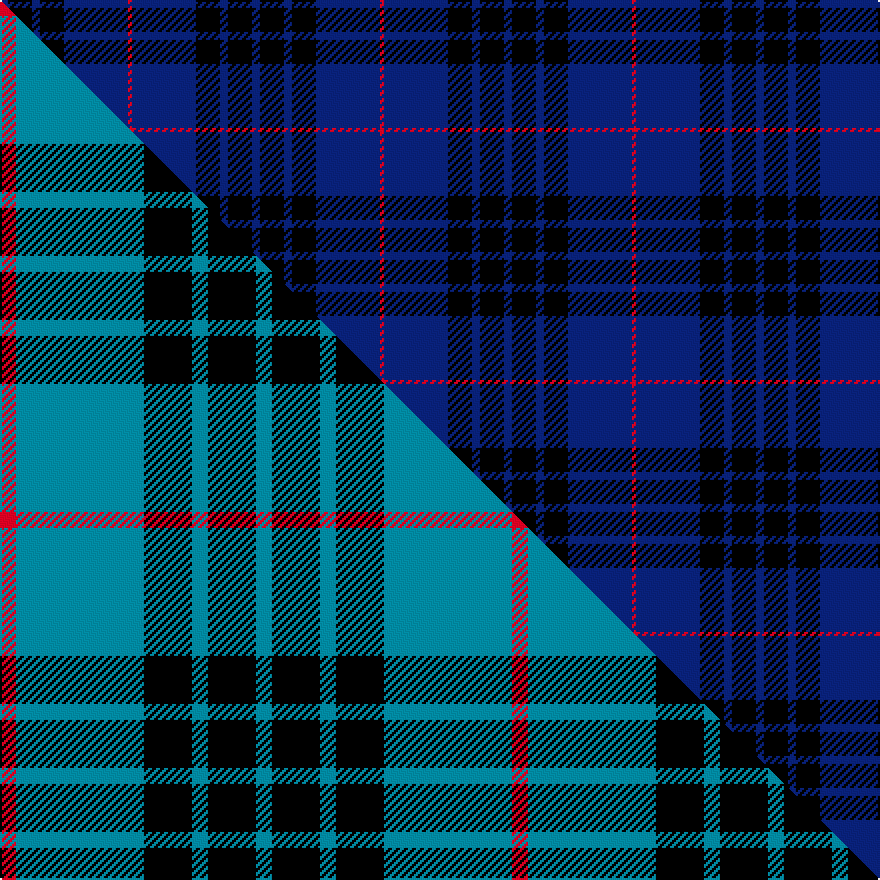

This page is one **sett** — a single exact thread-count. It belongs to the [tartan](/setts/db2k6db2k6db16r1/)
(the same proportion at any scale), whose colour order is pattern [BKBKBR](/stripes/bkbkbr/).

Part of the [Mackay](/tartans/mackay-2/) tartan — the named design grouping this sett with its other cloths.

Sourced from weddslist.  It is a [6 stripe tartan](/stripes/stripes6/).

Original link http://www.weddslist.com/cgi-bin/tartans/pg.pl?source=rb

4 attestations — the source records this cloth was collapsed from (oldest owns this page)

<ul>
<li>undated — MacKay V (weddslist, <a href="http://www.weddslist.com/cgi-bin/tartans/pg.pl?source=rb">record</a>) </li>
<li>undated — MacKay (weddslist, <a href="http://www.weddslist.com/cgi-bin/tartans/pg.pl?source=sts">record</a>) </li>
<li>undated — MacKay VS (weddslist, <a href="http://www.weddslist.com/cgi-bin/tartans/pg.pl?source=tinsel">record</a>) </li>
<li>undated — MacKay VS (weddslist, <a href="http://www.weddslist.com/cgi-bin/tartans/pg.pl?source=x">record</a>) </li>
</ul>

## Thread count
DB/4 K12 DB4 K12 DB32 R/2

One full sett is **126 threads**.

## Palette
<table><thead><tr><th>Colour</th><th>Shade</th><th>OKLCh</th></tr></thead><tbody><tr><td>DB</td><td><code style="background-color:#082077;">#082077</code> <small style="color:#888">#082077</small></td><td><small style="color:#888">oklch(30.0% 0.149 265.1)</small></td></tr><tr><td>K</td><td><code style="background-color:#000000;">#000000</code> <small style="color:#888">#000000</small></td><td><small style="color:#888">oklch(0.0% 0.000 0.0)</small></td></tr><tr><td>R</td><td><code style="background-color:#D60020;">#D60020</code> <small style="color:#888">#D60020</small></td><td><small style="color:#888">oklch(55.2% 0.224 25.5)</small></td></tr></tbody></table>

# Sample pattern

## Compared to the master

This cloth is one sett of its design; the master sett (the exemplar the design is anchored on) is below for comparison.

Its **ΔTartan distance** from the master is **2.72** — the same measure the nearest-tartans table ranks by (0 is identical; a re-scale of the same cloth is near 0, a recolour or a different proportion further).

<figure class="master-compare" style="margin:0">

this sett
master sett ★

<figcaption style="color:#888;font-size:smaller">One weave of this sett against the <a href="/setts/r1t8k3t1k3t1/">master sett ★</a>, split on the diagonal: a shared proportion runs seamlessly across it with only the shades shifting; a different proportion breaks on it.</figcaption>
</figure>

## Nearest tartan variants

The nearest existing variants by ΔTartan distance, with this cloth at the top so the swatches line up against it.

ΔTartan

Threads

Variant

Sett

—

126

<a href="/variants/s6/db2k6db2k6db16r1~x2/">MacKay V</a>

<a href="/ttd/edit/#slug=db8k39db8k39db87r6&amp;base=db2k6db2k6db16r1~x2" title="compare in the TTD">0.28</a>

360

<a href="/variants/s6/db8k39db8k39db87r6/">Largan (?)</a>

<a href="/ttd/edit/#slug=db1k3db1k3db8r1~x8&amp;base=db2k6db2k6db16r1~x2" title="compare in the TTD">0.49</a>

256

<a href="/variants/s6/db1k3db1k3db8r1~x8/">MacKay -1842 (VS) (Clan)</a>

<a href="/ttd/edit/#slug=db1k3db1k3db8r1~x4&amp;base=db2k6db2k6db16r1~x2" title="compare in the TTD">0.49</a>

128

<a href="/variants/s6/db1k3db1k3db8r1~x4/">Morgan (MacKay Blue) Clan Tartan</a>

<a href="/ttd/edit/#slug=db5k2db14k14db2lp2~x2&amp;base=db2k6db2k6db16r1~x2" title="compare in the TTD">1.01</a>

142

<a href="/variants/s6/db5k2db14k14db2lp2~x2/">Royal Scotsman Train (Corporate)</a>

<a href="/ttd/edit/#slug=db9k9db9k9db42lb5~x2&amp;base=db2k6db2k6db16r1~x2" title="compare in the TTD">1.16</a>

304

<a href="/variants/s6/db9k9db9k9db42lb5~x2/">Dollar Academy</a>

<a href="/ttd/edit/#slug=k15db4k15db28r2~x2&amp;base=db2k6db2k6db16r1~x2" title="compare in the TTD">1.42</a>

222

<a href="/variants/s5/k15db4k15db28r2~x2/">MacKay (Blue) #2</a>

<a href="/ttd/edit/#slug=db9k4lb1k4db9r1~x4~db1406275&amp;base=db2k6db2k6db16r1~x2" title="compare in the TTD">1.60</a>

184

<a href="/variants/s6/db9k4lb1k4db9r1~x4~db1406275/">Scottish Nuclear</a>

<a href="/ttd/edit/#slug=k14db14k14db40k3db2~x2&amp;base=db2k6db2k6db16r1~x2" title="compare in the TTD">1.64</a>

316

<a href="/variants/s6/k14db14k14db40k3db2~x2/">Atlin (Fashion)</a>

<a href="/ttd/edit/#slug=db5k2db14k14db2k2r2~x2&amp;base=db2k6db2k6db16r1~x2" title="compare in the TTD">1.77</a>

150

<a href="/variants/s7/db5k2db14k14db2k2r2~x2/">Royal Scotsman Train</a>

<a href="/ttd/edit/#slug=k30db6k6db41lb2~x2&amp;base=db2k6db2k6db16r1~x2" title="compare in the TTD">1.84</a>

276

<a href="/variants/s5/k30db6k6db41lb2~x2/">Williams (New York) (Personal)</a>

## Neighbour map

Every grey dot is one of 13620 variants placed by the first two principal components of the ΔTartan feature space (42% of its variance). Red is this tartan; blue dots are its nearest — click one to open its page.

<svg viewBox="0 0 640 380" role="img" style="max-width:100%;height:auto;border:1px solid #e0e0e0;border-radius:4px;display:block" xmlns="http://www.w3.org/2000/svg"><image href="/nn/cloud.v1.png" width="640" height="380"/><a href="/variants/s6/db8k39db8k39db87r6/"><circle cx="362.8" cy="197.9" r="4" fill="#3465a4"><title>Largan (?)</title></circle></a><a href="/variants/s6/db1k3db1k3db8r1~x8/"><circle cx="344.7" cy="220.0" r="4" fill="#3465a4"><title>MacKay -1842 (VS) (Clan)</title></circle></a><a href="/variants/s6/db1k3db1k3db8r1~x4/"><circle cx="344.7" cy="220.0" r="4" fill="#3465a4"><title>Morgan (MacKay Blue) Clan Tartan</title></circle></a><a href="/variants/s6/db5k2db14k14db2lp2~x2/"><circle cx="302.7" cy="225.5" r="4" fill="#3465a4"><title>Royal Scotsman Train (Corporate)</title></circle></a><a href="/variants/s6/db9k9db9k9db42lb5~x2/"><circle cx="417.8" cy="212.0" r="4" fill="#3465a4"><title>Dollar Academy</title></circle></a><a href="/variants/s5/k15db4k15db28r2~x2/"><circle cx="328.7" cy="220.2" r="4" fill="#3465a4"><title>MacKay (Blue) #2</title></circle></a><a href="/variants/s6/db9k4lb1k4db9r1~x4~db1406275/"><circle cx="331.0" cy="211.1" r="4" fill="#3465a4"><title>Scottish Nuclear</title></circle></a><a href="/variants/s6/k14db14k14db40k3db2~x2/"><circle cx="453.8" cy="209.2" r="4" fill="#3465a4"><title>Atlin (Fashion)</title></circle></a><a href="/variants/s7/db5k2db14k14db2k2r2~x2/"><circle cx="304.4" cy="215.2" r="4" fill="#3465a4"><title>Royal Scotsman Train</title></circle></a><a href="/variants/s5/k30db6k6db41lb2~x2/"><circle cx="374.8" cy="191.6" r="4" fill="#3465a4"><title>Williams (New York) (Personal)</title></circle></a><circle cx="393.5" cy="194.0" r="5" fill="#c00000"/><text x="320" y="376" text-anchor="middle" font-size="11" fill="#999">ground</text><text x="11" y="190" text-anchor="middle" font-size="11" fill="#999" transform="rotate(-90 11 190)">complexity</text></svg>

ID: /variants/s6/db2k6db2k6db16r1~x2/
