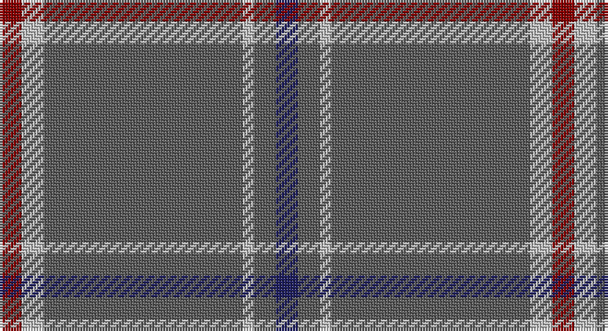

This page is one **sett** — a single exact thread-count. It belongs to the [tartan](/setts/db2n2lb1n18lb2r2/)
(the same proportion at any scale), whose colour order is pattern [BBWBWR](/stripes/bbwbwr/).

Sourced from tartans-authority.  It is a [6 stripe tartan](/stripes/stripes6/).

Original link http://www.tartansauthority.com/tartan-ferret/display/3220/

2 attestations — the source records this cloth was collapsed from (oldest owns this page)

<ul>
<li>1995 — St. Giles Cathedral (Corporate) (tartans-authority, <a href="http://www.tartansauthority.com/tartan-ferret/display/3220/">record</a>)</li>
<li>undated — St. Giles Cathedral (register-of-tartans, <a href="https://www.tartanregister.gov.uk/tartanDetails.aspx?ref=4970">record</a>)</li>
</ul>

## Register references

External register numbers recorded for this tartan.

- Scottish Register of Tartans: [4970](https://www.tartanregister.gov.uk/tartanDetails.aspx?ref=4970)
- Scottish Tartans Authority (ITI): 3220

## Thread count
DR/8 Na8 N72 Na4 N8 DB/8

One full sett is **200 threads**.

## Palette

Palette: <strong>Tartan Register</strong> <small style="color:#888">(3 of 4 colours)</small>
<table><thead><tr><th>Colour</th><th>Threads</th><th>Shade</th><th>Base</th><th>OKLCh</th></tr></thead><tbody><tr><td>DR/</td><td style="text-align:right;font-variant-numeric:tabular-nums">8</td><td><code style="background-color:#880000;">#880000</code> <small style="color:#888">#880000</small></td><td>R <code style="background-color:#CC0000;">#CC0000</code></td><td><small style="color:#888">oklch(39.4% 0.162 29.2)</small></td></tr><tr><td>Na</td><td style="text-align:right;font-variant-numeric:tabular-nums">8</td><td><code style="background-color:#C0C0C0;">#C0C0C0</code> <small style="color:#888">#C0C0C0</small></td><td>W <code style="background-color:#F7F7F7;">#F7F7F7</code></td><td><small style="color:#888">oklch(80.8% 0.000 89.9)</small></td></tr><tr><td>N</td><td style="text-align:right;font-variant-numeric:tabular-nums">72</td><td><code style="background-color:#5C5C5C;">#5C5C5C</code> <small style="color:#888">#5C5C5C</small></td><td>B <code style="background-color:#2A418A;">#2A418A</code></td><td><small style="color:#888">oklch(47.5% 0.000 89.9)</small></td></tr><tr><td>Na</td><td style="text-align:right;font-variant-numeric:tabular-nums">4</td><td><code style="background-color:#C0C0C0;">#C0C0C0</code> <small style="color:#888">#C0C0C0</small></td><td>W <code style="background-color:#F7F7F7;">#F7F7F7</code></td><td><small style="color:#888">oklch(80.8% 0.000 89.9)</small></td></tr><tr><td>N</td><td style="text-align:right;font-variant-numeric:tabular-nums">8</td><td><code style="background-color:#5C5C5C;">#5C5C5C</code> <small style="color:#888">#5C5C5C</small></td><td>B <code style="background-color:#2A418A;">#2A418A</code></td><td><small style="color:#888">oklch(47.5% 0.000 89.9)</small></td></tr><tr><td>DB/</td><td style="text-align:right;font-variant-numeric:tabular-nums">8</td><td><code style="background-color:#202060;">#202060</code> <small style="color:#888">#202060</small></td><td>B <code style="background-color:#2A418A;">#2A418A</code></td><td><small style="color:#888">oklch(28.9% 0.111 276.9)</small></td></tr></tbody></table>

# Sample pattern

## Nearest tartans

The nearest existing variants by ΔTartan distance, with this tartan at the top so the swatches line up against it.

ΔTartan

Tartan

Sett

—

<a href="/ttd/edit/#slug=db2n2lb1n18lb2r2~x4">St. Giles Cathedral (Corporate)</a> <a class="nn-out" href="/variants/s6/db2n2lb1n18lb2r2~x4/" title="open its dictionary page">↗</a>

1.15

<a href="/ttd/edit/#slug=r2n2k2n28k8n9k1lo2~x2&amp;base=db2n2lb1n18lb2r2~x4">Highland Autumn (Fashion)</a> <a class="nn-out" href="/variants/s8/r2n2k2n28k8n9k1lo2~x2/" title="open its dictionary page">↗</a>

1.22

<a href="/ttd/edit/#slug=o60dg13o9oi8ly4~x2&amp;base=db2n2lb1n18lb2r2~x4">Ballantyne Personal Tartan</a> <a class="nn-out" href="/variants/s5/o60dg13o9oi8ly4~x2/" title="open its dictionary page">↗</a>

1.26

<a href="/variants/s6/n65ki2n4k2n10r24~x2/">Norsemen, The</a>

1.30

<a href="/ttd/edit/#slug=db3y1w1y25w1y1p3~x2&amp;base=db2n2lb1n18lb2r2~x4">St Giles, Check</a> <a class="nn-out" href="/variants/s7/db3y1w1y25w1y1p3~x2/" title="open its dictionary page">↗</a>

1.40

<a href="/ttd/edit/#slug=db3o1w1o25w1o1dp3~x2&amp;base=db2n2lb1n18lb2r2~x4">St Giles Check Tartan</a> <a class="nn-out" href="/variants/s7/db3o1w1o25w1o1dp3~x2/" title="open its dictionary page">↗</a>

1.45

<a href="/ttd/edit/#slug=n65k2n4lr2n10r24~x2&amp;base=db2n2lb1n18lb2r2~x4">Norsemen (Corporate)</a> <a class="nn-out" href="/variants/s6/n65k2n4lr2n10r24~x2/" title="open its dictionary page">↗</a>

1.54

<a href="/ttd/edit/#slug=y60g13y9r8ly4~x2&amp;base=db2n2lb1n18lb2r2~x4">Ballantyne (Personal)</a> <a class="nn-out" href="/variants/s5/y60g13y9r8ly4~x2/" title="open its dictionary page">↗</a>

1.55

<a href="/ttd/edit/#slug=db3n44k9n10k9n10k9n44r3~x2&amp;base=db2n2lb1n18lb2r2~x4">VersaCold/Atlas (Corporate)</a> <a class="nn-out" href="/variants/s9/db3n44k9n10k9n10k9n44r3~x2/" title="open its dictionary page">↗</a>

1.56

<a href="/ttd/edit/#slug=db3o1w1o25w1o1dp3~x4&amp;base=db2n2lb1n18lb2r2~x4">St. Giles Check (Corporate)</a> <a class="nn-out" href="/variants/s7/db3o1w1o25w1o1dp3~x4/" title="open its dictionary page">↗</a>

1.71

<a href="/ttd/edit/#slug=db48g14r3g2r3g2~x2&amp;base=db2n2lb1n18lb2r2~x4">Wilson</a> <a class="nn-out" href="/variants/s6/db48g14r3g2r3g2~x2/" title="open its dictionary page">↗</a>

## Neighbour map

Every grey dot is one of 14360 variants placed by the first two principal components of the ΔTartan feature space (44% of its variance). Red is this tartan; blue dots are its nearest — click one to open its page.

<svg viewBox="0 0 640 380" role="img" style="max-width:100%;height:auto;border:1px solid #e0e0e0;border-radius:4px;display:block" xmlns="http://www.w3.org/2000/svg"><image href="/nn/cloud.v1.png" width="640" height="380"/><a href="/variants/s8/r2n2k2n28k8n9k1lo2~x2/"><circle cx="517.4" cy="164.8" r="4" fill="#3465a4"><title>Highland Autumn (Fashion)</title></circle></a><a href="/variants/s5/o60dg13o9oi8ly4~x2/"><circle cx="505.7" cy="212.7" r="4" fill="#3465a4"><title>Ballantyne Personal Tartan</title></circle></a><a href="/variants/s6/n65ki2n4k2n10r24~x2/"><circle cx="551.6" cy="177.2" r="4" fill="#3465a4"><title>Norsemen, The</title></circle></a><a href="/variants/s7/db3y1w1y25w1y1p3~x2/"><circle cx="573.3" cy="153.6" r="4" fill="#3465a4"><title>St Giles, Check</title></circle></a><a href="/variants/s7/db3o1w1o25w1o1dp3~x2/"><circle cx="556.2" cy="144.0" r="4" fill="#3465a4"><title>St Giles Check Tartan</title></circle></a><a href="/variants/s6/n65k2n4lr2n10r24~x2/"><circle cx="578.6" cy="186.4" r="4" fill="#3465a4"><title>Norsemen (Corporate)</title></circle></a><a href="/variants/s5/y60g13y9r8ly4~x2/"><circle cx="526.7" cy="226.0" r="4" fill="#3465a4"><title>Ballantyne (Personal)</title></circle></a><a href="/variants/s9/db3n44k9n10k9n10k9n44r3~x2/"><circle cx="519.1" cy="207.3" r="4" fill="#3465a4"><title>VersaCold/Atlas (Corporate)</title></circle></a><a href="/variants/s7/db3o1w1o25w1o1dp3~x4/"><circle cx="543.9" cy="137.5" r="4" fill="#3465a4"><title>St. Giles Check (Corporate)</title></circle></a><a href="/variants/s6/db48g14r3g2r3g2~x2/"><circle cx="489.6" cy="188.6" r="4" fill="#3465a4"><title>Wilson</title></circle></a><circle cx="520.7" cy="185.4" r="5" fill="#c00000"/></svg>

ID: /variants/s6/db2n2lb1n18lb2r2~x4/
