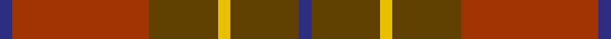
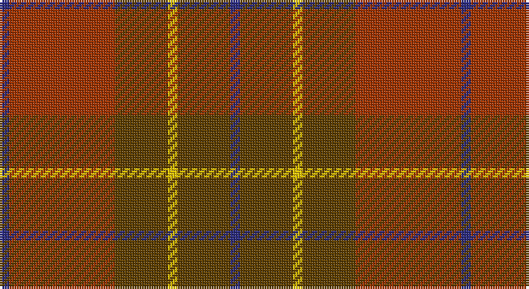

This page is one **sett** — a single exact thread-count. It belongs to the [tartan](/setts/db2o22dy11ly2dy11db2/)
(the same proportion at any scale), whose colour order is pattern [BGYGRB](/stripes/bgygrb/).

Part of the [Cetoloni](/tartans/cetoloni/) tartan — the named design grouping this sett with its other cloths.

Sourced from house-of-tartan.  It is a [6 stripe tartan](/stripes/stripes6/).

Original link http://www.house-of-tartan.scotland.net/house/TartanViewjs.asp?colr=Def&tnam=2049

## Provenance

Earliest known date: November 1991 The Cetoloni tartan was designed with the colours of the Border Hills, 'the sky at its best, the rooftop skyline of Siena and the golden sun of Tuscany'. Franco Cetoloni of Liddlevale was born in Badia Roti Bucine in Arezzo, Italy. Jayne was a designer at Pringle's knitwear in Hawick. Red is Sienna red.

## Thread count
DB/4 R44 T22 Y4 T22 DB/4

One full sett is **192 threads**.

## Palette

Palette: <strong>Tartan Register</strong> <small style="color:#888">(3 of 4 colours)</small>
<table><thead><tr><th>Colour</th><th>Threads</th><th>Shade</th><th>Base</th><th>OKLCh</th></tr></thead><tbody><tr><td>DB/</td><td style="text-align:right;font-variant-numeric:tabular-nums">4</td><td><code style="background-color:#2C2C80;">#2C2C80</code> <small style="color:#888">#2C2C80</small></td><td>B <code style="background-color:#2A418A;">#2A418A</code></td><td><small style="color:#888">oklch(35.0% 0.138 276.6)</small></td></tr><tr><td>R</td><td style="text-align:right;font-variant-numeric:tabular-nums">44</td><td><code style="background-color:#A03400;">#A03400</code> <small style="color:#888">#A03400</small></td><td>R <code style="background-color:#CC0000;">#CC0000</code></td><td><small style="color:#888">oklch(47.9% 0.152 39.6)</small></td></tr><tr><td>T</td><td style="text-align:right;font-variant-numeric:tabular-nums">22</td><td><code style="background-color:#604000;">#604000</code> <small style="color:#888">#604000</small></td><td>G <code style="background-color:#006100;">#006100</code></td><td><small style="color:#888">oklch(39.8% 0.083 76.8)</small></td></tr><tr><td>Y</td><td style="text-align:right;font-variant-numeric:tabular-nums">4</td><td><code style="background-color:#E8C000;">#E8C000</code> <small style="color:#888">#E8C000</small></td><td>Y <code style="background-color:#F2BF00;">#F2BF00</code></td><td><small style="color:#888">oklch(81.9% 0.168 93.7)</small></td></tr><tr><td>T</td><td style="text-align:right;font-variant-numeric:tabular-nums">22</td><td><code style="background-color:#604000;">#604000</code> <small style="color:#888">#604000</small></td><td>G <code style="background-color:#006100;">#006100</code></td><td><small style="color:#888">oklch(39.8% 0.083 76.8)</small></td></tr><tr><td>DB/</td><td style="text-align:right;font-variant-numeric:tabular-nums">4</td><td><code style="background-color:#2C2C80;">#2C2C80</code> <small style="color:#888">#2C2C80</small></td><td>B <code style="background-color:#2A418A;">#2A418A</code></td><td><small style="color:#888">oklch(35.0% 0.138 276.6)</small></td></tr></tbody></table>

# Sample pattern

## Compared to the master

This cloth is one sett of its design; the master sett (the exemplar the design is anchored on) is below for comparison.

<figure style="margin:0"><figcaption style="color:#888;font-size:smaller">this sett</figcaption></figure>
<figure style="margin:0"><figcaption style="color:#888;font-size:smaller"><a href="/setts/db1r12k6ly1k6db1/">master sett →</a></figcaption></figure>

## Nearest tartans

The nearest existing variants by ΔTartan distance, with this tartan at the top so the swatches line up against it.

ΔTartan

Tartan

Sett

—

<a href="/ttd/edit/#slug=db2o22dy11ly2dy11db2~x2">Cetoloni Family Tartan</a> <a class="nn-out" href="/variants/s6/db2o22dy11ly2dy11db2~x2/" title="open its dictionary page">↗</a>

0.88

<a href="/ttd/edit/#slug=db2r22dy11y2dy11db2~x2&amp;base=db2o22dy11ly2dy11db2~x2">Cetoloni</a> <a class="nn-out" href="/variants/s6/db2r22dy11y2dy11db2~x2/" title="open its dictionary page">↗</a>

1.26

<a href="/ttd/edit/#slug=g3dy4g2dy22n5r16ly3~x2&amp;base=db2o22dy11ly2dy11db2~x2">Pubcrawlers (Corporate)</a> <a class="nn-out" href="/variants/s7/g3dy4g2dy22n5r16ly3~x2/" title="open its dictionary page">↗</a>

1.32

<a href="/ttd/edit/#slug=do2m2do17oi17o2oi2~x4&amp;base=db2o22dy11ly2dy11db2~x2">Cypress</a> <a class="nn-out" href="/variants/s6/do2m2do17oi17o2oi2~x4/" title="open its dictionary page">↗</a>

1.37

<a href="/ttd/edit/#slug=r8lr2o30dg12o3dg12o3~x2&amp;base=db2o22dy11ly2dy11db2~x2">Wasko (Personal)</a> <a class="nn-out" href="/variants/s7/r8lr2o30dg12o3dg12o3~x2/" title="open its dictionary page">↗</a>

1.58

<a href="/ttd/edit/#slug=do10y24r3y3r24dg3y6do6~x2&amp;base=db2o22dy11ly2dy11db2~x2">Earle's Flame (Fashion)</a> <a class="nn-out" href="/variants/s8/do10y24r3y3r24dg3y6do6~x2/" title="open its dictionary page">↗</a>

1.66

<a href="/ttd/edit/#slug=dr24g2dr5o14g2o5oi17dr2~x2&amp;base=db2o22dy11ly2dy11db2~x2">Loch Rannoch</a> <a class="nn-out" href="/variants/s8/dr24g2dr5o14g2o5oi17dr2~x2/" title="open its dictionary page">↗</a>

1.69

<a href="/ttd/edit/#slug=r12n2lr1n2r3dg8r3n1~x2&amp;base=db2o22dy11ly2dy11db2~x2">Chisholm</a> <a class="nn-out" href="/variants/s8/r12n2lr1n2r3dg8r3n1~x2/" title="open its dictionary page">↗</a>

1.69

<a href="/ttd/edit/#slug=r12n2lr1n2r3dg8r3n1&amp;base=db2o22dy11ly2dy11db2~x2">Chisholm</a> <a class="nn-out" href="/variants/s8/r12n2lr1n2r3dg8r3n1/" title="open its dictionary page">↗</a>

1.71

<a href="/ttd/edit/#slug=dg1ri1dg7ri4r7ri1~x6&amp;base=db2o22dy11ly2dy11db2~x2">Dewar (Name)</a> <a class="nn-out" href="/variants/s6/dg1ri1dg7ri4r7ri1~x6/" title="open its dictionary page">↗</a>

1.74

<a href="/ttd/edit/#slug=dy4lg11dy14o30r4~x2&amp;base=db2o22dy11ly2dy11db2~x2">Trinity Bicycles</a> <a class="nn-out" href="/variants/s5/dy4lg11dy14o30r4~x2/" title="open its dictionary page">↗</a>

## Neighbour map

Every grey dot is one of 14360 variants placed by the first two principal components of the ΔTartan feature space (44% of its variance). Red is this tartan; blue dots are its nearest — click one to open its page.

<svg viewBox="0 0 640 380" role="img" style="max-width:100%;height:auto;border:1px solid #e0e0e0;border-radius:4px;display:block" xmlns="http://www.w3.org/2000/svg"><image href="/nn/cloud.v1.png" width="640" height="380"/><a href="/variants/s6/db2r22dy11y2dy11db2~x2/"><circle cx="353.6" cy="233.6" r="4" fill="#3465a4"><title>Cetoloni</title></circle></a><a href="/variants/s7/g3dy4g2dy22n5r16ly3~x2/"><circle cx="316.8" cy="215.8" r="4" fill="#3465a4"><title>Pubcrawlers (Corporate)</title></circle></a><a href="/variants/s6/do2m2do17oi17o2oi2~x4/"><circle cx="378.9" cy="251.5" r="4" fill="#3465a4"><title>Cypress</title></circle></a><a href="/variants/s7/r8lr2o30dg12o3dg12o3~x2/"><circle cx="385.4" cy="226.6" r="4" fill="#3465a4"><title>Wasko (Personal)</title></circle></a><a href="/variants/s8/do10y24r3y3r24dg3y6do6~x2/"><circle cx="341.5" cy="261.9" r="4" fill="#3465a4"><title>Earle's Flame (Fashion)</title></circle></a><a href="/variants/s8/dr24g2dr5o14g2o5oi17dr2~x2/"><circle cx="292.2" cy="213.0" r="4" fill="#3465a4"><title>Loch Rannoch</title></circle></a><a href="/variants/s8/r12n2lr1n2r3dg8r3n1~x2/"><circle cx="376.4" cy="207.5" r="4" fill="#3465a4"><title>Chisholm</title></circle></a><a href="/variants/s8/r12n2lr1n2r3dg8r3n1/"><circle cx="376.4" cy="207.5" r="4" fill="#3465a4"><title>Chisholm</title></circle></a><a href="/variants/s6/dg1ri1dg7ri4r7ri1~x6/"><circle cx="285.1" cy="264.5" r="4" fill="#3465a4"><title>Dewar (Name)</title></circle></a><a href="/variants/s5/dy4lg11dy14o30r4~x2/"><circle cx="317.1" cy="270.9" r="4" fill="#3465a4"><title>Trinity Bicycles</title></circle></a><circle cx="357.3" cy="243.2" r="5" fill="#c00000"/></svg>

ID: /variants/s6/db2o22dy11ly2dy11db2~x2/
