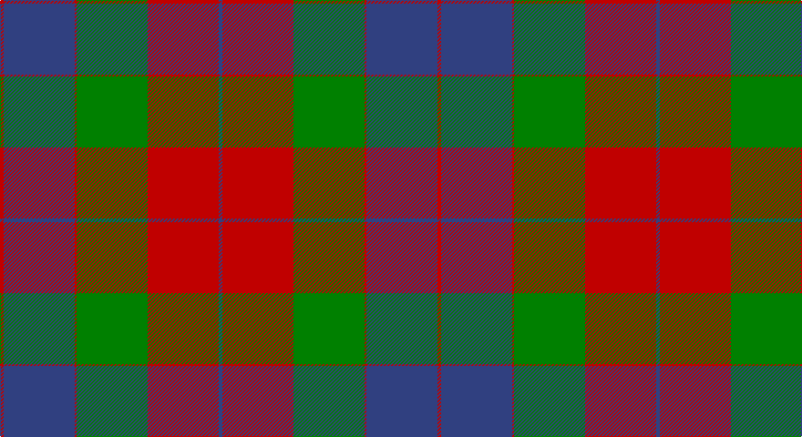

This page is one **sett** — a single exact thread-count. It belongs to the [tartan](/setts/db2r39g39r1db39r2/)
(the same proportion at any scale), whose colour order is pattern [BRGRBR](/stripes/brgrbr/).

Part of the [Mar](/tartans/mar/) tartan — the named design grouping this sett with its other cloths.

Sourced from weddslist.  It is a [6 stripe tartan](/stripes/stripes6/).

Original link http://www.weddslist.com/cgi-bin/tartans/pg.pl?source=sts

## Also known as

This cloth is also recorded under:

- Mar,
- Mar, Tribe of

## Thread count
R/4 B78 R2 G78 R78 B/4

One full sett is **480 threads**.

## Palette

Palette: <strong>custom</strong>
<table><thead><tr><th>Colour</th><th>Threads</th><th>Shade</th><th>Base</th><th>OKLCh</th></tr></thead><tbody><tr><td>R/</td><td style="text-align:right;font-variant-numeric:tabular-nums">4</td><td><code style="background-color:#C00000;">#C00000</code> <small style="color:#888">#C00000</small></td><td>R <code style="background-color:#CC0000;">#CC0000</code></td><td><small style="color:#888">oklch(50.7% 0.208 29.2)</small></td></tr><tr><td>B</td><td style="text-align:right;font-variant-numeric:tabular-nums">78</td><td><code style="background-color:#304080;">#304080</code> <small style="color:#888">#304080</small></td><td>B <code style="background-color:#2A418A;">#2A418A</code></td><td><small style="color:#888">oklch(39.4% 0.109 270.2)</small></td></tr><tr><td>R</td><td style="text-align:right;font-variant-numeric:tabular-nums">2</td><td><code style="background-color:#C00000;">#C00000</code> <small style="color:#888">#C00000</small></td><td>R <code style="background-color:#CC0000;">#CC0000</code></td><td><small style="color:#888">oklch(50.7% 0.208 29.2)</small></td></tr><tr><td>G</td><td style="text-align:right;font-variant-numeric:tabular-nums">78</td><td><code style="background-color:#008000;">#008000</code> <small style="color:#888">#008000</small></td><td>G <code style="background-color:#006100;">#006100</code></td><td><small style="color:#888">oklch(52.0% 0.177 142.5)</small></td></tr><tr><td>R</td><td style="text-align:right;font-variant-numeric:tabular-nums">78</td><td><code style="background-color:#C00000;">#C00000</code> <small style="color:#888">#C00000</small></td><td>R <code style="background-color:#CC0000;">#CC0000</code></td><td><small style="color:#888">oklch(50.7% 0.208 29.2)</small></td></tr><tr><td>B/</td><td style="text-align:right;font-variant-numeric:tabular-nums">4</td><td><code style="background-color:#304080;">#304080</code> <small style="color:#888">#304080</small></td><td>B <code style="background-color:#2A418A;">#2A418A</code></td><td><small style="color:#888">oklch(39.4% 0.109 270.2)</small></td></tr></tbody></table>

# Sample pattern

## Compared to the master

This cloth is one sett of its design; the master sett (the exemplar the design is anchored on) is below for comparison.

<figure style="margin:0"><figcaption style="color:#888;font-size:smaller">this sett</figcaption></figure>
<figure style="margin:0"><figcaption style="color:#888;font-size:smaller"><a href="/setts/r2k4g45k3ly2/">master sett →</a></figcaption></figure>

## Nearest tartans

The nearest existing variants by ΔTartan distance, with this tartan at the top so the swatches line up against it.

ΔTartan

Tartan

Sett

—

<a href="/ttd/edit/#slug=db2r39g39r1db39r2~x2">Mar</a> <a class="nn-out" href="/variants/s6/db2r39g39r1db39r2~x2/" title="open its dictionary page">↗</a>

1.02

<a href="/ttd/edit/#slug=db2r24g24r1db24r2~x2&amp;base=db2r39g39r1db39r2~x2">Mar, Red</a> <a class="nn-out" href="/variants/s6/db2r24g24r1db24r2~x2/" title="open its dictionary page">↗</a>

1.23

<a href="/ttd/edit/#slug=lo1db14r28g14r1g14lo1~x2&amp;base=db2r39g39r1db39r2~x2">Abernethy (Colerain USA) (Personal)</a> <a class="nn-out" href="/variants/s7/lo1db14r28g14r1g14lo1~x2/" title="open its dictionary page">↗</a>

1.46

<a href="/ttd/edit/#slug=db2m24g24m1db24m2~x2&amp;base=db2r39g39r1db39r2~x2">Mar Dress</a> <a class="nn-out" href="/variants/s6/db2m24g24m1db24m2~x2/" title="open its dictionary page">↗</a>

1.58

<a href="/ttd/edit/#slug=db2lo21db11dt21db1~x2&amp;base=db2r39g39r1db39r2~x2">St. Matthews Check (School)</a> <a class="nn-out" href="/variants/s5/db2lo21db11dt21db1~x2/" title="open its dictionary page">↗</a>

1.58

<a href="/ttd/edit/#slug=w3g15db18r30g1r2~x2&amp;base=db2r39g39r1db39r2~x2">Ruthven</a> <a class="nn-out" href="/variants/s6/w3g15db18r30g1r2~x2/" title="open its dictionary page">↗</a>

1.62

<a href="/ttd/edit/#slug=w3g15db18r15g1r2~x2&amp;base=db2r39g39r1db39r2~x2">Nibley</a> <a class="nn-out" href="/variants/s6/w3g15db18r15g1r2~x2/" title="open its dictionary page">↗</a>

1.67

<a href="/ttd/edit/#slug=db1r5g18r4db9r10w1~x4&amp;base=db2r39g39r1db39r2~x2">MacKintosh, Geddes</a> <a class="nn-out" href="/variants/s7/db1r5g18r4db9r10w1~x4/" title="open its dictionary page">↗</a>

1.71

<a href="/ttd/edit/#slug=db1r5dg18r4db9r10w1~x4&amp;base=db2r39g39r1db39r2~x2">MacKintosh Geddes</a> <a class="nn-out" href="/variants/s7/db1r5dg18r4db9r10w1~x4/" title="open its dictionary page">↗</a>

1.76

<a href="/ttd/edit/#slug=w3dg18db22r19dg1r2~x2&amp;base=db2r39g39r1db39r2~x2">Nibley (Personal)</a> <a class="nn-out" href="/variants/s6/w3dg18db22r19dg1r2~x2/" title="open its dictionary page">↗</a>

1.77

<a href="/ttd/edit/#slug=db8r3db1r3dg14r3db1~x4&amp;base=db2r39g39r1db39r2~x2">Logan</a> <a class="nn-out" href="/variants/s7/db8r3db1r3dg14r3db1~x4/" title="open its dictionary page">↗</a>

## Neighbour map

Every grey dot is one of 14360 variants placed by the first two principal components of the ΔTartan feature space (44% of its variance). Red is this tartan; blue dots are its nearest — click one to open its page.

<svg viewBox="0 0 640 380" role="img" style="max-width:100%;height:auto;border:1px solid #e0e0e0;border-radius:4px;display:block" xmlns="http://www.w3.org/2000/svg"><image href="/nn/cloud.v1.png" width="640" height="380"/><a href="/variants/s6/db2r24g24r1db24r2~x2/"><circle cx="269.2" cy="194.5" r="4" fill="#3465a4"><title>Mar, Red</title></circle></a><a href="/variants/s7/lo1db14r28g14r1g14lo1~x2/"><circle cx="278.2" cy="162.4" r="4" fill="#3465a4"><title>Abernethy (Colerain USA) (Personal)</title></circle></a><a href="/variants/s6/db2m24g24m1db24m2~x2/"><circle cx="290.9" cy="206.9" r="4" fill="#3465a4"><title>Mar Dress</title></circle></a><a href="/variants/s5/db2lo21db11dt21db1~x2/"><circle cx="254.5" cy="213.0" r="4" fill="#3465a4"><title>St. Matthews Check (School)</title></circle></a><a href="/variants/s6/w3g15db18r30g1r2~x2/"><circle cx="298.5" cy="157.0" r="4" fill="#3465a4"><title>Ruthven</title></circle></a><a href="/variants/s6/w3g15db18r15g1r2~x2/"><circle cx="205.1" cy="188.0" r="4" fill="#3465a4"><title>Nibley</title></circle></a><a href="/variants/s7/db1r5g18r4db9r10w1~x4/"><circle cx="248.6" cy="182.9" r="4" fill="#3465a4"><title>MacKintosh, Geddes</title></circle></a><a href="/variants/s7/db1r5dg18r4db9r10w1~x4/"><circle cx="249.2" cy="180.7" r="4" fill="#3465a4"><title>MacKintosh Geddes</title></circle></a><a href="/variants/s6/w3dg18db22r19dg1r2~x2/"><circle cx="224.2" cy="180.6" r="4" fill="#3465a4"><title>Nibley (Personal)</title></circle></a><a href="/variants/s7/db8r3db1r3dg14r3db1~x4/"><circle cx="288.6" cy="210.5" r="4" fill="#3465a4"><title>Logan</title></circle></a><circle cx="292.2" cy="174.7" r="5" fill="#c00000"/></svg>

ID: /variants/s6/db2r39g39r1db39r2~x2/
