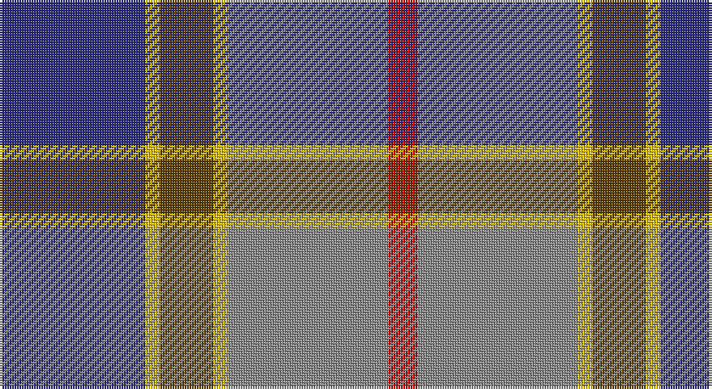

This page is one **sett** — a single exact thread-count. It belongs to the [tartan](/setts/db30ly3dy11ly3o33r6/)
(the same proportion at any scale), whose colour order is pattern [BYGYRR](/stripes/bygyrr/).

Sourced from house-of-tartan.  It is a [6 stripe tartan](/stripes/stripes6/).

Original link http://www.house-of-tartan.scotland.net/house/TartanViewjs.asp?colr=Def&tnam=683

## Provenance

Earliest known date: 1984 Presented by William Balfour.

## Thread count
DB/60 Y6 T22 Y6 N66 R/12

One full sett is **272 threads**.

## Palette

Palette: <strong>Tartan Register</strong>
<table><thead><tr><th>Colour</th><th>Threads</th><th>Shade</th><th>Base</th><th>OKLCh</th></tr></thead><tbody><tr><td>DB/</td><td style="text-align:right;font-variant-numeric:tabular-nums">60</td><td><code style="background-color:#2C2C80;">#2C2C80</code> <small style="color:#888">#2C2C80</small></td><td>B <code style="background-color:#2A418A;">#2A418A</code></td><td><small style="color:#888">oklch(35.0% 0.138 276.6)</small></td></tr><tr><td>Y</td><td style="text-align:right;font-variant-numeric:tabular-nums">6</td><td><code style="background-color:#E8C000;">#E8C000</code> <small style="color:#888">#E8C000</small></td><td>Y <code style="background-color:#F2BF00;">#F2BF00</code></td><td><small style="color:#888">oklch(81.9% 0.168 93.7)</small></td></tr><tr><td>T</td><td style="text-align:right;font-variant-numeric:tabular-nums">22</td><td><code style="background-color:#604000;">#604000</code> <small style="color:#888">#604000</small></td><td>G <code style="background-color:#006100;">#006100</code></td><td><small style="color:#888">oklch(39.8% 0.083 76.8)</small></td></tr><tr><td>Y</td><td style="text-align:right;font-variant-numeric:tabular-nums">6</td><td><code style="background-color:#E8C000;">#E8C000</code> <small style="color:#888">#E8C000</small></td><td>Y <code style="background-color:#F2BF00;">#F2BF00</code></td><td><small style="color:#888">oklch(81.9% 0.168 93.7)</small></td></tr><tr><td>N</td><td style="text-align:right;font-variant-numeric:tabular-nums">66</td><td><code style="background-color:#888888;">#888888</code> <small style="color:#888">#888888</small></td><td>R <code style="background-color:#CC0000;">#CC0000</code></td><td><small style="color:#888">oklch(62.7% 0.000 89.9)</small></td></tr><tr><td>R/</td><td style="text-align:right;font-variant-numeric:tabular-nums">12</td><td><code style="background-color:#C80000;">#C80000</code> <small style="color:#888">#C80000</small></td><td>R <code style="background-color:#CC0000;">#CC0000</code></td><td><small style="color:#888">oklch(52.3% 0.215 29.2)</small></td></tr></tbody></table>

# Sample pattern

## Nearest tartans

The nearest existing variants by ΔTartan distance, with this tartan at the top so the swatches line up against it.

ΔTartan

Tartan

Sett

—

<a href="/ttd/edit/#slug=db30ly3dy11ly3o33r6~x2">Balfour Family Tartan</a> <a class="nn-out" href="/variants/s6/db30ly3dy11ly3o33r6~x2/" title="open its dictionary page">↗</a>

0.62

<a href="/ttd/edit/#slug=db30ly3dy11ly3y33r6~x2&amp;base=db30ly3dy11ly3o33r6~x2">Balfour</a> <a class="nn-out" href="/variants/s6/db30ly3dy11ly3y33r6~x2/" title="open its dictionary page">↗</a>

0.89

<a href="/ttd/edit/#slug=m15dt8y25dt72n98w15&amp;base=db30ly3dy11ly3o33r6~x2">Afternoon Tea / Black Tea</a> <a class="nn-out" href="/variants/s6/m15dt8y25dt72n98w15/" title="open its dictionary page">↗</a>

0.92

<a href="/ttd/edit/#slug=m3k17n11m2o20w2~x2&amp;base=db30ly3dy11ly3o33r6~x2">Commonwealth Games Council (Corp.)</a> <a class="nn-out" href="/variants/s6/m3k17n11m2o20w2~x2/" title="open its dictionary page">↗</a>

0.93

<a href="/ttd/edit/#slug=w2k1m10k6b12lo2~x2&amp;base=db30ly3dy11ly3o33r6~x2">Soroptimist International (Corporate</a> <a class="nn-out" href="/variants/s6/w2k1m10k6b12lo2~x2/" title="open its dictionary page">↗</a>

0.95

<a href="/ttd/edit/#slug=t4n19lr2k19n2lr25lb2~x2&amp;base=db30ly3dy11ly3o33r6~x2">Ritchie, Stephen James (Personal)</a> <a class="nn-out" href="/variants/s7/t4n19lr2k19n2lr25lb2~x2/" title="open its dictionary page">↗</a>

0.97

<a href="/ttd/edit/#slug=w15y98db72r25db8ly15&amp;base=db30ly3dy11ly3o33r6~x2">Afternoon Tea / Darjeeling</a> <a class="nn-out" href="/variants/s6/w15y98db72r25db8ly15/" title="open its dictionary page">↗</a>

1.05

<a href="/ttd/edit/#slug=r5t3g24db24r4ly2~x2&amp;base=db30ly3dy11ly3o33r6~x2">Canine All Dogs</a> <a class="nn-out" href="/variants/s6/r5t3g24db24r4ly2~x2/" title="open its dictionary page">↗</a>

1.05

<a href="/ttd/edit/#slug=db34dy9ly3dy9y30r3y11r5&amp;base=db30ly3dy11ly3o33r6~x2">Ballantyne (Personal) STWR</a> <a class="nn-out" href="/variants/s8/db34dy9ly3dy9y30r3y11r5/" title="open its dictionary page">↗</a>

1.06

<a href="/ttd/edit/#slug=db27o9w3dy16r7~x2&amp;base=db30ly3dy11ly3o33r6~x2">Unidentified (Sock Tie)</a> <a class="nn-out" href="/variants/s5/db27o9w3dy16r7~x2/" title="open its dictionary page">↗</a>

1.08

<a href="/ttd/edit/#slug=w4t30g6r2g6r28ly2r3~x2&amp;base=db30ly3dy11ly3o33r6~x2">Scotland 2000 Commemorative Tartan</a> <a class="nn-out" href="/variants/s8/w4t30g6r2g6r28ly2r3~x2/" title="open its dictionary page">↗</a>

## Neighbour map

Every grey dot is one of 14360 variants placed by the first two principal components of the ΔTartan feature space (44% of its variance). Red is this tartan; blue dots are its nearest — click one to open its page.

<svg viewBox="0 0 640 380" role="img" style="max-width:100%;height:auto;border:1px solid #e0e0e0;border-radius:4px;display:block" xmlns="http://www.w3.org/2000/svg"><image href="/nn/cloud.v1.png" width="640" height="380"/><a href="/variants/s6/db30ly3dy11ly3y33r6~x2/"><circle cx="213.9" cy="197.6" r="4" fill="#3465a4"><title>Balfour</title></circle></a><a href="/variants/s6/m15dt8y25dt72n98w15/"><circle cx="211.2" cy="183.6" r="4" fill="#3465a4"><title>Afternoon Tea / Black Tea</title></circle></a><a href="/variants/s6/m3k17n11m2o20w2~x2/"><circle cx="159.8" cy="192.2" r="4" fill="#3465a4"><title>Commonwealth Games Council (Corp.)</title></circle></a><a href="/variants/s6/w2k1m10k6b12lo2~x2/"><circle cx="163.9" cy="189.5" r="4" fill="#3465a4"><title>Soroptimist International (Corporate</title></circle></a><a href="/variants/s7/t4n19lr2k19n2lr25lb2~x2/"><circle cx="175.1" cy="168.5" r="4" fill="#3465a4"><title>Ritchie, Stephen James (Personal)</title></circle></a><a href="/variants/s6/w15y98db72r25db8ly15/"><circle cx="202.7" cy="181.2" r="4" fill="#3465a4"><title>Afternoon Tea / Darjeeling</title></circle></a><a href="/variants/s6/r5t3g24db24r4ly2~x2/"><circle cx="218.5" cy="189.0" r="4" fill="#3465a4"><title>Canine All Dogs</title></circle></a><a href="/variants/s8/db34dy9ly3dy9y30r3y11r5/"><circle cx="186.8" cy="175.0" r="4" fill="#3465a4"><title>Ballantyne (Personal) STWR</title></circle></a><a href="/variants/s5/db27o9w3dy16r7~x2/"><circle cx="195.1" cy="225.5" r="4" fill="#3465a4"><title>Unidentified (Sock Tie)</title></circle></a><a href="/variants/s8/w4t30g6r2g6r28ly2r3~x2/"><circle cx="237.9" cy="148.3" r="4" fill="#3465a4"><title>Scotland 2000 Commemorative Tartan</title></circle></a><circle cx="198.6" cy="188.4" r="5" fill="#c00000"/></svg>

ID: /variants/s6/db30ly3dy11ly3o33r6~x2/
