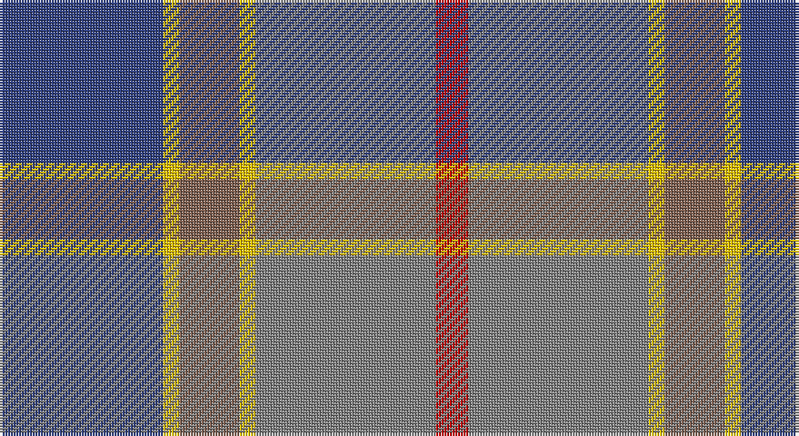

This page is one **sett** — a single exact thread-count. It belongs to the [tartan](/setts/db30ly3o11ly3y33r6/)
(the same proportion at any scale), whose colour order is pattern [BYRYGR](/stripes/byrygr/).

Sourced from weddslist.  It is a [6 stripe tartan](/stripes/stripes6/).

Original link http://www.weddslist.com/cgi-bin/tartans/pg.pl?source=sts

## Thread count
B/60 Y6 LT22 Y6 N66 R/12

One full sett is **272 threads**.

## Palette

Palette: <strong>Tartan Register</strong> <small style="color:#888">(1 of 5 colours)</small>
<table><thead><tr><th>Colour</th><th>Threads</th><th>Shade</th><th>Base</th><th>OKLCh</th></tr></thead><tbody><tr><td>B/</td><td style="text-align:right;font-variant-numeric:tabular-nums">60</td><td><code style="background-color:#304080;">#304080</code> <small style="color:#888">#304080</small></td><td>B <code style="background-color:#2A418A;">#2A418A</code></td><td><small style="color:#888">oklch(39.4% 0.109 270.2)</small></td></tr><tr><td>Y</td><td style="text-align:right;font-variant-numeric:tabular-nums">6</td><td><code style="background-color:#F0C000;">#F0C000</code> <small style="color:#888">#F0C000</small></td><td>Y <code style="background-color:#F2BF00;">#F2BF00</code></td><td><small style="color:#888">oklch(82.7% 0.169 90.5)</small></td></tr><tr><td>LT</td><td style="text-align:right;font-variant-numeric:tabular-nums">22</td><td><code style="background-color:#806050;">#806050</code> <small style="color:#888">#806050</small></td><td>R <code style="background-color:#CC0000;">#CC0000</code></td><td><small style="color:#888">oklch(51.7% 0.049 47.8)</small></td></tr><tr><td>Y</td><td style="text-align:right;font-variant-numeric:tabular-nums">6</td><td><code style="background-color:#F0C000;">#F0C000</code> <small style="color:#888">#F0C000</small></td><td>Y <code style="background-color:#F2BF00;">#F2BF00</code></td><td><small style="color:#888">oklch(82.7% 0.169 90.5)</small></td></tr><tr><td>N</td><td style="text-align:right;font-variant-numeric:tabular-nums">66</td><td><code style="background-color:#808080;">#808080</code> <small style="color:#888">#808080</small></td><td>G <code style="background-color:#006100;">#006100</code></td><td><small style="color:#888">oklch(60.0% 0.000 89.9)</small></td></tr><tr><td>R/</td><td style="text-align:right;font-variant-numeric:tabular-nums">12</td><td><code style="background-color:#C00000;">#C00000</code> <small style="color:#888">#C00000</small></td><td>R <code style="background-color:#CC0000;">#CC0000</code></td><td><small style="color:#888">oklch(50.7% 0.208 29.2)</small></td></tr></tbody></table>

# Sample pattern

## Nearest tartans

The nearest existing variants by ΔTartan distance, with this tartan at the top so the swatches line up against it.

ΔTartan

Tartan

Sett

—

<a href="/ttd/edit/#slug=db30ly3o11ly3y33r6~x2">Balfour</a> <a class="nn-out" href="/variants/s6/db30ly3o11ly3y33r6~x2/" title="open its dictionary page">↗</a>

0.62

<a href="/ttd/edit/#slug=db30ly3dy11ly3y33r6~x2&amp;base=db30ly3o11ly3y33r6~x2">Balfour</a> <a class="nn-out" href="/variants/s6/db30ly3dy11ly3y33r6~x2/" title="open its dictionary page">↗</a>

0.99

<a href="/ttd/edit/#slug=t4r1ly1t12do4y10ly1r3~x4&amp;base=db30ly3o11ly3y33r6~x2">Hawaii (District)</a> <a class="nn-out" href="/variants/s8/t4r1ly1t12do4y10ly1r3~x4/" title="open its dictionary page">↗</a>

1.10

<a href="/ttd/edit/#slug=y15k10n30o11w3y5~x2&amp;base=db30ly3o11ly3y33r6~x2">McHale (Personal)</a> <a class="nn-out" href="/variants/s6/y15k10n30o11w3y5~x2/" title="open its dictionary page">↗</a>

1.20

<a href="/ttd/edit/#slug=db30ly3dy11ly3o33r6~x2&amp;base=db30ly3o11ly3y33r6~x2">Balfour Family Tartan</a> <a class="nn-out" href="/variants/s6/db30ly3dy11ly3o33r6~x2/" title="open its dictionary page">↗</a>

1.25

<a href="/ttd/edit/#slug=r1o5dt3dti11dt3o5lo1~x8&amp;base=db30ly3o11ly3y33r6~x2">Newmill</a> <a class="nn-out" href="/variants/s7/r1o5dt3dti11dt3o5lo1~x8/" title="open its dictionary page">↗</a>

1.25

<a href="/ttd/edit/#slug=r3n20ly2n20o20lb20r3~x2&amp;base=db30ly3o11ly3y33r6~x2">Brodie Silver Clan Tartan</a> <a class="nn-out" href="/variants/s7/r3n20ly2n20o20lb20r3~x2/" title="open its dictionary page">↗</a>

1.25

<a href="/ttd/edit/#slug=r3n20k2n20o20lb20r3~x2&amp;base=db30ly3o11ly3y33r6~x2">Brodie Silver</a> <a class="nn-out" href="/variants/s7/r3n20k2n20o20lb20r3~x2/" title="open its dictionary page">↗</a>

1.26

<a href="/ttd/edit/#slug=r3w2y7n25k8y15dg2~x2&amp;base=db30ly3o11ly3y33r6~x2">Allman-Jones (Personal)</a> <a class="nn-out" href="/variants/s7/r3w2y7n25k8y15dg2~x2/" title="open its dictionary page">↗</a>

1.26

<a href="/ttd/edit/#slug=r5o20dt13db42dt13o20lo5&amp;base=db30ly3o11ly3y33r6~x2">Newmill Corporate Tartan</a> <a class="nn-out" href="/variants/s7/r5o20dt13db42dt13o20lo5/" title="open its dictionary page">↗</a>

1.27

<a href="/ttd/edit/#slug=r3n20ly2n20y20lb20r3~x2&amp;base=db30ly3o11ly3y33r6~x2">Brodie, Silver</a> <a class="nn-out" href="/variants/s7/r3n20ly2n20y20lb20r3~x2/" title="open its dictionary page">↗</a>

## Neighbour map

Every grey dot is one of 14360 variants placed by the first two principal components of the ΔTartan feature space (44% of its variance). Red is this tartan; blue dots are its nearest — click one to open its page.

<svg viewBox="0 0 640 380" role="img" style="max-width:100%;height:auto;border:1px solid #e0e0e0;border-radius:4px;display:block" xmlns="http://www.w3.org/2000/svg"><image href="/nn/cloud.v1.png" width="640" height="380"/><a href="/variants/s6/db30ly3dy11ly3y33r6~x2/"><circle cx="213.9" cy="197.6" r="4" fill="#3465a4"><title>Balfour</title></circle></a><a href="/variants/s8/t4r1ly1t12do4y10ly1r3~x4/"><circle cx="249.5" cy="191.4" r="4" fill="#3465a4"><title>Hawaii (District)</title></circle></a><a href="/variants/s6/y15k10n30o11w3y5~x2/"><circle cx="200.4" cy="218.8" r="4" fill="#3465a4"><title>McHale (Personal)</title></circle></a><a href="/variants/s6/db30ly3dy11ly3o33r6~x2/"><circle cx="198.6" cy="188.4" r="4" fill="#3465a4"><title>Balfour Family Tartan</title></circle></a><a href="/variants/s7/r1o5dt3dti11dt3o5lo1~x8/"><circle cx="205.9" cy="209.3" r="4" fill="#3465a4"><title>Newmill</title></circle></a><a href="/variants/s7/r3n20ly2n20o20lb20r3~x2/"><circle cx="236.1" cy="215.5" r="4" fill="#3465a4"><title>Brodie Silver Clan Tartan</title></circle></a><a href="/variants/s7/r3n20k2n20o20lb20r3~x2/"><circle cx="219.5" cy="208.0" r="4" fill="#3465a4"><title>Brodie Silver</title></circle></a><a href="/variants/s7/r3w2y7n25k8y15dg2~x2/"><circle cx="213.8" cy="174.7" r="4" fill="#3465a4"><title>Allman-Jones (Personal)</title></circle></a><a href="/variants/s7/r5o20dt13db42dt13o20lo5/"><circle cx="177.0" cy="219.4" r="4" fill="#3465a4"><title>Newmill Corporate Tartan</title></circle></a><a href="/variants/s7/r3n20ly2n20y20lb20r3~x2/"><circle cx="221.0" cy="208.5" r="4" fill="#3465a4"><title>Brodie, Silver</title></circle></a><circle cx="228.9" cy="204.8" r="5" fill="#c00000"/></svg>

ID: /variants/s6/db30ly3o11ly3y33r6~x2/
