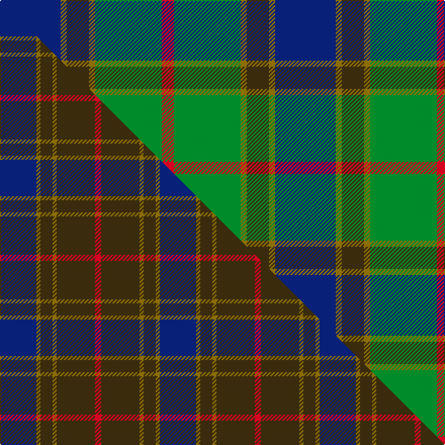

This is one **variant** — a specific cloth: this exact thread count and colourway, with its own
provenance below. It is one weaving of the [sett](/tartans/b/ba/balfour-hunting/) (the scale-free proportion — the
same cloth at any scale or shade), whose colour order is pattern [BGGGGR](/stripes/bggggr/).

Part of the [Balfour Hunting](/tartans/b/ba/balfour-hunting/) tartan — the named design grouping this sett with its other cloths.

Sourced from register-of-tartans.  It is a [6 stripe tartan](/stripes/stripes6/).

Original link [https://www.tartanregister.gov.uk/tartanDetails.aspx?ref=4866](https://www.tartanregister.gov.uk/tartanDetails.aspx?ref=4866)

Dataset <small>— provenance for this record, inherited from the source manifest</small>

<dl class="dataset-prov">
<dt>source</dt><dd><a href="/sources/register-of-tartans/">Scottish Register of Tartans</a></dd>
<dt>data captured from</dt><dd><a href="https://github.com/thetartan/tartan-database/blob/master/data/register-of-tartans/data.csv">https://github.com/thetartan/tartan-database/blob/master/data/register-of-tartans/data.csv</a></dd>
<dt>data date</dt><dd>2017-01-06 <small>(dataset default)</small></dd>
<dt>licence</dt><dd><a href="https://www.tartanregister.gov.uk/copyright">Crown copyright</a></dd>
</dl>

Capture chain <small>— the hands this data passed through, oldest first; each capture carries its own licence</small>

<ol class="capture-chain">
<li><a href="https://www.tartanregister.gov.uk/">Scottish Register of Tartans</a> · <a href="https://www.tartanregister.gov.uk/copyright">Crown copyright</a> <small>the living register — still published by National Records of Scotland</small></li>
<li><a href="https://github.com/thetartan/tartan-database">thetartan/tartan-database</a> <small>2016-2017</small> · <a href="https://creativecommons.org/licenses/by-nc-nd/4.0/">CC BY-NC-ND 4.0</a> <small>Levko Kravets's frozen compilation — the capture we vendored, and where its CC licence text came from</small></li>
<li>this dictionary <small>captured 2026-06-10 · commit 5bf86c7566</small> <small>each re-capture is a git commit to data/sources</small></li>
</ol>

## Register references

External register numbers recorded for this tartan.

- Scottish Register of Tartans: [4866](https://www.tartanregister.gov.uk/tartanDetails.aspx?ref=4866)
- Scottish Tartans Authority (ITI): 3970

## Thread count
DB/60 Y6 DY22 Y6 G66 R/12

One full sett is **272 threads**.

## Palette
<table><thead><tr><th>Colour</th><th>Shade</th><th>OKLCh</th></tr></thead><tbody><tr><td>DB</td><td><code style="background-color:#082077;">#082077</code> <small style="color:#888">#082077</small></td><td><small style="color:#888">oklch(30.0% 0.149 265.1)</small></td></tr><tr><td>G</td><td><code style="background-color:#008B2A;">#008B2A</code> <small style="color:#888">#008B2A</small></td><td><small style="color:#888">oklch(55.4% 0.170 145.9)</small></td></tr><tr><td>R</td><td><code style="background-color:#D60020;">#D60020</code> <small style="color:#888">#D60020</small></td><td><small style="color:#888">oklch(55.2% 0.224 25.5)</small></td></tr><tr><td>DY</td><td><code style="background-color:#3A2B0D;">#3A2B0D</code> <small style="color:#888">#3A2B0D</small></td><td><small style="color:#888">oklch(30.0% 0.049 82.0)</small></td></tr><tr><td>Y</td><td><code style="background-color:#8B6E00;">#8B6E00</code> <small style="color:#888">#8B6E00</small></td><td><small style="color:#888">oklch(55.1% 0.113 90.4)</small></td></tr></tbody></table>

# Sample pattern

[Sample sheet (PDF)](swatch.pdf) — the woven sample, thread count and palette on one printable A4, rendered on demand (the same sheet the TTD print page downloads).

## Compared to the master

This cloth is one sett of its design; the master sett (the exemplar the design is anchored on) is below for comparison.

Its **ΔTartan distance** from the master is **1.57** — the same measure the nearest-tartans table ranks by (0 is identical; a re-scale of the same cloth is near 0, a recolour or a different proportion further).

<figure class="master-compare" style="margin:0">

this sett
master sett ★

<figcaption style="color:#888;font-size:smaller">One weave of this sett against the <a href="/setts/db18y2dy6y2dy19r3/">master sett ★</a>, split on the diagonal: a shared proportion runs seamlessly across it with only the shades shifting; a different proportion breaks on it.</figcaption>
</figure>

## Nearest tartan variants

The nearest existing variants by ΔTartan distance, with this cloth at the top so the swatches line up against it.

ΔTartan

Threads

Variant

Sett

—

272

<a href="/variants/s6/db30y3dy11y3g33r6~x2/">Balfour Hunting</a>

<a href="/ttd/edit/#slug=k7dr3g30db28lb3~x2&amp;base=db30y3dy11y3g33r6~x2" title="compare in the TTD">1.33</a>

264

<a href="/variants/s5/k7dr3g30db28lb3~x2/">Highlander Highland Laddie</a>

<a href="/ttd/edit/#slug=r2y1g10db10w1~x6&amp;base=db30y3dy11y3g33r6~x2" title="compare in the TTD">1.35</a>

270

<a href="/variants/s5/r2y1g10db10w1~x6/">Turnbull Hunting (Name)</a>

<a href="/ttd/edit/#slug=r7y3g28db28w3~x2&amp;base=db30y3dy11y3g33r6~x2" title="compare in the TTD">1.43</a>

256

<a href="/variants/s5/r7y3g28db28w3~x2/">Turnbull, hunting</a>

<a href="/ttd/edit/#slug=dr7y3g28db28w3~x2&amp;base=db30y3dy11y3g33r6~x2" title="compare in the TTD">1.43</a>

256

<a href="/variants/s5/dr7y3g28db28w3~x2/">Turnbull Hunting</a>

<a href="/ttd/edit/#slug=r2ly2db9dy1dg9r1w1~x2&amp;base=db30y3dy11y3g33r6~x2" title="compare in the TTD">1.48</a>

94

<a href="/variants/s7/r2ly2db9dy1dg9r1w1~x2/">Unidentified (ex Tony Murray)</a>

<a href="/ttd/edit/#slug=t32dy16g3lo4dg28~x2&amp;base=db30y3dy11y3g33r6~x2" title="compare in the TTD">1.51</a>

212

<a href="/variants/s5/t32dy16g3lo4dg28~x2/">Corey (Name)</a>

<a href="/ttd/edit/#slug=r5t3g24db24r4y2~x2~t5912243-db3514276&amp;base=db30y3dy11y3g33r6~x2" title="compare in the TTD">1.52</a>

234

<a href="/variants/s6/r5t3g24db24r4y2~x2~t5912243-db3514276/">Canine All Dogs</a>

<a href="/ttd/edit/#slug=ly5db30w3g15y8r4~x2&amp;base=db30y3dy11y3g33r6~x2" title="compare in the TTD">1.64</a>

242

<a href="/variants/s6/ly5db30w3g15y8r4~x2/">Carleton College Rugby</a>

<a href="/ttd/edit/#slug=dg9g1b2g1db4r1~x12~dg4514144-g6019141&amp;base=db30y3dy11y3g33r6~x2" title="compare in the TTD">1.68</a>

312

<a href="/variants/s6/dg9g1b2g1db4r1~x12~dg4514144-g6019141/">Gorman, George (Personal)</a>

<a href="/ttd/edit/#slug=g11dy4w1db10dr1db2~x4&amp;base=db30y3dy11y3g33r6~x2" title="compare in the TTD">1.76</a>

180

<a href="/variants/s6/g11dy4w1db10dr1db2~x4/">Ayrshire</a>

## Neighbour map

Every grey dot is one of 13662 variants placed by the first two principal components of the ΔTartan feature space (42% of its variance). Red is this tartan; blue dots are its nearest — click one to open its page. The map is a flat projection of a many-dimensional space — [how to read it](/posts/neighbourhood-maps/).

<svg viewBox="0 0 640 380" role="img" style="max-width:100%;height:auto;border:1px solid #e0e0e0;border-radius:4px;display:block" xmlns="http://www.w3.org/2000/svg"><image href="/nn/cloud.v1.png" width="640" height="380"/><a href="/variants/s5/k7dr3g30db28lb3~x2/"><circle cx="198.4" cy="197.5" r="4" fill="#3465a4"><title>Highlander Highland Laddie</title></circle></a><a href="/variants/s5/r2y1g10db10w1~x6/"><circle cx="225.4" cy="207.6" r="4" fill="#3465a4"><title>Turnbull Hunting (Name)</title></circle></a><a href="/variants/s5/r7y3g28db28w3~x2/"><circle cx="211.8" cy="212.9" r="4" fill="#3465a4"><title>Turnbull, hunting</title></circle></a><a href="/variants/s5/dr7y3g28db28w3~x2/"><circle cx="238.0" cy="230.0" r="4" fill="#3465a4"><title>Turnbull Hunting</title></circle></a><a href="/variants/s7/r2ly2db9dy1dg9r1w1~x2/"><circle cx="164.7" cy="176.4" r="4" fill="#3465a4"><title>Unidentified (ex Tony Murray)</title></circle></a><a href="/variants/s5/t32dy16g3lo4dg28~x2/"><circle cx="262.0" cy="254.8" r="4" fill="#3465a4"><title>Corey (Name)</title></circle></a><a href="/variants/s6/r5t3g24db24r4y2~x2~t5912243-db3514276/"><circle cx="236.2" cy="196.4" r="4" fill="#3465a4"><title>Canine All Dogs</title></circle></a><a href="/variants/s6/ly5db30w3g15y8r4~x2/"><circle cx="188.2" cy="183.1" r="4" fill="#3465a4"><title>Carleton College Rugby</title></circle></a><a href="/variants/s6/dg9g1b2g1db4r1~x12~dg4514144-g6019141/"><circle cx="283.1" cy="214.9" r="4" fill="#3465a4"><title>Gorman, George (Personal)</title></circle></a><a href="/variants/s6/g11dy4w1db10dr1db2~x4/"><circle cx="246.7" cy="218.4" r="4" fill="#3465a4"><title>Ayrshire</title></circle></a><circle cx="216.6" cy="207.3" r="5" fill="#c00000"/><text x="320" y="376" text-anchor="middle" font-size="11" fill="#999">ground</text><text x="11" y="190" text-anchor="middle" font-size="11" fill="#999" transform="rotate(-90 11 190)">complexity</text></svg>

ID: /variants/s6/db30y3dy11y3g33r6~x2/
