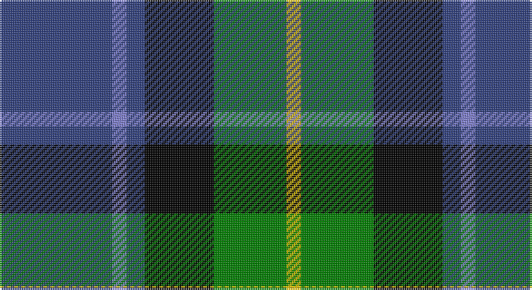

This page is one **sett** — a single exact thread-count. It belongs to the [tartan](/setts/db31b4db5k19g20ly4/)
(the same proportion at any scale), whose colour order is pattern [BBBKGY](/stripes/bbbkgy/).

Part of the [Midlothian](/tartans/midlothian/) tartan — the named design grouping this sett with its other cloths.

Sourced from weddslist.  It is a [6 stripe tartan](/stripes/stripes6/).

Original link http://www.weddslist.com/cgi-bin/tartans/pg.pl?source=sts

## Thread count
Ba/62 B8 Ba10 K38 G40 Y/8

One full sett is **262 threads**.

## Palette

Palette: <strong>Ingles Buchan</strong> <small style="color:#888">(1 of 5 colours)</small>
<table><thead><tr><th>Colour</th><th>Threads</th><th>Shade</th><th>Base</th><th>OKLCh</th></tr></thead><tbody><tr><td>Ba/</td><td style="text-align:right;font-variant-numeric:tabular-nums">62</td><td><code style="background-color:#304080;">#304080</code> <small style="color:#888">#304080</small></td><td>B <code style="background-color:#2A418A;">#2A418A</code></td><td><small style="color:#888">oklch(39.4% 0.109 270.2)</small></td></tr><tr><td>B</td><td style="text-align:right;font-variant-numeric:tabular-nums">8</td><td><code style="background-color:#8080D0;">#8080D0</code> <small style="color:#888">#8080D0</small></td><td>B <code style="background-color:#2A418A;">#2A418A</code></td><td><small style="color:#888">oklch(63.4% 0.119 282.5)</small></td></tr><tr><td>Ba</td><td style="text-align:right;font-variant-numeric:tabular-nums">10</td><td><code style="background-color:#304080;">#304080</code> <small style="color:#888">#304080</small></td><td>B <code style="background-color:#2A418A;">#2A418A</code></td><td><small style="color:#888">oklch(39.4% 0.109 270.2)</small></td></tr><tr><td>K</td><td style="text-align:right;font-variant-numeric:tabular-nums">38</td><td><code style="background-color:#000000;">#000000</code> <small style="color:#888">#000000</small></td><td>K <code style="background-color:#000000;">#000000</code></td><td><small style="color:#888">oklch(0.0% 0.000 0.0)</small></td></tr><tr><td>G</td><td style="text-align:right;font-variant-numeric:tabular-nums">40</td><td><code style="background-color:#008000;">#008000</code> <small style="color:#888">#008000</small></td><td>G <code style="background-color:#006100;">#006100</code></td><td><small style="color:#888">oklch(52.0% 0.177 142.5)</small></td></tr><tr><td>Y/</td><td style="text-align:right;font-variant-numeric:tabular-nums">8</td><td><code style="background-color:#F0C000;">#F0C000</code> <small style="color:#888">#F0C000</small></td><td>Y <code style="background-color:#F2BF00;">#F2BF00</code></td><td><small style="color:#888">oklch(82.7% 0.169 90.5)</small></td></tr></tbody></table>

# Sample pattern

## Compared to the master

This cloth is one sett of its design; the master sett (the exemplar the design is anchored on) is below for comparison.

<figure style="margin:0"><figcaption style="color:#888;font-size:smaller">this sett</figcaption></figure>
<figure style="margin:0"><figcaption style="color:#888;font-size:smaller"><a href="/setts/db31b4db5k19g20lo4/">master sett →</a></figcaption></figure>

## Nearest tartans

The nearest existing variants by ΔTartan distance, with this tartan at the top so the swatches line up against it.

ΔTartan

Tartan

Sett

—

<a href="/ttd/edit/#slug=db31b4db5k19g20ly4~x2">Midlothian</a> <a class="nn-out" href="/variants/s6/db31b4db5k19g20ly4~x2/" title="open its dictionary page">↗</a>

0.74

<a href="/ttd/edit/#slug=r3k2g15k10db20ly2~x2&amp;base=db31b4db5k19g20ly4~x2">MacLeod of Assynt</a> <a class="nn-out" href="/variants/s6/r3k2g15k10db20ly2~x2/" title="open its dictionary page">↗</a>

0.77

<a href="/ttd/edit/#slug=lr4g24db10r3db12lo4~x2&amp;base=db31b4db5k19g20ly4~x2">Inglis (Name)</a> <a class="nn-out" href="/variants/s6/lr4g24db10r3db12lo4~x2/" title="open its dictionary page">↗</a>

0.83

<a href="/ttd/edit/#slug=r2db23k14g16k2w2~x2&amp;base=db31b4db5k19g20ly4~x2">MacPhail, hunting</a> <a class="nn-out" href="/variants/s6/r2db23k14g16k2w2~x2/" title="open its dictionary page">↗</a>

0.86

<a href="/ttd/edit/#slug=dg31ly4dg6k19db18t9~x2&amp;base=db31b4db5k19g20ly4~x2">Lanark</a> <a class="nn-out" href="/variants/s6/dg31ly4dg6k19db18t9~x2/" title="open its dictionary page">↗</a>

0.93

<a href="/ttd/edit/#slug=ly3dt17n9k25lb3~x2&amp;base=db31b4db5k19g20ly4~x2">Teylu Coleman (Name)</a> <a class="nn-out" href="/variants/s5/ly3dt17n9k25lb3~x2/" title="open its dictionary page">↗</a>

0.94

<a href="/ttd/edit/#slug=g9t2g1k6db6r1db1~x2&amp;base=db31b4db5k19g20ly4~x2">MacTaggert</a> <a class="nn-out" href="/variants/s7/g9t2g1k6db6r1db1~x2/" title="open its dictionary page">↗</a>

0.99

<a href="/ttd/edit/#slug=r3k2g15k10db20k2ly2~x2&amp;base=db31b4db5k19g20ly4~x2">MacLeod, Macleod of Harris</a> <a class="nn-out" href="/variants/s7/r3k2g15k10db20k2ly2~x2/" title="open its dictionary page">↗</a>

1.01

<a href="/ttd/edit/#slug=db1r1db6k6g6w1~x2&amp;base=db31b4db5k19g20ly4~x2">Wellington</a> <a class="nn-out" href="/variants/s6/db1r1db6k6g6w1~x2/" title="open its dictionary page">↗</a>

1.03

<a href="/ttd/edit/#slug=g16lb3g3k10db12r2db3~x2&amp;base=db31b4db5k19g20ly4~x2">MacLean, Donald (Personal)</a> <a class="nn-out" href="/variants/s7/g16lb3g3k10db12r2db3~x2/" title="open its dictionary page">↗</a>

1.03

<a href="/ttd/edit/#slug=g17ly2k14r2db9r2db10~x2&amp;base=db31b4db5k19g20ly4~x2">MacDonald, (Flora.. )</a> <a class="nn-out" href="/variants/s7/g17ly2k14r2db9r2db10~x2/" title="open its dictionary page">↗</a>

## Neighbour map

Every grey dot is one of 14360 variants placed by the first two principal components of the ΔTartan feature space (44% of its variance). Red is this tartan; blue dots are its nearest — click one to open its page.

<svg viewBox="0 0 640 380" role="img" style="max-width:100%;height:auto;border:1px solid #e0e0e0;border-radius:4px;display:block" xmlns="http://www.w3.org/2000/svg"><image href="/nn/cloud.v1.png" width="640" height="380"/><a href="/variants/s6/r3k2g15k10db20ly2~x2/"><circle cx="153.9" cy="194.2" r="4" fill="#3465a4"><title>MacLeod of Assynt</title></circle></a><a href="/variants/s6/lr4g24db10r3db12lo4~x2/"><circle cx="183.1" cy="209.9" r="4" fill="#3465a4"><title>Inglis (Name)</title></circle></a><a href="/variants/s6/r2db23k14g16k2w2~x2/"><circle cx="167.0" cy="187.3" r="4" fill="#3465a4"><title>MacPhail, hunting</title></circle></a><a href="/variants/s6/dg31ly4dg6k19db18t9~x2/"><circle cx="154.0" cy="229.3" r="4" fill="#3465a4"><title>Lanark</title></circle></a><a href="/variants/s5/ly3dt17n9k25lb3~x2/"><circle cx="192.0" cy="222.9" r="4" fill="#3465a4"><title>Teylu Coleman (Name)</title></circle></a><a href="/variants/s7/g9t2g1k6db6r1db1~x2/"><circle cx="144.7" cy="193.7" r="4" fill="#3465a4"><title>MacTaggert</title></circle></a><a href="/variants/s7/r3k2g15k10db20k2ly2~x2/"><circle cx="151.2" cy="180.6" r="4" fill="#3465a4"><title>MacLeod, Macleod of Harris</title></circle></a><a href="/variants/s6/db1r1db6k6g6w1~x2/"><circle cx="101.8" cy="218.5" r="4" fill="#3465a4"><title>Wellington</title></circle></a><a href="/variants/s7/g16lb3g3k10db12r2db3~x2/"><circle cx="164.3" cy="216.4" r="4" fill="#3465a4"><title>MacLean, Donald (Personal)</title></circle></a><a href="/variants/s7/g17ly2k14r2db9r2db10~x2/"><circle cx="116.5" cy="200.3" r="4" fill="#3465a4"><title>MacDonald, (Flora.. )</title></circle></a><circle cx="158.7" cy="210.0" r="5" fill="#c00000"/></svg>

ID: /variants/s6/db31b4db5k19g20ly4~x2/
