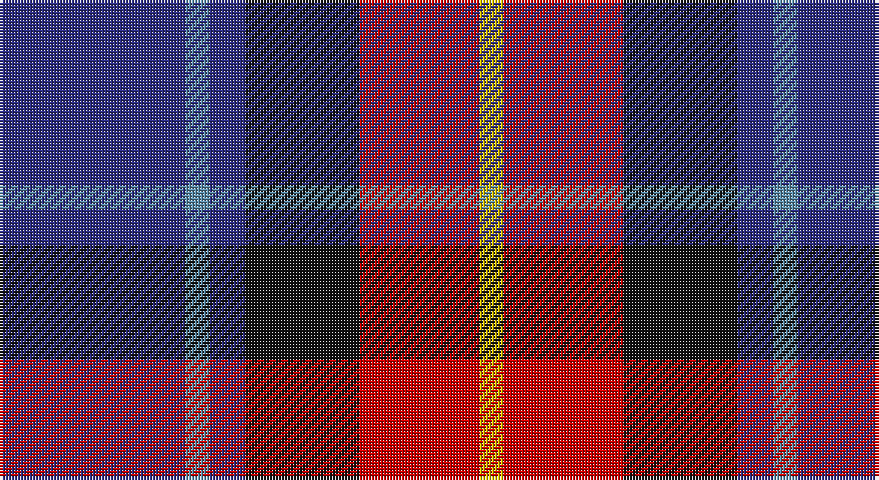

This page is one **sett** — a single exact thread-count. It belongs to the [tartan](/setts/db31t4db6k19r20ly4/)
(the same proportion at any scale), whose colour order is pattern [BBBKRY](/stripes/bbbkry/).

Part of the [Fife](/tartans/fife/) tartan — the named design grouping this sett with its other cloths.

Sourced from register-of-tartans.  It is a [6 stripe tartan](/stripes/stripes6/).

Original link https://www.tartanregister.gov.uk/tartanDetails.aspx?ref=1180

## Also known as

This cloth is also recorded under:

- Fife, Duke Of

2 attestations — the source records this cloth was collapsed from (oldest owns this page)

<ul>
<li>01/01/1998 — Fife (McGill) (register-of-tartans, <a href="https://www.tartanregister.gov.uk/tartanDetails.aspx?ref=1180">record</a>)</li>
<li>undated — Fife (weddslist, <a href="http://www.weddslist.com/cgi-bin/tartans/pg.pl?source=sts">record</a>)</li>
</ul>

## Register references

External register numbers recorded for this tartan.

- Scottish Register of Tartans: [1180](https://www.tartanregister.gov.uk/tartanDetails.aspx?ref=1180)
- Scottish Tartans World Register: 2503

## Thread count
DB/62 B8 DB12 K38 R40 Y/8

One full sett is **266 threads**.

## Palette

Palette: <strong>Tartan Register</strong>
<table><thead><tr><th>Colour</th><th>Threads</th><th>Shade</th><th>Base</th><th>OKLCh</th></tr></thead><tbody><tr><td>DB/</td><td style="text-align:right;font-variant-numeric:tabular-nums">62</td><td><code style="background-color:#2C2C80;">#2C2C80</code> <small style="color:#888">#2C2C80</small></td><td>B <code style="background-color:#2A418A;">#2A418A</code></td><td><small style="color:#888">oklch(35.0% 0.138 276.6)</small></td></tr><tr><td>B</td><td style="text-align:right;font-variant-numeric:tabular-nums">8</td><td><code style="background-color:#5C8CA8;">#5C8CA8</code> <small style="color:#888">#5C8CA8</small></td><td>B <code style="background-color:#2A418A;">#2A418A</code></td><td><small style="color:#888">oklch(61.7% 0.067 235.0)</small></td></tr><tr><td>DB</td><td style="text-align:right;font-variant-numeric:tabular-nums">12</td><td><code style="background-color:#2C2C80;">#2C2C80</code> <small style="color:#888">#2C2C80</small></td><td>B <code style="background-color:#2A418A;">#2A418A</code></td><td><small style="color:#888">oklch(35.0% 0.138 276.6)</small></td></tr><tr><td>K</td><td style="text-align:right;font-variant-numeric:tabular-nums">38</td><td><code style="background-color:#101010;">#101010</code> <small style="color:#888">#101010</small></td><td>K <code style="background-color:#000000;">#000000</code></td><td><small style="color:#888">oklch(17.3% 0.000 89.9)</small></td></tr><tr><td>R</td><td style="text-align:right;font-variant-numeric:tabular-nums">40</td><td><code style="background-color:#C80000;">#C80000</code> <small style="color:#888">#C80000</small></td><td>R <code style="background-color:#CC0000;">#CC0000</code></td><td><small style="color:#888">oklch(52.3% 0.215 29.2)</small></td></tr><tr><td>Y/</td><td style="text-align:right;font-variant-numeric:tabular-nums">8</td><td><code style="background-color:#E8C000;">#E8C000</code> <small style="color:#888">#E8C000</small></td><td>Y <code style="background-color:#F2BF00;">#F2BF00</code></td><td><small style="color:#888">oklch(81.9% 0.168 93.7)</small></td></tr></tbody></table>

# Sample pattern

## Compared to the master

This cloth is one sett of its design; the master sett (the exemplar the design is anchored on) is below for comparison.

<figure style="margin:0"><figcaption style="color:#888;font-size:smaller">this sett</figcaption></figure>
<figure style="margin:0"><figcaption style="color:#888;font-size:smaller"><a href="/setts/b2w1b12lo3b7dy2lo1b2k1g4w1b2/">master sett →</a></figcaption></figure>

## Nearest tartans

The nearest existing variants by ΔTartan distance, with this tartan at the top so the swatches line up against it.

ΔTartan

Tartan

Sett

—

<a href="/ttd/edit/#slug=db31t4db6k19r20ly4~x2">Fife (McGill)</a> <a class="nn-out" href="/variants/s6/db31t4db6k19r20ly4~x2/" title="open its dictionary page">↗</a>

0.86

<a href="/ttd/edit/#slug=r12dbi3g5db16ly2g2~x2&amp;base=db31t4db6k19r20ly4~x2">Dunbog Primary School Corporate Tartan</a> <a class="nn-out" href="/variants/s6/r12dbi3g5db16ly2g2~x2/" title="open its dictionary page">↗</a>

0.97

<a href="/ttd/edit/#slug=k1r2t1db5lo1~x16&amp;base=db31t4db6k19r20ly4~x2">Trinity College, Toronto Uni. (Corp</a> <a class="nn-out" href="/variants/s5/k1r2t1db5lo1~x16/" title="open its dictionary page">↗</a>

1.04

<a href="/ttd/edit/#slug=r12db3g5dbi16ly2g2~x2&amp;base=db31t4db6k19r20ly4~x2">Dunbog, Primary School</a> <a class="nn-out" href="/variants/s6/r12db3g5dbi16ly2g2~x2/" title="open its dictionary page">↗</a>

1.04

<a href="/ttd/edit/#slug=w5db6r18k8b5k4db27w3~x2&amp;base=db31t4db6k19r20ly4~x2">Clinton (Personal)</a> <a class="nn-out" href="/variants/s8/w5db6r18k8b5k4db27w3~x2/" title="open its dictionary page">↗</a>

1.07

<a href="/ttd/edit/#slug=db15r6dg8k2w2k2~x6&amp;base=db31t4db6k19r20ly4~x2">Stovell (2015)</a> <a class="nn-out" href="/variants/s6/db15r6dg8k2w2k2~x6/" title="open its dictionary page">↗</a>

1.09

<a href="/ttd/edit/#slug=p19w2g12t3k4~x2&amp;base=db31t4db6k19r20ly4~x2">Wilson's, No 111</a> <a class="nn-out" href="/variants/s5/p19w2g12t3k4~x2/" title="open its dictionary page">↗</a>

1.10

<a href="/ttd/edit/#slug=r2o8db2t4k4t1~x6&amp;base=db31t4db6k19r20ly4~x2">Thom(p)son's, Fancy</a> <a class="nn-out" href="/variants/s6/r2o8db2t4k4t1~x6/" title="open its dictionary page">↗</a>

1.16

<a href="/ttd/edit/#slug=dbi36db15r25w5k6dbi35db15r7w5k6&amp;base=db31t4db6k19r20ly4~x2">Le Mirage (Corporate?)</a> <a class="nn-out" href="/variants/s10/dbi36db15r25w5k6dbi35db15r7w5k6/" title="open its dictionary page">↗</a>

1.18

<a href="/ttd/edit/#slug=lb2db20n2dt15r9lb2~x2&amp;base=db31t4db6k19r20ly4~x2">Open Championship (1998)</a> <a class="nn-out" href="/variants/s6/lb2db20n2dt15r9lb2~x2/" title="open its dictionary page">↗</a>

1.18

<a href="/ttd/edit/#slug=n32w4n4k24dp29k4&amp;base=db31t4db6k19r20ly4~x2">Grammar School at Leeds (School)</a> <a class="nn-out" href="/variants/s6/n32w4n4k24dp29k4/" title="open its dictionary page">↗</a>

## Neighbour map

Every grey dot is one of 14360 variants placed by the first two principal components of the ΔTartan feature space (44% of its variance). Red is this tartan; blue dots are its nearest — click one to open its page.

<svg viewBox="0 0 640 380" role="img" style="max-width:100%;height:auto;border:1px solid #e0e0e0;border-radius:4px;display:block" xmlns="http://www.w3.org/2000/svg"><image href="/nn/cloud.v1.png" width="640" height="380"/><a href="/variants/s6/r12dbi3g5db16ly2g2~x2/"><circle cx="180.0" cy="200.4" r="4" fill="#3465a4"><title>Dunbog Primary School Corporate Tartan</title></circle></a><a href="/variants/s5/k1r2t1db5lo1~x16/"><circle cx="205.3" cy="230.3" r="4" fill="#3465a4"><title>Trinity College, Toronto Uni. (Corp</title></circle></a><a href="/variants/s6/r12db3g5dbi16ly2g2~x2/"><circle cx="159.6" cy="194.4" r="4" fill="#3465a4"><title>Dunbog, Primary School</title></circle></a><a href="/variants/s8/w5db6r18k8b5k4db27w3~x2/"><circle cx="172.1" cy="171.1" r="4" fill="#3465a4"><title>Clinton (Personal)</title></circle></a><a href="/variants/s6/db15r6dg8k2w2k2~x6/"><circle cx="182.0" cy="211.7" r="4" fill="#3465a4"><title>Stovell (2015)</title></circle></a><a href="/variants/s5/p19w2g12t3k4~x2/"><circle cx="208.2" cy="192.3" r="4" fill="#3465a4"><title>Wilson's, No 111</title></circle></a><a href="/variants/s6/r2o8db2t4k4t1~x6/"><circle cx="135.0" cy="212.1" r="4" fill="#3465a4"><title>Thom(p)son's, Fancy</title></circle></a><a href="/variants/s10/dbi36db15r25w5k6dbi35db15r7w5k6/"><circle cx="185.0" cy="193.2" r="4" fill="#3465a4"><title>Le Mirage (Corporate?)</title></circle></a><a href="/variants/s6/lb2db20n2dt15r9lb2~x2/"><circle cx="205.1" cy="204.7" r="4" fill="#3465a4"><title>Open Championship (1998)</title></circle></a><a href="/variants/s6/n32w4n4k24dp29k4/"><circle cx="207.2" cy="230.1" r="4" fill="#3465a4"><title>Grammar School at Leeds (School)</title></circle></a><circle cx="188.2" cy="210.2" r="5" fill="#c00000"/></svg>

ID: /variants/s6/db31t4db6k19r20ly4~x2/
