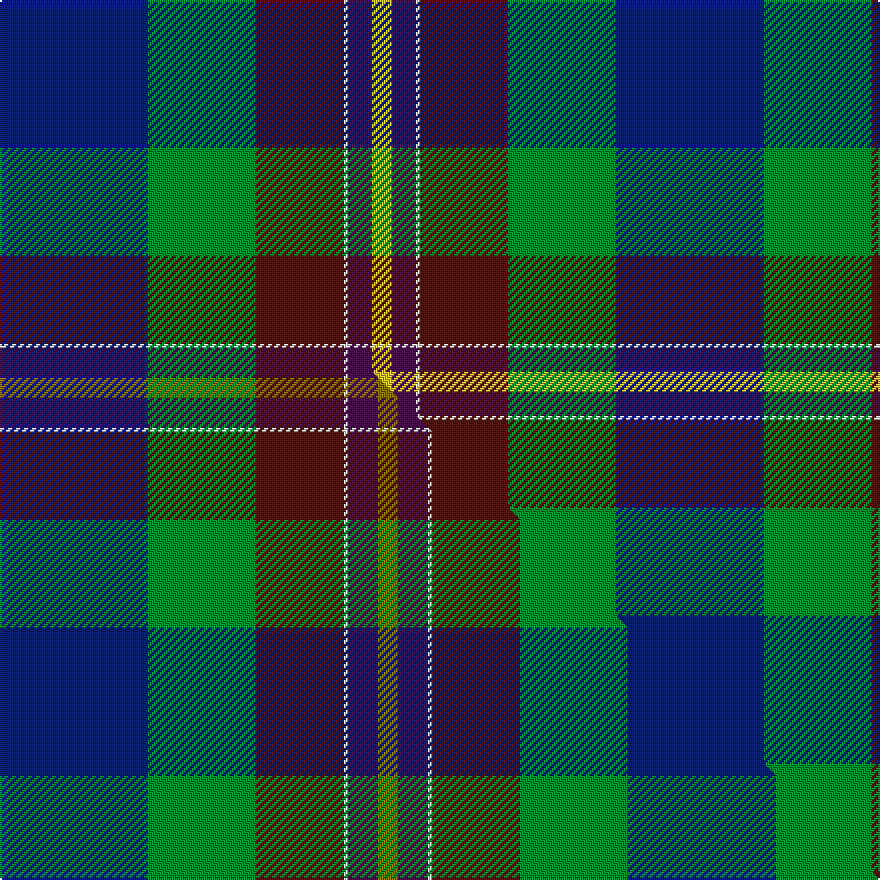

This is one **variant** — a specific cloth: this exact thread count and colourway, with its own
provenance below. It is one weaving of the [sett](/tartans/p/pa/palazzo-bloise/) (the scale-free proportion — the
same cloth at any scale or shade), whose colour order is pattern [BGBWBY](/stripes/bgbwby/).

Part of the [Palazzo Bloise](/tartans/p/pa/palazzo-bloise/) tartan — the named design grouping this sett with its other cloths.

Sourced from tartans-authority.  It is a [6 stripe tartan](/stripes/stripes6/).

Original link <code>http://www.tartansauthority.com/tartan-ferret/display/10543/</code> — retired · [Internet Archive copy](https://web.archive.org/web/*/http://www.tartansauthority.com/tartan-ferret/display/10543/*)

Dataset <small>— provenance for this record, inherited from the source manifest</small>

<dl class="dataset-prov">
<dt>source</dt><dd><a href="/sources/tartans-authority/">Scottish Tartans Authority</a></dd>
<dt>data captured from</dt><dd><a href="https://github.com/thetartan/tartan-database/blob/master/data/tartans-authority/data.csv">https://github.com/thetartan/tartan-database/blob/master/data/tartans-authority/data.csv</a></dd>
<dt>data date</dt><dd>02/01/2012 <small>(this record)</small></dd>
<dt>licence</dt><dd><a href="https://creativecommons.org/licenses/by-nc-nd/4.0/">CC BY-NC-ND 4.0</a></dd>
</dl>

Capture chain <small>— the hands this data passed through, oldest first; each capture carries its own licence</small>

<ol class="capture-chain">
<li><a href="https://www.tartansauthority.com/">Scottish Tartans Authority</a> <small>the heritage body’s archive — its tartan-ferret record browser is retired; dead record links are shown unlinked, with an Internet Archive copy (ITI numbers are not SRT references)</small></li>
<li><a href="https://github.com/thetartan/tartan-database">thetartan/tartan-database</a> <small>2016-2017</small> · <a href="https://creativecommons.org/licenses/by-nc-nd/4.0/">CC BY-NC-ND 4.0</a> <small>Levko Kravets's frozen compilation — the capture we vendored, and where its CC licence text came from</small></li>
<li>this dictionary <small>captured 2026-06-10 · commit 5bf86c7566</small> <small>each re-capture is a git commit to data/sources</small></li>
</ol>

## Register references

External register numbers recorded for this tartan.

- Scottish Register of Tartans: [10543](https://www.tartanregister.gov.uk/tartanDetails?ref=10543)
- Scottish Tartans Authority (ITI): 10543

## Thread count
DB/74 G54 DR44 W2 DP12 LY/10

One full sett is **308 threads**.

## Palette
<table><thead><tr><th>Colour</th><th>Shade</th><th>OKLCh</th></tr></thead><tbody><tr><td>DB</td><td><code style="background-color:#082077;">#082077</code> <small style="color:#888">#082077</small></td><td><small style="color:#888">oklch(30.0% 0.149 265.1)</small></td></tr><tr><td>DR</td><td><code style="background-color:#55120C;">#55120C</code> <small style="color:#888">#55120C</small></td><td><small style="color:#888">oklch(30.0% 0.099 29.3)</small></td></tr><tr><td>G</td><td><code style="background-color:#008B2A;">#008B2A</code> <small style="color:#888">#008B2A</small></td><td><small style="color:#888">oklch(55.4% 0.170 145.9)</small></td></tr><tr><td>W</td><td><code style="background-color:#F7F7F7;">#F7F7F7</code> <small style="color:#888">#F7F7F7</small></td><td><small style="color:#888">oklch(97.6% 0.000 89.9)</small></td></tr><tr><td>DP</td><td><code style="background-color:#4B0B4F;">#4B0B4F</code> <small style="color:#888">#4B0B4F</small></td><td><small style="color:#888">oklch(30.1% 0.125 325.4)</small></td></tr><tr><td>LY</td><td><code style="background-color:#DCBC32;">#DCBC32</code> <small style="color:#888">#DCBC32</small></td><td><small style="color:#888">oklch(80.0% 0.150 95.2)</small></td></tr></tbody></table>

# Sample pattern

## Compared to the master

This cloth is one sett of its design; the master sett (the exemplar the design is anchored on) is below for comparison.

Its **ΔTartan distance** from the master is **0.05** — the same measure the nearest-tartans table ranks by (0 is identical; a re-scale of the same cloth is near 0, a recolour or a different proportion further).

<figure class="master-compare" style="margin:0">

this sett
master sett ★

<figcaption style="color:#888;font-size:smaller">One weave of this sett against the <a href="/setts/db74g54dr44w2dp15y10/">master sett ★</a>, split on the diagonal: a shared proportion runs seamlessly across it with only the shades shifting; a different proportion breaks on it.</figcaption>
</figure>

## Nearest tartan variants

The nearest existing variants by ΔTartan distance, with this cloth at the top so the swatches line up against it.

ΔTartan

Threads

Variant

Sett

—

308

<a href="/variants/s6/db37g27dr22w1dp6ly5~x2/">Palazzo Bloise (Personal)</a>

<a href="/ttd/edit/#slug=db74g54dr44w2dp15y10&amp;base=db37g27dr22w1dp6ly5~x2" title="compare in the TTD">0.05</a>

314

<a href="/variants/s6/db74g54dr44w2dp15y10/">Palazzo Bloise (Personal)</a>

<a href="/ttd/edit/#slug=w4db30g10dr25w2~x2&amp;base=db37g27dr22w1dp6ly5~x2" title="compare in the TTD">1.42</a>

272

<a href="/variants/s5/w4db30g10dr25w2~x2/">Highland Spring Dress (2004) (Corp)</a>

<a href="/ttd/edit/#slug=db3g13lb1r3lb1db10y1~x2&amp;base=db37g27dr22w1dp6ly5~x2" title="compare in the TTD">2.54</a>

120

<a href="/variants/s7/db3g13lb1r3lb1db10y1~x2/">Graeme Heckenberg Hunting</a>

<a href="/ttd/edit/#slug=db3g13lb1r3lb1db10ly1~x2&amp;base=db37g27dr22w1dp6ly5~x2" title="compare in the TTD">2.55</a>

120

<a href="/variants/s7/db3g13lb1r3lb1db10ly1~x2/">Heckenberg Htg (Personal)</a>

<a href="/ttd/edit/#slug=dp10db10g10w1dy1~x6&amp;base=db37g27dr22w1dp6ly5~x2" title="compare in the TTD">2.73</a>

318

<a href="/variants/s5/dp10db10g10w1dy1~x6/">Edelstein (Personal)</a>

<a href="/ttd/edit/#slug=n50lb50y1db27g18do9y4~x2&amp;base=db37g27dr22w1dp6ly5~x2" title="compare in the TTD">3.02</a>

528

<a href="/variants/s7/n50lb50y1db27g18do9y4~x2/">Lachance (Canada) (Personal)</a>

<a href="/ttd/edit/#slug=dg18g6dy3w1dy3w1lb6db6~x2&amp;base=db37g27dr22w1dp6ly5~x2" title="compare in the TTD">3.15</a>

128

<a href="/variants/s8/dg18g6dy3w1dy3w1lb6db6~x2/">Iroquois Falls Centenary</a>

<a href="/ttd/edit/#slug=db12lb6g30db9r8dy1~x2&amp;base=db37g27dr22w1dp6ly5~x2" title="compare in the TTD">3.17</a>

238

<a href="/variants/s6/db12lb6g30db9r8dy1~x2/">Wright , Anne (Personal)</a>

<a href="/ttd/edit/#slug=db12lb6g30db9r8y1~x2&amp;base=db37g27dr22w1dp6ly5~x2" title="compare in the TTD">3.17</a>

238

<a href="/variants/s6/db12lb6g30db9r8y1~x2/">Wright, Anne (Personal)</a>

<a href="/ttd/edit/#slug=g6dp14t22db6ly16w1db6t6~x2&amp;base=db37g27dr22w1dp6ly5~x2" title="compare in the TTD">3.26</a>

284

<a href="/variants/s8/g6dp14t22db6ly16w1db6t6~x2/">Scotia (Fashion)</a>

## Neighbour map

Every grey dot is one of 13662 variants placed by the first two principal components of the ΔTartan feature space (42% of its variance). Red is this tartan; blue dots are its nearest — click one to open its page. The map is a flat projection of a many-dimensional space — [how to read it](/posts/neighbourhood-maps/).

<svg viewBox="0 0 640 380" role="img" style="max-width:100%;height:auto;border:1px solid #e0e0e0;border-radius:4px;display:block" xmlns="http://www.w3.org/2000/svg"><image href="/nn/cloud.v1.png" width="640" height="380"/><a href="/variants/s6/db74g54dr44w2dp15y10/"><circle cx="250.4" cy="172.4" r="4" fill="#3465a4"><title>Palazzo Bloise (Personal)</title></circle></a><a href="/variants/s5/w4db30g10dr25w2~x2/"><circle cx="268.1" cy="225.1" r="4" fill="#3465a4"><title>Highland Spring Dress (2004) (Corp)</title></circle></a><a href="/variants/s7/db3g13lb1r3lb1db10y1~x2/"><circle cx="240.1" cy="185.6" r="4" fill="#3465a4"><title>Graeme Heckenberg Hunting</title></circle></a><a href="/variants/s7/db3g13lb1r3lb1db10ly1~x2/"><circle cx="234.7" cy="183.8" r="4" fill="#3465a4"><title>Heckenberg Htg (Personal)</title></circle></a><a href="/variants/s5/dp10db10g10w1dy1~x6/"><circle cx="202.3" cy="247.3" r="4" fill="#3465a4"><title>Edelstein (Personal)</title></circle></a><a href="/variants/s7/n50lb50y1db27g18do9y4~x2/"><circle cx="223.2" cy="150.0" r="4" fill="#3465a4"><title>Lachance (Canada) (Personal)</title></circle></a><a href="/variants/s8/dg18g6dy3w1dy3w1lb6db6~x2/"><circle cx="200.9" cy="166.3" r="4" fill="#3465a4"><title>Iroquois Falls Centenary</title></circle></a><a href="/variants/s6/db12lb6g30db9r8dy1~x2/"><circle cx="257.0" cy="165.5" r="4" fill="#3465a4"><title>Wright , Anne (Personal)</title></circle></a><a href="/variants/s6/db12lb6g30db9r8y1~x2/"><circle cx="257.7" cy="165.8" r="4" fill="#3465a4"><title>Wright, Anne (Personal)</title></circle></a><a href="/variants/s8/g6dp14t22db6ly16w1db6t6~x2/"><circle cx="177.9" cy="184.0" r="4" fill="#3465a4"><title>Scotia (Fashion)</title></circle></a><circle cx="239.8" cy="165.3" r="5" fill="#c00000"/><text x="320" y="376" text-anchor="middle" font-size="11" fill="#999">ground</text><text x="11" y="190" text-anchor="middle" font-size="11" fill="#999" transform="rotate(-90 11 190)">complexity</text></svg>

ID: /variants/s6/db37g27dr22w1dp6ly5~x2/
