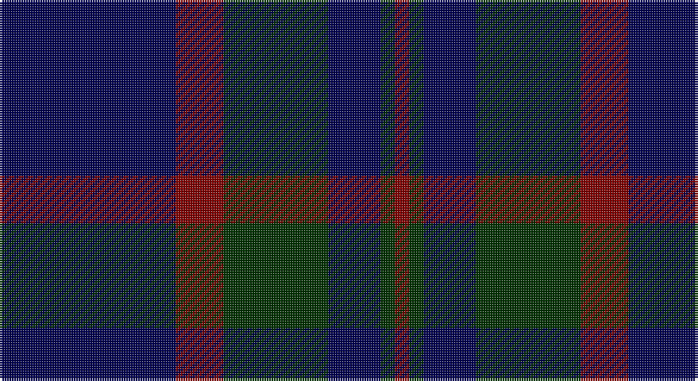

This page is one **sett** — a single exact thread-count. It belongs to the [tartan](/setts/db37r10dg22db11dg3r3/)
(the same proportion at any scale), whose colour order is pattern [BRGBGR](/stripes/brgbgr/).

Sourced from weddslist.  It is a [6 stripe tartan](/stripes/stripes6/).

Original link http://www.weddslist.com/cgi-bin/tartans/pg.pl?source=sts

## Thread count
DB/74 DR20 DG44 DB22 DG6 DR/6

One full sett is **264 threads**.

## Palette

Palette: <strong>custom</strong>
<table><thead><tr><th>Colour</th><th>Threads</th><th>Shade</th><th>Base</th><th>OKLCh</th></tr></thead><tbody><tr><td>DB/</td><td style="text-align:right;font-variant-numeric:tabular-nums">74</td><td><code style="background-color:#000050;">#000050</code> <small style="color:#888">#000050</small></td><td>B <code style="background-color:#2A418A;">#2A418A</code></td><td><small style="color:#888">oklch(19.5% 0.135 264.1)</small></td></tr><tr><td>DR</td><td style="text-align:right;font-variant-numeric:tabular-nums">20</td><td><code style="background-color:#800000;">#800000</code> <small style="color:#888">#800000</small></td><td>R <code style="background-color:#CC0000;">#CC0000</code></td><td><small style="color:#888">oklch(37.7% 0.155 29.2)</small></td></tr><tr><td>DG</td><td style="text-align:right;font-variant-numeric:tabular-nums">44</td><td><code style="background-color:#003000;">#003000</code> <small style="color:#888">#003000</small></td><td>G <code style="background-color:#006100;">#006100</code></td><td><small style="color:#888">oklch(26.8% 0.091 142.5)</small></td></tr><tr><td>DB</td><td style="text-align:right;font-variant-numeric:tabular-nums">22</td><td><code style="background-color:#000050;">#000050</code> <small style="color:#888">#000050</small></td><td>B <code style="background-color:#2A418A;">#2A418A</code></td><td><small style="color:#888">oklch(19.5% 0.135 264.1)</small></td></tr><tr><td>DG</td><td style="text-align:right;font-variant-numeric:tabular-nums">6</td><td><code style="background-color:#003000;">#003000</code> <small style="color:#888">#003000</small></td><td>G <code style="background-color:#006100;">#006100</code></td><td><small style="color:#888">oklch(26.8% 0.091 142.5)</small></td></tr><tr><td>DR/</td><td style="text-align:right;font-variant-numeric:tabular-nums">6</td><td><code style="background-color:#800000;">#800000</code> <small style="color:#888">#800000</small></td><td>R <code style="background-color:#CC0000;">#CC0000</code></td><td><small style="color:#888">oklch(37.7% 0.155 29.2)</small></td></tr></tbody></table>

# Sample pattern

## Nearest tartans

The nearest existing variants by ΔTartan distance, with this tartan at the top so the swatches line up against it.

ΔTartan

Tartan

Sett

—

<a href="/ttd/edit/#slug=db37r10dg22db11dg3r3~x2">Perthshire, New /Tourist Board</a> <a class="nn-out" href="/variants/s6/db37r10dg22db11dg3r3~x2/" title="open its dictionary page">↗</a>

0.93

<a href="/ttd/edit/#slug=k1db12k12g1k12db12g1~x4&amp;base=db37r10dg22db11dg3r3~x2">Marchmont (Personal)</a> <a class="nn-out" href="/variants/s7/k1db12k12g1k12db12g1~x4/" title="open its dictionary page">↗</a>

1.07

<a href="/ttd/edit/#slug=db8k39db8k39db87r6&amp;base=db37r10dg22db11dg3r3~x2">Largan (?)</a> <a class="nn-out" href="/variants/s6/db8k39db8k39db87r6/" title="open its dictionary page">↗</a>

1.11

<a href="/ttd/edit/#slug=k15db4k15db28r2~x2&amp;base=db37r10dg22db11dg3r3~x2">MacKay (Blue) #2</a> <a class="nn-out" href="/variants/s5/k15db4k15db28r2~x2/" title="open its dictionary page">↗</a>

1.18

<a href="/ttd/edit/#slug=k6db10k10b1k1b1k10b6~x4&amp;base=db37r10dg22db11dg3r3~x2">Oban</a> <a class="nn-out" href="/variants/s8/k6db10k10b1k1b1k10b6~x4/" title="open its dictionary page">↗</a>

1.22

<a href="/ttd/edit/#slug=k2dg7db2dg7db16r1~x6&amp;base=db37r10dg22db11dg3r3~x2">Hutton</a> <a class="nn-out" href="/variants/s6/k2dg7db2dg7db16r1~x6/" title="open its dictionary page">↗</a>

1.23

<a href="/ttd/edit/#slug=k3db23k17r2~x2&amp;base=db37r10dg22db11dg3r3~x2">Wellington Variation</a> <a class="nn-out" href="/variants/s4/k3db23k17r2~x2/" title="open its dictionary page">↗</a>

1.23

<a href="/ttd/edit/#slug=db12k1db1k1db1k3g6k1~x2&amp;base=db37r10dg22db11dg3r3~x2">Black Watch (Miniature) Regimental Tartan</a> <a class="nn-out" href="/variants/s8/db12k1db1k1db1k3g6k1~x2/" title="open its dictionary page">↗</a>

1.30

<a href="/ttd/edit/#slug=k4r2k12db12k1lo2~x2&amp;base=db37r10dg22db11dg3r3~x2">Robert Gordon University</a> <a class="nn-out" href="/variants/s6/k4r2k12db12k1lo2~x2/" title="open its dictionary page">↗</a>

1.30

<a href="/ttd/edit/#slug=k5g23k18db21k33db3~x2&amp;base=db37r10dg22db11dg3r3~x2">Black Watch (variation)</a> <a class="nn-out" href="/variants/s6/k5g23k18db21k33db3~x2/" title="open its dictionary page">↗</a>

1.30

<a href="/ttd/edit/#slug=db1k3db1k3db8r1~x4&amp;base=db37r10dg22db11dg3r3~x2">Morgan (MacKay Blue) Clan Tartan</a> <a class="nn-out" href="/variants/s6/db1k3db1k3db8r1~x4/" title="open its dictionary page">↗</a>

## Neighbour map

Every grey dot is one of 14360 variants placed by the first two principal components of the ΔTartan feature space (44% of its variance). Red is this tartan; blue dots are its nearest — click one to open its page.

<svg viewBox="0 0 640 380" role="img" style="max-width:100%;height:auto;border:1px solid #e0e0e0;border-radius:4px;display:block" xmlns="http://www.w3.org/2000/svg"><image href="/nn/cloud.v1.png" width="640" height="380"/><a href="/variants/s7/k1db12k12g1k12db12g1~x4/"><circle cx="366.9" cy="265.4" r="4" fill="#3465a4"><title>Marchmont (Personal)</title></circle></a><a href="/variants/s6/db8k39db8k39db87r6/"><circle cx="429.8" cy="255.6" r="4" fill="#3465a4"><title>Largan (?)</title></circle></a><a href="/variants/s5/k15db4k15db28r2~x2/"><circle cx="378.2" cy="271.0" r="4" fill="#3465a4"><title>MacKay (Blue) #2</title></circle></a><a href="/variants/s8/k6db10k10b1k1b1k10b6~x4/"><circle cx="367.6" cy="264.7" r="4" fill="#3465a4"><title>Oban</title></circle></a><a href="/variants/s6/k2dg7db2dg7db16r1~x6/"><circle cx="360.6" cy="235.5" r="4" fill="#3465a4"><title>Hutton</title></circle></a><a href="/variants/s4/k3db23k17r2~x2/"><circle cx="394.4" cy="286.2" r="4" fill="#3465a4"><title>Wellington Variation</title></circle></a><a href="/variants/s8/db12k1db1k1db1k3g6k1~x2/"><circle cx="385.9" cy="231.8" r="4" fill="#3465a4"><title>Black Watch (Miniature) Regimental Tartan</title></circle></a><a href="/variants/s6/k4r2k12db12k1lo2~x2/"><circle cx="338.6" cy="238.5" r="4" fill="#3465a4"><title>Robert Gordon University</title></circle></a><a href="/variants/s6/k5g23k18db21k33db3~x2/"><circle cx="346.5" cy="290.3" r="4" fill="#3465a4"><title>Black Watch (variation)</title></circle></a><a href="/variants/s6/db1k3db1k3db8r1~x4/"><circle cx="404.2" cy="272.9" r="4" fill="#3465a4"><title>Morgan (MacKay Blue) Clan Tartan</title></circle></a><circle cx="387.9" cy="266.5" r="5" fill="#c00000"/></svg>

ID: /variants/s6/db37r10dg22db11dg3r3~x2/
