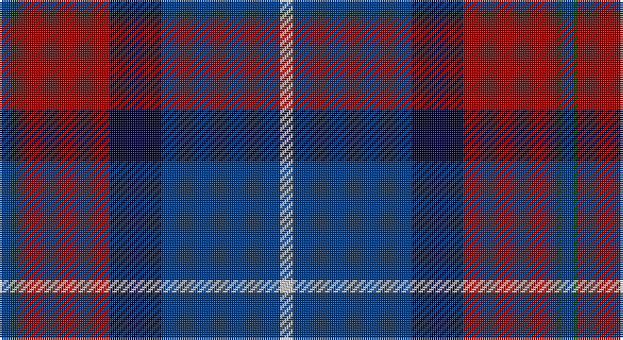

This page is one **sett** — a single exact thread-count. It belongs to the [tartan](/setts/db3dg1r22k12db28lb3/)
(the same proportion at any scale), whose colour order is pattern [BGRKBW](/stripes/bgrkbw/).

Part of the [Diaspora](/tartans/diaspora/) tartan — the named design grouping this sett with its other cloths.

Sourced from register-of-tartans.  It is a [6 stripe tartan](/stripes/stripes6/).

Original link https://www.tartanregister.gov.uk/tartanDetails.aspx?ref=934

## Register references

External register numbers recorded for this tartan.

- Scottish Register of Tartans: [934](https://www.tartanregister.gov.uk/tartanDetails.aspx?ref=934)
- Scottish Tartans Authority (ITI): 2690
- Scottish Tartans World Register: 2690

## Thread count
DB/6 G2 DR44 DBa24 DB56 N/6

One full sett is **264 threads**.

## Palette

Palette: <strong>Tartan Register</strong> <small style="color:#888">(1 of 5 colours)</small>
<table><thead><tr><th>Colour</th><th>Threads</th><th>Shade</th><th>Base</th><th>OKLCh</th></tr></thead><tbody><tr><td>DB/</td><td style="text-align:right;font-variant-numeric:tabular-nums">6</td><td><code style="background-color:#003478;">#003478</code> <small style="color:#888">#003478</small></td><td>B <code style="background-color:#2A418A;">#2A418A</code></td><td><small style="color:#888">oklch(34.1% 0.127 258.1)</small></td></tr><tr><td>G</td><td style="text-align:right;font-variant-numeric:tabular-nums">2</td><td><code style="background-color:#003800;">#003800</code> <small style="color:#888">#003800</small></td><td>G <code style="background-color:#006100;">#006100</code></td><td><small style="color:#888">oklch(29.5% 0.100 142.5)</small></td></tr><tr><td>DR</td><td style="text-align:right;font-variant-numeric:tabular-nums">44</td><td><code style="background-color:#8C0000;">#8C0000</code> <small style="color:#888">#8C0000</small></td><td>R <code style="background-color:#CC0000;">#CC0000</code></td><td><small style="color:#888">oklch(40.2% 0.165 29.2)</small></td></tr><tr><td>DBa</td><td style="text-align:right;font-variant-numeric:tabular-nums">24</td><td><code style="background-color:#000034;">#000034</code> <small style="color:#888">#000034</small></td><td>K <code style="background-color:#000000;">#000000</code></td><td><small style="color:#888">oklch(14.7% 0.102 264.1)</small></td></tr><tr><td>DB</td><td style="text-align:right;font-variant-numeric:tabular-nums">56</td><td><code style="background-color:#003478;">#003478</code> <small style="color:#888">#003478</small></td><td>B <code style="background-color:#2A418A;">#2A418A</code></td><td><small style="color:#888">oklch(34.1% 0.127 258.1)</small></td></tr><tr><td>N/</td><td style="text-align:right;font-variant-numeric:tabular-nums">6</td><td><code style="background-color:#C8C8C8;">#C8C8C8</code> <small style="color:#888">#C8C8C8</small></td><td>W <code style="background-color:#F7F7F7;">#F7F7F7</code></td><td><small style="color:#888">oklch(83.3% 0.000 89.9)</small></td></tr></tbody></table>

# Sample pattern

## Nearest tartans

The nearest existing variants by ΔTartan distance, with this tartan at the top so the swatches line up against it.

ΔTartan

Tartan

Sett

—

<a href="/ttd/edit/#slug=db3dg1r22k12db28lb3~x2">Diaspora</a> <a class="nn-out" href="/variants/s6/db3dg1r22k12db28lb3~x2/" title="open its dictionary page">↗</a>

0.56

<a href="/ttd/edit/#slug=lb3db28k12r22dg1~x2&amp;base=db3dg1r22k12db28lb3~x2">Diaspora (Fashion)</a> <a class="nn-out" href="/variants/s5/lb3db28k12r22dg1~x2/" title="open its dictionary page">↗</a>

0.59

<a href="/ttd/edit/#slug=dp72k40dg23r4dg23k2w4~x2&amp;base=db3dg1r22k12db28lb3~x2">Ferguson Unidentified</a> <a class="nn-out" href="/variants/s7/dp72k40dg23r4dg23k2w4~x2/" title="open its dictionary page">↗</a>

1.00

<a href="/ttd/edit/#slug=o3ri18k2dg18k24r1~x2&amp;base=db3dg1r22k12db28lb3~x2">205 (Scottish) Field Hospital (Mil.)</a> <a class="nn-out" href="/variants/s6/o3ri18k2dg18k24r1~x2/" title="open its dictionary page">↗</a>

1.10

<a href="/ttd/edit/#slug=dt3dg1r24dt16db28w3~x2&amp;base=db3dg1r22k12db28lb3~x2">Diaspora</a> <a class="nn-out" href="/variants/s6/dt3dg1r24dt16db28w3~x2/" title="open its dictionary page">↗</a>

1.23

<a href="/ttd/edit/#slug=lb12dg16k12dg24dp75lo4&amp;base=db3dg1r22k12db28lb3~x2">Widows Sons Scotland Dress</a> <a class="nn-out" href="/variants/s6/lb12dg16k12dg24dp75lo4/" title="open its dictionary page">↗</a>

1.24

<a href="/ttd/edit/#slug=k8r4k36db48r6g3lo2~x2&amp;base=db3dg1r22k12db28lb3~x2">Royal Marines Condor</a> <a class="nn-out" href="/variants/s7/k8r4k36db48r6g3lo2~x2/" title="open its dictionary page">↗</a>

1.26

<a href="/ttd/edit/#slug=db37o18k37r2k2r2~x2&amp;base=db3dg1r22k12db28lb3~x2">Hakkarain Personal Finnish Tartan</a> <a class="nn-out" href="/variants/s6/db37o18k37r2k2r2~x2/" title="open its dictionary page">↗</a>

1.31

<a href="/ttd/edit/#slug=dt22k16ly4k11dp2n1~x4&amp;base=db3dg1r22k12db28lb3~x2">Martinez, Clément (Personal)</a> <a class="nn-out" href="/variants/s6/dt22k16ly4k11dp2n1~x4/" title="open its dictionary page">↗</a>

1.32

<a href="/ttd/edit/#slug=db19k8lb1g10m3~x2&amp;base=db3dg1r22k12db28lb3~x2">Unidentified #50</a> <a class="nn-out" href="/variants/s5/db19k8lb1g10m3~x2/" title="open its dictionary page">↗</a>

1.34

<a href="/ttd/edit/#slug=db24k8g8dp2g8k1w2~x2&amp;base=db3dg1r22k12db28lb3~x2">Alexander</a> <a class="nn-out" href="/variants/s7/db24k8g8dp2g8k1w2~x2/" title="open its dictionary page">↗</a>

## Neighbour map

Every grey dot is one of 14360 variants placed by the first two principal components of the ΔTartan feature space (44% of its variance). Red is this tartan; blue dots are its nearest — click one to open its page.

<svg viewBox="0 0 640 380" role="img" style="max-width:100%;height:auto;border:1px solid #e0e0e0;border-radius:4px;display:block" xmlns="http://www.w3.org/2000/svg"><image href="/nn/cloud.v1.png" width="640" height="380"/><a href="/variants/s5/lb3db28k12r22dg1~x2/"><circle cx="264.2" cy="180.7" r="4" fill="#3465a4"><title>Diaspora (Fashion)</title></circle></a><a href="/variants/s7/dp72k40dg23r4dg23k2w4~x2/"><circle cx="281.1" cy="144.9" r="4" fill="#3465a4"><title>Ferguson Unidentified</title></circle></a><a href="/variants/s6/o3ri18k2dg18k24r1~x2/"><circle cx="247.0" cy="180.4" r="4" fill="#3465a4"><title>205 (Scottish) Field Hospital (Mil.)</title></circle></a><a href="/variants/s6/dt3dg1r24dt16db28w3~x2/"><circle cx="242.9" cy="159.1" r="4" fill="#3465a4"><title>Diaspora</title></circle></a><a href="/variants/s6/lb12dg16k12dg24dp75lo4/"><circle cx="291.7" cy="162.4" r="4" fill="#3465a4"><title>Widows Sons Scotland Dress</title></circle></a><a href="/variants/s7/k8r4k36db48r6g3lo2~x2/"><circle cx="320.6" cy="164.0" r="4" fill="#3465a4"><title>Royal Marines Condor</title></circle></a><a href="/variants/s6/db37o18k37r2k2r2~x2/"><circle cx="272.7" cy="196.6" r="4" fill="#3465a4"><title>Hakkarain Personal Finnish Tartan</title></circle></a><a href="/variants/s6/dt22k16ly4k11dp2n1~x4/"><circle cx="296.2" cy="189.7" r="4" fill="#3465a4"><title>Martinez, Clément (Personal)</title></circle></a><a href="/variants/s5/db19k8lb1g10m3~x2/"><circle cx="248.3" cy="202.2" r="4" fill="#3465a4"><title>Unidentified #50</title></circle></a><a href="/variants/s7/db24k8g8dp2g8k1w2~x2/"><circle cx="254.8" cy="159.8" r="4" fill="#3465a4"><title>Alexander</title></circle></a><circle cx="281.6" cy="166.3" r="5" fill="#c00000"/></svg>

ID: /variants/s6/db3dg1r22k12db28lb3~x2/
