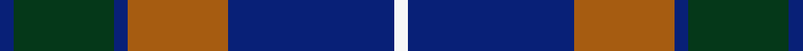

This is one **variant** — a specific cloth: this exact thread count and colourway, with its own
provenance below. It is one weaving of the [sett](/tartans/d/do/donnolly/) (the scale-free proportion — the
same cloth at any scale or shade), whose colour order is pattern [BGBRBW](/stripes/bgbrbw/).

Part of the [Donnolly](/tartans/d/do/donnolly/) tartan — the named design grouping this sett with its other cloths.

Sourced from register-of-tartans.  It is a [6 stripe tartan](/stripes/stripes6/).

Original link [https://www.tartanregister.gov.uk/tartanDetails.aspx?ref=951](https://www.tartanregister.gov.uk/tartanDetails.aspx?ref=951)

2 attestations — the source records this cloth was collapsed from (oldest owns this page)

<ul>
<li>01/01/2003 — Donnolly (register-of-tartans, <a href="https://www.tartanregister.gov.uk/tartanDetails.aspx?ref=951">record</a>)  <em>One of a series of Irish name tartans designed by Scotch Corner of Gateshead, England.</em></li>
<li>2003 — Donnolly (Fashion) (tartans-authority, <a href="https://web.archive.org/web/*/http://www.tartansauthority.com/tartan-ferret/display/6034/*">record</a>)  <em>Thought to be one of Scotch Corner's many Irish tartan inventions. Lochcarron swatch.</em></li>
</ul>

Dataset <small>— provenance for this record, inherited from the source manifest</small>

<dl class="dataset-prov">
<dt>source</dt><dd><a href="/sources/register-of-tartans/">Scottish Register of Tartans</a></dd>
<dt>data captured from</dt><dd><a href="https://github.com/thetartan/tartan-database/blob/master/data/register-of-tartans/data.csv">https://github.com/thetartan/tartan-database/blob/master/data/register-of-tartans/data.csv</a></dd>
<dt>data date</dt><dd>2003 <small>(this record)</small></dd>
<dt>licence</dt><dd><a href="https://www.tartanregister.gov.uk/copyright">Crown copyright</a></dd>
</dl>

Capture chain <small>— the hands this data passed through, oldest first; each capture carries its own licence</small>

<ol class="capture-chain">
<li><a href="https://www.tartanregister.gov.uk/">Scottish Register of Tartans</a> · <a href="https://www.tartanregister.gov.uk/copyright">Crown copyright</a> <small>the living register — still published by National Records of Scotland</small></li>
<li><a href="https://github.com/thetartan/tartan-database">thetartan/tartan-database</a> <small>2016-2017</small> · <a href="https://creativecommons.org/licenses/by-nc-nd/4.0/">CC BY-NC-ND 4.0</a> <small>Levko Kravets's frozen compilation — the capture we vendored, and where its CC licence text came from</small></li>
<li>this dictionary <small>captured 2026-06-10 · commit 5bf86c7566</small> <small>each re-capture is a git commit to data/sources</small></li>
</ol>

## Register references

External register numbers recorded for this tartan.

- Scottish Register of Tartans: [951](https://www.tartanregister.gov.uk/tartanDetails.aspx?ref=951)
- Scottish Tartans Authority (ITI): 6034

## Thread count
DB/6 DG42 DB6 O42 DB70 W/6

One full sett is **332 threads**.

## Palette
<table><thead><tr><th>Colour</th><th>Shade</th><th>OKLCh</th></tr></thead><tbody><tr><td>DB</td><td><code style="background-color:#082077;">#082077</code> <small style="color:#888">#082077</small></td><td><small style="color:#888">oklch(30.0% 0.149 265.1)</small></td></tr><tr><td>O</td><td><code style="background-color:#A65C11;">#A65C11</code> <small style="color:#888">#A65C11</small></td><td><small style="color:#888">oklch(55.0% 0.125 58.3)</small></td></tr><tr><td>DG</td><td><code style="background-color:#053819;">#053819</code> <small style="color:#888">#053819</small></td><td><small style="color:#888">oklch(30.0% 0.075 151.3)</small></td></tr><tr><td>W</td><td><code style="background-color:#F7F7F7;">#F7F7F7</code> <small style="color:#888">#F7F7F7</small></td><td><small style="color:#888">oklch(97.6% 0.000 89.9)</small></td></tr></tbody></table>

# Sample pattern

[Sample sheet (PDF)](swatch.pdf) — the woven sample, thread count and palette on one printable A4, rendered on demand (the same sheet the TTD print page downloads).

## Nearest tartan variants

The nearest existing variants by ΔTartan distance, with this cloth at the top so the swatches line up against it.

ΔTartan

Threads

Variant

Sett

—

332

<a href="/variants/s6/db3dg21db3o21db35w3~x2/">Donnolly</a>

<a href="/ttd/edit/#slug=r5t25w5t3dg25t3~x2&amp;base=db3dg21db3o21db35w3~x2" title="compare in the TTD">1.51</a>

248

<a href="/variants/s6/r5t25w5t3dg25t3~x2/">Thayer USA</a>

<a href="/ttd/edit/#slug=r5db25w5db3g25db3~x2&amp;base=db3dg21db3o21db35w3~x2" title="compare in the TTD">1.51</a>

248

<a href="/variants/s6/r5db25w5db3g25db3~x2/">Thayer USA (Name)</a>

<a href="/ttd/edit/#slug=db13g8r5db3g2r1y1~x4&amp;base=db3dg21db3o21db35w3~x2" title="compare in the TTD">1.76</a>

208

<a href="/variants/s7/db13g8r5db3g2r1y1~x4/">Fibonacci7</a>

<a href="/ttd/edit/#slug=db14g21db4r21db14y2~x2&amp;base=db3dg21db3o21db35w3~x2" title="compare in the TTD">1.91</a>

272

<a href="/variants/s6/db14g21db4r21db14y2~x2/">Kilgour</a>

<a href="/ttd/edit/#slug=db6r3g26db26w4db26r5g5~x2&amp;base=db3dg21db3o21db35w3~x2" title="compare in the TTD">2.19</a>

382

<a href="/variants/s8/db6r3g26db26w4db26r5g5~x2/">MacHardy, Blue</a>

<a href="/ttd/edit/#slug=db1r1g6db6y1db6r1g1~x2&amp;base=db3dg21db3o21db35w3~x2" title="compare in the TTD">2.53</a>

88

<a href="/variants/s8/db1r1g6db6y1db6r1g1~x2/">MacHardy</a>

<a href="/ttd/edit/#slug=g3r12dg12g5r2db30g2r2~x2&amp;base=db3dg21db3o21db35w3~x2" title="compare in the TTD">2.54</a>

262

<a href="/variants/s8/g3r12dg12g5r2db30g2r2~x2/">Rannoch Moor (Fashion)</a>

<a href="/ttd/edit/#slug=dg4db12r3db12dg32w4~x2&amp;base=db3dg21db3o21db35w3~x2" title="compare in the TTD">2.55</a>

252

<a href="/variants/s6/dg4db12r3db12dg32w4~x2/">MacIntyre</a>

<a href="/ttd/edit/#slug=dg5t2dg9db19r9ly2~x2&amp;base=db3dg21db3o21db35w3~x2" title="compare in the TTD">2.59</a>

170

<a href="/variants/s6/dg5t2dg9db19r9ly2~x2/">Lyle and Scott</a>

<a href="/ttd/edit/#slug=b36w4b4w4b16dg64r9b6~x2&amp;base=db3dg21db3o21db35w3~x2" title="compare in the TTD">2.62</a>

488

<a href="/variants/s8/b36w4b4w4b16dg64r9b6~x2/">Colvin</a>

## Neighbour map

Every grey dot is one of 13662 variants placed by the first two principal components of the ΔTartan feature space (42% of its variance). Red is this tartan; blue dots are its nearest — click one to open its page. The map is a flat projection of a many-dimensional space — [how to read it](/posts/neighbourhood-maps/).

<svg viewBox="0 0 640 380" role="img" style="max-width:100%;height:auto;border:1px solid #e0e0e0;border-radius:4px;display:block" xmlns="http://www.w3.org/2000/svg"><image href="/nn/cloud.v1.png" width="640" height="380"/><a href="/variants/s6/r5t25w5t3dg25t3~x2/"><circle cx="268.5" cy="224.3" r="4" fill="#3465a4"><title>Thayer USA</title></circle></a><a href="/variants/s6/r5db25w5db3g25db3~x2/"><circle cx="247.8" cy="216.5" r="4" fill="#3465a4"><title>Thayer USA (Name)</title></circle></a><a href="/variants/s7/db13g8r5db3g2r1y1~x4/"><circle cx="273.3" cy="197.4" r="4" fill="#3465a4"><title>Fibonacci7</title></circle></a><a href="/variants/s6/db14g21db4r21db14y2~x2/"><circle cx="221.1" cy="239.1" r="4" fill="#3465a4"><title>Kilgour</title></circle></a><a href="/variants/s8/db6r3g26db26w4db26r5g5~x2/"><circle cx="294.6" cy="207.9" r="4" fill="#3465a4"><title>MacHardy, Blue</title></circle></a><a href="/variants/s8/db1r1g6db6y1db6r1g1~x2/"><circle cx="295.4" cy="225.1" r="4" fill="#3465a4"><title>MacHardy</title></circle></a><a href="/variants/s8/g3r12dg12g5r2db30g2r2~x2/"><circle cx="262.9" cy="173.6" r="4" fill="#3465a4"><title>Rannoch Moor (Fashion)</title></circle></a><a href="/variants/s6/dg4db12r3db12dg32w4~x2/"><circle cx="328.4" cy="216.7" r="4" fill="#3465a4"><title>MacIntyre</title></circle></a><a href="/variants/s6/dg5t2dg9db19r9ly2~x2/"><circle cx="219.2" cy="216.8" r="4" fill="#3465a4"><title>Lyle and Scott</title></circle></a><a href="/variants/s8/b36w4b4w4b16dg64r9b6~x2/"><circle cx="294.0" cy="169.3" r="4" fill="#3465a4"><title>Colvin</title></circle></a><circle cx="285.8" cy="215.9" r="5" fill="#c00000"/><text x="320" y="376" text-anchor="middle" font-size="11" fill="#999">ground</text><text x="11" y="190" text-anchor="middle" font-size="11" fill="#999" transform="rotate(-90 11 190)">complexity</text></svg>

ID: /variants/s6/db3dg21db3o21db35w3~x2/
