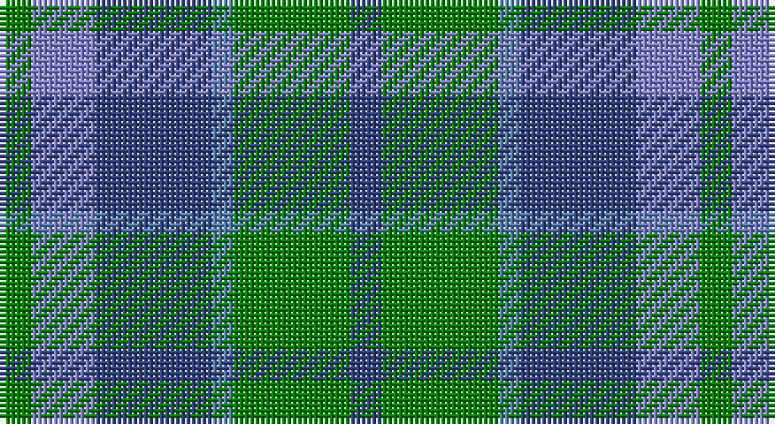

This page is one **sett** — a single exact thread-count. It belongs to the [tartan](/setts/db3g11t2db11b6g3/)
(the same proportion at any scale), whose colour order is pattern [BGBBBG](/stripes/bgbbbg/).

Sourced from weddslist.  It is a [6 stripe tartan](/stripes/stripes6/).

Original link http://www.weddslist.com/cgi-bin/tartans/pg.pl?source=sts

## Thread count
G/6 B12 Ba22 Bb4 G22 Ba/6

One full sett is **132 threads**.

## Palette

Palette: <strong>custom</strong>
<table><thead><tr><th>Colour</th><th>Threads</th><th>Shade</th><th>Base</th><th>OKLCh</th></tr></thead><tbody><tr><td>G/</td><td style="text-align:right;font-variant-numeric:tabular-nums">6</td><td><code style="background-color:#008000;">#008000</code> <small style="color:#888">#008000</small></td><td>G <code style="background-color:#006100;">#006100</code></td><td><small style="color:#888">oklch(52.0% 0.177 142.5)</small></td></tr><tr><td>B</td><td style="text-align:right;font-variant-numeric:tabular-nums">12</td><td><code style="background-color:#8080D0;">#8080D0</code> <small style="color:#888">#8080D0</small></td><td>B <code style="background-color:#2A418A;">#2A418A</code></td><td><small style="color:#888">oklch(63.4% 0.119 282.5)</small></td></tr><tr><td>Ba</td><td style="text-align:right;font-variant-numeric:tabular-nums">22</td><td><code style="background-color:#304080;">#304080</code> <small style="color:#888">#304080</small></td><td>B <code style="background-color:#2A418A;">#2A418A</code></td><td><small style="color:#888">oklch(39.4% 0.109 270.2)</small></td></tr><tr><td>Bb</td><td style="text-align:right;font-variant-numeric:tabular-nums">4</td><td><code style="background-color:#5480B0;">#5480B0</code> <small style="color:#888">#5480B0</small></td><td>B <code style="background-color:#2A418A;">#2A418A</code></td><td><small style="color:#888">oklch(58.8% 0.089 251.5)</small></td></tr><tr><td>G</td><td style="text-align:right;font-variant-numeric:tabular-nums">22</td><td><code style="background-color:#008000;">#008000</code> <small style="color:#888">#008000</small></td><td>G <code style="background-color:#006100;">#006100</code></td><td><small style="color:#888">oklch(52.0% 0.177 142.5)</small></td></tr><tr><td>Ba/</td><td style="text-align:right;font-variant-numeric:tabular-nums">6</td><td><code style="background-color:#304080;">#304080</code> <small style="color:#888">#304080</small></td><td>B <code style="background-color:#2A418A;">#2A418A</code></td><td><small style="color:#888">oklch(39.4% 0.109 270.2)</small></td></tr></tbody></table>

# Sample pattern

## Nearest tartans

The nearest existing variants by ΔTartan distance, with this tartan at the top so the swatches line up against it.

ΔTartan

Tartan

Sett

—

<a href="/ttd/edit/#slug=db3g11t2db11b6g3~x2">Unnamed, No 29</a> <a class="nn-out" href="/variants/s6/db3g11t2db11b6g3~x2/" title="open its dictionary page">↗</a>

0.95

<a href="/ttd/edit/#slug=dg3b6db11t2dg11db3~x2&amp;base=db3g11t2db11b6g3~x2">Unidentified No 29</a> <a class="nn-out" href="/variants/s6/dg3b6db11t2dg11db3~x2/" title="open its dictionary page">↗</a>

1.02

<a href="/ttd/edit/#slug=o1b7k4b1g7b1~x4&amp;base=db3g11t2db11b6g3~x2">Flower of Scotland Commemorative Tartan</a> <a class="nn-out" href="/variants/s6/o1b7k4b1g7b1~x4/" title="open its dictionary page">↗</a>

1.02

<a href="/ttd/edit/#slug=o1b7k4b1g7b1~x2&amp;base=db3g11t2db11b6g3~x2">Flower of Scotland MINI Tartan</a> <a class="nn-out" href="/variants/s6/o1b7k4b1g7b1~x2/" title="open its dictionary page">↗</a>

1.18

<a href="/ttd/edit/#slug=g3t1db7t1g3k1~x8&amp;base=db3g11t2db11b6g3~x2">Scott Green (Sir Walter)</a> <a class="nn-out" href="/variants/s6/g3t1db7t1g3k1~x8/" title="open its dictionary page">↗</a>

1.28

<a href="/ttd/edit/#slug=b25g25k6dt10r6~x2&amp;base=db3g11t2db11b6g3~x2">Breon (Personal)</a> <a class="nn-out" href="/variants/s5/b25g25k6dt10r6~x2/" title="open its dictionary page">↗</a>

1.32

<a href="/ttd/edit/#slug=r3b25k16b3g25b3~x2&amp;base=db3g11t2db11b6g3~x2">Flower of Scotland</a> <a class="nn-out" href="/variants/s6/r3b25k16b3g25b3~x2/" title="open its dictionary page">↗</a>

1.33

<a href="/ttd/edit/#slug=n4g18n3k17n18p4~x2&amp;base=db3g11t2db11b6g3~x2">Scottish Airports</a> <a class="nn-out" href="/variants/s6/n4g18n3k17n18p4~x2/" title="open its dictionary page">↗</a>

1.38

<a href="/ttd/edit/#slug=r1dr7g7db7g7db7r1~x4&amp;base=db3g11t2db11b6g3~x2">Tennant</a> <a class="nn-out" href="/variants/s7/r1dr7g7db7g7db7r1~x4/" title="open its dictionary page">↗</a>

1.39

<a href="/ttd/edit/#slug=g21k14g9db21k3db12dp3~x2&amp;base=db3g11t2db11b6g3~x2">Scotsman</a> <a class="nn-out" href="/variants/s7/g21k14g9db21k3db12dp3~x2/" title="open its dictionary page">↗</a>

1.40

<a href="/ttd/edit/#slug=t6db6g6r1~x2&amp;base=db3g11t2db11b6g3~x2">Norwich No.040</a> <a class="nn-out" href="/variants/s4/t6db6g6r1~x2/" title="open its dictionary page">↗</a>

## Neighbour map

Every grey dot is one of 14360 variants placed by the first two principal components of the ΔTartan feature space (44% of its variance). Red is this tartan; blue dots are its nearest — click one to open its page.

<svg viewBox="0 0 640 380" role="img" style="max-width:100%;height:auto;border:1px solid #e0e0e0;border-radius:4px;display:block" xmlns="http://www.w3.org/2000/svg"><image href="/nn/cloud.v1.png" width="640" height="380"/><a href="/variants/s6/dg3b6db11t2dg11db3~x2/"><circle cx="212.8" cy="285.9" r="4" fill="#3465a4"><title>Unidentified No 29</title></circle></a><a href="/variants/s6/o1b7k4b1g7b1~x4/"><circle cx="238.7" cy="253.6" r="4" fill="#3465a4"><title>Flower of Scotland Commemorative Tartan</title></circle></a><a href="/variants/s6/o1b7k4b1g7b1~x2/"><circle cx="238.7" cy="253.6" r="4" fill="#3465a4"><title>Flower of Scotland MINI Tartan</title></circle></a><a href="/variants/s6/g3t1db7t1g3k1~x8/"><circle cx="249.7" cy="253.0" r="4" fill="#3465a4"><title>Scott Green (Sir Walter)</title></circle></a><a href="/variants/s5/b25g25k6dt10r6~x2/"><circle cx="137.3" cy="276.7" r="4" fill="#3465a4"><title>Breon (Personal)</title></circle></a><a href="/variants/s6/r3b25k16b3g25b3~x2/"><circle cx="210.3" cy="231.2" r="4" fill="#3465a4"><title>Flower of Scotland</title></circle></a><a href="/variants/s6/n4g18n3k17n18p4~x2/"><circle cx="211.5" cy="276.1" r="4" fill="#3465a4"><title>Scottish Airports</title></circle></a><a href="/variants/s7/r1dr7g7db7g7db7r1~x4/"><circle cx="180.0" cy="266.2" r="4" fill="#3465a4"><title>Tennant</title></circle></a><a href="/variants/s7/g21k14g9db21k3db12dp3~x2/"><circle cx="210.8" cy="270.0" r="4" fill="#3465a4"><title>Scotsman</title></circle></a><a href="/variants/s4/t6db6g6r1~x2/"><circle cx="154.5" cy="304.5" r="4" fill="#3465a4"><title>Norwich No.040</title></circle></a><circle cx="198.5" cy="274.3" r="5" fill="#c00000"/></svg>

ID: /variants/s6/db3g11t2db11b6g3~x2/
