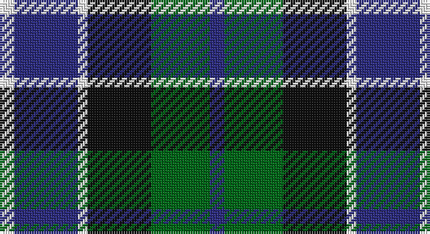

This page is one **sett** — a single exact thread-count. It belongs to the [tartan](/setts/db3g12k13w2db13w3/)
(the same proportion at any scale), whose colour order is pattern [BGKWBW](/stripes/bgkwbw/).

Sourced from register-of-tartans.  It is a [6 stripe tartan](/stripes/stripes6/).

Original link https://www.tartanregister.gov.uk/tartanDetails.aspx?ref=1691

2 attestations — the source records this cloth was collapsed from (oldest owns this page)

<ul>
<li>01/01/1978 — Herd/Hurd (register-of-tartans, <a href="https://www.tartanregister.gov.uk/tartanDetails.aspx?ref=1691">record</a>)</li>
<li>1978 — Herd/Hurd (Name) (tartans-authority, <a href="http://www.tartansauthority.com/tartan-ferret/display/170/">record</a>)</li>
</ul>

## Register references

External register numbers recorded for this tartan.

- Scottish Register of Tartans: [1691](https://www.tartanregister.gov.uk/tartanDetails.aspx?ref=1691)
- Scottish Tartans Authority (ITI): 170
- Scottish Tartans World Register: 170

## Thread count
W/6 DBa26 W4 K26 G24 DBa/6

One full sett is **172 threads**.

## Palette

Palette: <strong>Tartan Register</strong> <small style="color:#888">(6 of 8 colours)</small>
<table><thead><tr><th>Colour</th><th>Threads</th><th>Shade</th><th>Base</th><th>OKLCh</th></tr></thead><tbody><tr><td>W/</td><td style="text-align:right;font-variant-numeric:tabular-nums">6</td><td><code style="background-color:#FCFCFC;">#FCFCFC</code> <small style="color:#888">#FCFCFC</small></td><td>W <code style="background-color:#F7F7F7;">#F7F7F7</code></td><td><small style="color:#888">oklch(99.1% 0.000 89.9)</small></td></tr><tr><td>DBa</td><td style="text-align:right;font-variant-numeric:tabular-nums">26</td><td><code style="background-color:#2C2C80;">#2C2C80</code> <small style="color:#888">#2C2C80</small></td><td>B <code style="background-color:#2A418A;">#2A418A</code></td><td><small style="color:#888">oklch(35.0% 0.138 276.6)</small></td></tr><tr><td>W</td><td style="text-align:right;font-variant-numeric:tabular-nums">4</td><td><code style="background-color:#FCFCFC;">#FCFCFC</code> <small style="color:#888">#FCFCFC</small></td><td>W <code style="background-color:#F7F7F7;">#F7F7F7</code></td><td><small style="color:#888">oklch(99.1% 0.000 89.9)</small></td></tr><tr><td>K</td><td style="text-align:right;font-variant-numeric:tabular-nums">26</td><td><code style="background-color:#101010;">#101010</code> <small style="color:#888">#101010</small></td><td>K <code style="background-color:#000000;">#000000</code></td><td><small style="color:#888">oklch(17.3% 0.000 89.9)</small></td></tr><tr><td>G</td><td style="text-align:right;font-variant-numeric:tabular-nums">24</td><td><code style="background-color:#006818;">#006818</code> <small style="color:#888">#006818</small></td><td>G <code style="background-color:#006100;">#006100</code></td><td><small style="color:#888">oklch(45.0% 0.142 145.0)</small></td></tr><tr><td>DBa/</td><td style="text-align:right;font-variant-numeric:tabular-nums">6</td><td><code style="background-color:#2C2C80;">#2C2C80</code> <small style="color:#888">#2C2C80</small></td><td>B <code style="background-color:#2A418A;">#2A418A</code></td><td><small style="color:#888">oklch(35.0% 0.138 276.6)</small></td></tr></tbody></table>

# Sample pattern

## Nearest tartans

The nearest existing variants by ΔTartan distance, with this tartan at the top so the swatches line up against it.

ΔTartan

Tartan

Sett

—

<a href="/ttd/edit/#slug=db3g12k13w2db13w3~x2">Herd/Hurd</a> <a class="nn-out" href="/variants/s6/db3g12k13w2db13w3~x2/" title="open its dictionary page">↗</a>

0.77

<a href="/ttd/edit/#slug=k1db8r6g8k1~x4&amp;base=db3g12k13w2db13w3~x2">Edinburgh Tattoo 50th (Commemorative</a> <a class="nn-out" href="/variants/s5/k1db8r6g8k1~x4/" title="open its dictionary page">↗</a>

0.78

<a href="/ttd/edit/#slug=w4db4dg22k20db20w3&amp;base=db3g12k13w2db13w3~x2">Unidentified No 26</a> <a class="nn-out" href="/variants/s6/w4db4dg22k20db20w3/" title="open its dictionary page">↗</a>

0.81

<a href="/ttd/edit/#slug=w4db4g22k20db20w3&amp;base=db3g12k13w2db13w3~x2">Unnamed, No 26</a> <a class="nn-out" href="/variants/s6/w4db4g22k20db20w3/" title="open its dictionary page">↗</a>

0.86

<a href="/ttd/edit/#slug=db2k2db12k8g11r2~x2&amp;base=db3g12k13w2db13w3~x2">Murray</a> <a class="nn-out" href="/variants/s6/db2k2db12k8g11r2~x2/" title="open its dictionary page">↗</a>

0.90

<a href="/ttd/edit/#slug=db2k2db12k11g12w2~x2&amp;base=db3g12k13w2db13w3~x2">Campbell, The White Stripe</a> <a class="nn-out" href="/variants/s6/db2k2db12k11g12w2~x2/" title="open its dictionary page">↗</a>

0.90

<a href="/ttd/edit/#slug=k4w2g13k13t12k2~x2&amp;base=db3g12k13w2db13w3~x2">Melville</a> <a class="nn-out" href="/variants/s6/k4w2g13k13t12k2~x2/" title="open its dictionary page">↗</a>

0.91

<a href="/ttd/edit/#slug=k4lb2dg8db8lb1&amp;base=db3g12k13w2db13w3~x2">Douglas Green</a> <a class="nn-out" href="/variants/s5/k4lb2dg8db8lb1/" title="open its dictionary page">↗</a>

0.92

<a href="/ttd/edit/#slug=db6k1db6k8r1g8r2~x2&amp;base=db3g12k13w2db13w3~x2">Fletcher of Dunans</a> <a class="nn-out" href="/variants/s7/db6k1db6k8r1g8r2~x2/" title="open its dictionary page">↗</a>

0.93

<a href="/ttd/edit/#slug=t3g6k6t4r1t1~x2&amp;base=db3g12k13w2db13w3~x2">Wellington, or Waterloo</a> <a class="nn-out" href="/variants/s6/t3g6k6t4r1t1~x2/" title="open its dictionary page">↗</a>

0.95

<a href="/ttd/edit/#slug=t3g12k14t11r3t3~x2&amp;base=db3g12k13w2db13w3~x2">Wellington, or Waterloo</a> <a class="nn-out" href="/variants/s6/t3g12k14t11r3t3~x2/" title="open its dictionary page">↗</a>

## Neighbour map

Every grey dot is one of 14360 variants placed by the first two principal components of the ΔTartan feature space (44% of its variance). Red is this tartan; blue dots are its nearest — click one to open its page.

<svg viewBox="0 0 640 380" role="img" style="max-width:100%;height:auto;border:1px solid #e0e0e0;border-radius:4px;display:block" xmlns="http://www.w3.org/2000/svg"><image href="/nn/cloud.v1.png" width="640" height="380"/><a href="/variants/s5/k1db8r6g8k1~x4/"><circle cx="142.3" cy="233.7" r="4" fill="#3465a4"><title>Edinburgh Tattoo 50th (Commemorative</title></circle></a><a href="/variants/s6/w4db4dg22k20db20w3/"><circle cx="150.1" cy="240.9" r="4" fill="#3465a4"><title>Unidentified No 26</title></circle></a><a href="/variants/s6/w4db4g22k20db20w3/"><circle cx="118.1" cy="225.8" r="4" fill="#3465a4"><title>Unnamed, No 26</title></circle></a><a href="/variants/s6/db2k2db12k8g11r2~x2/"><circle cx="152.3" cy="241.4" r="4" fill="#3465a4"><title>Murray</title></circle></a><a href="/variants/s6/db2k2db12k11g12w2~x2/"><circle cx="129.6" cy="237.4" r="4" fill="#3465a4"><title>Campbell, The White Stripe</title></circle></a><a href="/variants/s6/k4w2g13k13t12k2~x2/"><circle cx="166.3" cy="239.3" r="4" fill="#3465a4"><title>Melville</title></circle></a><a href="/variants/s5/k4lb2dg8db8lb1/"><circle cx="135.9" cy="244.6" r="4" fill="#3465a4"><title>Douglas Green</title></circle></a><a href="/variants/s7/db6k1db6k8r1g8r2~x2/"><circle cx="147.1" cy="229.0" r="4" fill="#3465a4"><title>Fletcher of Dunans</title></circle></a><a href="/variants/s6/t3g6k6t4r1t1~x2/"><circle cx="128.4" cy="245.2" r="4" fill="#3465a4"><title>Wellington, or Waterloo</title></circle></a><a href="/variants/s6/t3g12k14t11r3t3~x2/"><circle cx="115.5" cy="249.6" r="4" fill="#3465a4"><title>Wellington, or Waterloo</title></circle></a><circle cx="126.2" cy="237.8" r="5" fill="#c00000"/></svg>

ID: /variants/s6/db3g12k13w2db13w3~x2/
