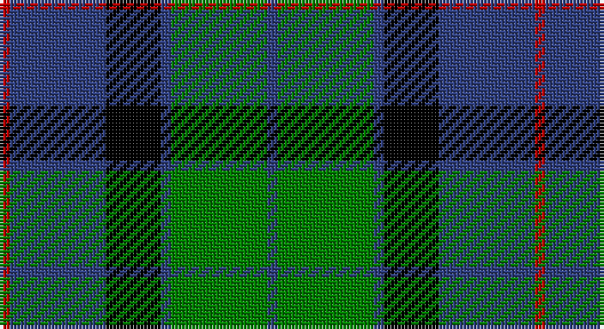

This page is one **sett** — a single exact thread-count. It belongs to the [tartan](/setts/db3g28db3k16db28r3/)
(the same proportion at any scale), whose colour order is pattern [BGBKBR](/stripes/bgbkbr/).

Part of the [Flower of Scotland](/tartans/flower-of-scotland/) tartan — the named design grouping this sett with its other cloths.

Sourced from weddslist.  It is a [6 stripe tartan](/stripes/stripes6/).

Original link http://www.weddslist.com/cgi-bin/tartans/pg.pl?source=sts

## Thread count
R/3 B28 K16 B3 G28 B/3

One full sett is **156 threads**.

## Palette

Palette: <strong>Ingles Buchan</strong> <small style="color:#888">(1 of 4 colours)</small>
<table><thead><tr><th>Colour</th><th>Threads</th><th>Shade</th><th>Base</th><th>OKLCh</th></tr></thead><tbody><tr><td>R/</td><td style="text-align:right;font-variant-numeric:tabular-nums">3</td><td><code style="background-color:#C00000;">#C00000</code> <small style="color:#888">#C00000</small></td><td>R <code style="background-color:#CC0000;">#CC0000</code></td><td><small style="color:#888">oklch(50.7% 0.208 29.2)</small></td></tr><tr><td>B</td><td style="text-align:right;font-variant-numeric:tabular-nums">28</td><td><code style="background-color:#304080;">#304080</code> <small style="color:#888">#304080</small></td><td>B <code style="background-color:#2A418A;">#2A418A</code></td><td><small style="color:#888">oklch(39.4% 0.109 270.2)</small></td></tr><tr><td>K</td><td style="text-align:right;font-variant-numeric:tabular-nums">16</td><td><code style="background-color:#000000;">#000000</code> <small style="color:#888">#000000</small></td><td>K <code style="background-color:#000000;">#000000</code></td><td><small style="color:#888">oklch(0.0% 0.000 0.0)</small></td></tr><tr><td>B</td><td style="text-align:right;font-variant-numeric:tabular-nums">3</td><td><code style="background-color:#304080;">#304080</code> <small style="color:#888">#304080</small></td><td>B <code style="background-color:#2A418A;">#2A418A</code></td><td><small style="color:#888">oklch(39.4% 0.109 270.2)</small></td></tr><tr><td>G</td><td style="text-align:right;font-variant-numeric:tabular-nums">28</td><td><code style="background-color:#008000;">#008000</code> <small style="color:#888">#008000</small></td><td>G <code style="background-color:#006100;">#006100</code></td><td><small style="color:#888">oklch(52.0% 0.177 142.5)</small></td></tr><tr><td>B/</td><td style="text-align:right;font-variant-numeric:tabular-nums">3</td><td><code style="background-color:#304080;">#304080</code> <small style="color:#888">#304080</small></td><td>B <code style="background-color:#2A418A;">#2A418A</code></td><td><small style="color:#888">oklch(39.4% 0.109 270.2)</small></td></tr></tbody></table>

# Sample pattern

## Compared to the master

This cloth is one sett of its design; the master sett (the exemplar the design is anchored on) is below for comparison.

<figure style="margin:0"><figcaption style="color:#888;font-size:smaller">this sett</figcaption></figure>
<figure style="margin:0"><figcaption style="color:#888;font-size:smaller"><a href="/setts/r3b25k16b3g25b3/">master sett →</a></figcaption></figure>

## Nearest tartans

The nearest existing variants by ΔTartan distance, with this tartan at the top so the swatches line up against it.

ΔTartan

Tartan

Sett

—

<a href="/ttd/edit/#slug=db3g28db3k16db28r3">Flower of Scotland</a> <a class="nn-out" href="/variants/s6/db3g28db3k16db28r3/" title="open its dictionary page">↗</a>

0.75

<a href="/ttd/edit/#slug=db3r1db10k8g10r1g3~x4&amp;base=db3g28db3k16db28r3">Blair</a> <a class="nn-out" href="/variants/s7/db3r1db10k8g10r1g3~x4/" title="open its dictionary page">↗</a>

0.79

<a href="/ttd/edit/#slug=r1g8k8r1k8t8r1~x4&amp;base=db3g28db3k16db28r3">Triad Highland Games Proposed</a> <a class="nn-out" href="/variants/s7/r1g8k8r1k8t8r1~x4/" title="open its dictionary page">↗</a>

0.90

<a href="/ttd/edit/#slug=db10k1db1k1db2k8g10w1~x2&amp;base=db3g28db3k16db28r3">Lamont</a> <a class="nn-out" href="/variants/s8/db10k1db1k1db2k8g10w1~x2/" title="open its dictionary page">↗</a>

0.91

<a href="/ttd/edit/#slug=r2g12k12g1db12g1~x2&amp;base=db3g28db3k16db28r3">Gunn</a> <a class="nn-out" href="/variants/s6/r2g12k12g1db12g1~x2/" title="open its dictionary page">↗</a>

0.92

<a href="/ttd/edit/#slug=k3b4g20k20g3lo3~x4&amp;base=db3g28db3k16db28r3">Michaluk (Personal)</a> <a class="nn-out" href="/variants/s6/k3b4g20k20g3lo3~x4/" title="open its dictionary page">↗</a>

0.92

<a href="/ttd/edit/#slug=t1db11k11g11k2t1~x2&amp;base=db3g28db3k16db28r3">Unnamed, No 59</a> <a class="nn-out" href="/variants/s6/t1db11k11g11k2t1~x2/" title="open its dictionary page">↗</a>

0.92

<a href="/ttd/edit/#slug=g18t2g4k14db12k3~x2&amp;base=db3g28db3k16db28r3">Graham of Menteith</a> <a class="nn-out" href="/variants/s6/g18t2g4k14db12k3~x2/" title="open its dictionary page">↗</a>

0.93

<a href="/ttd/edit/#slug=k2lb2dg8db8lb1&amp;base=db3g28db3k16db28r3">Douglas</a> <a class="nn-out" href="/variants/s5/k2lb2dg8db8lb1/" title="open its dictionary page">↗</a>

0.97

<a href="/ttd/edit/#slug=g14db2g2k8p9k2~x2&amp;base=db3g28db3k16db28r3">MacArthur of Milton, hunting</a> <a class="nn-out" href="/variants/s6/g14db2g2k8p9k2~x2/" title="open its dictionary page">↗</a>

0.97

<a href="/ttd/edit/#slug=k2dg9t1k6b4dg2~x2&amp;base=db3g28db3k16db28r3">Unidentified #28</a> <a class="nn-out" href="/variants/s6/k2dg9t1k6b4dg2~x2/" title="open its dictionary page">↗</a>

## Neighbour map

Every grey dot is one of 14360 variants placed by the first two principal components of the ΔTartan feature space (44% of its variance). Red is this tartan; blue dots are its nearest — click one to open its page.

<svg viewBox="0 0 640 380" role="img" style="max-width:100%;height:auto;border:1px solid #e0e0e0;border-radius:4px;display:block" xmlns="http://www.w3.org/2000/svg"><image href="/nn/cloud.v1.png" width="640" height="380"/><a href="/variants/s7/db3r1db10k8g10r1g3~x4/"><circle cx="167.2" cy="214.6" r="4" fill="#3465a4"><title>Blair</title></circle></a><a href="/variants/s7/r1g8k8r1k8t8r1~x4/"><circle cx="194.7" cy="226.6" r="4" fill="#3465a4"><title>Triad Highland Games Proposed</title></circle></a><a href="/variants/s8/db10k1db1k1db2k8g10w1~x2/"><circle cx="184.5" cy="190.6" r="4" fill="#3465a4"><title>Lamont</title></circle></a><a href="/variants/s6/r2g12k12g1db12g1~x2/"><circle cx="173.0" cy="207.2" r="4" fill="#3465a4"><title>Gunn</title></circle></a><a href="/variants/s6/k3b4g20k20g3lo3~x4/"><circle cx="233.7" cy="228.3" r="4" fill="#3465a4"><title>Michaluk (Personal)</title></circle></a><a href="/variants/s6/t1db11k11g11k2t1~x2/"><circle cx="167.5" cy="213.6" r="4" fill="#3465a4"><title>Unnamed, No 59</title></circle></a><a href="/variants/s6/g18t2g4k14db12k3~x2/"><circle cx="177.6" cy="229.2" r="4" fill="#3465a4"><title>Graham of Menteith</title></circle></a><a href="/variants/s5/k2lb2dg8db8lb1/"><circle cx="168.0" cy="234.7" r="4" fill="#3465a4"><title>Douglas</title></circle></a><a href="/variants/s6/g14db2g2k8p9k2~x2/"><circle cx="177.6" cy="225.8" r="4" fill="#3465a4"><title>MacArthur of Milton, hunting</title></circle></a><a href="/variants/s6/k2dg9t1k6b4dg2~x2/"><circle cx="229.2" cy="243.7" r="4" fill="#3465a4"><title>Unidentified #28</title></circle></a><circle cx="206.9" cy="217.2" r="5" fill="#c00000"/></svg>

ID: /variants/s6/db3g28db3k16db28r3/
