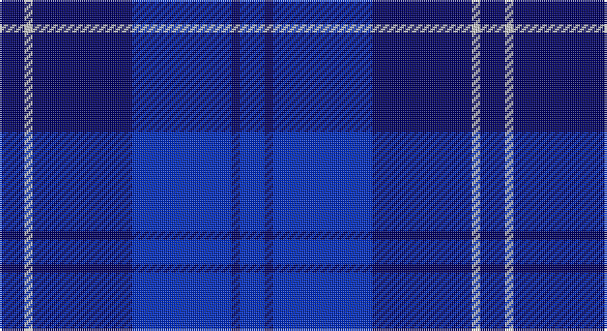

This page is one **sett** — a single exact thread-count. It belongs to the [tartan](/setts/db3lb1db12dbi12db1dbi3/)
(the same proportion at any scale), whose colour order is pattern [BBBBWB](/stripes/bbbbwb/).

Part of the [Erskine](/tartans/erskine/) tartan — the named design grouping this sett with its other cloths.

Sourced from tartans-authority.  It is a [6 stripe tartan](/stripes/stripes6/).

Original link http://www.tartansauthority.com/tartan-ferret/display/4821/

## Also known as

This cloth is also recorded under:

- Erskine Blue
- Erskine Green
- Erskine Hunting
- Erskine Purple
- Erskine Red Dress
- Erskine Royal Blue Dress
- Erskine,
- Erskine, Black & Red
- Erskine, Blue
- Erskine, Burgundy
- Erskine, Green
- Erskine, Grey
- Erskine, Purple
- Erskine, dress
- Erskine, hunting
- Royal Scots Fusiliers

## Register references

External register numbers recorded for this tartan.

- Scottish Tartans Authority (ITI): 4821

## Thread count
DB/12 N4 DB48 B48 DB4 B/12

One full sett is **232 threads**.

## Palette

Palette: <strong>Tartan Register</strong> <small style="color:#888">(2 of 3 colours)</small>
<table><thead><tr><th>Colour</th><th>Threads</th><th>Shade</th><th>Base</th><th>OKLCh</th></tr></thead><tbody><tr><td>DB/</td><td style="text-align:right;font-variant-numeric:tabular-nums">12</td><td><code style="background-color:#000064;">#000064</code> <small style="color:#888">#000064</small></td><td>B <code style="background-color:#2A418A;">#2A418A</code></td><td><small style="color:#888">oklch(22.7% 0.158 264.1)</small></td></tr><tr><td>N</td><td style="text-align:right;font-variant-numeric:tabular-nums">4</td><td><code style="background-color:#C8C8C8;">#C8C8C8</code> <small style="color:#888">#C8C8C8</small></td><td>W <code style="background-color:#F7F7F7;">#F7F7F7</code></td><td><small style="color:#888">oklch(83.3% 0.000 89.9)</small></td></tr><tr><td>DB</td><td style="text-align:right;font-variant-numeric:tabular-nums">48</td><td><code style="background-color:#000064;">#000064</code> <small style="color:#888">#000064</small></td><td>B <code style="background-color:#2A418A;">#2A418A</code></td><td><small style="color:#888">oklch(22.7% 0.158 264.1)</small></td></tr><tr><td>B</td><td style="text-align:right;font-variant-numeric:tabular-nums">48</td><td><code style="background-color:#002CC0;">#002CC0</code> <small style="color:#888">#002CC0</small></td><td>B <code style="background-color:#2A418A;">#2A418A</code></td><td><small style="color:#888">oklch(40.2% 0.228 263.9)</small></td></tr><tr><td>DB</td><td style="text-align:right;font-variant-numeric:tabular-nums">4</td><td><code style="background-color:#000064;">#000064</code> <small style="color:#888">#000064</small></td><td>B <code style="background-color:#2A418A;">#2A418A</code></td><td><small style="color:#888">oklch(22.7% 0.158 264.1)</small></td></tr><tr><td>B/</td><td style="text-align:right;font-variant-numeric:tabular-nums">12</td><td><code style="background-color:#002CC0;">#002CC0</code> <small style="color:#888">#002CC0</small></td><td>B <code style="background-color:#2A418A;">#2A418A</code></td><td><small style="color:#888">oklch(40.2% 0.228 263.9)</small></td></tr></tbody></table>

# Sample pattern

## Compared to the master

This cloth is one sett of its design; the master sett (the exemplar the design is anchored on) is below for comparison.

<figure style="margin:0"><figcaption style="color:#888;font-size:smaller">this sett</figcaption></figure>
<figure style="margin:0"><figcaption style="color:#888;font-size:smaller"><a href="/setts/g6r1g24r28g1r4/">master sett →</a></figcaption></figure>

## Nearest tartans

The nearest existing variants by ΔTartan distance, with this tartan at the top so the swatches line up against it.

ΔTartan

Tartan

Sett

—

<a href="/ttd/edit/#slug=db3lb1db12dbi12db1dbi3~x4">Erskine Blue (Fashion)</a> <a class="nn-out" href="/variants/s6/db3lb1db12dbi12db1dbi3~x4/" title="open its dictionary page">↗</a>

1.78

<a href="/ttd/edit/#slug=dbi23db2dbi2db2dbi2db28r2db4b2~x2&amp;base=db3lb1db12dbi12db1dbi3~x4">Trotter (Personal)</a> <a class="nn-out" href="/variants/s9/dbi23db2dbi2db2dbi2db28r2db4b2~x2/" title="open its dictionary page">↗</a>

2.00

<a href="/ttd/edit/#slug=b3db1dbi16db16dbi2lb2~x4&amp;base=db3lb1db12dbi12db1dbi3~x4">U.S.S. John Paul Jones #1</a> <a class="nn-out" href="/variants/s6/b3db1dbi16db16dbi2lb2~x4/" title="open its dictionary page">↗</a>

2.09

<a href="/ttd/edit/#slug=k30db6k6db41lt2~x2&amp;base=db3lb1db12dbi12db1dbi3~x4">Williams (New York) (Personal)</a> <a class="nn-out" href="/variants/s5/k30db6k6db41lt2~x2/" title="open its dictionary page">↗</a>

2.13

<a href="/variants/s9/n1t6db4t1db16ni1db4ni6t1~x4/">Fujisankei Serene</a>

2.16

<a href="/ttd/edit/#slug=k33db8k4db35p3~x2&amp;base=db3lb1db12dbi12db1dbi3~x4">Fenston/Morris (Personal)</a> <a class="nn-out" href="/variants/s5/k33db8k4db35p3~x2/" title="open its dictionary page">↗</a>

2.18

<a href="/ttd/edit/#slug=db2b2r1b16w1db20r2~x2&amp;base=db3lb1db12dbi12db1dbi3~x4">British American School (Corporate)</a> <a class="nn-out" href="/variants/s7/db2b2r1b16w1db20r2~x2/" title="open its dictionary page">↗</a>

2.19

<a href="/ttd/edit/#slug=r2dbi35db35ly1~x2&amp;base=db3lb1db12dbi12db1dbi3~x4">Mackaw</a> <a class="nn-out" href="/variants/s4/r2dbi35db35ly1~x2/" title="open its dictionary page">↗</a>

2.21

<a href="/ttd/edit/#slug=db5w3db33k3db3k36db3~x2&amp;base=db3lb1db12dbi12db1dbi3~x4">Argentina</a> <a class="nn-out" href="/variants/s7/db5w3db33k3db3k36db3~x2/" title="open its dictionary page">↗</a>

2.35

<a href="/ttd/edit/#slug=t5db30k25t5db30dp2t5~x2&amp;base=db3lb1db12dbi12db1dbi3~x4">Van Loo (Personal)</a> <a class="nn-out" href="/variants/s7/t5db30k25t5db30dp2t5~x2/" title="open its dictionary page">↗</a>

2.35

<a href="/ttd/edit/#slug=t5db30k25t5db30dp3t5~x2&amp;base=db3lb1db12dbi12db1dbi3~x4">Van Loo Tartan</a> <a class="nn-out" href="/variants/s7/t5db30k25t5db30dp3t5~x2/" title="open its dictionary page">↗</a>

## Neighbour map

Every grey dot is one of 14360 variants placed by the first two principal components of the ΔTartan feature space (44% of its variance). Red is this tartan; blue dots are its nearest — click one to open its page.

<svg viewBox="0 0 640 380" role="img" style="max-width:100%;height:auto;border:1px solid #e0e0e0;border-radius:4px;display:block" xmlns="http://www.w3.org/2000/svg"><image href="/nn/cloud.v1.png" width="640" height="380"/><a href="/variants/s9/dbi23db2dbi2db2dbi2db28r2db4b2~x2/"><circle cx="415.4" cy="208.4" r="4" fill="#3465a4"><title>Trotter (Personal)</title></circle></a><a href="/variants/s6/b3db1dbi16db16dbi2lb2~x4/"><circle cx="302.7" cy="207.0" r="4" fill="#3465a4"><title>U.S.S. John Paul Jones #1</title></circle></a><a href="/variants/s5/k30db6k6db41lt2~x2/"><circle cx="436.3" cy="254.2" r="4" fill="#3465a4"><title>Williams (New York) (Personal)</title></circle></a><a href="/variants/s9/n1t6db4t1db16ni1db4ni6t1~x4/"><circle cx="369.0" cy="193.7" r="4" fill="#3465a4"><title>Fujisankei Serene</title></circle></a><a href="/variants/s5/k33db8k4db35p3~x2/"><circle cx="346.7" cy="251.0" r="4" fill="#3465a4"><title>Fenston/Morris (Personal)</title></circle></a><a href="/variants/s7/db2b2r1b16w1db20r2~x2/"><circle cx="394.9" cy="197.0" r="4" fill="#3465a4"><title>British American School (Corporate)</title></circle></a><a href="/variants/s4/r2dbi35db35ly1~x2/"><circle cx="417.6" cy="237.1" r="4" fill="#3465a4"><title>Mackaw</title></circle></a><a href="/variants/s7/db5w3db33k3db3k36db3~x2/"><circle cx="379.3" cy="225.0" r="4" fill="#3465a4"><title>Argentina</title></circle></a><a href="/variants/s7/t5db30k25t5db30dp2t5~x2/"><circle cx="369.8" cy="225.8" r="4" fill="#3465a4"><title>Van Loo (Personal)</title></circle></a><a href="/variants/s7/t5db30k25t5db30dp3t5~x2/"><circle cx="349.0" cy="241.2" r="4" fill="#3465a4"><title>Van Loo Tartan</title></circle></a><circle cx="389.3" cy="269.1" r="5" fill="#c00000"/></svg>

ID: /variants/s6/db3lb1db12dbi12db1dbi3~x4/
