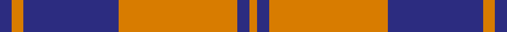
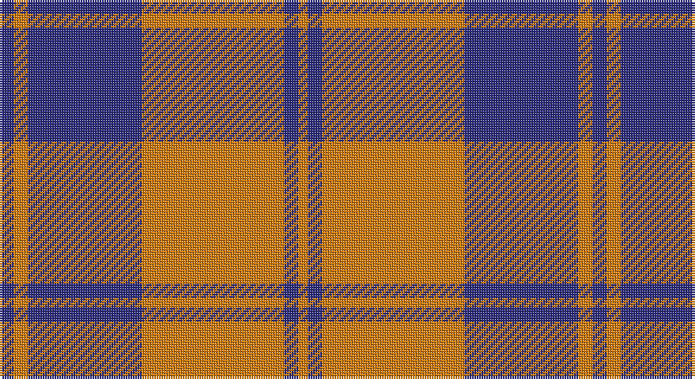

This page is one **sett** — a single exact thread-count. It belongs to the [tartan](/setts/db3lo3db24lo30db3lo2/)
(the same proportion at any scale), whose colour order is pattern [BYBYBY](/stripes/bybyby/).

Sourced from register-of-tartans.  It is a [6 stripe tartan](/stripes/stripes6/).

Original link https://www.tartanregister.gov.uk/tartanDetails.aspx?ref=128

## Register references

External register numbers recorded for this tartan.

- Scottish Register of Tartans: [128](https://www.tartanregister.gov.uk/tartanDetails.aspx?ref=128)
- Scottish Tartans Authority (ITI): 5881

## Thread count
DB/6 O6 DB48 O60 DB6 O/4

One full sett is **250 threads**.

## Palette

Palette: <strong>Tartan Register</strong>
<table><thead><tr><th>Colour</th><th>Threads</th><th>Shade</th><th>Base</th><th>OKLCh</th></tr></thead><tbody><tr><td>DB/</td><td style="text-align:right;font-variant-numeric:tabular-nums">6</td><td><code style="background-color:#2C2C80;">#2C2C80</code> <small style="color:#888">#2C2C80</small></td><td>B <code style="background-color:#2A418A;">#2A418A</code></td><td><small style="color:#888">oklch(35.0% 0.138 276.6)</small></td></tr><tr><td>O</td><td style="text-align:right;font-variant-numeric:tabular-nums">6</td><td><code style="background-color:#D87C00;">#D87C00</code> <small style="color:#888">#D87C00</small></td><td>Y <code style="background-color:#F2BF00;">#F2BF00</code></td><td><small style="color:#888">oklch(67.3% 0.155 61.8)</small></td></tr><tr><td>DB</td><td style="text-align:right;font-variant-numeric:tabular-nums">48</td><td><code style="background-color:#2C2C80;">#2C2C80</code> <small style="color:#888">#2C2C80</small></td><td>B <code style="background-color:#2A418A;">#2A418A</code></td><td><small style="color:#888">oklch(35.0% 0.138 276.6)</small></td></tr><tr><td>O</td><td style="text-align:right;font-variant-numeric:tabular-nums">60</td><td><code style="background-color:#D87C00;">#D87C00</code> <small style="color:#888">#D87C00</small></td><td>Y <code style="background-color:#F2BF00;">#F2BF00</code></td><td><small style="color:#888">oklch(67.3% 0.155 61.8)</small></td></tr><tr><td>DB</td><td style="text-align:right;font-variant-numeric:tabular-nums">6</td><td><code style="background-color:#2C2C80;">#2C2C80</code> <small style="color:#888">#2C2C80</small></td><td>B <code style="background-color:#2A418A;">#2A418A</code></td><td><small style="color:#888">oklch(35.0% 0.138 276.6)</small></td></tr><tr><td>O/</td><td style="text-align:right;font-variant-numeric:tabular-nums">4</td><td><code style="background-color:#D87C00;">#D87C00</code> <small style="color:#888">#D87C00</small></td><td>Y <code style="background-color:#F2BF00;">#F2BF00</code></td><td><small style="color:#888">oklch(67.3% 0.155 61.8)</small></td></tr></tbody></table>

# Sample pattern

## Nearest tartans

The nearest existing variants by ΔTartan distance, with this tartan at the top so the swatches line up against it.

ΔTartan

Tartan

Sett

—

<a href="/ttd/edit/#slug=db3lo3db24lo30db3lo2~x2">Auburn University (Alabama)</a> <a class="nn-out" href="/variants/s6/db3lo3db24lo30db3lo2~x2/" title="open its dictionary page">↗</a>

1.04

<a href="/ttd/edit/#slug=do44lr3do4lb3do4lr44~x2&amp;base=db3lo3db24lo30db3lo2~x2">Wcwm 1166-2</a> <a class="nn-out" href="/variants/s6/do44lr3do4lb3do4lr44~x2/" title="open its dictionary page">↗</a>

1.13

<a href="/ttd/edit/#slug=db3o3db24o30db3o2~x2&amp;base=db3lo3db24lo30db3lo2~x2">Auburn University (Alabama) (Corp)</a> <a class="nn-out" href="/variants/s6/db3o3db24o30db3o2~x2/" title="open its dictionary page">↗</a>

1.46

<a href="/ttd/edit/#slug=o72k16w9k4w5k16~x2&amp;base=db3lo3db24lo30db3lo2~x2">Machair (warp)</a> <a class="nn-out" href="/variants/s6/o72k16w9k4w5k16~x2/" title="open its dictionary page">↗</a>

1.52

<a href="/ttd/edit/#slug=n6lb2n25lb25n2lb6~x2&amp;base=db3lo3db24lo30db3lo2~x2">Erskine, Grey</a> <a class="nn-out" href="/variants/s6/n6lb2n25lb25n2lb6~x2/" title="open its dictionary page">↗</a>

1.53

<a href="/ttd/edit/#slug=r5w2r25w25r2w5~x2&amp;base=db3lo3db24lo30db3lo2~x2">Erskine Dress Burgandy Clan Tartan</a> <a class="nn-out" href="/variants/s6/r5w2r25w25r2w5~x2/" title="open its dictionary page">↗</a>

1.58

<a href="/ttd/edit/#slug=db3lo30db40r3~x2&amp;base=db3lo3db24lo30db3lo2~x2">Sanix Large Muted</a> <a class="nn-out" href="/variants/s4/db3lo30db40r3~x2/" title="open its dictionary page">↗</a>

1.59

<a href="/ttd/edit/#slug=db2r7db2r7db22ly2~x2&amp;base=db3lo3db24lo30db3lo2~x2">MacQueen variant</a> <a class="nn-out" href="/variants/s6/db2r7db2r7db22ly2~x2/" title="open its dictionary page">↗</a>

1.65

<a href="/ttd/edit/#slug=r6w3r17dt3r3dt25r3~x2&amp;base=db3lo3db24lo30db3lo2~x2">Bon Accord</a> <a class="nn-out" href="/variants/s7/r6w3r17dt3r3dt25r3~x2/" title="open its dictionary page">↗</a>

1.66

<a href="/ttd/edit/#slug=y5r3y35k28y4k11y2~x2&amp;base=db3lo3db24lo30db3lo2~x2">Korner-Macpherson (Personal)</a> <a class="nn-out" href="/variants/s7/y5r3y35k28y4k11y2~x2/" title="open its dictionary page">↗</a>

1.66

<a href="/variants/s6/r28k4w2k13~x2/">Dunbar Ancient</a>

## Neighbour map

Every grey dot is one of 14360 variants placed by the first two principal components of the ΔTartan feature space (44% of its variance). Red is this tartan; blue dots are its nearest — click one to open its page.

<svg viewBox="0 0 640 380" role="img" style="max-width:100%;height:auto;border:1px solid #e0e0e0;border-radius:4px;display:block" xmlns="http://www.w3.org/2000/svg"><image href="/nn/cloud.v1.png" width="640" height="380"/><a href="/variants/s6/do44lr3do4lb3do4lr44~x2/"><circle cx="345.3" cy="179.5" r="4" fill="#3465a4"><title>Wcwm 1166-2</title></circle></a><a href="/variants/s6/db3o3db24o30db3o2~x2/"><circle cx="410.9" cy="212.2" r="4" fill="#3465a4"><title>Auburn University (Alabama) (Corp)</title></circle></a><a href="/variants/s6/o72k16w9k4w5k16~x2/"><circle cx="361.1" cy="169.6" r="4" fill="#3465a4"><title>Machair (warp)</title></circle></a><a href="/variants/s6/n6lb2n25lb25n2lb6~x2/"><circle cx="355.8" cy="222.2" r="4" fill="#3465a4"><title>Erskine, Grey</title></circle></a><a href="/variants/s6/r5w2r25w25r2w5~x2/"><circle cx="340.0" cy="192.9" r="4" fill="#3465a4"><title>Erskine Dress Burgandy Clan Tartan</title></circle></a><a href="/variants/s4/db3lo30db40r3~x2/"><circle cx="370.8" cy="230.5" r="4" fill="#3465a4"><title>Sanix Large Muted</title></circle></a><a href="/variants/s6/db2r7db2r7db22ly2~x2/"><circle cx="393.5" cy="207.5" r="4" fill="#3465a4"><title>MacQueen variant</title></circle></a><a href="/variants/s7/r6w3r17dt3r3dt25r3~x2/"><circle cx="309.4" cy="206.2" r="4" fill="#3465a4"><title>Bon Accord</title></circle></a><a href="/variants/s7/y5r3y35k28y4k11y2~x2/"><circle cx="346.9" cy="188.6" r="4" fill="#3465a4"><title>Korner-Macpherson (Personal)</title></circle></a><a href="/variants/s6/r28k4w2k13~x2/"><circle cx="333.3" cy="177.6" r="4" fill="#3465a4"><title>Dunbar Ancient</title></circle></a><circle cx="384.0" cy="198.2" r="5" fill="#c00000"/></svg>

ID: /variants/s6/db3lo3db24lo30db3lo2~x2/
