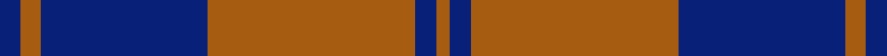

This is one **variant** — a specific cloth: this exact thread count and colourway, with its own
provenance below. It is one weaving of the [sett](/setts/db3o3db24o30db3o2/) (the scale-free proportion — the
same cloth at any scale or shade), whose colour order is pattern [BRBRBR](/stripes/brbrbr/).

Sourced from register-of-tartans.  It is a [6 stripe tartan](/stripes/stripes6/).

Original link [https://www.tartanregister.gov.uk/tartanDetails.aspx?ref=128](https://www.tartanregister.gov.uk/tartanDetails.aspx?ref=128)

2 attestations — the source records this cloth was collapsed from (oldest owns this page)

<ul>
<li>01/01/2002 — Auburn University (Alabama) (register-of-tartans, <a href="https://www.tartanregister.gov.uk/tartanDetails.aspx?ref=128">record</a>)  <em>Designed in 2002 by Dr Phil Smith for Auburn University, Montgomery, Alabama, USA. Threadcount corrected in Sept 2004 in line with designer's note. Sole agents are Scotpress of P.O. Box 609, Auburn. AL 36831</em></li>
<li>2002 — Auburn University (Alabama) (Corp) (tartans-authority, <a href="https://www.tartanregister.gov.uk/tartanDetails.aspx?ref=5881">record</a>)  <em>Designed in 2002 by Dr. Phil Smith for Auburn University, Montgomery, Alabama, USA. Sample in STA Collection. Count corrected Sept 2004 in line with designer's note. Sole agents were Scotpress (Rene & Vicki) of P.O. Box 609, Auburn. AL 36831 but passed to the university itelf (July 2011) - George Willock, Director of Planed Giving willoge@auburn.edu</em></li>
</ul>

Dataset <small>— provenance for this record, inherited from the source manifest</small>

<dl class="dataset-prov">
<dt>source</dt><dd><a href="/sources/register-of-tartans/">Scottish Register of Tartans</a></dd>
<dt>data captured from</dt><dd><a href="https://github.com/thetartan/tartan-database/blob/master/data/register-of-tartans/data.csv">https://github.com/thetartan/tartan-database/blob/master/data/register-of-tartans/data.csv</a></dd>
<dt>data date</dt><dd>2002 <small>(this record)</small></dd>
<dt>licence</dt><dd><a href="https://www.tartanregister.gov.uk/copyright">Crown copyright</a></dd>
</dl>

Capture chain <small>— the hands this data passed through, oldest first; each capture carries its own licence</small>

<ol class="capture-chain">
<li><a href="https://www.tartanregister.gov.uk/">Scottish Register of Tartans</a> · <a href="https://www.tartanregister.gov.uk/copyright">Crown copyright</a> <small>the living register — still published by National Records of Scotland</small></li>
<li><a href="https://github.com/thetartan/tartan-database">thetartan/tartan-database</a> <small>2016-2017</small> · <a href="https://creativecommons.org/licenses/by-nc-nd/4.0/">CC BY-NC-ND 4.0</a> <small>Levko Kravets's frozen compilation — the capture we vendored, and where its CC licence text came from</small></li>
<li>this dictionary <small>captured 2026-06-10 · commit 5bf86c7566</small> <small>each re-capture is a git commit to data/sources</small></li>
</ol>

## Register references

External register numbers recorded for this tartan.

- Scottish Register of Tartans: [128](https://www.tartanregister.gov.uk/tartanDetails.aspx?ref=128)
- Scottish Tartans Authority (ITI): 5881

## Thread count
DB/6 O6 DB48 O60 DB6 O/4

One full sett is **250 threads**.

## Palette
<table><thead><tr><th>Colour</th><th>Shade</th><th>OKLCh</th></tr></thead><tbody><tr><td>T</td><td><code style="background-color:#00879F;">#00879F</code> <small style="color:#888">#00879F</small></td><td><small style="color:#888">oklch(57.4% 0.102 216.1)</small></td></tr><tr><td>DB</td><td><code style="background-color:#082077;">#082077</code> <small style="color:#888">#082077</small></td><td><small style="color:#888">oklch(30.0% 0.149 265.1)</small></td></tr><tr><td>O</td><td><code style="background-color:#A65C11;">#A65C11</code> <small style="color:#888">#A65C11</small></td><td><small style="color:#888">oklch(55.0% 0.125 58.3)</small></td></tr></tbody></table>

# Sample pattern

## Nearest tartan variants

The nearest existing variants by ΔTartan distance, with this cloth at the top so the swatches line up against it.

ΔTartan

Threads

Variant

Sett

—

250

<a href="/variants/s6/db3o3db24o30db3o2~x2/">Auburn University (Alabama)</a>

<a href="/ttd/edit/#slug=db2o28g13o2db13o2~x4&amp;base=db3o3db24o30db3o2~x2" title="compare in the TTD">1.72</a>

464

<a href="/variants/s6/db2o28g13o2db13o2~x4/">Edinchat</a>

<a href="/ttd/edit/#slug=o15r5o30db32o4y3~x2&amp;base=db3o3db24o30db3o2~x2" title="compare in the TTD">3.27</a>

320

<a href="/variants/s6/o15r5o30db32o4y3~x2/">Cameron, hunting</a>

<a href="/ttd/edit/#slug=db16o2db16o19r4~x3&amp;base=db3o3db24o30db3o2~x2" title="compare in the TTD">3.32</a>

282

<a href="/variants/s5/db16o2db16o19r4~x3/">Unidentified 17</a>

<a href="/ttd/edit/#slug=dp6o2dp29o29dp2o6~x2&amp;base=db3o3db24o30db3o2~x2" title="compare in the TTD">3.46</a>

272

<a href="/variants/s6/dp6o2dp29o29dp2o6~x2/">Harmony, 11</a>

<a href="/ttd/edit/#slug=lb15do15lb15do80r6&amp;base=db3o3db24o30db3o2~x2" title="compare in the TTD">3.50</a>

241

<a href="/variants/s5/lb15do15lb15do80r6/">Coca Cola (Corporate)</a>

<a href="/ttd/edit/#slug=db2r7db2r7db22y2~x2&amp;base=db3o3db24o30db3o2~x2" title="compare in the TTD">3.52</a>

160

<a href="/variants/s6/db2r7db2r7db22y2~x2/">MacQueen variant</a>

<a href="/ttd/edit/#slug=o11db1o3n1db9r1~x4~db0805267-n1604274&amp;base=db3o3db24o30db3o2~x2" title="compare in the TTD">3.65</a>

160

<a href="/variants/s6/o11db1o3dbi1db9r1~x4~db0805267-dbi1604274/">Dege, of Saville Row</a>

<a href="/ttd/edit/#slug=db48r18db6r13y4r14~x2&amp;base=db3o3db24o30db3o2~x2" title="compare in the TTD">3.66</a>

288

<a href="/variants/s6/db48r18db6r13y4r14~x2/">Butler</a>

<a href="/ttd/edit/#slug=db4r1db18r18db1r1w1~x2&amp;base=db3o3db24o30db3o2~x2" title="compare in the TTD">3.77</a>

166

<a href="/variants/s7/db4r1db18r18db1r1w1~x2/">St. Mildreds Check (School)</a>

<a href="/ttd/edit/#slug=db3dy1db14r14dy1r1dy1r1db2~x4&amp;base=db3o3db24o30db3o2~x2" title="compare in the TTD">4.00</a>

284

<a href="/variants/s9/db3dy1db14r14dy1r1dy1r1db2~x4/">Breckon</a>

## Neighbour map

Every grey dot is one of 13621 variants placed by the first two principal components of the ΔTartan feature space (42% of its variance). Red is this tartan; blue dots are its nearest — click one to open its page.

<svg viewBox="0 0 640 380" role="img" style="max-width:100%;height:auto;border:1px solid #e0e0e0;border-radius:4px;display:block" xmlns="http://www.w3.org/2000/svg"><image href="/nn/cloud.v1.png" width="640" height="380"/><a href="/variants/s6/db2o28g13o2db13o2~x4/"><circle cx="359.1" cy="217.0" r="4" fill="#3465a4"><title>Edinchat</title></circle></a><a href="/variants/s6/o15r5o30db32o4y3~x2/"><circle cx="339.7" cy="215.1" r="4" fill="#3465a4"><title>Cameron, hunting</title></circle></a><a href="/variants/s5/db16o2db16o19r4~x3/"><circle cx="341.9" cy="258.1" r="4" fill="#3465a4"><title>Unidentified 17</title></circle></a><a href="/variants/s6/dp6o2dp29o29dp2o6~x2/"><circle cx="432.9" cy="227.7" r="4" fill="#3465a4"><title>Harmony, 11</title></circle></a><a href="/variants/s5/lb15do15lb15do80r6/"><circle cx="454.8" cy="200.3" r="4" fill="#3465a4"><title>Coca Cola (Corporate)</title></circle></a><a href="/variants/s6/db2r7db2r7db22y2~x2/"><circle cx="397.6" cy="205.4" r="4" fill="#3465a4"><title>MacQueen variant</title></circle></a><a href="/variants/s6/o11db1o3dbi1db9r1~x4~db0805267-dbi1604274/"><circle cx="318.6" cy="194.1" r="4" fill="#3465a4"><title>Dege, of Saville Row</title></circle></a><a href="/variants/s6/db48r18db6r13y4r14~x2/"><circle cx="346.9" cy="211.9" r="4" fill="#3465a4"><title>Butler</title></circle></a><a href="/variants/s7/db4r1db18r18db1r1w1~x2/"><circle cx="373.1" cy="165.5" r="4" fill="#3465a4"><title>St. Mildreds Check (School)</title></circle></a><a href="/variants/s9/db3dy1db14r14dy1r1dy1r1db2~x4/"><circle cx="349.0" cy="164.7" r="4" fill="#3465a4"><title>Breckon</title></circle></a><circle cx="415.5" cy="212.7" r="5" fill="#c00000"/><text x="320" y="376" text-anchor="middle" font-size="11" fill="#999">ground</text><text x="11" y="190" text-anchor="middle" font-size="11" fill="#999" transform="rotate(-90 11 190)">complexity</text></svg>

ID: /variants/s6/db3o3db24o30db3o2~x2/
