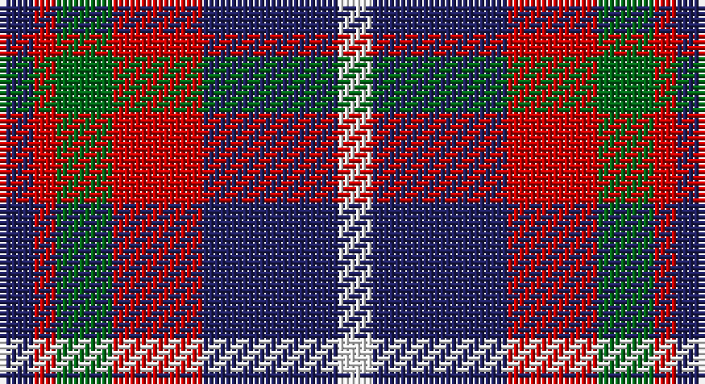

This page is one **sett** — a single exact thread-count. It belongs to the [tartan](/setts/db3r2g5r8db12w3/)
(the same proportion at any scale), whose colour order is pattern [BRGRBW](/stripes/brgrbw/).

Sourced from tartans-authority.  It is a [6 stripe tartan](/stripes/stripes6/).

Original link http://www.tartansauthority.com/tartan-ferret/display/8547/

## Register references

External register numbers recorded for this tartan.

- Scottish Register of Tartans: [8547](https://www.tartanregister.gov.uk/tartanDetails?ref=8547)
- Scottish Tartans Authority (ITI): 8547

## Thread count
DB/6 R4 G10 R16 DB24 W/6

One full sett is **120 threads**.

## Palette

Palette: <strong>Tartan Register</strong>
<table><thead><tr><th>Colour</th><th>Threads</th><th>Shade</th><th>Base</th><th>OKLCh</th></tr></thead><tbody><tr><td>DB/</td><td style="text-align:right;font-variant-numeric:tabular-nums">6</td><td><code style="background-color:#202060;">#202060</code> <small style="color:#888">#202060</small></td><td>B <code style="background-color:#2A418A;">#2A418A</code></td><td><small style="color:#888">oklch(28.9% 0.111 276.9)</small></td></tr><tr><td>R</td><td style="text-align:right;font-variant-numeric:tabular-nums">4</td><td><code style="background-color:#C80000;">#C80000</code> <small style="color:#888">#C80000</small></td><td>R <code style="background-color:#CC0000;">#CC0000</code></td><td><small style="color:#888">oklch(52.3% 0.215 29.2)</small></td></tr><tr><td>G</td><td style="text-align:right;font-variant-numeric:tabular-nums">10</td><td><code style="background-color:#006818;">#006818</code> <small style="color:#888">#006818</small></td><td>G <code style="background-color:#006100;">#006100</code></td><td><small style="color:#888">oklch(45.0% 0.142 145.0)</small></td></tr><tr><td>R</td><td style="text-align:right;font-variant-numeric:tabular-nums">16</td><td><code style="background-color:#C80000;">#C80000</code> <small style="color:#888">#C80000</small></td><td>R <code style="background-color:#CC0000;">#CC0000</code></td><td><small style="color:#888">oklch(52.3% 0.215 29.2)</small></td></tr><tr><td>DB</td><td style="text-align:right;font-variant-numeric:tabular-nums">24</td><td><code style="background-color:#202060;">#202060</code> <small style="color:#888">#202060</small></td><td>B <code style="background-color:#2A418A;">#2A418A</code></td><td><small style="color:#888">oklch(28.9% 0.111 276.9)</small></td></tr><tr><td>W/</td><td style="text-align:right;font-variant-numeric:tabular-nums">6</td><td><code style="background-color:#FCFCFC;">#FCFCFC</code> <small style="color:#888">#FCFCFC</small></td><td>W <code style="background-color:#F7F7F7;">#F7F7F7</code></td><td><small style="color:#888">oklch(99.1% 0.000 89.9)</small></td></tr></tbody></table>

# Sample pattern

## Nearest tartans

The nearest existing variants by ΔTartan distance, with this tartan at the top so the swatches line up against it.

ΔTartan

Tartan

Sett

—

<a href="/ttd/edit/#slug=db3r2g5r8db12w3~x2">Edinburgh Bus Company (Corporate)</a> <a class="nn-out" href="/variants/s6/db3r2g5r8db12w3~x2/" title="open its dictionary page">↗</a>

1.00

<a href="/ttd/edit/#slug=lb5o34k24o4r24o4~x2&amp;base=db3r2g5r8db12w3~x2">Wcwm 759-3</a> <a class="nn-out" href="/variants/s6/lb5o34k24o4r24o4~x2/" title="open its dictionary page">↗</a>

1.03

<a href="/ttd/edit/#slug=t1r6db1t3k3t1~x8&amp;base=db3r2g5r8db12w3~x2">MacTavish #2</a> <a class="nn-out" href="/variants/s6/t1r6db1t3k3t1~x8/" title="open its dictionary page">↗</a>

1.07

<a href="/ttd/edit/#slug=r12db3g5db16ly2g2~x2&amp;base=db3r2g5r8db12w3~x2">Dunbog Primary (School)</a> <a class="nn-out" href="/variants/s6/r12db3g5db16ly2g2~x2/" title="open its dictionary page">↗</a>

1.14

<a href="/ttd/edit/#slug=r5db35k25db8ly10r5~x2&amp;base=db3r2g5r8db12w3~x2">University of Notre Dame</a> <a class="nn-out" href="/variants/s6/r5db35k25db8ly10r5~x2/" title="open its dictionary page">↗</a>

1.17

<a href="/ttd/edit/#slug=db8k3r4ly1~x2&amp;base=db3r2g5r8db12w3~x2">Unidentified #17</a> <a class="nn-out" href="/variants/s4/db8k3r4ly1~x2/" title="open its dictionary page">↗</a>

1.17

<a href="/ttd/edit/#slug=k4w3k4y9r1~x4&amp;base=db3r2g5r8db12w3~x2">Oban Grey</a> <a class="nn-out" href="/variants/s5/k4w3k4y9r1~x4/" title="open its dictionary page">↗</a>

1.18

<a href="/ttd/edit/#slug=dt2k2dt2r5ly1~x12&amp;base=db3r2g5r8db12w3~x2">Chivas Regal (Corporate)</a> <a class="nn-out" href="/variants/s5/dt2k2dt2r5ly1~x12/" title="open its dictionary page">↗</a>

1.19

<a href="/ttd/edit/#slug=r1o6k1w3k3r1~x8&amp;base=db3r2g5r8db12w3~x2">Thompson Grey Dress</a> <a class="nn-out" href="/variants/s6/r1o6k1w3k3r1~x8/" title="open its dictionary page">↗</a>

1.20

<a href="/ttd/edit/#slug=db9r12dg9db5w2~x4&amp;base=db3r2g5r8db12w3~x2">Battle of Prestonpans (1745) Herit</a> <a class="nn-out" href="/variants/s5/db9r12dg9db5w2~x4/" title="open its dictionary page">↗</a>

1.20

<a href="/ttd/edit/#slug=db13k13db13r29ly4~x2&amp;base=db3r2g5r8db12w3~x2">Highland Pub Company</a> <a class="nn-out" href="/variants/s5/db13k13db13r29ly4~x2/" title="open its dictionary page">↗</a>

## Neighbour map

Every grey dot is one of 14360 variants placed by the first two principal components of the ΔTartan feature space (44% of its variance). Red is this tartan; blue dots are its nearest — click one to open its page.

<svg viewBox="0 0 640 380" role="img" style="max-width:100%;height:auto;border:1px solid #e0e0e0;border-radius:4px;display:block" xmlns="http://www.w3.org/2000/svg"><image href="/nn/cloud.v1.png" width="640" height="380"/><a href="/variants/s6/lb5o34k24o4r24o4~x2/"><circle cx="190.3" cy="203.2" r="4" fill="#3465a4"><title>Wcwm 759-3</title></circle></a><a href="/variants/s6/t1r6db1t3k3t1~x8/"><circle cx="192.3" cy="235.8" r="4" fill="#3465a4"><title>MacTavish #2</title></circle></a><a href="/variants/s6/r12db3g5db16ly2g2~x2/"><circle cx="223.3" cy="210.7" r="4" fill="#3465a4"><title>Dunbog Primary (School)</title></circle></a><a href="/variants/s6/r5db35k25db8ly10r5~x2/"><circle cx="220.4" cy="222.4" r="4" fill="#3465a4"><title>University of Notre Dame</title></circle></a><a href="/variants/s4/db8k3r4ly1~x2/"><circle cx="237.3" cy="247.0" r="4" fill="#3465a4"><title>Unidentified #17</title></circle></a><a href="/variants/s5/k4w3k4y9r1~x4/"><circle cx="186.9" cy="224.9" r="4" fill="#3465a4"><title>Oban Grey</title></circle></a><a href="/variants/s5/dt2k2dt2r5ly1~x12/"><circle cx="175.6" cy="262.7" r="4" fill="#3465a4"><title>Chivas Regal (Corporate)</title></circle></a><a href="/variants/s6/r1o6k1w3k3r1~x8/"><circle cx="144.2" cy="215.5" r="4" fill="#3465a4"><title>Thompson Grey Dress</title></circle></a><a href="/variants/s5/db9r12dg9db5w2~x4/"><circle cx="150.2" cy="264.3" r="4" fill="#3465a4"><title>Battle of Prestonpans (1745) Herit</title></circle></a><a href="/variants/s5/db13k13db13r29ly4~x2/"><circle cx="184.1" cy="249.7" r="4" fill="#3465a4"><title>Highland Pub Company</title></circle></a><circle cx="181.6" cy="231.2" r="5" fill="#c00000"/></svg>

ID: /variants/s6/db3r2g5r8db12w3~x2/
