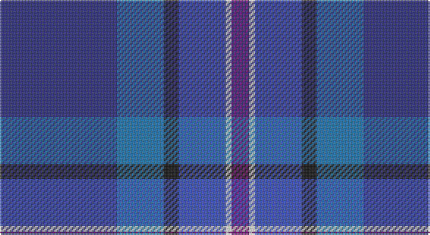

This page is one **sett** — a single exact thread-count. It belongs to the [tartan](/setts/db40b16k5bi16w2dp6/)
(the same proportion at any scale), whose colour order is pattern [BBKBWB](/stripes/bbkbwb/).

Sourced from tartans-authority.  It is a [6 stripe tartan](/stripes/stripes6/).

Original link http://www.tartansauthority.com/tartan-ferret/display/10344/

## Register references

External register numbers recorded for this tartan.

- Scottish Register of Tartans: [10344](https://www.tartanregister.gov.uk/tartanDetails?ref=10344)
- Scottish Tartans Authority (ITI): 10344

## Thread count
DB/80 Ba32 K10 B32 W4 P/12

One full sett is **248 threads**.

## Palette

Palette: <strong>Tartan Register</strong>
<table><thead><tr><th>Colour</th><th>Threads</th><th>Shade</th><th>Base</th><th>OKLCh</th></tr></thead><tbody><tr><td>DB/</td><td style="text-align:right;font-variant-numeric:tabular-nums">80</td><td><code style="background-color:#2C2C80;">#2C2C80</code> <small style="color:#888">#2C2C80</small></td><td>B <code style="background-color:#2A418A;">#2A418A</code></td><td><small style="color:#888">oklch(35.0% 0.138 276.6)</small></td></tr><tr><td>Ba</td><td style="text-align:right;font-variant-numeric:tabular-nums">32</td><td><code style="background-color:#1474B4;">#1474B4</code> <small style="color:#888">#1474B4</small></td><td>B <code style="background-color:#2A418A;">#2A418A</code></td><td><small style="color:#888">oklch(54.0% 0.129 245.1)</small></td></tr><tr><td>K</td><td style="text-align:right;font-variant-numeric:tabular-nums">10</td><td><code style="background-color:#101010;">#101010</code> <small style="color:#888">#101010</small></td><td>K <code style="background-color:#000000;">#000000</code></td><td><small style="color:#888">oklch(17.3% 0.000 89.9)</small></td></tr><tr><td>B</td><td style="text-align:right;font-variant-numeric:tabular-nums">32</td><td><code style="background-color:#3850C8;">#3850C8</code> <small style="color:#888">#3850C8</small></td><td>B <code style="background-color:#2A418A;">#2A418A</code></td><td><small style="color:#888">oklch(48.8% 0.188 269.4)</small></td></tr><tr><td>W</td><td style="text-align:right;font-variant-numeric:tabular-nums">4</td><td><code style="background-color:#FCFCFC;">#FCFCFC</code> <small style="color:#888">#FCFCFC</small></td><td>W <code style="background-color:#F7F7F7;">#F7F7F7</code></td><td><small style="color:#888">oklch(99.1% 0.000 89.9)</small></td></tr><tr><td>P/</td><td style="text-align:right;font-variant-numeric:tabular-nums">12</td><td><code style="background-color:#780078;">#780078</code> <small style="color:#888">#780078</small></td><td>B <code style="background-color:#2A418A;">#2A418A</code></td><td><small style="color:#888">oklch(40.2% 0.185 328.4)</small></td></tr></tbody></table>

# Sample pattern

## Nearest tartans

The nearest existing variants by ΔTartan distance, with this tartan at the top so the swatches line up against it.

ΔTartan

Tartan

Sett

—

<a href="/ttd/edit/#slug=db40b16k5bi16w2dp6~x2">MacFarland-Collins (Name)</a> <a class="nn-out" href="/variants/s6/db40b16k5bi16w2dp6~x2/" title="open its dictionary page">↗</a>

1.37

<a href="/ttd/edit/#slug=dbi49g3k22r2b33db3b7~x2&amp;base=db40b16k5bi16w2dp6~x2">U.S. 2001 Air Force (Military?)</a> <a class="nn-out" href="/variants/s7/dbi49g3k22r2b33db3b7~x2/" title="open its dictionary page">↗</a>

1.52

<a href="/ttd/edit/#slug=db38w3db8dbi36dg9r3~x2&amp;base=db40b16k5bi16w2dp6~x2">Waters of Georgian Bay (District)</a> <a class="nn-out" href="/variants/s6/db38w3db8dbi36dg9r3~x2/" title="open its dictionary page">↗</a>

1.60

<a href="/ttd/edit/#slug=b17lb2b3db16t28db2t3lo2~x2&amp;base=db40b16k5bi16w2dp6~x2">Banff &amp; Buchan (District)</a> <a class="nn-out" href="/variants/s8/b17lb2b3db16t28db2t3lo2~x2/" title="open its dictionary page">↗</a>

1.69

<a href="/ttd/edit/#slug=db20k4g5dp14w1db2~x2&amp;base=db40b16k5bi16w2dp6~x2">Riley's Theme (Fashion)</a> <a class="nn-out" href="/variants/s6/db20k4g5dp14w1db2~x2/" title="open its dictionary page">↗</a>

1.74

<a href="/ttd/edit/#slug=w4b44db19dbi44r2~x2&amp;base=db40b16k5bi16w2dp6~x2">World Federation of Building Contractors</a> <a class="nn-out" href="/variants/s5/w4b44db19dbi44r2~x2/" title="open its dictionary page">↗</a>

1.76

<a href="/ttd/edit/#slug=dp6dt4k4dt26k12dp3db42ly4db4&amp;base=db40b16k5bi16w2dp6~x2">Goldblatt, Joe, Jeff (Personal)</a> <a class="nn-out" href="/variants/s9/dp6dt4k4dt26k12dp3db42ly4db4/" title="open its dictionary page">↗</a>

1.80

<a href="/ttd/edit/#slug=db40n16k5dt16w2dp6~x2&amp;base=db40b16k5bi16w2dp6~x2">McFarland-Collins</a> <a class="nn-out" href="/variants/s6/db40n16k5dt16w2dp6~x2/" title="open its dictionary page">↗</a>

1.84

<a href="/ttd/edit/#slug=dg24t4dg3db11dp8db37k3db2r4~x2&amp;base=db40b16k5bi16w2dp6~x2">Stewmann (Personal)</a> <a class="nn-out" href="/variants/s9/dg24t4dg3db11dp8db37k3db2r4~x2/" title="open its dictionary page">↗</a>

1.85

<a href="/ttd/edit/#slug=db12t6db52dt41m12dp6m12&amp;base=db40b16k5bi16w2dp6~x2">Great Scot (Fashion)</a> <a class="nn-out" href="/variants/s7/db12t6db52dt41m12dp6m12/" title="open its dictionary page">↗</a>

1.87

<a href="/ttd/edit/#slug=bi26n10dt19r6ly2b9~x2&amp;base=db40b16k5bi16w2dp6~x2">Meeson Formal</a> <a class="nn-out" href="/variants/s6/bi26n10dt19r6ly2b9~x2/" title="open its dictionary page">↗</a>

## Neighbour map

Every grey dot is one of 14360 variants placed by the first two principal components of the ΔTartan feature space (44% of its variance). Red is this tartan; blue dots are its nearest — click one to open its page.

<svg viewBox="0 0 640 380" role="img" style="max-width:100%;height:auto;border:1px solid #e0e0e0;border-radius:4px;display:block" xmlns="http://www.w3.org/2000/svg"><image href="/nn/cloud.v1.png" width="640" height="380"/><a href="/variants/s7/dbi49g3k22r2b33db3b7~x2/"><circle cx="262.6" cy="159.2" r="4" fill="#3465a4"><title>U.S. 2001 Air Force (Military?)</title></circle></a><a href="/variants/s6/db38w3db8dbi36dg9r3~x2/"><circle cx="307.7" cy="221.4" r="4" fill="#3465a4"><title>Waters of Georgian Bay (District)</title></circle></a><a href="/variants/s8/b17lb2b3db16t28db2t3lo2~x2/"><circle cx="257.8" cy="185.6" r="4" fill="#3465a4"><title>Banff &amp; Buchan (District)</title></circle></a><a href="/variants/s6/db20k4g5dp14w1db2~x2/"><circle cx="311.3" cy="197.8" r="4" fill="#3465a4"><title>Riley's Theme (Fashion)</title></circle></a><a href="/variants/s5/w4b44db19dbi44r2~x2/"><circle cx="264.9" cy="202.8" r="4" fill="#3465a4"><title>World Federation of Building Contractors</title></circle></a><a href="/variants/s9/dp6dt4k4dt26k12dp3db42ly4db4/"><circle cx="289.0" cy="191.6" r="4" fill="#3465a4"><title>Goldblatt, Joe, Jeff (Personal)</title></circle></a><a href="/variants/s6/db40n16k5dt16w2dp6~x2/"><circle cx="303.2" cy="203.8" r="4" fill="#3465a4"><title>McFarland-Collins</title></circle></a><a href="/variants/s9/dg24t4dg3db11dp8db37k3db2r4~x2/"><circle cx="325.7" cy="165.7" r="4" fill="#3465a4"><title>Stewmann (Personal)</title></circle></a><a href="/variants/s7/db12t6db52dt41m12dp6m12/"><circle cx="285.5" cy="239.3" r="4" fill="#3465a4"><title>Great Scot (Fashion)</title></circle></a><a href="/variants/s6/bi26n10dt19r6ly2b9~x2/"><circle cx="165.9" cy="206.7" r="4" fill="#3465a4"><title>Meeson Formal</title></circle></a><circle cx="278.3" cy="186.0" r="5" fill="#c00000"/></svg>

ID: /variants/s6/db40b16k5bi16w2dp6~x2/
