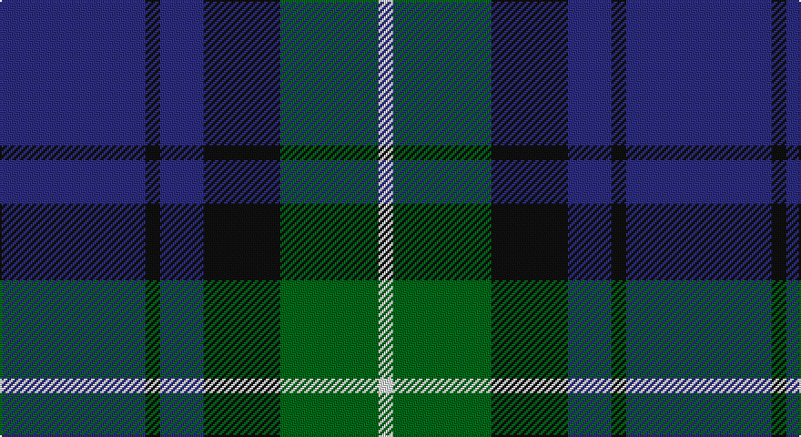

This page is one **sett** — a single exact thread-count. It belongs to the [tartan](/setts/db40k4db12k21g27w4/)
(the same proportion at any scale), whose colour order is pattern [BKBKGW](/stripes/bkbkgw/).

Part of the [Granger](/tartans/granger/) tartan — the named design grouping this sett with its other cloths.

Sourced from tartans-authority.  It is a [6 stripe tartan](/stripes/stripes6/).

Original link http://www.tartansauthority.com/tartan-ferret/display/2226/

## Register references

External register numbers recorded for this tartan.

- Scottish Tartans Authority (ITI): 2226

## Thread count
DB/80 K8 DB24 K42 G54 LN/8

One full sett is **344 threads**.

## Palette

Palette: <strong>Tartan Register</strong>
<table><thead><tr><th>Colour</th><th>Threads</th><th>Shade</th><th>Base</th><th>OKLCh</th></tr></thead><tbody><tr><td>DB/</td><td style="text-align:right;font-variant-numeric:tabular-nums">80</td><td><code style="background-color:#2C2C80;">#2C2C80</code> <small style="color:#888">#2C2C80</small></td><td>B <code style="background-color:#2A418A;">#2A418A</code></td><td><small style="color:#888">oklch(35.0% 0.138 276.6)</small></td></tr><tr><td>K</td><td style="text-align:right;font-variant-numeric:tabular-nums">8</td><td><code style="background-color:#101010;">#101010</code> <small style="color:#888">#101010</small></td><td>K <code style="background-color:#000000;">#000000</code></td><td><small style="color:#888">oklch(17.3% 0.000 89.9)</small></td></tr><tr><td>DB</td><td style="text-align:right;font-variant-numeric:tabular-nums">24</td><td><code style="background-color:#2C2C80;">#2C2C80</code> <small style="color:#888">#2C2C80</small></td><td>B <code style="background-color:#2A418A;">#2A418A</code></td><td><small style="color:#888">oklch(35.0% 0.138 276.6)</small></td></tr><tr><td>K</td><td style="text-align:right;font-variant-numeric:tabular-nums">42</td><td><code style="background-color:#101010;">#101010</code> <small style="color:#888">#101010</small></td><td>K <code style="background-color:#000000;">#000000</code></td><td><small style="color:#888">oklch(17.3% 0.000 89.9)</small></td></tr><tr><td>G</td><td style="text-align:right;font-variant-numeric:tabular-nums">54</td><td><code style="background-color:#006818;">#006818</code> <small style="color:#888">#006818</small></td><td>G <code style="background-color:#006100;">#006100</code></td><td><small style="color:#888">oklch(45.0% 0.142 145.0)</small></td></tr><tr><td>LN/</td><td style="text-align:right;font-variant-numeric:tabular-nums">8</td><td><code style="background-color:#E0E0E0;">#E0E0E0</code> <small style="color:#888">#E0E0E0</small></td><td>W <code style="background-color:#F7F7F7;">#F7F7F7</code></td><td><small style="color:#888">oklch(90.7% 0.000 89.9)</small></td></tr></tbody></table>

# Sample pattern

## Nearest tartans

The nearest existing variants by ΔTartan distance, with this tartan at the top so the swatches line up against it.

ΔTartan

Tartan

Sett

—

<a href="/ttd/edit/#slug=db40k4db12k21g27w4~x2">Granger (Personal)</a> <a class="nn-out" href="/variants/s6/db40k4db12k21g27w4~x2/" title="open its dictionary page">↗</a>

0.98

<a href="/ttd/edit/#slug=db24k3db5k23ly2k11g22~x2&amp;base=db40k4db12k21g27w4~x2">Mowat (Clans Originaux)</a> <a class="nn-out" href="/variants/s7/db24k3db5k23ly2k11g22~x2/" title="open its dictionary page">↗</a>

0.99

<a href="/ttd/edit/#slug=db30k10g10lb2g15lb2~x2&amp;base=db40k4db12k21g27w4~x2">MacRobart (Personal)</a> <a class="nn-out" href="/variants/s6/db30k10g10lb2g15lb2~x2/" title="open its dictionary page">↗</a>

1.02

<a href="/ttd/edit/#slug=dr5b35k24b9g9dr5~x2&amp;base=db40k4db12k21g27w4~x2">Notre Dame Marching Guard (Corp)</a> <a class="nn-out" href="/variants/s6/dr5b35k24b9g9dr5~x2/" title="open its dictionary page">↗</a>

1.04

<a href="/ttd/edit/#slug=n6k6n21k16db36ly4&amp;base=db40k4db12k21g27w4~x2">Bareback (Corporate)</a> <a class="nn-out" href="/variants/s6/n6k6n21k16db36ly4/" title="open its dictionary page">↗</a>

1.05

<a href="/ttd/edit/#slug=b11k1b3k5dp9lo1~x2&amp;base=db40k4db12k21g27w4~x2">Joker Fancy Tartan</a> <a class="nn-out" href="/variants/s6/b11k1b3k5dp9lo1~x2/" title="open its dictionary page">↗</a>

1.09

<a href="/ttd/edit/#slug=g7db1g1k4dp4k1~x4&amp;base=db40k4db12k21g27w4~x2">MacArthur of Milton (Clan)</a> <a class="nn-out" href="/variants/s6/g7db1g1k4dp4k1~x4/" title="open its dictionary page">↗</a>

1.13

<a href="/ttd/edit/#slug=g8b1g1k6db6k1~x4&amp;base=db40k4db12k21g27w4~x2">Graham of Menteith</a> <a class="nn-out" href="/variants/s6/g8b1g1k6db6k1~x4/" title="open its dictionary page">↗</a>

1.13

<a href="/ttd/edit/#slug=k2dg9t1k6b4dg2~x2&amp;base=db40k4db12k21g27w4~x2">Unidentified #28</a> <a class="nn-out" href="/variants/s6/k2dg9t1k6b4dg2~x2/" title="open its dictionary page">↗</a>

1.16

<a href="/ttd/edit/#slug=db31b4db5k19g20lo4~x2&amp;base=db40k4db12k21g27w4~x2">Midlothian</a> <a class="nn-out" href="/variants/s6/db31b4db5k19g20lo4~x2/" title="open its dictionary page">↗</a>

1.16

<a href="/ttd/edit/#slug=k4g21k10r2k10db21k4db4k4~x2&amp;base=db40k4db12k21g27w4~x2">Swallow Hotels (Corporate)</a> <a class="nn-out" href="/variants/s9/k4g21k10r2k10db21k4db4k4~x2/" title="open its dictionary page">↗</a>

## Neighbour map

Every grey dot is one of 14360 variants placed by the first two principal components of the ΔTartan feature space (44% of its variance). Red is this tartan; blue dots are its nearest — click one to open its page.

<svg viewBox="0 0 640 380" role="img" style="max-width:100%;height:auto;border:1px solid #e0e0e0;border-radius:4px;display:block" xmlns="http://www.w3.org/2000/svg"><image href="/nn/cloud.v1.png" width="640" height="380"/><a href="/variants/s7/db24k3db5k23ly2k11g22~x2/"><circle cx="238.5" cy="232.6" r="4" fill="#3465a4"><title>Mowat (Clans Originaux)</title></circle></a><a href="/variants/s6/db30k10g10lb2g15lb2~x2/"><circle cx="264.1" cy="218.3" r="4" fill="#3465a4"><title>MacRobart (Personal)</title></circle></a><a href="/variants/s6/dr5b35k24b9g9dr5~x2/"><circle cx="235.3" cy="235.7" r="4" fill="#3465a4"><title>Notre Dame Marching Guard (Corp)</title></circle></a><a href="/variants/s6/n6k6n21k16db36ly4/"><circle cx="233.0" cy="241.5" r="4" fill="#3465a4"><title>Bareback (Corporate)</title></circle></a><a href="/variants/s6/b11k1b3k5dp9lo1~x2/"><circle cx="263.6" cy="229.4" r="4" fill="#3465a4"><title>Joker Fancy Tartan</title></circle></a><a href="/variants/s6/g7db1g1k4dp4k1~x4/"><circle cx="233.2" cy="249.7" r="4" fill="#3465a4"><title>MacArthur of Milton (Clan)</title></circle></a><a href="/variants/s6/g8b1g1k6db6k1~x4/"><circle cx="220.5" cy="251.3" r="4" fill="#3465a4"><title>Graham of Menteith</title></circle></a><a href="/variants/s6/k2dg9t1k6b4dg2~x2/"><circle cx="229.2" cy="243.7" r="4" fill="#3465a4"><title>Unidentified #28</title></circle></a><a href="/variants/s6/db31b4db5k19g20lo4~x2/"><circle cx="191.0" cy="227.8" r="4" fill="#3465a4"><title>Midlothian</title></circle></a><a href="/variants/s9/k4g21k10r2k10db21k4db4k4~x2/"><circle cx="224.7" cy="214.8" r="4" fill="#3465a4"><title>Swallow Hotels (Corporate)</title></circle></a><circle cx="253.8" cy="239.6" r="5" fill="#c00000"/></svg>

ID: /variants/s6/db40k4db12k21g27w4~x2/
