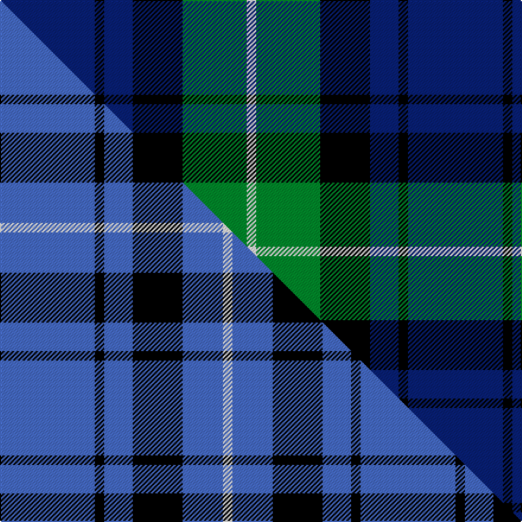

This page is one **sett** — a single exact thread-count. It belongs to the [tartan](/setts/db40k4db12k21g27w4/)
(the same proportion at any scale), whose colour order is pattern [BKBKGW](/stripes/bkbkgw/).

Part of the [Granger](/tartans/granger/) tartan — the named design grouping this sett with its other cloths.

Sourced from tartans-authority.  It is a [6 stripe tartan](/stripes/stripes6/).

Original link http://www.tartansauthority.com/tartan-ferret/display/2226/

## Register references

External register numbers recorded for this tartan.

- Scottish Tartans Authority (ITI): 2226

## Thread count
DB/80 K8 DB24 K42 G54 W/8

One full sett is **344 threads**.

## Palette
<table><thead><tr><th>Colour</th><th>Shade</th><th>OKLCh</th></tr></thead><tbody><tr><td>DB</td><td><code style="background-color:#082077;">#082077</code> <small style="color:#888">#082077</small></td><td><small style="color:#888">oklch(30.0% 0.149 265.1)</small></td></tr><tr><td>G</td><td><code style="background-color:#008B2A;">#008B2A</code> <small style="color:#888">#008B2A</small></td><td><small style="color:#888">oklch(55.4% 0.170 145.9)</small></td></tr><tr><td>K</td><td><code style="background-color:#000000;">#000000</code> <small style="color:#888">#000000</small></td><td><small style="color:#888">oklch(0.0% 0.000 0.0)</small></td></tr><tr><td>W</td><td><code style="background-color:#F7F7F7;">#F7F7F7</code> <small style="color:#888">#F7F7F7</small></td><td><small style="color:#888">oklch(97.6% 0.000 89.9)</small></td></tr></tbody></table>

# Sample pattern

## Compared to the master

This cloth is one sett of its design; the master sett (the exemplar the design is anchored on) is below for comparison.

Its **ΔTartan distance** from the master is **3.18** — the same measure the nearest-tartans table ranks by (0 is identical; a re-scale of the same cloth is near 0, a recolour or a different proportion further).

<figure class="master-compare" style="margin:0">

this sett
master sett ★

<figcaption style="color:#888;font-size:smaller">One weave of this sett against the <a href="/setts/b40k4b12k21b17w4/">master sett ★</a>, split on the diagonal: a shared proportion runs seamlessly across it with only the shades shifting; a different proportion breaks on it.</figcaption>
</figure>

## Nearest variants

The nearest existing variants by ΔTartan distance, with this cloth at the top so the swatches line up against it.

ΔTartan

Threads

Variant

Sett

—

344

<a href="/variants/s6/db40k4db12k21g27w4~x2/">Granger (Personal)</a>

<a href="/ttd/edit/#slug=db2k2db12k8g11r2~x2&amp;base=db40k4db12k21g27w4~x2" title="compare in the TTD">1.07</a>

140

<a href="/variants/s6/db2k2db12k8g11r2~x2/">Murray #3</a>

<a href="/ttd/edit/#slug=db15w2g2k18db21k3g15~x2&amp;base=db40k4db12k21g27w4~x2" title="compare in the TTD">1.57</a>

244

<a href="/variants/s7/db15w2g2k18db21k3g15~x2/">Loyalhanna (District?)</a>

<a href="/ttd/edit/#slug=k6g11w2db22r2k4~x2&amp;base=db40k4db12k21g27w4~x2" title="compare in the TTD">1.60</a>

168

<a href="/variants/s6/k6g11w2db22r2k4~x2/">Leslie Hebridean Artifact Tartan</a>

<a href="/ttd/edit/#slug=db31t4db5k19g20lo4~x2&amp;base=db40k4db12k21g27w4~x2" title="compare in the TTD">1.66</a>

262

<a href="/variants/s6/db31t4db5k19g20lo4~x2/">Midlothian</a>

<a href="/ttd/edit/#slug=db31b4db5k19g20y4~x2&amp;base=db40k4db12k21g27w4~x2" title="compare in the TTD">1.66</a>

262

<a href="/variants/s6/db31b4db5k19g20y4~x2/">Midlothian</a>

<a href="/ttd/edit/#slug=k6g15w2db22b2k4~x2&amp;base=db40k4db12k21g27w4~x2" title="compare in the TTD">1.69</a>

184

<a href="/variants/s6/k6g15w2db22b2k4~x2/">Leslie, Hebridean</a>

<a href="/ttd/edit/#slug=k6g15w2db22r2k4~x2&amp;base=db40k4db12k21g27w4~x2" title="compare in the TTD">1.69</a>

184

<a href="/variants/s6/k6g15w2db22r2k4~x2/">Leslie, Hebridean</a>

<a href="/ttd/edit/#slug=g8w2g1k12db12k1~x2&amp;base=db40k4db12k21g27w4~x2" title="compare in the TTD">1.74</a>

126

<a href="/variants/s6/g8w2g1k12db12k1~x2/">Graham of Menteith</a>

<a href="/ttd/edit/#slug=t11k1t3k5dp9lo1~x2&amp;base=db40k4db12k21g27w4~x2" title="compare in the TTD">1.79</a>

96

<a href="/variants/s6/t11k1t3k5dp9lo1~x2/">Joker Fancy Tartan</a>

<a href="/ttd/edit/#slug=k5w2g18k17db16k3&amp;base=db40k4db12k21g27w4~x2" title="compare in the TTD">1.80</a>

114

<a href="/variants/s6/k5w2g18k17db16k3/">Melville</a>

## Neighbour map

Every grey dot is one of 13620 variants placed by the first two principal components of the ΔTartan feature space (42% of its variance). Red is this tartan; blue dots are its nearest — click one to open its page.

<svg viewBox="0 0 640 380" role="img" style="max-width:100%;height:auto;border:1px solid #e0e0e0;border-radius:4px;display:block" xmlns="http://www.w3.org/2000/svg"><image href="/nn/cloud.v1.png" width="640" height="380"/><a href="/variants/s6/db2k2db12k8g11r2~x2/"><circle cx="145.5" cy="229.0" r="4" fill="#3465a4"><title>Murray #3</title></circle></a><a href="/variants/s7/db15w2g2k18db21k3g15~x2/"><circle cx="181.6" cy="188.3" r="4" fill="#3465a4"><title>Loyalhanna (District?)</title></circle></a><a href="/variants/s6/k6g11w2db22r2k4~x2/"><circle cx="181.9" cy="167.5" r="4" fill="#3465a4"><title>Leslie Hebridean Artifact Tartan</title></circle></a><a href="/variants/s6/db31t4db5k19g20lo4~x2/"><circle cx="156.2" cy="203.0" r="4" fill="#3465a4"><title>Midlothian</title></circle></a><a href="/variants/s6/db31b4db5k19g20y4~x2/"><circle cx="163.5" cy="204.9" r="4" fill="#3465a4"><title>Midlothian</title></circle></a><a href="/variants/s6/k6g15w2db22b2k4~x2/"><circle cx="168.1" cy="172.8" r="4" fill="#3465a4"><title>Leslie, Hebridean</title></circle></a><a href="/variants/s6/k6g15w2db22r2k4~x2/"><circle cx="166.0" cy="170.8" r="4" fill="#3465a4"><title>Leslie, Hebridean</title></circle></a><a href="/variants/s6/g8w2g1k12db12k1~x2/"><circle cx="158.2" cy="191.4" r="4" fill="#3465a4"><title>Graham of Menteith</title></circle></a><a href="/variants/s6/t11k1t3k5dp9lo1~x2/"><circle cx="217.1" cy="199.3" r="4" fill="#3465a4"><title>Joker Fancy Tartan</title></circle></a><a href="/variants/s6/k5w2g18k17db16k3/"><circle cx="153.0" cy="208.5" r="4" fill="#3465a4"><title>Melville</title></circle></a><circle cx="206.8" cy="207.8" r="5" fill="#c00000"/><text x="320" y="376" text-anchor="middle" font-size="11" fill="#999">ground</text><text x="11" y="190" text-anchor="middle" font-size="11" fill="#999" transform="rotate(-90 11 190)">complexity</text></svg>

ID: /variants/s6/db40k4db12k21g27w4~x2/
