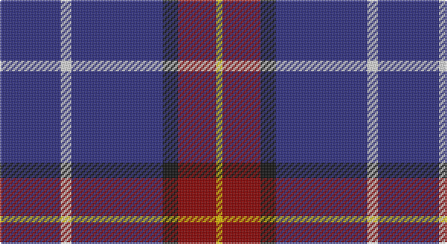

This page is one **sett** — a single exact thread-count. It belongs to the [tartan](/setts/db40w7db60k10r25ly4/)
(the same proportion at any scale), whose colour order is pattern [BWBKRY](/stripes/bwbkry/).

Sourced from tartans-authority.  It is a [6 stripe tartan](/stripes/stripes6/).

Original link http://www.tartansauthority.com/tartan-ferret/display/7650/

2 attestations — the source records this cloth was collapsed from (oldest owns this page)

<ul>
<li>pre 2008 — Stradling (Name) (tartans-authority, <a href="http://www.tartansauthority.com/tartan-ferret/display/7650/">record</a>)</li>
<li>undated — Stradling (register-of-tartans, <a href="https://www.tartanregister.gov.uk/tartanDetails.aspx?ref=5663">record</a>)</li>
</ul>

## Register references

External register numbers recorded for this tartan.

- Scottish Register of Tartans: [5663](https://www.tartanregister.gov.uk/tartanDetails.aspx?ref=5663)
- Scottish Tartans Authority (ITI): 7650

## Thread count
DB/40 LN7 DB60 K10 DR25 Y/4

One full sett is **248 threads**.

## Palette

Palette: <strong>Tartan Register</strong>
<table><thead><tr><th>Colour</th><th>Threads</th><th>Shade</th><th>Base</th><th>OKLCh</th></tr></thead><tbody><tr><td>DB/</td><td style="text-align:right;font-variant-numeric:tabular-nums">40</td><td><code style="background-color:#2C2C80;">#2C2C80</code> <small style="color:#888">#2C2C80</small></td><td>B <code style="background-color:#2A418A;">#2A418A</code></td><td><small style="color:#888">oklch(35.0% 0.138 276.6)</small></td></tr><tr><td>LN</td><td style="text-align:right;font-variant-numeric:tabular-nums">7</td><td><code style="background-color:#E0E0E0;">#E0E0E0</code> <small style="color:#888">#E0E0E0</small></td><td>W <code style="background-color:#F7F7F7;">#F7F7F7</code></td><td><small style="color:#888">oklch(90.7% 0.000 89.9)</small></td></tr><tr><td>DB</td><td style="text-align:right;font-variant-numeric:tabular-nums">60</td><td><code style="background-color:#2C2C80;">#2C2C80</code> <small style="color:#888">#2C2C80</small></td><td>B <code style="background-color:#2A418A;">#2A418A</code></td><td><small style="color:#888">oklch(35.0% 0.138 276.6)</small></td></tr><tr><td>K</td><td style="text-align:right;font-variant-numeric:tabular-nums">10</td><td><code style="background-color:#101010;">#101010</code> <small style="color:#888">#101010</small></td><td>K <code style="background-color:#000000;">#000000</code></td><td><small style="color:#888">oklch(17.3% 0.000 89.9)</small></td></tr><tr><td>DR</td><td style="text-align:right;font-variant-numeric:tabular-nums">25</td><td><code style="background-color:#880000;">#880000</code> <small style="color:#888">#880000</small></td><td>R <code style="background-color:#CC0000;">#CC0000</code></td><td><small style="color:#888">oklch(39.4% 0.162 29.2)</small></td></tr><tr><td>Y/</td><td style="text-align:right;font-variant-numeric:tabular-nums">4</td><td><code style="background-color:#E8C000;">#E8C000</code> <small style="color:#888">#E8C000</small></td><td>Y <code style="background-color:#F2BF00;">#F2BF00</code></td><td><small style="color:#888">oklch(81.9% 0.168 93.7)</small></td></tr></tbody></table>

# Sample pattern

## Nearest tartans

The nearest existing variants by ΔTartan distance, with this tartan at the top so the swatches line up against it.

ΔTartan

Tartan

Sett

—

<a href="/ttd/edit/#slug=db40w7db60k10r25ly4">Stradling (Name)</a> <a class="nn-out" href="/variants/s6/db40w7db60k10r25ly4/" title="open its dictionary page">↗</a>

1.11

<a href="/ttd/edit/#slug=r1db12k5lo3db5lb1~x4&amp;base=db40w7db60k10r25ly4">Massachusetts (Unofficial)</a> <a class="nn-out" href="/variants/s6/r1db12k5lo3db5lb1~x4/" title="open its dictionary page">↗</a>

1.21

<a href="/ttd/edit/#slug=r1db12k5o3db5w1~x4&amp;base=db40w7db60k10r25ly4">Massachusetts</a> <a class="nn-out" href="/variants/s6/r1db12k5o3db5w1~x4/" title="open its dictionary page">↗</a>

1.22

<a href="/ttd/edit/#slug=db2t11dp19db1dp19dpi4lo2~x2&amp;base=db40w7db60k10r25ly4">Brigid Mhairi (Personal)</a> <a class="nn-out" href="/variants/s7/db2t11dp19db1dp19dpi4lo2~x2/" title="open its dictionary page">↗</a>

1.26

<a href="/ttd/edit/#slug=g20lr6db20ly3db48r6db4r6~x2&amp;base=db40w7db60k10r25ly4">Warren Wilson College (Corporate)</a> <a class="nn-out" href="/variants/s8/g20lr6db20ly3db48r6db4r6~x2/" title="open its dictionary page">↗</a>

1.40

<a href="/ttd/edit/#slug=db65k9db21ly8db21w8db35r35&amp;base=db40w7db60k10r25ly4">Maud, Mary</a> <a class="nn-out" href="/variants/s8/db65k9db21ly8db21w8db35r35/" title="open its dictionary page">↗</a>

1.48

<a href="/ttd/edit/#slug=r5db20r3db20k6db3lb2db1~x2&amp;base=db40w7db60k10r25ly4">Masai Shuka 29 (Artefact)</a> <a class="nn-out" href="/variants/s8/r5db20r3db20k6db3lb2db1~x2/" title="open its dictionary page">↗</a>

1.50

<a href="/ttd/edit/#slug=db40g7ly3g7db15r5~x2&amp;base=db40w7db60k10r25ly4">Wheadon (Name)</a> <a class="nn-out" href="/variants/s6/db40g7ly3g7db15r5~x2/" title="open its dictionary page">↗</a>

1.55

<a href="/ttd/edit/#slug=db14k3r3w1~x2&amp;base=db40w7db60k10r25ly4">Bacon, Blue</a> <a class="nn-out" href="/variants/s4/db14k3r3w1~x2/" title="open its dictionary page">↗</a>

1.55

<a href="/ttd/edit/#slug=db30r3db3ly3db3g30db36w5~x2&amp;base=db40w7db60k10r25ly4">De Nardi Hunting (Personal)</a> <a class="nn-out" href="/variants/s8/db30r3db3ly3db3g30db36w5~x2/" title="open its dictionary page">↗</a>

1.55

<a href="/ttd/edit/#slug=r3db21r3db3k13db13t3db3w2~x2&amp;base=db40w7db60k10r25ly4">Fitzgerald, Blue</a> <a class="nn-out" href="/variants/s9/r3db21r3db3k13db13t3db3w2~x2/" title="open its dictionary page">↗</a>

## Neighbour map

Every grey dot is one of 14360 variants placed by the first two principal components of the ΔTartan feature space (44% of its variance). Red is this tartan; blue dots are its nearest — click one to open its page.

<svg viewBox="0 0 640 380" role="img" style="max-width:100%;height:auto;border:1px solid #e0e0e0;border-radius:4px;display:block" xmlns="http://www.w3.org/2000/svg"><image href="/nn/cloud.v1.png" width="640" height="380"/><a href="/variants/s6/r1db12k5lo3db5lb1~x4/"><circle cx="324.0" cy="199.6" r="4" fill="#3465a4"><title>Massachusetts (Unofficial)</title></circle></a><a href="/variants/s6/r1db12k5o3db5w1~x4/"><circle cx="316.5" cy="194.5" r="4" fill="#3465a4"><title>Massachusetts</title></circle></a><a href="/variants/s7/db2t11dp19db1dp19dpi4lo2~x2/"><circle cx="397.3" cy="178.3" r="4" fill="#3465a4"><title>Brigid Mhairi (Personal)</title></circle></a><a href="/variants/s8/g20lr6db20ly3db48r6db4r6~x2/"><circle cx="350.6" cy="165.9" r="4" fill="#3465a4"><title>Warren Wilson College (Corporate)</title></circle></a><a href="/variants/s8/db65k9db21ly8db21w8db35r35/"><circle cx="349.3" cy="204.7" r="4" fill="#3465a4"><title>Maud, Mary</title></circle></a><a href="/variants/s8/r5db20r3db20k6db3lb2db1~x2/"><circle cx="452.4" cy="176.5" r="4" fill="#3465a4"><title>Masai Shuka 29 (Artefact)</title></circle></a><a href="/variants/s6/db40g7ly3g7db15r5~x2/"><circle cx="427.3" cy="202.5" r="4" fill="#3465a4"><title>Wheadon (Name)</title></circle></a><a href="/variants/s4/db14k3r3w1~x2/"><circle cx="412.0" cy="225.2" r="4" fill="#3465a4"><title>Bacon, Blue</title></circle></a><a href="/variants/s8/db30r3db3ly3db3g30db36w5~x2/"><circle cx="342.6" cy="176.0" r="4" fill="#3465a4"><title>De Nardi Hunting (Personal)</title></circle></a><a href="/variants/s9/r3db21r3db3k13db13t3db3w2~x2/"><circle cx="305.8" cy="175.2" r="4" fill="#3465a4"><title>Fitzgerald, Blue</title></circle></a><circle cx="385.1" cy="194.4" r="5" fill="#c00000"/></svg>

ID: /variants/s6/db40w7db60k10r25ly4/
