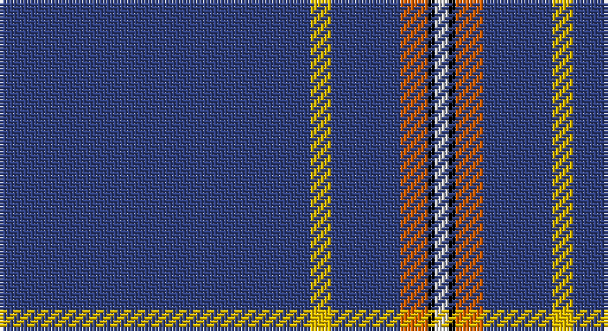

This page is one **sett** — a single exact thread-count. It belongs to the [tartan](/setts/db45ly3db10o4k1w2/)
(the same proportion at any scale), whose colour order is pattern [BYBRKW](/stripes/bybrkw/).

Part of the [Wylie](/tartans/wylie/) tartan — the named design grouping this sett with its other cloths.

Sourced from weddslist.  It is a [6 stripe tartan](/stripes/stripes6/).

Original link http://www.weddslist.com/cgi-bin/tartans/pg.pl?source=sts

## Thread count
B/90 Y6 B20 O8 K2 LN/4

One full sett is **166 threads**.

## Palette

Palette: <strong>Tartan Register</strong> <small style="color:#888">(2 of 5 colours)</small>
<table><thead><tr><th>Colour</th><th>Threads</th><th>Shade</th><th>Base</th><th>OKLCh</th></tr></thead><tbody><tr><td>B/</td><td style="text-align:right;font-variant-numeric:tabular-nums">90</td><td><code style="background-color:#304080;">#304080</code> <small style="color:#888">#304080</small></td><td>B <code style="background-color:#2A418A;">#2A418A</code></td><td><small style="color:#888">oklch(39.4% 0.109 270.2)</small></td></tr><tr><td>Y</td><td style="text-align:right;font-variant-numeric:tabular-nums">6</td><td><code style="background-color:#F0C000;">#F0C000</code> <small style="color:#888">#F0C000</small></td><td>Y <code style="background-color:#F2BF00;">#F2BF00</code></td><td><small style="color:#888">oklch(82.7% 0.169 90.5)</small></td></tr><tr><td>B</td><td style="text-align:right;font-variant-numeric:tabular-nums">20</td><td><code style="background-color:#304080;">#304080</code> <small style="color:#888">#304080</small></td><td>B <code style="background-color:#2A418A;">#2A418A</code></td><td><small style="color:#888">oklch(39.4% 0.109 270.2)</small></td></tr><tr><td>O</td><td style="text-align:right;font-variant-numeric:tabular-nums">8</td><td><code style="background-color:#E06000;">#E06000</code> <small style="color:#888">#E06000</small></td><td>R <code style="background-color:#CC0000;">#CC0000</code></td><td><small style="color:#888">oklch(64.1% 0.179 46.2)</small></td></tr><tr><td>K</td><td style="text-align:right;font-variant-numeric:tabular-nums">2</td><td><code style="background-color:#000000;">#000000</code> <small style="color:#888">#000000</small></td><td>K <code style="background-color:#000000;">#000000</code></td><td><small style="color:#888">oklch(0.0% 0.000 0.0)</small></td></tr><tr><td>LN/</td><td style="text-align:right;font-variant-numeric:tabular-nums">4</td><td><code style="background-color:#E0E0E0;">#E0E0E0</code> <small style="color:#888">#E0E0E0</small></td><td>W <code style="background-color:#F7F7F7;">#F7F7F7</code></td><td><small style="color:#888">oklch(90.7% 0.000 89.9)</small></td></tr></tbody></table>

# Sample pattern

## Compared to the master

This cloth is one sett of its design; the master sett (the exemplar the design is anchored on) is below for comparison.

<figure style="margin:0"><figcaption style="color:#888;font-size:smaller">this sett</figcaption></figure>
<figure style="margin:0"><figcaption style="color:#888;font-size:smaller"><a href="/setts/b86ly2b18r3k1w2/">master sett →</a></figcaption></figure>

## Nearest tartans

The nearest existing variants by ΔTartan distance, with this tartan at the top so the swatches line up against it.

ΔTartan

Tartan

Sett

—

<a href="/ttd/edit/#slug=db45ly3db10o4k1w2~x2">Wylie</a> <a class="nn-out" href="/variants/s6/db45ly3db10o4k1w2~x2/" title="open its dictionary page">↗</a>

1.10

<a href="/ttd/edit/#slug=db32r3db4k1ly3~x2&amp;base=db45ly3db10o4k1w2~x2">MacLaine of Lochbuie, hunting</a> <a class="nn-out" href="/variants/s5/db32r3db4k1ly3~x2/" title="open its dictionary page">↗</a>

1.29

<a href="/ttd/edit/#slug=r3db2ly1db50w1db2lb3~x2&amp;base=db45ly3db10o4k1w2~x2">Easton (2014)</a> <a class="nn-out" href="/variants/s7/r3db2ly1db50w1db2lb3~x2/" title="open its dictionary page">↗</a>

1.35

<a href="/ttd/edit/#slug=db61w4db2w7p2g3ly2db16~x2&amp;base=db45ly3db10o4k1w2~x2">Boat of Garten (District)</a> <a class="nn-out" href="/variants/s8/db61w4db2w7p2g3ly2db16~x2/" title="open its dictionary page">↗</a>

1.41

<a href="/variants/s6/n45k3n10o4ki1w2~x4/">Wylie</a>

1.46

<a href="/ttd/edit/#slug=db122r11w4r15ly4db6ly4db30&amp;base=db45ly3db10o4k1w2~x2">Inverness, Duke of York</a> <a class="nn-out" href="/variants/s8/db122r11w4r15ly4db6ly4db30/" title="open its dictionary page">↗</a>

1.55

<a href="/ttd/edit/#slug=r3db2ly1db50w1db2t3~x2&amp;base=db45ly3db10o4k1w2~x2">Easton (2014)</a> <a class="nn-out" href="/variants/s7/r3db2ly1db50w1db2t3~x2/" title="open its dictionary page">↗</a>

1.73

<a href="/ttd/edit/#slug=dt35ly1dt3ly1dt3ly1dt20r6w1r5~x2&amp;base=db45ly3db10o4k1w2~x2">Alpha Chi Sigma Fraternity</a> <a class="nn-out" href="/variants/s10/dt35ly1dt3ly1dt3ly1dt20r6w1r5~x2/" title="open its dictionary page">↗</a>

1.74

<a href="/ttd/edit/#slug=ly6db28do2db28y1~x2&amp;base=db45ly3db10o4k1w2~x2">Pearson</a> <a class="nn-out" href="/variants/s5/ly6db28do2db28y1~x2/" title="open its dictionary page">↗</a>

1.83

<a href="/ttd/edit/#slug=r5w4k4db80w4~x2&amp;base=db45ly3db10o4k1w2~x2">Volunteer Lifesaving Corps (Corp.)</a> <a class="nn-out" href="/variants/s5/r5w4k4db80w4~x2/" title="open its dictionary page">↗</a>

1.85

<a href="/ttd/edit/#slug=o2w1dp30dr1oi2~x2&amp;base=db45ly3db10o4k1w2~x2">Wedding</a> <a class="nn-out" href="/variants/s5/o2w1dp30dr1oi2~x2/" title="open its dictionary page">↗</a>

## Neighbour map

Every grey dot is one of 14360 variants placed by the first two principal components of the ΔTartan feature space (44% of its variance). Red is this tartan; blue dots are its nearest — click one to open its page.

<svg viewBox="0 0 640 380" role="img" style="max-width:100%;height:auto;border:1px solid #e0e0e0;border-radius:4px;display:block" xmlns="http://www.w3.org/2000/svg"><image href="/nn/cloud.v1.png" width="640" height="380"/><a href="/variants/s5/db32r3db4k1ly3~x2/"><circle cx="596.1" cy="164.5" r="4" fill="#3465a4"><title>MacLaine of Lochbuie, hunting</title></circle></a><a href="/variants/s7/r3db2ly1db50w1db2lb3~x2/"><circle cx="626.0" cy="99.2" r="4" fill="#3465a4"><title>Easton (2014)</title></circle></a><a href="/variants/s8/db61w4db2w7p2g3ly2db16~x2/"><circle cx="533.5" cy="111.6" r="4" fill="#3465a4"><title>Boat of Garten (District)</title></circle></a><a href="/variants/s6/n45k3n10o4ki1w2~x4/"><circle cx="597.6" cy="123.9" r="4" fill="#3465a4"><title>Wylie</title></circle></a><a href="/variants/s8/db122r11w4r15ly4db6ly4db30/"><circle cx="575.0" cy="137.8" r="4" fill="#3465a4"><title>Inverness, Duke of York</title></circle></a><a href="/variants/s7/r3db2ly1db50w1db2t3~x2/"><circle cx="626.0" cy="108.6" r="4" fill="#3465a4"><title>Easton (2014)</title></circle></a><a href="/variants/s10/dt35ly1dt3ly1dt3ly1dt20r6w1r5~x2/"><circle cx="558.5" cy="131.5" r="4" fill="#3465a4"><title>Alpha Chi Sigma Fraternity</title></circle></a><a href="/variants/s5/ly6db28do2db28y1~x2/"><circle cx="589.8" cy="196.9" r="4" fill="#3465a4"><title>Pearson</title></circle></a><a href="/variants/s5/r5w4k4db80w4~x2/"><circle cx="560.8" cy="163.3" r="4" fill="#3465a4"><title>Volunteer Lifesaving Corps (Corp.)</title></circle></a><a href="/variants/s5/o2w1dp30dr1oi2~x2/"><circle cx="592.7" cy="143.1" r="4" fill="#3465a4"><title>Wedding</title></circle></a><circle cx="592.3" cy="123.9" r="5" fill="#c00000"/></svg>

ID: /variants/s6/db45ly3db10o4k1w2~x2/
