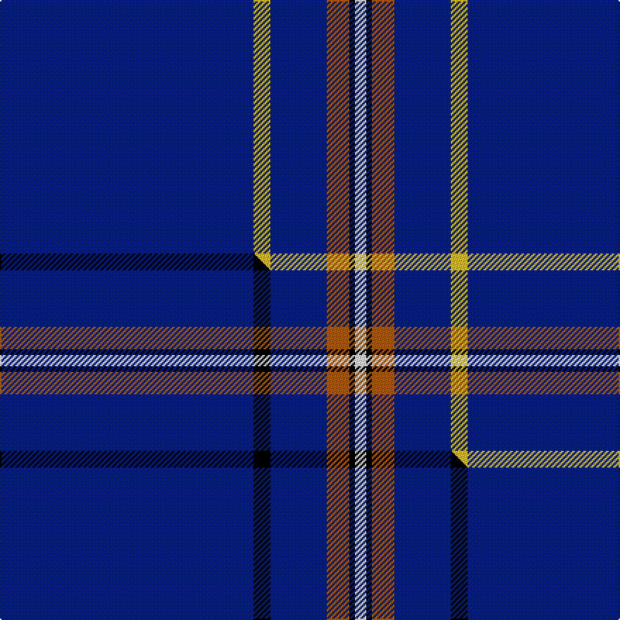

This is one **variant** — a specific cloth: this exact thread count and colourway, with its own
provenance below. It is one weaving of the [sett](/setts/db45ly3db10o4k1w2/) (the scale-free proportion — the
same cloth at any scale or shade), whose colour order is pattern [BYBRKW](/stripes/bybrkw/).

Part of the [Wylie](/tartans/w/wy/wylie/) tartan — the named design grouping this sett with its other cloths.

Sourced from tartans-authority.  It is a [6 stripe tartan](/stripes/stripes6/).

Original link [https://www.tartanregister.gov.uk/tartanDetails.aspx?ref=2465](https://www.tartanregister.gov.uk/tartanDetails.aspx?ref=2465)

Dataset <small>— provenance for this record, inherited from the source manifest</small>

<dl class="dataset-prov">
<dt>source</dt><dd><a href="/sources/tartans-authority/">Scottish Tartans Authority</a></dd>
<dt>data captured from</dt><dd><a href="https://github.com/thetartan/tartan-database/blob/master/data/tartans-authority/data.csv">https://github.com/thetartan/tartan-database/blob/master/data/tartans-authority/data.csv</a></dd>
<dt>data date</dt><dd>1998 <small>(this record)</small></dd>
<dt>licence</dt><dd><a href="https://creativecommons.org/licenses/by-nc-nd/4.0/">CC BY-NC-ND 4.0</a></dd>
</dl>

Capture chain <small>— the hands this data passed through, oldest first; each capture carries its own licence</small>

<ol class="capture-chain">
<li><a href="https://www.tartansauthority.com/">Scottish Tartans Authority</a> <small>the heritage body's archive — its tartan-ferret record browser is retired (links repaired to the SRT, above)</small></li>
<li><a href="https://github.com/thetartan/tartan-database">thetartan/tartan-database</a> <small>2016-2017</small> · <a href="https://creativecommons.org/licenses/by-nc-nd/4.0/">CC BY-NC-ND 4.0</a> <small>Levko Kravets's frozen compilation — the capture we vendored, and where its CC licence text came from</small></li>
<li>this dictionary <small>captured 2026-06-10 · commit 5bf86c7566</small> <small>each re-capture is a git commit to data/sources</small></li>
</ol>

## Register references

External register numbers recorded for this tartan.

- Scottish Tartans Authority (ITI): 2465

## Thread count
DB/180 LY12 DB40 O16 K4 W/8

One full sett is **332 threads**.

## Palette
<table><thead><tr><th>Colour</th><th>Shade</th><th>OKLCh</th></tr></thead><tbody><tr><td>DB</td><td><code style="background-color:#082077;">#082077</code> <small style="color:#888">#082077</small></td><td><small style="color:#888">oklch(30.0% 0.149 265.1)</small></td></tr><tr><td>O</td><td><code style="background-color:#A65C11;">#A65C11</code> <small style="color:#888">#A65C11</small></td><td><small style="color:#888">oklch(55.0% 0.125 58.3)</small></td></tr><tr><td>K</td><td><code style="background-color:#000000;">#000000</code> <small style="color:#888">#000000</small></td><td><small style="color:#888">oklch(0.0% 0.000 0.0)</small></td></tr><tr><td>W</td><td><code style="background-color:#F7F7F7;">#F7F7F7</code> <small style="color:#888">#F7F7F7</small></td><td><small style="color:#888">oklch(97.6% 0.000 89.9)</small></td></tr><tr><td>LY</td><td><code style="background-color:#DCBC32;">#DCBC32</code> <small style="color:#888">#DCBC32</small></td><td><small style="color:#888">oklch(80.0% 0.150 95.2)</small></td></tr></tbody></table>

# Sample pattern

## Compared to the master

This cloth is one sett of its design; the master sett (the exemplar the design is anchored on) is below for comparison.

Its **ΔTartan distance** from the master is **0.30** — the same measure the nearest-tartans table ranks by (0 is identical; a re-scale of the same cloth is near 0, a recolour or a different proportion further).

<figure class="master-compare" style="margin:0">

this sett
master sett ★

<figcaption style="color:#888;font-size:smaller">One weave of this sett against the <a href="/setts/db45k3db10o4k1w2/">master sett ★</a>, split on the diagonal: a shared proportion runs seamlessly across it with only the shades shifting; a different proportion breaks on it.</figcaption>
</figure>

## Nearest tartan variants

The nearest existing variants by ΔTartan distance, with this cloth at the top so the swatches line up against it.

ΔTartan

Threads

Variant

Sett

—

332

<a href="/variants/s6/db45ly3db10o4k1w2~x4/">Wylie (Name)</a>

<a href="/ttd/edit/#slug=db45y3db10dg4k1w2~x2&amp;base=db45ly3db10o4k1w2~x4" title="compare in the TTD">0.32</a>

166

<a href="/variants/s6/db45y3db10dg4k1w2~x2/">Wylie</a>

<a href="/ttd/edit/#slug=db45k3db10o4k1w2~x4&amp;base=db45ly3db10o4k1w2~x4" title="compare in the TTD">0.90</a>

332

<a href="/variants/s6/db45k3db10o4k1w2~x4/">Wylie</a>

<a href="/ttd/edit/#slug=r5db40w1db13g8k4~x2&amp;base=db45ly3db10o4k1w2~x4" title="compare in the TTD">1.14</a>

266

<a href="/variants/s6/r5db40w1db13g8k4~x2/">London Scottish Rugby Club</a>

<a href="/ttd/edit/#slug=r5db40w1db13dg8k4~x2&amp;base=db45ly3db10o4k1w2~x4" title="compare in the TTD">1.14</a>

266

<a href="/variants/s6/r5db40w1db13dg8k4~x2/">London Caledonian Rugby Club</a>

<a href="/ttd/edit/#slug=r5ki40w1ki13g8k4~x2~ki0604259&amp;base=db45ly3db10o4k1w2~x4" title="compare in the TTD">1.14</a>

266

<a href="/variants/s6/r5ki40w1ki13g8k4~x2~ki0604259/">London Scottish Rugby Club</a>

<a href="/ttd/edit/#slug=db32r3db4k1y3&amp;base=db45ly3db10o4k1w2~x4" title="compare in the TTD">1.29</a>

51

<a href="/variants/s5/db32r3db4k1y3/">MacLaine of Lochbuie Hunting</a>

<a href="/ttd/edit/#slug=db32r3db4k1y3~x2&amp;base=db45ly3db10o4k1w2~x4" title="compare in the TTD">1.29</a>

102

<a href="/variants/s5/db32r3db4k1y3~x2/">MacLaine of Lochbuie Hunting Clan Tartan</a>

<a href="/ttd/edit/#slug=db12lb1k2db1r1~x8&amp;base=db45ly3db10o4k1w2~x4" title="compare in the TTD">1.41</a>

168

<a href="/variants/s5/db12lb1k2db1r1~x8/">Lochcarron (1985)</a>

<a href="/ttd/edit/#slug=db68lb7db16k16ly4~x2&amp;base=db45ly3db10o4k1w2~x4" title="compare in the TTD">1.45</a>

300

<a href="/variants/s5/db68lb7db16k16ly4~x2/">Burnetts &amp; Struth</a>

<a href="/ttd/edit/#slug=db35w4db10r3ri3r3~x4~r1706009-ri2109032&amp;base=db45ly3db10o4k1w2~x4" title="compare in the TTD">1.78</a>

312

<a href="/variants/s6/db35w4db10r3ri3r3~x4~r1706009-ri2109032/">Steffen, Morris (Personal)</a>

## Neighbour map

Every grey dot is one of 13621 variants placed by the first two principal components of the ΔTartan feature space (42% of its variance). Red is this tartan; blue dots are its nearest — click one to open its page.

<svg viewBox="0 0 640 380" role="img" style="max-width:100%;height:auto;border:1px solid #e0e0e0;border-radius:4px;display:block" xmlns="http://www.w3.org/2000/svg"><image href="/nn/cloud.v1.png" width="640" height="380"/><a href="/variants/s6/db45y3db10dg4k1w2~x2/"><circle cx="582.8" cy="99.4" r="4" fill="#3465a4"><title>Wylie</title></circle></a><a href="/variants/s6/db45k3db10o4k1w2~x4/"><circle cx="559.6" cy="89.4" r="4" fill="#3465a4"><title>Wylie</title></circle></a><a href="/variants/s6/r5db40w1db13g8k4~x2/"><circle cx="448.1" cy="111.4" r="4" fill="#3465a4"><title>London Scottish Rugby Club</title></circle></a><a href="/variants/s6/r5db40w1db13dg8k4~x2/"><circle cx="478.5" cy="120.5" r="4" fill="#3465a4"><title>London Caledonian Rugby Club</title></circle></a><a href="/variants/s6/r5ki40w1ki13g8k4~x2~ki0604259/"><circle cx="430.0" cy="103.4" r="4" fill="#3465a4"><title>London Scottish Rugby Club</title></circle></a><a href="/variants/s5/db32r3db4k1y3/"><circle cx="589.6" cy="135.3" r="4" fill="#3465a4"><title>MacLaine of Lochbuie Hunting</title></circle></a><a href="/variants/s5/db32r3db4k1y3~x2/"><circle cx="589.6" cy="135.3" r="4" fill="#3465a4"><title>MacLaine of Lochbuie Hunting Clan Tartan</title></circle></a><a href="/variants/s5/db12lb1k2db1r1~x8/"><circle cx="459.8" cy="167.6" r="4" fill="#3465a4"><title>Lochcarron (1985)</title></circle></a><a href="/variants/s5/db68lb7db16k16ly4~x2/"><circle cx="445.5" cy="167.8" r="4" fill="#3465a4"><title>Burnetts &amp; Struth</title></circle></a><a href="/variants/s6/db35w4db10r3ri3r3~x4~r1706009-ri2109032/"><circle cx="467.2" cy="171.8" r="4" fill="#3465a4"><title>Steffen, Morris (Personal)</title></circle></a><circle cx="542.7" cy="84.7" r="5" fill="#c00000"/><text x="320" y="376" text-anchor="middle" font-size="11" fill="#999">ground</text><text x="11" y="190" text-anchor="middle" font-size="11" fill="#999" transform="rotate(-90 11 190)">complexity</text></svg>

ID: /variants/s6/db45ly3db10o4k1w2~x4/
