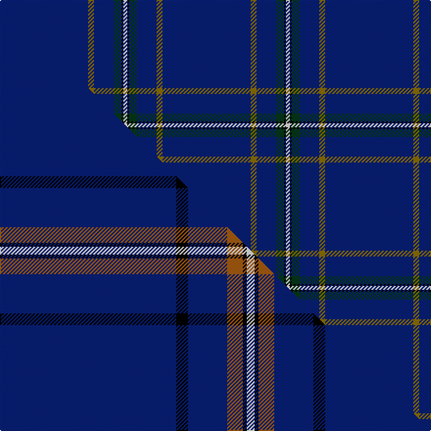

This page is one **sett** — a single exact thread-count. It belongs to the [tartan](/setts/db45y3db10dg4k1w2/)
(the same proportion at any scale), whose colour order is pattern [BGBGKW](/stripes/bgbgkw/).

Part of the [Wylie](/tartans/wylie/) tartan — the named design grouping this sett with its other cloths.

Sourced from weddslist.  It is a [6 stripe tartan](/stripes/stripes6/).

Original link http://www.weddslist.com/cgi-bin/tartans/pg.pl?source=sts

## Thread count
DB/90 Y6 DB20 DG8 K2 W/4

One full sett is **166 threads**.

## Palette
<table><thead><tr><th>Colour</th><th>Shade</th><th>OKLCh</th></tr></thead><tbody><tr><td>DB</td><td><code style="background-color:#082077;">#082077</code> <small style="color:#888">#082077</small></td><td><small style="color:#888">oklch(30.0% 0.149 265.1)</small></td></tr><tr><td>K</td><td><code style="background-color:#000000;">#000000</code> <small style="color:#888">#000000</small></td><td><small style="color:#888">oklch(0.0% 0.000 0.0)</small></td></tr><tr><td>W</td><td><code style="background-color:#F7F7F7;">#F7F7F7</code> <small style="color:#888">#F7F7F7</small></td><td><small style="color:#888">oklch(97.6% 0.000 89.9)</small></td></tr><tr><td>DG</td><td><code style="background-color:#053819;">#053819</code> <small style="color:#888">#053819</small></td><td><small style="color:#888">oklch(30.0% 0.075 151.3)</small></td></tr><tr><td>Y</td><td><code style="background-color:#8B6E00;">#8B6E00</code> <small style="color:#888">#8B6E00</small></td><td><small style="color:#888">oklch(55.1% 0.113 90.4)</small></td></tr></tbody></table>

# Sample pattern

## Compared to the master

This cloth is one sett of its design; the master sett (the exemplar the design is anchored on) is below for comparison.

Its **ΔTartan distance** from the master is **1.07** — the same measure the nearest-tartans table ranks by (0 is identical; a re-scale of the same cloth is near 0, a recolour or a different proportion further).

<figure class="master-compare" style="margin:0">

this sett
master sett ★

<figcaption style="color:#888;font-size:smaller">One weave of this sett against the <a href="/setts/db45k3db10o4k1w2/">master sett ★</a>, split on the diagonal: a shared proportion runs seamlessly across it with only the shades shifting; a different proportion breaks on it.</figcaption>
</figure>

## Nearest tartan variants

The nearest existing variants by ΔTartan distance, with this cloth at the top so the swatches line up against it.

ΔTartan

Threads

Variant

Sett

—

166

<a href="/variants/s6/db45y3db10dg4k1w2~x2/">Wylie</a>

<a href="/ttd/edit/#slug=db45ly3db10o4k1w2~x4&amp;base=db45y3db10dg4k1w2~x2" title="compare in the TTD">0.30</a>

332

<a href="/variants/s6/db45ly3db10o4k1w2~x4/">Wylie (Name)</a>

<a href="/ttd/edit/#slug=r5db40w1db13dg8k4~x2&amp;base=db45y3db10dg4k1w2~x2" title="compare in the TTD">0.84</a>

266

<a href="/variants/s6/r5db40w1db13dg8k4~x2/">London Caledonian Rugby Club</a>

<a href="/ttd/edit/#slug=r5db40w1db13g8k4~x2&amp;base=db45y3db10dg4k1w2~x2" title="compare in the TTD">0.84</a>

266

<a href="/variants/s6/r5db40w1db13g8k4~x2/">London Scottish Rugby Club</a>

<a href="/ttd/edit/#slug=r5ki40w1ki13g8k4~x2~ki0604259&amp;base=db45y3db10dg4k1w2~x2" title="compare in the TTD">0.84</a>

266

<a href="/variants/s6/r5ki40w1ki13g8k4~x2~ki0604259/">London Scottish Rugby Club</a>

<a href="/ttd/edit/#slug=db45k3db10o4k1w2~x4&amp;base=db45y3db10dg4k1w2~x2" title="compare in the TTD">1.20</a>

332

<a href="/variants/s6/db45k3db10o4k1w2~x4/">Wylie</a>

<a href="/ttd/edit/#slug=db32r3db4k1y3&amp;base=db45y3db10dg4k1w2~x2" title="compare in the TTD">1.30</a>

51

<a href="/variants/s5/db32r3db4k1y3/">MacLaine of Lochbuie Hunting</a>

<a href="/ttd/edit/#slug=db32r3db4k1y3~x2&amp;base=db45y3db10dg4k1w2~x2" title="compare in the TTD">1.30</a>

102

<a href="/variants/s5/db32r3db4k1y3~x2/">MacLaine of Lochbuie, hunting</a>

<a href="/ttd/edit/#slug=db68lb7db16k16ly4~x2&amp;base=db45y3db10dg4k1w2~x2" title="compare in the TTD">1.45</a>

300

<a href="/variants/s5/db68lb7db16k16ly4~x2/">Burnetts &amp; Struth</a>

<a href="/ttd/edit/#slug=db12lb1k2db1r1~x8&amp;base=db45y3db10dg4k1w2~x2" title="compare in the TTD">1.50</a>

168

<a href="/variants/s5/db12lb1k2db1r1~x8/">Lochcarron (1985)</a>

<a href="/ttd/edit/#slug=db62w4k2w7dp2g3y2db16~x2&amp;base=db45y3db10dg4k1w2~x2" title="compare in the TTD">1.56</a>

236

<a href="/variants/s8/db62w4k2w7dp2g3y2db16~x2/">Boat of Garten</a>

## Neighbour map

Every grey dot is one of 13620 variants placed by the first two principal components of the ΔTartan feature space (42% of its variance). Red is this tartan; blue dots are its nearest — click one to open its page.

<svg viewBox="0 0 640 380" role="img" style="max-width:100%;height:auto;border:1px solid #e0e0e0;border-radius:4px;display:block" xmlns="http://www.w3.org/2000/svg"><image href="/nn/cloud.v1.png" width="640" height="380"/><a href="/variants/s6/db45ly3db10o4k1w2~x4/"><circle cx="542.8" cy="84.8" r="4" fill="#3465a4"><title>Wylie (Name)</title></circle></a><a href="/variants/s6/r5db40w1db13dg8k4~x2/"><circle cx="478.6" cy="120.6" r="4" fill="#3465a4"><title>London Caledonian Rugby Club</title></circle></a><a href="/variants/s6/r5db40w1db13g8k4~x2/"><circle cx="448.2" cy="111.5" r="4" fill="#3465a4"><title>London Scottish Rugby Club</title></circle></a><a href="/variants/s6/r5ki40w1ki13g8k4~x2~ki0604259/"><circle cx="430.1" cy="103.4" r="4" fill="#3465a4"><title>London Scottish Rugby Club</title></circle></a><a href="/variants/s6/db45k3db10o4k1w2~x4/"><circle cx="559.7" cy="89.5" r="4" fill="#3465a4"><title>Wylie</title></circle></a><a href="/variants/s5/db32r3db4k1y3/"><circle cx="589.6" cy="135.4" r="4" fill="#3465a4"><title>MacLaine of Lochbuie Hunting</title></circle></a><a href="/variants/s5/db32r3db4k1y3~x2/"><circle cx="589.6" cy="135.4" r="4" fill="#3465a4"><title>MacLaine of Lochbuie, hunting</title></circle></a><a href="/variants/s5/db68lb7db16k16ly4~x2/"><circle cx="445.5" cy="167.6" r="4" fill="#3465a4"><title>Burnetts &amp; Struth</title></circle></a><a href="/variants/s5/db12lb1k2db1r1~x8/"><circle cx="459.8" cy="167.4" r="4" fill="#3465a4"><title>Lochcarron (1985)</title></circle></a><a href="/variants/s8/db62w4k2w7dp2g3y2db16~x2/"><circle cx="461.3" cy="71.0" r="4" fill="#3465a4"><title>Boat of Garten</title></circle></a><circle cx="582.9" cy="99.6" r="5" fill="#c00000"/><text x="320" y="376" text-anchor="middle" font-size="11" fill="#999">ground</text><text x="11" y="190" text-anchor="middle" font-size="11" fill="#999" transform="rotate(-90 11 190)">complexity</text></svg>

ID: /variants/s6/db45y3db10dg4k1w2~x2/
