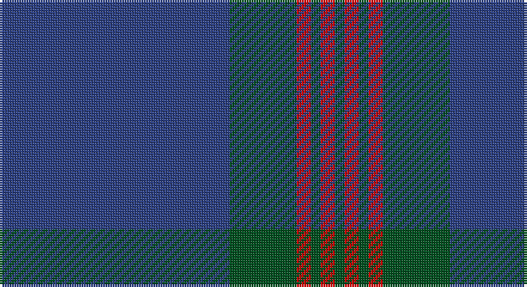

This page is one **sett** — a single exact thread-count. It belongs to the [tartan](/setts/db48dg14r3dg2r3dg2/)
(the same proportion at any scale), whose colour order is pattern [BGRGRG](/stripes/bgrgrg/).

Part of the [Wilson](/tartans/wilson/) tartan — the named design grouping this sett with its other cloths.

Sourced from register-of-tartans.  It is a [6 stripe tartan](/stripes/stripes6/).

Original link https://www.tartanregister.gov.uk/tartanDetails.aspx?ref=4633

## Also known as

This cloth is also recorded under:

- Wilson #2
- Wilson, Janet

## Register references

External register numbers recorded for this tartan.

- Scottish Register of Tartans: [4633](https://www.tartanregister.gov.uk/tartanDetails.aspx?ref=4633)
- Scottish Tartans World Register: 180

## Thread count
B/96 G28 R6 G4 R6 G/4

One full sett is **188 threads**.

## Palette

Palette: <strong>Tartan Register</strong>
<table><thead><tr><th>Colour</th><th>Threads</th><th>Shade</th><th>Base</th><th>OKLCh</th></tr></thead><tbody><tr><td>B/</td><td style="text-align:right;font-variant-numeric:tabular-nums">96</td><td><code style="background-color:#2C4084;">#2C4084</code> <small style="color:#888">#2C4084</small></td><td>B <code style="background-color:#2A418A;">#2A418A</code></td><td><small style="color:#888">oklch(39.4% 0.117 268.3)</small></td></tr><tr><td>G</td><td style="text-align:right;font-variant-numeric:tabular-nums">28</td><td><code style="background-color:#005020;">#005020</code> <small style="color:#888">#005020</small></td><td>G <code style="background-color:#006100;">#006100</code></td><td><small style="color:#888">oklch(37.7% 0.105 149.6)</small></td></tr><tr><td>R</td><td style="text-align:right;font-variant-numeric:tabular-nums">6</td><td><code style="background-color:#DC0000;">#DC0000</code> <small style="color:#888">#DC0000</small></td><td>R <code style="background-color:#CC0000;">#CC0000</code></td><td><small style="color:#888">oklch(56.2% 0.230 29.2)</small></td></tr><tr><td>G</td><td style="text-align:right;font-variant-numeric:tabular-nums">4</td><td><code style="background-color:#005020;">#005020</code> <small style="color:#888">#005020</small></td><td>G <code style="background-color:#006100;">#006100</code></td><td><small style="color:#888">oklch(37.7% 0.105 149.6)</small></td></tr><tr><td>R</td><td style="text-align:right;font-variant-numeric:tabular-nums">6</td><td><code style="background-color:#DC0000;">#DC0000</code> <small style="color:#888">#DC0000</small></td><td>R <code style="background-color:#CC0000;">#CC0000</code></td><td><small style="color:#888">oklch(56.2% 0.230 29.2)</small></td></tr><tr><td>G/</td><td style="text-align:right;font-variant-numeric:tabular-nums">4</td><td><code style="background-color:#005020;">#005020</code> <small style="color:#888">#005020</small></td><td>G <code style="background-color:#006100;">#006100</code></td><td><small style="color:#888">oklch(37.7% 0.105 149.6)</small></td></tr></tbody></table>

# Sample pattern

## Compared to the master

This cloth is one sett of its design; the master sett (the exemplar the design is anchored on) is below for comparison.

<figure style="margin:0"><figcaption style="color:#888;font-size:smaller">this sett</figcaption></figure>
<figure style="margin:0"><figcaption style="color:#888;font-size:smaller"><a href="/setts/db30w2t3dg3t3dg3t3dg16r3dg3r3dg3r3dg3r3dg25r15dg4t4r8w2r15/">master sett →</a></figcaption></figure>

## Nearest tartans

The nearest existing variants by ΔTartan distance, with this tartan at the top so the swatches line up against it.

ΔTartan

Tartan

Sett

—

<a href="/ttd/edit/#slug=db48dg14r3dg2r3dg2~x2">Wilson #2</a> <a class="nn-out" href="/variants/s6/db48dg14r3dg2r3dg2~x2/" title="open its dictionary page">↗</a>

0.25

<a href="/ttd/edit/#slug=db64dg20r4dg3r4dg3&amp;base=db48dg14r3dg2r3dg2~x2">Wilson</a> <a class="nn-out" href="/variants/s6/db64dg20r4dg3r4dg3/" title="open its dictionary page">↗</a>

1.17

<a href="/ttd/edit/#slug=db48g14r3g2r3g2~x2&amp;base=db48dg14r3dg2r3dg2~x2">Wilson</a> <a class="nn-out" href="/variants/s6/db48g14r3g2r3g2~x2/" title="open its dictionary page">↗</a>

1.25

<a href="/ttd/edit/#slug=db64g20r4g3r4g3&amp;base=db48dg14r3dg2r3dg2~x2">Wilson</a> <a class="nn-out" href="/variants/s6/db64g20r4g3r4g3/" title="open its dictionary page">↗</a>

1.44

<a href="/ttd/edit/#slug=db56lo2dg19lo1dg2lo1db2~x2&amp;base=db48dg14r3dg2r3dg2~x2">Lewis Welsh Name Tartan</a> <a class="nn-out" href="/variants/s7/db56lo2dg19lo1dg2lo1db2~x2/" title="open its dictionary page">↗</a>

1.50

<a href="/ttd/edit/#slug=ly4dt3ly1dt17db40dt2db3~x2&amp;base=db48dg14r3dg2r3dg2~x2">Danzas</a> <a class="nn-out" href="/variants/s7/ly4dt3ly1dt17db40dt2db3~x2/" title="open its dictionary page">↗</a>

1.62

<a href="/ttd/edit/#slug=t60db19w3db2r2db7~x2&amp;base=db48dg14r3dg2r3dg2~x2">Federal Bureaux of Investigation</a> <a class="nn-out" href="/variants/s6/t60db19w3db2r2db7~x2/" title="open its dictionary page">↗</a>

1.62

<a href="/variants/s6/n65ki2n4k2n10r24~x2/">Norsemen, The</a>

1.65

<a href="/ttd/edit/#slug=db50do4db12do23ly4do4~x2&amp;base=db48dg14r3dg2r3dg2~x2">Sligo, County</a> <a class="nn-out" href="/variants/s6/db50do4db12do23ly4do4~x2/" title="open its dictionary page">↗</a>

1.68

<a href="/ttd/edit/#slug=dt29b2dt1b1dt1b1db8ly1~x4&amp;base=db48dg14r3dg2r3dg2~x2">Marist School, The</a> <a class="nn-out" href="/variants/s8/dt29b2dt1b1dt1b1db8ly1~x4/" title="open its dictionary page">↗</a>

1.71

<a href="/ttd/edit/#slug=db80k5g12k2ly2g2k10~x2&amp;base=db48dg14r3dg2r3dg2~x2">Affara (Personal)</a> <a class="nn-out" href="/variants/s7/db80k5g12k2ly2g2k10~x2/" title="open its dictionary page">↗</a>

## Neighbour map

Every grey dot is one of 14360 variants placed by the first two principal components of the ΔTartan feature space (44% of its variance). Red is this tartan; blue dots are its nearest — click one to open its page.

<svg viewBox="0 0 640 380" role="img" style="max-width:100%;height:auto;border:1px solid #e0e0e0;border-radius:4px;display:block" xmlns="http://www.w3.org/2000/svg"><image href="/nn/cloud.v1.png" width="640" height="380"/><a href="/variants/s6/db64dg20r4dg3r4dg3/"><circle cx="506.3" cy="211.1" r="4" fill="#3465a4"><title>Wilson</title></circle></a><a href="/variants/s6/db48g14r3g2r3g2~x2/"><circle cx="489.6" cy="188.6" r="4" fill="#3465a4"><title>Wilson</title></circle></a><a href="/variants/s6/db64g20r4g3r4g3/"><circle cx="474.1" cy="193.5" r="4" fill="#3465a4"><title>Wilson</title></circle></a><a href="/variants/s7/db56lo2dg19lo1dg2lo1db2~x2/"><circle cx="581.1" cy="169.3" r="4" fill="#3465a4"><title>Lewis Welsh Name Tartan</title></circle></a><a href="/variants/s7/ly4dt3ly1dt17db40dt2db3~x2/"><circle cx="476.0" cy="171.4" r="4" fill="#3465a4"><title>Danzas</title></circle></a><a href="/variants/s6/t60db19w3db2r2db7~x2/"><circle cx="499.5" cy="181.5" r="4" fill="#3465a4"><title>Federal Bureaux of Investigation</title></circle></a><a href="/variants/s6/n65ki2n4k2n10r24~x2/"><circle cx="551.6" cy="177.2" r="4" fill="#3465a4"><title>Norsemen, The</title></circle></a><a href="/variants/s6/db50do4db12do23ly4do4~x2/"><circle cx="472.0" cy="248.4" r="4" fill="#3465a4"><title>Sligo, County</title></circle></a><a href="/variants/s8/dt29b2dt1b1dt1b1db8ly1~x4/"><circle cx="530.0" cy="161.5" r="4" fill="#3465a4"><title>Marist School, The</title></circle></a><a href="/variants/s7/db80k5g12k2ly2g2k10~x2/"><circle cx="535.2" cy="149.2" r="4" fill="#3465a4"><title>Affara (Personal)</title></circle></a><circle cx="520.3" cy="205.4" r="5" fill="#c00000"/></svg>

ID: /variants/s6/db48dg14r3dg2r3dg2~x2/
