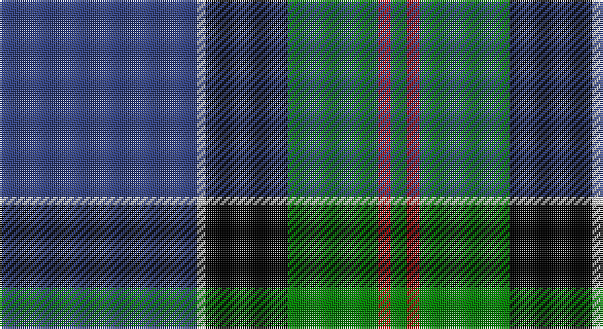

This page is one **sett** — a single exact thread-count. It belongs to the [tartan](/setts/db48w2k20g22r3g4/)
(the same proportion at any scale), whose colour order is pattern [BWKGRG](/stripes/bwkgrg/).

Part of the [MacFadzean](/tartans/macfadzean/) tartan — the named design grouping this sett with its other cloths.

Sourced from weddslist.  It is a [6 stripe tartan](/stripes/stripes6/).

Original link http://www.weddslist.com/cgi-bin/tartans/pg.pl?source=sts

## Provenance

Earliest known date: pre 2003 Nothing

2 attestations — the source records this cloth was collapsed from (oldest owns this page)

<ul>
<li>undated — MacFadzean (weddslist, <a href="http://www.weddslist.com/cgi-bin/tartans/pg.pl?source=sts">record</a>)</li>
<li>undated — MacFadzean Clan Tartan (house-of-tartan, <a href="http://www.house-of-tartan.scotland.net/house/TartanViewjs.asp?colr=Def&tnam=645">record</a>)</li>
</ul>

## Thread count
B/96 LN4 K40 G44 R6 G/8

One full sett is **292 threads**.

## Palette

Palette: <strong>Tartan Register</strong> <small style="color:#888">(2 of 5 colours)</small>
<table><thead><tr><th>Colour</th><th>Threads</th><th>Shade</th><th>Base</th><th>OKLCh</th></tr></thead><tbody><tr><td>B/</td><td style="text-align:right;font-variant-numeric:tabular-nums">96</td><td><code style="background-color:#304080;">#304080</code> <small style="color:#888">#304080</small></td><td>B <code style="background-color:#2A418A;">#2A418A</code></td><td><small style="color:#888">oklch(39.4% 0.109 270.2)</small></td></tr><tr><td>LN</td><td style="text-align:right;font-variant-numeric:tabular-nums">4</td><td><code style="background-color:#E0E0E0;">#E0E0E0</code> <small style="color:#888">#E0E0E0</small></td><td>W <code style="background-color:#F7F7F7;">#F7F7F7</code></td><td><small style="color:#888">oklch(90.7% 0.000 89.9)</small></td></tr><tr><td>K</td><td style="text-align:right;font-variant-numeric:tabular-nums">40</td><td><code style="background-color:#000000;">#000000</code> <small style="color:#888">#000000</small></td><td>K <code style="background-color:#000000;">#000000</code></td><td><small style="color:#888">oklch(0.0% 0.000 0.0)</small></td></tr><tr><td>G</td><td style="text-align:right;font-variant-numeric:tabular-nums">44</td><td><code style="background-color:#008000;">#008000</code> <small style="color:#888">#008000</small></td><td>G <code style="background-color:#006100;">#006100</code></td><td><small style="color:#888">oklch(52.0% 0.177 142.5)</small></td></tr><tr><td>R</td><td style="text-align:right;font-variant-numeric:tabular-nums">6</td><td><code style="background-color:#C00000;">#C00000</code> <small style="color:#888">#C00000</small></td><td>R <code style="background-color:#CC0000;">#CC0000</code></td><td><small style="color:#888">oklch(50.7% 0.208 29.2)</small></td></tr><tr><td>G/</td><td style="text-align:right;font-variant-numeric:tabular-nums">8</td><td><code style="background-color:#008000;">#008000</code> <small style="color:#888">#008000</small></td><td>G <code style="background-color:#006100;">#006100</code></td><td><small style="color:#888">oklch(52.0% 0.177 142.5)</small></td></tr></tbody></table>

# Sample pattern

## Compared to the master

This cloth is one sett of its design; the master sett (the exemplar the design is anchored on) is below for comparison.

<figure style="margin:0"><figcaption style="color:#888;font-size:smaller">this sett</figcaption></figure>
<figure style="margin:0"><figcaption style="color:#888;font-size:smaller"><a href="/setts/db48w2k20dg22r3dg4/">master sett →</a></figcaption></figure>

## Nearest tartans

The nearest existing variants by ΔTartan distance, with this tartan at the top so the swatches line up against it.

ΔTartan

Tartan

Sett

—

<a href="/ttd/edit/#slug=db48w2k20g22r3g4~x2">MacFadzean</a> <a class="nn-out" href="/variants/s6/db48w2k20g22r3g4~x2/" title="open its dictionary page">↗</a>

0.54

<a href="/ttd/edit/#slug=db24k8g8r2g8k1w2~x2&amp;base=db48w2k20g22r3g4~x2">Ferguson of Athol</a> <a class="nn-out" href="/variants/s7/db24k8g8r2g8k1w2~x2/" title="open its dictionary page">↗</a>

0.58

<a href="/ttd/edit/#slug=db24k8g8r2g8k1ly2~x2&amp;base=db48w2k20g22r3g4~x2">MacLaren</a> <a class="nn-out" href="/variants/s7/db24k8g8r2g8k1ly2~x2/" title="open its dictionary page">↗</a>

0.98

<a href="/ttd/edit/#slug=k7db4dg31db3ly2db27lb4~x2&amp;base=db48w2k20g22r3g4~x2">Wishart Htg (Clan)</a> <a class="nn-out" href="/variants/s7/k7db4dg31db3ly2db27lb4~x2/" title="open its dictionary page">↗</a>

0.99

<a href="/ttd/edit/#slug=db24k8g8dp2g8k1w2~x2&amp;base=db48w2k20g22r3g4~x2">Alexander</a> <a class="nn-out" href="/variants/s7/db24k8g8dp2g8k1w2~x2/" title="open its dictionary page">↗</a>

1.03

<a href="/ttd/edit/#slug=db24k8dg8r2dg8k1ly2&amp;base=db48w2k20g22r3g4~x2">MacLaren</a> <a class="nn-out" href="/variants/s7/db24k8dg8r2dg8k1ly2/" title="open its dictionary page">↗</a>

1.07

<a href="/ttd/edit/#slug=db32k12db12g6r6g18k2ly3~x2&amp;base=db48w2k20g22r3g4~x2">Gillies</a> <a class="nn-out" href="/variants/s8/db32k12db12g6r6g18k2ly3~x2/" title="open its dictionary page">↗</a>

1.08

<a href="/ttd/edit/#slug=lo8k2dt20t4w1k2~x4&amp;base=db48w2k20g22r3g4~x2">Solberg-Bell (Personal)</a> <a class="nn-out" href="/variants/s6/lo8k2dt20t4w1k2~x4/" title="open its dictionary page">↗</a>

1.08

<a href="/ttd/edit/#slug=w10db2w1db35dg10lo3dg10r4~x2&amp;base=db48w2k20g22r3g4~x2">Sandelin #2 (Personal)</a> <a class="nn-out" href="/variants/s8/w10db2w1db35dg10lo3dg10r4~x2/" title="open its dictionary page">↗</a>

1.13

<a href="/ttd/edit/#slug=db4k2db16w1k8g24r4~x2&amp;base=db48w2k20g22r3g4~x2">Colquhoun</a> <a class="nn-out" href="/variants/s7/db4k2db16w1k8g24r4~x2/" title="open its dictionary page">↗</a>

1.15

<a href="/ttd/edit/#slug=r2w7db30g36ly2~x2&amp;base=db48w2k20g22r3g4~x2">Centennial-King George Lodge No.171</a> <a class="nn-out" href="/variants/s5/r2w7db30g36ly2~x2/" title="open its dictionary page">↗</a>

## Neighbour map

Every grey dot is one of 14360 variants placed by the first two principal components of the ΔTartan feature space (44% of its variance). Red is this tartan; blue dots are its nearest — click one to open its page.

<svg viewBox="0 0 640 380" role="img" style="max-width:100%;height:auto;border:1px solid #e0e0e0;border-radius:4px;display:block" xmlns="http://www.w3.org/2000/svg"><image href="/nn/cloud.v1.png" width="640" height="380"/><a href="/variants/s7/db24k8g8r2g8k1w2~x2/"><circle cx="234.4" cy="147.2" r="4" fill="#3465a4"><title>Ferguson of Athol</title></circle></a><a href="/variants/s7/db24k8g8r2g8k1ly2~x2/"><circle cx="236.1" cy="147.8" r="4" fill="#3465a4"><title>MacLaren</title></circle></a><a href="/variants/s7/k7db4dg31db3ly2db27lb4~x2/"><circle cx="246.6" cy="169.8" r="4" fill="#3465a4"><title>Wishart Htg (Clan)</title></circle></a><a href="/variants/s7/db24k8g8dp2g8k1w2~x2/"><circle cx="254.8" cy="159.8" r="4" fill="#3465a4"><title>Alexander</title></circle></a><a href="/variants/s7/db24k8dg8r2dg8k1ly2/"><circle cx="249.6" cy="160.5" r="4" fill="#3465a4"><title>MacLaren</title></circle></a><a href="/variants/s8/db32k12db12g6r6g18k2ly3~x2/"><circle cx="221.6" cy="168.7" r="4" fill="#3465a4"><title>Gillies</title></circle></a><a href="/variants/s6/lo8k2dt20t4w1k2~x4/"><circle cx="280.4" cy="148.7" r="4" fill="#3465a4"><title>Solberg-Bell (Personal)</title></circle></a><a href="/variants/s8/w10db2w1db35dg10lo3dg10r4~x2/"><circle cx="271.2" cy="114.3" r="4" fill="#3465a4"><title>Sandelin #2 (Personal)</title></circle></a><a href="/variants/s7/db4k2db16w1k8g24r4~x2/"><circle cx="212.5" cy="149.3" r="4" fill="#3465a4"><title>Colquhoun</title></circle></a><a href="/variants/s5/r2w7db30g36ly2~x2/"><circle cx="252.0" cy="172.2" r="4" fill="#3465a4"><title>Centennial-King George Lodge No.171</title></circle></a><circle cx="259.2" cy="155.4" r="5" fill="#c00000"/></svg>

ID: /variants/s6/db48w2k20g22r3g4~x2/
