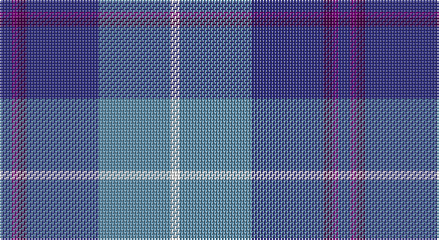

This page is one **sett** — a single exact thread-count. It belongs to the [tartan](/setts/db4dpi2dp3db24t24w3/)
(the same proportion at any scale), whose colour order is pattern [BBBBBW](/stripes/bbbbbw/).

Sourced from tartans-authority.  It is a [6 stripe tartan](/stripes/stripes6/).

Original link http://www.tartansauthority.com/tartan-ferret/display/11181/

## Also known as

This cloth is also recorded under:

- Aberdeen Academy of Performing Arts

## Register references

External register numbers recorded for this tartan.

- Scottish Register of Tartans: [11181](https://www.tartanregister.gov.uk/tartanDetails?ref=11181)
- Scottish Tartans Authority (ITI): 11181

## Thread count
DB/8 P4 DP6 DB48 B48 W/6

One full sett is **226 threads**.

## Palette

Palette: <strong>Tartan Register</strong>
<table><thead><tr><th>Colour</th><th>Threads</th><th>Shade</th><th>Base</th><th>OKLCh</th></tr></thead><tbody><tr><td>DB/</td><td style="text-align:right;font-variant-numeric:tabular-nums">8</td><td><code style="background-color:#2C2C80;">#2C2C80</code> <small style="color:#888">#2C2C80</small></td><td>B <code style="background-color:#2A418A;">#2A418A</code></td><td><small style="color:#888">oklch(35.0% 0.138 276.6)</small></td></tr><tr><td>P</td><td style="text-align:right;font-variant-numeric:tabular-nums">4</td><td><code style="background-color:#780078;">#780078</code> <small style="color:#888">#780078</small></td><td>B <code style="background-color:#2A418A;">#2A418A</code></td><td><small style="color:#888">oklch(40.2% 0.185 328.4)</small></td></tr><tr><td>DP</td><td style="text-align:right;font-variant-numeric:tabular-nums">6</td><td><code style="background-color:#440044;">#440044</code> <small style="color:#888">#440044</small></td><td>B <code style="background-color:#2A418A;">#2A418A</code></td><td><small style="color:#888">oklch(27.1% 0.125 328.4)</small></td></tr><tr><td>DB</td><td style="text-align:right;font-variant-numeric:tabular-nums">48</td><td><code style="background-color:#2C2C80;">#2C2C80</code> <small style="color:#888">#2C2C80</small></td><td>B <code style="background-color:#2A418A;">#2A418A</code></td><td><small style="color:#888">oklch(35.0% 0.138 276.6)</small></td></tr><tr><td>B</td><td style="text-align:right;font-variant-numeric:tabular-nums">48</td><td><code style="background-color:#5C8CA8;">#5C8CA8</code> <small style="color:#888">#5C8CA8</small></td><td>B <code style="background-color:#2A418A;">#2A418A</code></td><td><small style="color:#888">oklch(61.7% 0.067 235.0)</small></td></tr><tr><td>W/</td><td style="text-align:right;font-variant-numeric:tabular-nums">6</td><td><code style="background-color:#FCFCFC;">#FCFCFC</code> <small style="color:#888">#FCFCFC</small></td><td>W <code style="background-color:#F7F7F7;">#F7F7F7</code></td><td><small style="color:#888">oklch(99.1% 0.000 89.9)</small></td></tr></tbody></table>

# Sample pattern

## Nearest tartans

The nearest existing variants by ΔTartan distance, with this tartan at the top so the swatches line up against it.

ΔTartan

Tartan

Sett

—

<a href="/ttd/edit/#slug=db4dpi2dp3db24t24w3~x2">Aberdeen Academy of Performing Art</a> <a class="nn-out" href="/variants/s6/db4dpi2dp3db24t24w3~x2/" title="open its dictionary page">↗</a>

0.66

<a href="/ttd/edit/#slug=db4p2dp3db24b24w3~x2&amp;base=db4dpi2dp3db24t24w3~x2">Aberdeen Academy of Performing Arts</a> <a class="nn-out" href="/variants/s6/db4p2dp3db24b24w3~x2/" title="open its dictionary page">↗</a>

1.01

<a href="/ttd/edit/#slug=db35w3db8t36dg9o3~x2&amp;base=db4dpi2dp3db24t24w3~x2">Georgian Bay, Waters of</a> <a class="nn-out" href="/variants/s6/db35w3db8t36dg9o3~x2/" title="open its dictionary page">↗</a>

1.06

<a href="/ttd/edit/#slug=db3t24k11db20w2db5lo3~x2&amp;base=db4dpi2dp3db24t24w3~x2">Icelandair</a> <a class="nn-out" href="/variants/s7/db3t24k11db20w2db5lo3~x2/" title="open its dictionary page">↗</a>

1.13

<a href="/ttd/edit/#slug=w4db24ly2dbi24t5db4ly4~x2&amp;base=db4dpi2dp3db24t24w3~x2">Mina Perhonen Japanese Corporate Tartan</a> <a class="nn-out" href="/variants/s7/w4db24ly2dbi24t5db4ly4~x2/" title="open its dictionary page">↗</a>

1.15

<a href="/ttd/edit/#slug=db6lb2db2lb3db16b26r2~x2&amp;base=db4dpi2dp3db24t24w3~x2">Federal Bureau of Investigation</a> <a class="nn-out" href="/variants/s7/db6lb2db2lb3db16b26r2~x2/" title="open its dictionary page">↗</a>

1.17

<a href="/ttd/edit/#slug=w3dt2db15t15r2~x4&amp;base=db4dpi2dp3db24t24w3~x2">SABA</a> <a class="nn-out" href="/variants/s5/w3dt2db15t15r2~x4/" title="open its dictionary page">↗</a>

1.19

<a href="/ttd/edit/#slug=t3k2g2k1db10w1~x8&amp;base=db4dpi2dp3db24t24w3~x2">Isle of Harris (District)</a> <a class="nn-out" href="/variants/s6/t3k2g2k1db10w1~x8/" title="open its dictionary page">↗</a>

1.21

<a href="/ttd/edit/#slug=w1db15r1o10g2lp1~x4&amp;base=db4dpi2dp3db24t24w3~x2">Peterson, Oren (Name)</a> <a class="nn-out" href="/variants/s6/w1db15r1o10g2lp1~x4/" title="open its dictionary page">↗</a>

1.23

<a href="/ttd/edit/#slug=t12db6t50dbi39p12dp6p6w4&amp;base=db4dpi2dp3db24t24w3~x2">Pride of the Nation (Fashion)</a> <a class="nn-out" href="/variants/s8/t12db6t50dbi39p12dp6p6w4/" title="open its dictionary page">↗</a>

1.27

<a href="/ttd/edit/#slug=lb6lo6b21dt32r3~x2&amp;base=db4dpi2dp3db24t24w3~x2">Jamieson, Robert (Personal)</a> <a class="nn-out" href="/variants/s5/lb6lo6b21dt32r3~x2/" title="open its dictionary page">↗</a>

## Neighbour map

Every grey dot is one of 14360 variants placed by the first two principal components of the ΔTartan feature space (44% of its variance). Red is this tartan; blue dots are its nearest — click one to open its page.

<svg viewBox="0 0 640 380" role="img" style="max-width:100%;height:auto;border:1px solid #e0e0e0;border-radius:4px;display:block" xmlns="http://www.w3.org/2000/svg"><image href="/nn/cloud.v1.png" width="640" height="380"/><a href="/variants/s6/db4p2dp3db24b24w3~x2/"><circle cx="264.3" cy="188.9" r="4" fill="#3465a4"><title>Aberdeen Academy of Performing Arts</title></circle></a><a href="/variants/s6/db35w3db8t36dg9o3~x2/"><circle cx="247.7" cy="196.7" r="4" fill="#3465a4"><title>Georgian Bay, Waters of</title></circle></a><a href="/variants/s7/db3t24k11db20w2db5lo3~x2/"><circle cx="206.7" cy="188.5" r="4" fill="#3465a4"><title>Icelandair</title></circle></a><a href="/variants/s7/w4db24ly2dbi24t5db4ly4~x2/"><circle cx="212.6" cy="177.3" r="4" fill="#3465a4"><title>Mina Perhonen Japanese Corporate Tartan</title></circle></a><a href="/variants/s7/db6lb2db2lb3db16b26r2~x2/"><circle cx="288.2" cy="191.5" r="4" fill="#3465a4"><title>Federal Bureau of Investigation</title></circle></a><a href="/variants/s5/w3dt2db15t15r2~x4/"><circle cx="202.9" cy="219.6" r="4" fill="#3465a4"><title>SABA</title></circle></a><a href="/variants/s6/t3k2g2k1db10w1~x8/"><circle cx="243.1" cy="185.7" r="4" fill="#3465a4"><title>Isle of Harris (District)</title></circle></a><a href="/variants/s6/w1db15r1o10g2lp1~x4/"><circle cx="269.5" cy="150.4" r="4" fill="#3465a4"><title>Peterson, Oren (Name)</title></circle></a><a href="/variants/s8/t12db6t50dbi39p12dp6p6w4/"><circle cx="217.0" cy="153.8" r="4" fill="#3465a4"><title>Pride of the Nation (Fashion)</title></circle></a><a href="/variants/s5/lb6lo6b21dt32r3~x2/"><circle cx="240.9" cy="214.8" r="4" fill="#3465a4"><title>Jamieson, Robert (Personal)</title></circle></a><circle cx="265.6" cy="184.4" r="5" fill="#c00000"/></svg>

ID: /variants/s6/db4dpi2dp3db24t24w3~x2/
