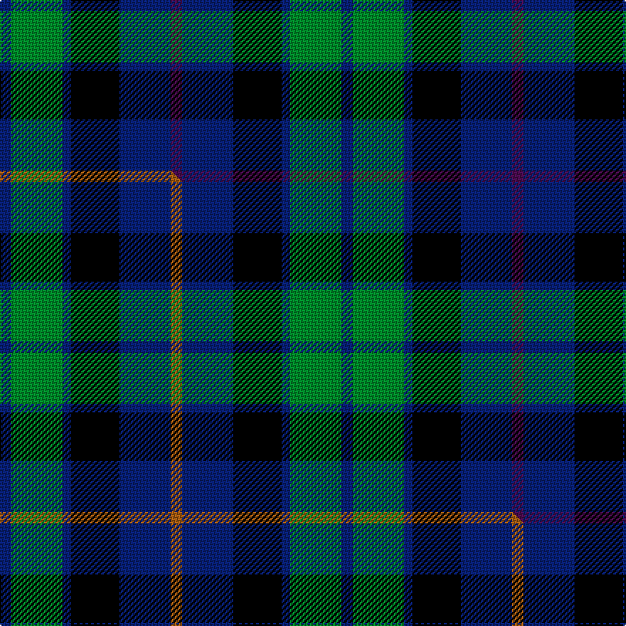

This page is one **sett** — a single exact thread-count. It belongs to the [tartan](/setts/db4g18db3k17db18dp4/)
(the same proportion at any scale), whose colour order is pattern [BBKBGB](/stripes/bbkbgb/).

Part of the [Scottish Airports](/tartans/scottish-airports/) tartan — the named design grouping this sett with its other cloths.

Sourced from tartans-authority.  It is a [6 stripe tartan](/stripes/stripes6/).

Original link http://www.tartansauthority.com/tartan-ferret/display/2510/

## Register references

External register numbers recorded for this tartan.

- Scottish Tartans Authority (ITI): 2510

## Thread count
DB/8 G36 DB6 K34 DB36 DP/8

One full sett is **240 threads**.

## Palette
<table><thead><tr><th>Colour</th><th>Shade</th><th>OKLCh</th></tr></thead><tbody><tr><td>G</td><td><code style="background-color:#008B2A;">#008B2A</code> <small style="color:#888">#008B2A</small></td><td><small style="color:#888">oklch(55.4% 0.170 145.9)</small></td></tr><tr><td>K</td><td><code style="background-color:#000000;">#000000</code> <small style="color:#888">#000000</small></td><td><small style="color:#888">oklch(0.0% 0.000 0.0)</small></td></tr><tr><td>DB</td><td><code style="background-color:#082077;">#082077</code> <small style="color:#888">#082077</small></td><td><small style="color:#888">oklch(30.0% 0.149 265.1)</small></td></tr><tr><td>DP</td><td><code style="background-color:#4B0B4F;">#4B0B4F</code> <small style="color:#888">#4B0B4F</small></td><td><small style="color:#888">oklch(30.1% 0.125 325.4)</small></td></tr></tbody></table>

# Sample pattern

## Compared to the master

This cloth is one sett of its design; the master sett (the exemplar the design is anchored on) is below for comparison.

Its **ΔTartan distance** from the master is **0.30** — the same measure the nearest-tartans table ranks by (0 is identical; a re-scale of the same cloth is near 0, a recolour or a different proportion further).

<figure class="master-compare" style="margin:0">

this sett
master sett ★

<figcaption style="color:#888;font-size:smaller">One weave of this sett against the <a href="/setts/db4g18db3k17db18o4/">master sett ★</a>, split on the diagonal: a shared proportion runs seamlessly across it with only the shades shifting; a different proportion breaks on it.</figcaption>
</figure>

## Nearest tartan variants

The nearest existing variants by ΔTartan distance, with this cloth at the top so the swatches line up against it.

ΔTartan

Threads

Variant

Sett

—

240

<a href="/variants/s6/db4g18db3k17db18dp4~x2/">Scottish Airports (Corporate)</a>

<a href="/ttd/edit/#slug=db4g18db3k17db18o4~x2&amp;base=db4g18db3k17db18dp4~x2" title="compare in the TTD">0.30</a>

240

<a href="/variants/s6/db4g18db3k17db18o4~x2/">Scottish Airports</a>

<a href="/ttd/edit/#slug=r1t7k4t1dg7t1~x4&amp;base=db4g18db3k17db18dp4~x2" title="compare in the TTD">0.67</a>

160

<a href="/variants/s6/r1t7k4t1dg7t1~x4/">Flower of Scotland Commemorative Tartan</a>

<a href="/ttd/edit/#slug=r1t7k4t1dg7t1~x2&amp;base=db4g18db3k17db18dp4~x2" title="compare in the TTD">0.67</a>

80

<a href="/variants/s6/r1t7k4t1dg7t1~x2/">Flower of Scotland MINI Tartan</a>

<a href="/ttd/edit/#slug=db3g28db3k16db28r3&amp;base=db4g18db3k17db18dp4~x2" title="compare in the TTD">0.70</a>

156

<a href="/variants/s6/db3g28db3k16db28r3/">Flower of Scotland</a>

<a href="/ttd/edit/#slug=dr2db9k5g6db1~x4&amp;base=db4g18db3k17db18dp4~x2" title="compare in the TTD">1.63</a>

172

<a href="/variants/s5/dr2db9k5g6db1~x4/">Frobo Nairn</a>

<a href="/ttd/edit/#slug=g7k6db7k1db2~x2&amp;base=db4g18db3k17db18dp4~x2" title="compare in the TTD">1.74</a>

74

<a href="/variants/s5/g7k6db7k1db2~x2/">Campbell of Glenlyon</a>

<a href="/ttd/edit/#slug=db1r1db6k6g6w1~x2&amp;base=db4g18db3k17db18dp4~x2" title="compare in the TTD">1.75</a>

80

<a href="/variants/s6/db1r1db6k6g6w1~x2/">Wellington</a>

<a href="/ttd/edit/#slug=db3g12k13w2db13w3~x2&amp;base=db4g18db3k17db18dp4~x2" title="compare in the TTD">1.76</a>

172

<a href="/variants/s6/db3g12k13w2db13w3~x2/">Herd/Hurd (Name)</a>

<a href="/ttd/edit/#slug=db3g12k13w2db13w3~x2~db1406275&amp;base=db4g18db3k17db18dp4~x2" title="compare in the TTD">1.76</a>

172

<a href="/variants/s6/db3g12k13w2db13w3~x2~db1406275/">Herd/Hurd</a>

<a href="/ttd/edit/#slug=b4g17k17db17r3db3~x2&amp;base=db4g18db3k17db18dp4~x2" title="compare in the TTD">1.76</a>

230

<a href="/variants/s6/b4g17k17db17r3db3~x2/">Royal Highland</a>

## Neighbour map

Every grey dot is one of 13620 variants placed by the first two principal components of the ΔTartan feature space (42% of its variance). Red is this tartan; blue dots are its nearest — click one to open its page.

<svg viewBox="0 0 640 380" role="img" style="max-width:100%;height:auto;border:1px solid #e0e0e0;border-radius:4px;display:block" xmlns="http://www.w3.org/2000/svg"><image href="/nn/cloud.v1.png" width="640" height="380"/><a href="/variants/s6/db4g18db3k17db18o4~x2/"><circle cx="151.2" cy="237.1" r="4" fill="#3465a4"><title>Scottish Airports</title></circle></a><a href="/variants/s6/r1t7k4t1dg7t1~x4/"><circle cx="193.2" cy="223.7" r="4" fill="#3465a4"><title>Flower of Scotland Commemorative Tartan</title></circle></a><a href="/variants/s6/r1t7k4t1dg7t1~x2/"><circle cx="193.2" cy="223.7" r="4" fill="#3465a4"><title>Flower of Scotland MINI Tartan</title></circle></a><a href="/variants/s6/db3g28db3k16db28r3/"><circle cx="197.6" cy="204.8" r="4" fill="#3465a4"><title>Flower of Scotland</title></circle></a><a href="/variants/s5/dr2db9k5g6db1~x4/"><circle cx="189.1" cy="233.4" r="4" fill="#3465a4"><title>Frobo Nairn</title></circle></a><a href="/variants/s5/g7k6db7k1db2~x2/"><circle cx="175.9" cy="261.6" r="4" fill="#3465a4"><title>Campbell of Glenlyon</title></circle></a><a href="/variants/s6/db1r1db6k6g6w1~x2/"><circle cx="96.7" cy="213.2" r="4" fill="#3465a4"><title>Wellington</title></circle></a><a href="/variants/s6/db3g12k13w2db13w3~x2/"><circle cx="107.1" cy="227.4" r="4" fill="#3465a4"><title>Herd/Hurd (Name)</title></circle></a><a href="/variants/s6/db3g12k13w2db13w3~x2~db1406275/"><circle cx="108.4" cy="226.8" r="4" fill="#3465a4"><title>Herd/Hurd</title></circle></a><a href="/variants/s6/b4g17k17db17r3db3~x2/"><circle cx="96.8" cy="222.3" r="4" fill="#3465a4"><title>Royal Highland</title></circle></a><circle cx="157.1" cy="238.9" r="5" fill="#c00000"/><text x="320" y="376" text-anchor="middle" font-size="11" fill="#999">ground</text><text x="11" y="190" text-anchor="middle" font-size="11" fill="#999" transform="rotate(-90 11 190)">complexity</text></svg>

ID: /variants/s6/db4g18db3k17db18dp4~x2/
