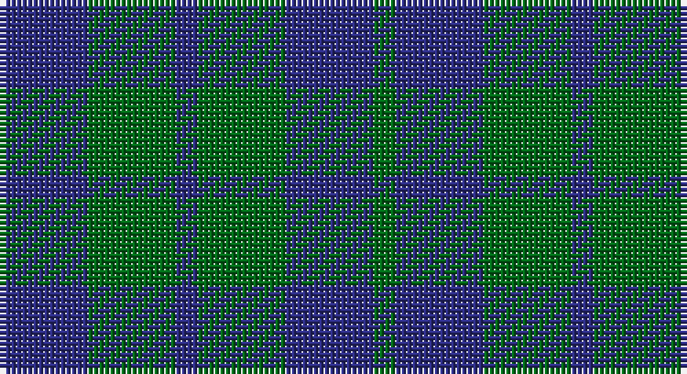

This page is one **sett** — a single exact thread-count. It belongs to the [tartan](/setts/db4g4db1g4db4g1/)
(the same proportion at any scale), whose colour order is pattern [BGBGBG](/stripes/bgbgbg/).

Part of the [Highland](/tartans/highland/) tartan — the named design grouping this sett with its other cloths.

Sourced from tartans-authority.  It is a [6 stripe tartan](/stripes/stripes6/).

Original link http://www.tartansauthority.com/tartan-ferret/display/9001/

## Also known as

This cloth is also recorded under:

- Highland Blue
- Highland Green
- Highland Grey
- Highland, Blue
- Highland, Green

## Register references

External register numbers recorded for this tartan.

- Scottish Register of Tartans: [9001](https://www.tartanregister.gov.uk/tartanDetails?ref=9001)
- Scottish Tartans Authority (ITI): 9001

## Thread count
DB/16 G16 DB4 G16 DB16 G/4

One full sett is **124 threads**.

## Palette

Palette: <strong>Tartan Register</strong>
<table><thead><tr><th>Colour</th><th>Threads</th><th>Shade</th><th>Base</th><th>OKLCh</th></tr></thead><tbody><tr><td>DB/</td><td style="text-align:right;font-variant-numeric:tabular-nums">16</td><td><code style="background-color:#2C2C80;">#2C2C80</code> <small style="color:#888">#2C2C80</small></td><td>B <code style="background-color:#2A418A;">#2A418A</code></td><td><small style="color:#888">oklch(35.0% 0.138 276.6)</small></td></tr><tr><td>G</td><td style="text-align:right;font-variant-numeric:tabular-nums">16</td><td><code style="background-color:#006818;">#006818</code> <small style="color:#888">#006818</small></td><td>G <code style="background-color:#006100;">#006100</code></td><td><small style="color:#888">oklch(45.0% 0.142 145.0)</small></td></tr><tr><td>DB</td><td style="text-align:right;font-variant-numeric:tabular-nums">4</td><td><code style="background-color:#2C2C80;">#2C2C80</code> <small style="color:#888">#2C2C80</small></td><td>B <code style="background-color:#2A418A;">#2A418A</code></td><td><small style="color:#888">oklch(35.0% 0.138 276.6)</small></td></tr><tr><td>G</td><td style="text-align:right;font-variant-numeric:tabular-nums">16</td><td><code style="background-color:#006818;">#006818</code> <small style="color:#888">#006818</small></td><td>G <code style="background-color:#006100;">#006100</code></td><td><small style="color:#888">oklch(45.0% 0.142 145.0)</small></td></tr><tr><td>DB</td><td style="text-align:right;font-variant-numeric:tabular-nums">16</td><td><code style="background-color:#2C2C80;">#2C2C80</code> <small style="color:#888">#2C2C80</small></td><td>B <code style="background-color:#2A418A;">#2A418A</code></td><td><small style="color:#888">oklch(35.0% 0.138 276.6)</small></td></tr><tr><td>G/</td><td style="text-align:right;font-variant-numeric:tabular-nums">4</td><td><code style="background-color:#006818;">#006818</code> <small style="color:#888">#006818</small></td><td>G <code style="background-color:#006100;">#006100</code></td><td><small style="color:#888">oklch(45.0% 0.142 145.0)</small></td></tr></tbody></table>

# Sample pattern

## Compared to the master

This cloth is one sett of its design; the master sett (the exemplar the design is anchored on) is below for comparison.

<figure style="margin:0"><figcaption style="color:#888;font-size:smaller">this sett</figcaption></figure>
<figure style="margin:0"><figcaption style="color:#888;font-size:smaller"><a href="/setts/g13db5ly3t6ly3db5n6db28w2db28n6db5ly3t6ly3db5g13dp4/">master sett →</a></figcaption></figure>

## Nearest tartans

The nearest existing variants by ΔTartan distance, with this tartan at the top so the swatches line up against it.

ΔTartan

Tartan

Sett

—

<a href="/ttd/edit/#slug=db4g4db1g4db4g1~x4">Highland Grey</a> <a class="nn-out" href="/variants/s6/db4g4db1g4db4g1~x4/" title="open its dictionary page">↗</a>

1.65

<a href="/ttd/edit/#slug=k5g14db12g4~x4&amp;base=db4g4db1g4db4g1~x4">MacCurdie (Clan?)</a> <a class="nn-out" href="/variants/s4/k5g14db12g4~x4/" title="open its dictionary page">↗</a>

1.81

<a href="/ttd/edit/#slug=dt12g8t4g8dt12t5&amp;base=db4g4db1g4db4g1~x4">Sheffield High School</a> <a class="nn-out" href="/variants/s6/dt12g8t4g8dt12t5/" title="open its dictionary page">↗</a>

1.87

<a href="/ttd/edit/#slug=db2dg7db7w1~x2&amp;base=db4g4db1g4db4g1~x4">Unidentified No 78</a> <a class="nn-out" href="/variants/s4/db2dg7db7w1~x2/" title="open its dictionary page">↗</a>

1.98

<a href="/ttd/edit/#slug=db11dg2db15dg18w2~x2&amp;base=db4g4db1g4db4g1~x4">Hamilton Hunting</a> <a class="nn-out" href="/variants/s5/db11dg2db15dg18w2~x2/" title="open its dictionary page">↗</a>

1.99

<a href="/variants/s4/g6db2g1~x4/">Montgomery</a>

1.99

<a href="/variants/s4/g6db2g1~x8/">Montgomery - 1842 (VS</a>

2.02

<a href="/ttd/edit/#slug=k19dg10k6dg10k12dg6k4dg14~x2&amp;base=db4g4db1g4db4g1~x4">Menzies Green</a> <a class="nn-out" href="/variants/s8/k19dg10k6dg10k12dg6k4dg14~x2/" title="open its dictionary page">↗</a>

2.04

<a href="/ttd/edit/#slug=k15dt40k9o10~x2&amp;base=db4g4db1g4db4g1~x4">Omega Delta Sigma, National Veterans Fraternity</a> <a class="nn-out" href="/variants/s4/k15dt40k9o10~x2/" title="open its dictionary page">↗</a>

2.11

<a href="/ttd/edit/#slug=db5g2db5g8w1~x8&amp;base=db4g4db1g4db4g1~x4">Hamilton, hunting</a> <a class="nn-out" href="/variants/s5/db5g2db5g8w1~x8/" title="open its dictionary page">↗</a>

2.11

<a href="/ttd/edit/#slug=db4k4db4g9k2~x2&amp;base=db4g4db1g4db4g1~x4">Austin Clan</a> <a class="nn-out" href="/variants/s5/db4k4db4g9k2~x2/" title="open its dictionary page">↗</a>

## Neighbour map

Every grey dot is one of 14360 variants placed by the first two principal components of the ΔTartan feature space (44% of its variance). Red is this tartan; blue dots are its nearest — click one to open its page.

<svg viewBox="0 0 640 380" role="img" style="max-width:100%;height:auto;border:1px solid #e0e0e0;border-radius:4px;display:block" xmlns="http://www.w3.org/2000/svg"><image href="/nn/cloud.v1.png" width="640" height="380"/><a href="/variants/s4/k5g14db12g4~x4/"><circle cx="265.3" cy="347.3" r="4" fill="#3465a4"><title>MacCurdie (Clan?)</title></circle></a><a href="/variants/s6/dt12g8t4g8dt12t5/"><circle cx="242.6" cy="365.6" r="4" fill="#3465a4"><title>Sheffield High School</title></circle></a><a href="/variants/s4/db2dg7db7w1~x2/"><circle cx="332.9" cy="305.1" r="4" fill="#3465a4"><title>Unidentified No 78</title></circle></a><a href="/variants/s5/db11dg2db15dg18w2~x2/"><circle cx="365.8" cy="292.4" r="4" fill="#3465a4"><title>Hamilton Hunting</title></circle></a><a href="/variants/s4/g6db2g1~x4/"><circle cx="426.2" cy="331.6" r="4" fill="#3465a4"><title>Montgomery</title></circle></a><a href="/variants/s4/g6db2g1~x8/"><circle cx="426.2" cy="331.6" r="4" fill="#3465a4"><title>Montgomery - 1842 (VS</title></circle></a><a href="/variants/s8/k19dg10k6dg10k12dg6k4dg14~x2/"><circle cx="358.0" cy="358.1" r="4" fill="#3465a4"><title>Menzies Green</title></circle></a><a href="/variants/s4/k15dt40k9o10~x2/"><circle cx="319.2" cy="322.0" r="4" fill="#3465a4"><title>Omega Delta Sigma, National Veterans Fraternity</title></circle></a><a href="/variants/s5/db5g2db5g8w1~x8/"><circle cx="285.1" cy="283.9" r="4" fill="#3465a4"><title>Hamilton, hunting</title></circle></a><a href="/variants/s5/db4k4db4g9k2~x2/"><circle cx="209.3" cy="324.9" r="4" fill="#3465a4"><title>Austin Clan</title></circle></a><circle cx="318.9" cy="351.4" r="5" fill="#c00000"/></svg>

ID: /variants/s6/db4g4db1g4db4g1~x4/
