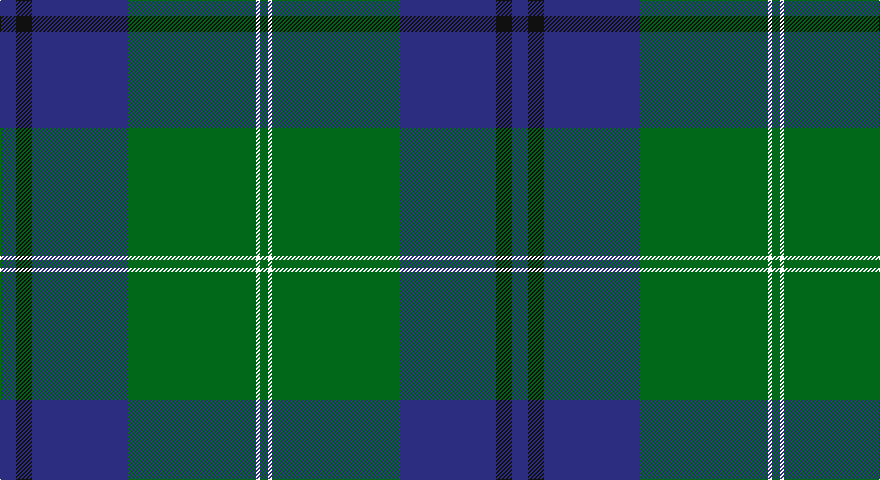

This page is one **sett** — a single exact thread-count. It belongs to the [tartan](/setts/db4k4db24g32w1g2/)
(the same proportion at any scale), whose colour order is pattern [BKBGWG](/stripes/bkbgwg/).

Part of the [Oliphant](/tartans/oliphant/) tartan — the named design grouping this sett with its other cloths.

Sourced from tartans-authority.  It is a [6 stripe tartan](/stripes/stripes6/).

Original link http://www.tartansauthority.com/tartan-ferret/display/242/

## Register references

External register numbers recorded for this tartan.

- Scottish Tartans Authority (ITI): 242

## Thread count
DB/16 K16 DB96 G128 W4 G/8

One full sett is **512 threads**.

## Palette

Palette: <strong>Tartan Register</strong>
<table><thead><tr><th>Colour</th><th>Threads</th><th>Shade</th><th>Base</th><th>OKLCh</th></tr></thead><tbody><tr><td>DB/</td><td style="text-align:right;font-variant-numeric:tabular-nums">16</td><td><code style="background-color:#2C2C80;">#2C2C80</code> <small style="color:#888">#2C2C80</small></td><td>B <code style="background-color:#2A418A;">#2A418A</code></td><td><small style="color:#888">oklch(35.0% 0.138 276.6)</small></td></tr><tr><td>K</td><td style="text-align:right;font-variant-numeric:tabular-nums">16</td><td><code style="background-color:#101010;">#101010</code> <small style="color:#888">#101010</small></td><td>K <code style="background-color:#000000;">#000000</code></td><td><small style="color:#888">oklch(17.3% 0.000 89.9)</small></td></tr><tr><td>DB</td><td style="text-align:right;font-variant-numeric:tabular-nums">96</td><td><code style="background-color:#2C2C80;">#2C2C80</code> <small style="color:#888">#2C2C80</small></td><td>B <code style="background-color:#2A418A;">#2A418A</code></td><td><small style="color:#888">oklch(35.0% 0.138 276.6)</small></td></tr><tr><td>G</td><td style="text-align:right;font-variant-numeric:tabular-nums">128</td><td><code style="background-color:#006818;">#006818</code> <small style="color:#888">#006818</small></td><td>G <code style="background-color:#006100;">#006100</code></td><td><small style="color:#888">oklch(45.0% 0.142 145.0)</small></td></tr><tr><td>W</td><td style="text-align:right;font-variant-numeric:tabular-nums">4</td><td><code style="background-color:#FCFCFC;">#FCFCFC</code> <small style="color:#888">#FCFCFC</small></td><td>W <code style="background-color:#F7F7F7;">#F7F7F7</code></td><td><small style="color:#888">oklch(99.1% 0.000 89.9)</small></td></tr><tr><td>G/</td><td style="text-align:right;font-variant-numeric:tabular-nums">8</td><td><code style="background-color:#006818;">#006818</code> <small style="color:#888">#006818</small></td><td>G <code style="background-color:#006100;">#006100</code></td><td><small style="color:#888">oklch(45.0% 0.142 145.0)</small></td></tr></tbody></table>

# Sample pattern

## Nearest tartans

The nearest existing variants by ΔTartan distance, with this tartan at the top so the swatches line up against it.

ΔTartan

Tartan

Sett

—

<a href="/ttd/edit/#slug=db4k4db24g32w1g2~x4">Oliphant (Clan)</a> <a class="nn-out" href="/variants/s6/db4k4db24g32w1g2~x4/" title="open its dictionary page">↗</a>

0.97

<a href="/ttd/edit/#slug=dg4w1dg26b26k2b4~x4&amp;base=db4k4db24g32w1g2~x4">Melville (Two black lines)</a> <a class="nn-out" href="/variants/s6/dg4w1dg26b26k2b4~x4/" title="open its dictionary page">↗</a>

1.04

<a href="/ttd/edit/#slug=db4k4db24g32w1g2~x2&amp;base=db4k4db24g32w1g2~x4">Oliphant</a> <a class="nn-out" href="/variants/s6/db4k4db24g32w1g2~x2/" title="open its dictionary page">↗</a>

1.07

<a href="/variants/s10/db4k4db24g32w1g2~x4/">Oliphant</a>

1.08

<a href="/ttd/edit/#slug=db4k4db24dg32lb1dg2~x2&amp;base=db4k4db24g32w1g2~x4">Oliphant</a> <a class="nn-out" href="/variants/s6/db4k4db24dg32lb1dg2~x2/" title="open its dictionary page">↗</a>

1.17

<a href="/ttd/edit/#slug=db2g2k1g30db20r2db2r2~x2&amp;base=db4k4db24g32w1g2~x4">Gretna Green Fashion Tartan</a> <a class="nn-out" href="/variants/s8/db2g2k1g30db20r2db2r2~x2/" title="open its dictionary page">↗</a>

1.18

<a href="/ttd/edit/#slug=db4k4db24dg32lr1dg2~x2&amp;base=db4k4db24g32w1g2~x4">Oliphant</a> <a class="nn-out" href="/variants/s6/db4k4db24dg32lr1dg2~x2/" title="open its dictionary page">↗</a>

1.18

<a href="/ttd/edit/#slug=db2g2ly1g30db20r2db2r2~x2&amp;base=db4k4db24g32w1g2~x4">Gretna Green</a> <a class="nn-out" href="/variants/s8/db2g2ly1g30db20r2db2r2~x2/" title="open its dictionary page">↗</a>

1.26

<a href="/ttd/edit/#slug=dg38w2dg6db24o6db2o3db2~x2&amp;base=db4k4db24g32w1g2~x4">MacAuliffe/McAucliffe</a> <a class="nn-out" href="/variants/s8/dg38w2dg6db24o6db2o3db2~x2/" title="open its dictionary page">↗</a>

1.31

<a href="/ttd/edit/#slug=o2db20r2g3r4g35r1~x2&amp;base=db4k4db24g32w1g2~x4">Williams, Jodi (Personal)</a> <a class="nn-out" href="/variants/s7/o2db20r2g3r4g35r1~x2/" title="open its dictionary page">↗</a>

1.39

<a href="/ttd/edit/#slug=t28dt15r2dt2w1dt6~x2&amp;base=db4k4db24g32w1g2~x4">Corries</a> <a class="nn-out" href="/variants/s6/t28dt15r2dt2w1dt6~x2/" title="open its dictionary page">↗</a>

## Neighbour map

Every grey dot is one of 14360 variants placed by the first two principal components of the ΔTartan feature space (44% of its variance). Red is this tartan; blue dots are its nearest — click one to open its page.

<svg viewBox="0 0 640 380" role="img" style="max-width:100%;height:auto;border:1px solid #e0e0e0;border-radius:4px;display:block" xmlns="http://www.w3.org/2000/svg"><image href="/nn/cloud.v1.png" width="640" height="380"/><a href="/variants/s6/dg4w1dg26b26k2b4~x4/"><circle cx="370.1" cy="193.7" r="4" fill="#3465a4"><title>Melville (Two black lines)</title></circle></a><a href="/variants/s6/db4k4db24g32w1g2~x2/"><circle cx="349.8" cy="166.4" r="4" fill="#3465a4"><title>Oliphant</title></circle></a><a href="/variants/s10/db4k4db24g32w1g2~x4/"><circle cx="359.0" cy="163.5" r="4" fill="#3465a4"><title>Oliphant</title></circle></a><a href="/variants/s6/db4k4db24dg32lb1dg2~x2/"><circle cx="373.3" cy="183.9" r="4" fill="#3465a4"><title>Oliphant</title></circle></a><a href="/variants/s8/db2g2k1g30db20r2db2r2~x2/"><circle cx="368.6" cy="142.9" r="4" fill="#3465a4"><title>Gretna Green Fashion Tartan</title></circle></a><a href="/variants/s6/db4k4db24dg32lr1dg2~x2/"><circle cx="389.6" cy="191.4" r="4" fill="#3465a4"><title>Oliphant</title></circle></a><a href="/variants/s8/db2g2ly1g30db20r2db2r2~x2/"><circle cx="367.0" cy="141.5" r="4" fill="#3465a4"><title>Gretna Green</title></circle></a><a href="/variants/s8/dg38w2dg6db24o6db2o3db2~x2/"><circle cx="364.2" cy="179.5" r="4" fill="#3465a4"><title>MacAuliffe/McAucliffe</title></circle></a><a href="/variants/s7/o2db20r2g3r4g35r1~x2/"><circle cx="376.0" cy="145.1" r="4" fill="#3465a4"><title>Williams, Jodi (Personal)</title></circle></a><a href="/variants/s6/t28dt15r2dt2w1dt6~x2/"><circle cx="381.3" cy="178.9" r="4" fill="#3465a4"><title>Corries</title></circle></a><circle cx="374.3" cy="178.6" r="5" fill="#c00000"/></svg>

ID: /variants/s6/db4k4db24g32w1g2~x4/
