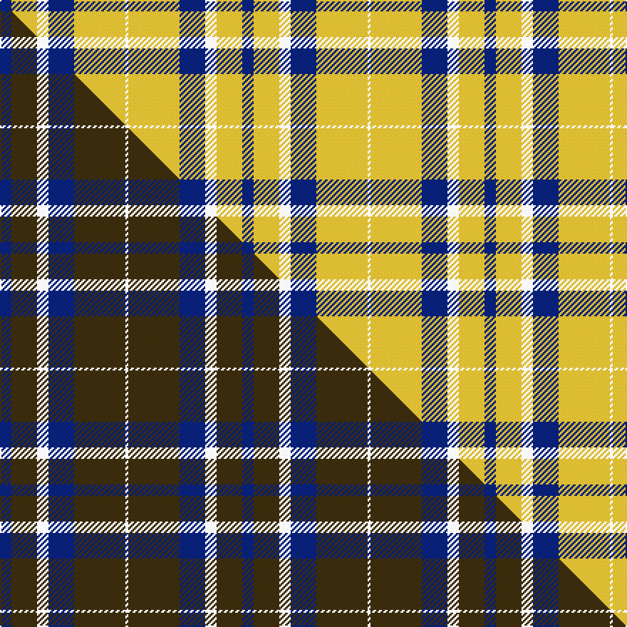

This is one **variant** — a specific cloth: this exact thread count and colourway, with its own
provenance below. It is one weaving of the [sett](/setts/db4ly9w4db9ly18w1/) (the scale-free proportion — the
same cloth at any scale or shade), whose colour order is pattern [BYWBYW](/stripes/bywbyw/).

Part of the [WVU Mountaineer](/tartans/wvu-mountaineer/) tartan — the named design grouping this sett with its other cloths.

Sourced from tartans-authority.  It is a [6 stripe tartan](/stripes/stripes6/).

Original link [https://www.tartanregister.gov.uk/tartanDetails.aspx?ref=10567](https://www.tartanregister.gov.uk/tartanDetails.aspx?ref=10567)

Dataset <small>— provenance for this record, inherited from the source manifest</small>

<dl class="dataset-prov">
<dt>source</dt><dd><a href="/sources/tartans-authority/">Scottish Tartans Authority</a></dd>
<dt>data captured from</dt><dd><a href="https://github.com/thetartan/tartan-database/blob/master/data/tartans-authority/data.csv">https://github.com/thetartan/tartan-database/blob/master/data/tartans-authority/data.csv</a></dd>
<dt>data date</dt><dd>1st March 2011 <small>(this record)</small></dd>
<dt>licence</dt><dd><a href="https://creativecommons.org/licenses/by-nc-nd/4.0/">CC BY-NC-ND 4.0</a></dd>
</dl>

Capture chain <small>— the hands this data passed through, oldest first; each capture carries its own licence</small>

<ol class="capture-chain">
<li><a href="https://www.tartansauthority.com/">Scottish Tartans Authority</a> <small>the heritage body's archive — its tartan-ferret record browser is retired (links repaired to the SRT, above)</small></li>
<li><a href="https://github.com/thetartan/tartan-database">thetartan/tartan-database</a> <small>2016-2017</small> · <a href="https://creativecommons.org/licenses/by-nc-nd/4.0/">CC BY-NC-ND 4.0</a> <small>Levko Kravets's frozen compilation — the capture we vendored, and where its CC licence text came from</small></li>
<li>this dictionary <small>captured 2026-06-10 · commit 5bf86c7566</small> <small>each re-capture is a git commit to data/sources</small></li>
</ol>

## Register references

External register numbers recorded for this tartan.

- Scottish Register of Tartans: [10567](https://www.tartanregister.gov.uk/tartanDetails?ref=10567)
- Scottish Tartans Authority (ITI): 10567

## Thread count
DB/8 LY18 W8 DB18 LY36 W/2

One full sett is **170 threads**.

## Palette
<table><thead><tr><th>Colour</th><th>Shade</th><th>OKLCh</th></tr></thead><tbody><tr><td>DB</td><td><code style="background-color:#082077;">#082077</code> <small style="color:#888">#082077</small></td><td><small style="color:#888">oklch(30.0% 0.149 265.1)</small></td></tr><tr><td>W</td><td><code style="background-color:#F7F7F7;">#F7F7F7</code> <small style="color:#888">#F7F7F7</small></td><td><small style="color:#888">oklch(97.6% 0.000 89.9)</small></td></tr><tr><td>LY</td><td><code style="background-color:#DCBC32;">#DCBC32</code> <small style="color:#888">#DCBC32</small></td><td><small style="color:#888">oklch(80.0% 0.150 95.2)</small></td></tr></tbody></table>

# Sample pattern

## Compared to the master

This cloth is one sett of its design; the master sett (the exemplar the design is anchored on) is below for comparison.

Its **ΔTartan distance** from the master is **0.24** — the same measure the nearest-tartans table ranks by (0 is identical; a re-scale of the same cloth is near 0, a recolour or a different proportion further).

<figure class="master-compare" style="margin:0">

this sett
master sett ★

<figcaption style="color:#888;font-size:smaller">One weave of this sett against the <a href="/setts/db4dy9w4db9dy18w1/">master sett ★</a>, split on the diagonal: a shared proportion runs seamlessly across it with only the shades shifting; a different proportion breaks on it.</figcaption>
</figure>

## Nearest tartan variants

The nearest existing variants by ΔTartan distance, with this cloth at the top so the swatches line up against it.

ΔTartan

Threads

Variant

Sett

—

170

<a href="/variants/s6/db4ly9w4db9ly18w1~x2/">WVU Mountaineer (Corporate)</a>

<a href="/ttd/edit/#slug=db4dy9w4db9dy18w1~x2&amp;base=db4ly9w4db9ly18w1~x2" title="compare in the TTD">0.24</a>

170

<a href="/variants/s6/db4dy9w4db9dy18w1~x2/">WVU Mountaineer Tartan</a>

<a href="/ttd/edit/#slug=db1ly5db1ly5db2w1~x4&amp;base=db4ly9w4db9ly18w1~x2" title="compare in the TTD">1.96</a>

112

<a href="/variants/s6/db1ly5db1ly5db2w1~x4/">Tokharion</a>

<a href="/ttd/edit/#slug=ly72db16w9db4w5db16~x2&amp;base=db4ly9w4db9ly18w1~x2" title="compare in the TTD">2.02</a>

312

<a href="/variants/s6/ly72db16w9db4w5db16~x2/">Machair</a>

<a href="/ttd/edit/#slug=w24g2w8db5y4db5y4~x2&amp;base=db4ly9w4db9ly18w1~x2" title="compare in the TTD">3.04</a>

152

<a href="/variants/s7/w24g2w8db5y4db5y4~x2/">Clackson Arisaid (Name?)</a>

<a href="/ttd/edit/#slug=ly38w9ly3do9w3~x2&amp;base=db4ly9w4db9ly18w1~x2" title="compare in the TTD">3.35</a>

166

<a href="/variants/s5/ly38w9ly3do9w3~x2/">Loch Tummel Trade Tartan</a>

<a href="/ttd/edit/#slug=w32dr12db12w2db3~x2&amp;base=db4ly9w4db9ly18w1~x2" title="compare in the TTD">3.44</a>

174

<a href="/variants/s5/w32dr12db12w2db3~x2/">Fraser Arisaid Red (Dance)</a>

<a href="/ttd/edit/#slug=y8w3y28w32dp3w4~x2&amp;base=db4ly9w4db9ly18w1~x2" title="compare in the TTD">3.77</a>

288

<a href="/variants/s6/y8w3y28w32dp3w4~x2/">Ailsa Yellow Fashion Tartan</a>

<a href="/ttd/edit/#slug=y20db10w3~x2&amp;base=db4ly9w4db9ly18w1~x2" title="compare in the TTD">3.89</a>

86

<a href="/variants/s3/y20db10w3~x2/">Masai Shuka 04 (Artefact)</a>

## Neighbour map

Every grey dot is one of 13621 variants placed by the first two principal components of the ΔTartan feature space (42% of its variance). Red is this tartan; blue dots are its nearest — click one to open its page.

<svg viewBox="0 0 640 380" role="img" style="max-width:100%;height:auto;border:1px solid #e0e0e0;border-radius:4px;display:block" xmlns="http://www.w3.org/2000/svg"><image href="/nn/cloud.v1.png" width="640" height="380"/><a href="/variants/s6/db4dy9w4db9dy18w1~x2/"><circle cx="378.4" cy="227.2" r="4" fill="#3465a4"><title>WVU Mountaineer Tartan</title></circle></a><a href="/variants/s6/db1ly5db1ly5db2w1~x4/"><circle cx="378.8" cy="285.1" r="4" fill="#3465a4"><title>Tokharion</title></circle></a><a href="/variants/s6/ly72db16w9db4w5db16~x2/"><circle cx="394.3" cy="204.4" r="4" fill="#3465a4"><title>Machair</title></circle></a><a href="/variants/s7/w24g2w8db5y4db5y4~x2/"><circle cx="327.1" cy="198.4" r="4" fill="#3465a4"><title>Clackson Arisaid (Name?)</title></circle></a><a href="/variants/s5/ly38w9ly3do9w3~x2/"><circle cx="452.7" cy="240.4" r="4" fill="#3465a4"><title>Loch Tummel Trade Tartan</title></circle></a><a href="/variants/s5/w32dr12db12w2db3~x2/"><circle cx="342.8" cy="228.7" r="4" fill="#3465a4"><title>Fraser Arisaid Red (Dance)</title></circle></a><a href="/variants/s6/y8w3y28w32dp3w4~x2/"><circle cx="345.6" cy="234.5" r="4" fill="#3465a4"><title>Ailsa Yellow Fashion Tartan</title></circle></a><a href="/variants/s3/y20db10w3~x2/"><circle cx="361.9" cy="301.7" r="4" fill="#3465a4"><title>Masai Shuka 04 (Artefact)</title></circle></a><circle cx="375.1" cy="238.2" r="5" fill="#c00000"/><text x="320" y="376" text-anchor="middle" font-size="11" fill="#999">ground</text><text x="11" y="190" text-anchor="middle" font-size="11" fill="#999" transform="rotate(-90 11 190)">complexity</text></svg>

ID: /variants/s6/db4ly9w4db9ly18w1~x2/
