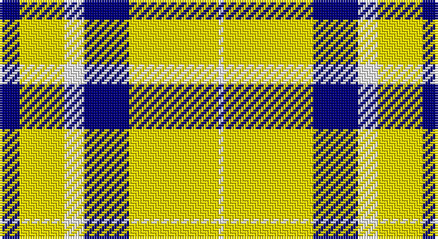

This page is one **sett** — a single exact thread-count. It belongs to the [tartan](/setts/db4ly9w4db9ly18w1/)
(the same proportion at any scale), whose colour order is pattern [BYWBYW](/stripes/bywbyw/).

Sourced from register-of-tartans.  It is a [6 stripe tartan](/stripes/stripes6/).

Original link https://www.tartanregister.gov.uk/tartanDetails.aspx?ref=10567

## Register references

External register numbers recorded for this tartan.

- Scottish Register of Tartans: [10567](https://www.tartanregister.gov.uk/tartanDetails.aspx?ref=10567)

## Thread count
DB/8 Y18 W8 DB18 Y36 W/2

One full sett is **170 threads**.

## Palette

Palette: <strong>Tartan Register</strong> <small style="color:#888">(1 of 3 colours)</small>
<table><thead><tr><th>Colour</th><th>Threads</th><th>Shade</th><th>Base</th><th>OKLCh</th></tr></thead><tbody><tr><td>DB/</td><td style="text-align:right;font-variant-numeric:tabular-nums">8</td><td><code style="background-color:#000080;">#000080</code> <small style="color:#888">#000080</small></td><td>B <code style="background-color:#2A418A;">#2A418A</code></td><td><small style="color:#888">oklch(27.1% 0.188 264.1)</small></td></tr><tr><td>Y</td><td style="text-align:right;font-variant-numeric:tabular-nums">18</td><td><code style="background-color:#FFE700;">#FFE700</code> <small style="color:#888">#FFE700</small></td><td>Y <code style="background-color:#F2BF00;">#F2BF00</code></td><td><small style="color:#888">oklch(91.9% 0.192 101.8)</small></td></tr><tr><td>W</td><td style="text-align:right;font-variant-numeric:tabular-nums">8</td><td><code style="background-color:#FFFFFF;">#FFFFFF</code> <small style="color:#888">#FFFFFF</small></td><td>W <code style="background-color:#F7F7F7;">#F7F7F7</code></td><td><small style="color:#888">oklch(100.0% 0.000 89.9)</small></td></tr><tr><td>DB</td><td style="text-align:right;font-variant-numeric:tabular-nums">18</td><td><code style="background-color:#000080;">#000080</code> <small style="color:#888">#000080</small></td><td>B <code style="background-color:#2A418A;">#2A418A</code></td><td><small style="color:#888">oklch(27.1% 0.188 264.1)</small></td></tr><tr><td>Y</td><td style="text-align:right;font-variant-numeric:tabular-nums">36</td><td><code style="background-color:#FFE700;">#FFE700</code> <small style="color:#888">#FFE700</small></td><td>Y <code style="background-color:#F2BF00;">#F2BF00</code></td><td><small style="color:#888">oklch(91.9% 0.192 101.8)</small></td></tr><tr><td>W/</td><td style="text-align:right;font-variant-numeric:tabular-nums">2</td><td><code style="background-color:#FFFFFF;">#FFFFFF</code> <small style="color:#888">#FFFFFF</small></td><td>W <code style="background-color:#F7F7F7;">#F7F7F7</code></td><td><small style="color:#888">oklch(100.0% 0.000 89.9)</small></td></tr></tbody></table>

# Sample pattern

## Nearest tartans

The nearest existing variants by ΔTartan distance, with this tartan at the top so the swatches line up against it.

ΔTartan

Tartan

Sett

—

<a href="/ttd/edit/#slug=db4ly9w4db9ly18w1~x2">WVU Mountaineer Tartan</a> <a class="nn-out" href="/variants/s6/db4ly9w4db9ly18w1~x2/" title="open its dictionary page">↗</a>

0.73

<a href="/ttd/edit/#slug=dt4ly9w4dt9ly18w1~x2&amp;base=db4ly9w4db9ly18w1~x2">WVU Mountaineer (Corporate)</a> <a class="nn-out" href="/variants/s6/dt4ly9w4dt9ly18w1~x2/" title="open its dictionary page">↗</a>

1.24

<a href="/ttd/edit/#slug=w15do6w1do3o3w1~x4&amp;base=db4ly9w4db9ly18w1~x2">Burns (Fashion)</a> <a class="nn-out" href="/variants/s6/w15do6w1do3o3w1~x4/" title="open its dictionary page">↗</a>

1.60

<a href="/ttd/edit/#slug=w12g12w1g12w12lo1~x4&amp;base=db4ly9w4db9ly18w1~x2">Wallace Green Dress Fashion Tartan</a> <a class="nn-out" href="/variants/s6/w12g12w1g12w12lo1~x4/" title="open its dictionary page">↗</a>

1.70

<a href="/ttd/edit/#slug=g6w2g29w29g2w6~x2&amp;base=db4ly9w4db9ly18w1~x2">Erskine, Green (Dance)</a> <a class="nn-out" href="/variants/s6/g6w2g29w29g2w6~x2/" title="open its dictionary page">↗</a>

1.73

<a href="/ttd/edit/#slug=dg4w35g31w4~x2&amp;base=db4ly9w4db9ly18w1~x2">Lewis, Green (Dance)</a> <a class="nn-out" href="/variants/s4/dg4w35g31w4~x2/" title="open its dictionary page">↗</a>

1.78

<a href="/ttd/edit/#slug=k27w29k5w14r2~x2&amp;base=db4ly9w4db9ly18w1~x2">McPartlin (Personal)</a> <a class="nn-out" href="/variants/s5/k27w29k5w14r2~x2/" title="open its dictionary page">↗</a>

1.90

<a href="/ttd/edit/#slug=w38r12w37g32k3w4k3g32r4&amp;base=db4ly9w4db9ly18w1~x2">MacDiarmid, dress</a> <a class="nn-out" href="/variants/s9/w38r12w37g32k3w4k3g32r4/" title="open its dictionary page">↗</a>

1.91

<a href="/ttd/edit/#slug=dg6w2dg29w29dg2w6~x2&amp;base=db4ly9w4db9ly18w1~x2">Erskine Green</a> <a class="nn-out" href="/variants/s6/dg6w2dg29w29dg2w6~x2/" title="open its dictionary page">↗</a>

1.93

<a href="/ttd/edit/#slug=w2o1w2g6w10o6w2g1w2~x2&amp;base=db4ly9w4db9ly18w1~x2">O'Neill</a> <a class="nn-out" href="/variants/s9/w2o1w2g6w10o6w2g1w2~x2/" title="open its dictionary page">↗</a>

1.97

<a href="/ttd/edit/#slug=w38r12w37g32k3w4k3g32r4~x2&amp;base=db4ly9w4db9ly18w1~x2">MacDiarmid Dress</a> <a class="nn-out" href="/variants/s9/w38r12w37g32k3w4k3g32r4~x2/" title="open its dictionary page">↗</a>

## Neighbour map

Every grey dot is one of 14360 variants placed by the first two principal components of the ΔTartan feature space (44% of its variance). Red is this tartan; blue dots are its nearest — click one to open its page.

<svg viewBox="0 0 640 380" role="img" style="max-width:100%;height:auto;border:1px solid #e0e0e0;border-radius:4px;display:block" xmlns="http://www.w3.org/2000/svg"><image href="/nn/cloud.v1.png" width="640" height="380"/><a href="/variants/s6/dt4ly9w4dt9ly18w1~x2/"><circle cx="314.6" cy="183.4" r="4" fill="#3465a4"><title>WVU Mountaineer (Corporate)</title></circle></a><a href="/variants/s6/w15do6w1do3o3w1~x4/"><circle cx="321.6" cy="166.6" r="4" fill="#3465a4"><title>Burns (Fashion)</title></circle></a><a href="/variants/s6/w12g12w1g12w12lo1~x4/"><circle cx="272.4" cy="224.4" r="4" fill="#3465a4"><title>Wallace Green Dress Fashion Tartan</title></circle></a><a href="/variants/s6/g6w2g29w29g2w6~x2/"><circle cx="318.9" cy="195.3" r="4" fill="#3465a4"><title>Erskine, Green (Dance)</title></circle></a><a href="/variants/s4/dg4w35g31w4~x2/"><circle cx="280.9" cy="231.6" r="4" fill="#3465a4"><title>Lewis, Green (Dance)</title></circle></a><a href="/variants/s5/k27w29k5w14r2~x2/"><circle cx="298.6" cy="201.7" r="4" fill="#3465a4"><title>McPartlin (Personal)</title></circle></a><a href="/variants/s9/w38r12w37g32k3w4k3g32r4/"><circle cx="223.6" cy="162.6" r="4" fill="#3465a4"><title>MacDiarmid, dress</title></circle></a><a href="/variants/s6/dg6w2dg29w29dg2w6~x2/"><circle cx="326.0" cy="200.4" r="4" fill="#3465a4"><title>Erskine Green</title></circle></a><a href="/variants/s9/w2o1w2g6w10o6w2g1w2~x2/"><circle cx="285.4" cy="192.4" r="4" fill="#3465a4"><title>O'Neill</title></circle></a><a href="/variants/s9/w38r12w37g32k3w4k3g32r4~x2/"><circle cx="225.3" cy="162.9" r="4" fill="#3465a4"><title>MacDiarmid Dress</title></circle></a><circle cx="299.4" cy="179.9" r="5" fill="#c00000"/></svg>

ID: /variants/s6/db4ly9w4db9ly18w1~x2/
